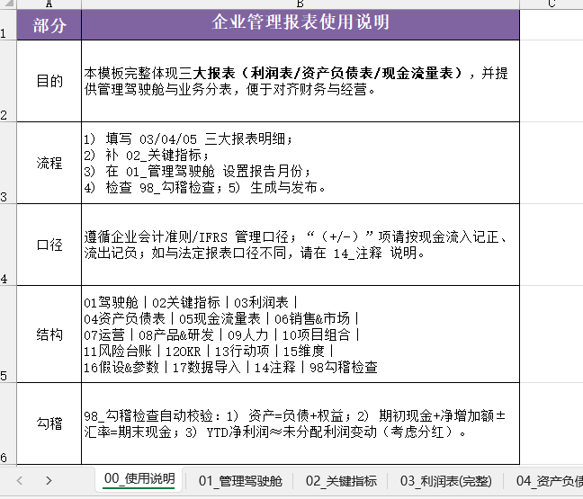
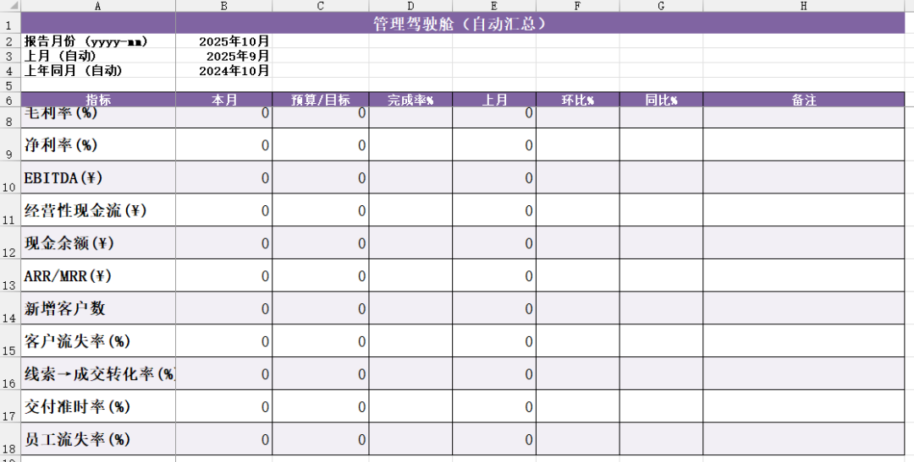

# 企业管理报表.xlsx

> 来源：微信公众号「数据熊」 · 作者 宋岳清 · 发布于 2025-10-21 07:30
> 原文链接：http://mp.weixin.qq.com/s?__biz=Mzg2MTg5OTgzNA==&mid=2247490473&idx=1&sn=ba313977a3fe833d2818d78dc9bd9dba&chksm=ce1146fcf966cfeaa3654f50de8f22e2ff06ffdfd13959ba37059372e85d18d9ede4c183dd43
> 摘要：很多公司报表很多、数据很杂，但开会依旧“靠感觉”。数据熊今天为大家带来一份《企业管理报表.xlsx》,整套表格共18张，文末左下角点击阅读原文获取。

很多公司报表很多、数据很杂，但开会依旧“靠感觉”。数据熊今天为大家带来一份《

企业管理报表.xlsx

》,整套表格共18张，文末左下角点击

阅读原文

获取。

这份模板的目的很简单：用一张“管理驾驶舱”把利润表、资产负债表、现金流量表以及关键业务数据穿起来，让老板和各条线在 10 分钟内看懂经营，并明确下一步动作。

## 1）它解决的是什么问题？

日常经营最怕“数据分家”：财务只讲结果，业务只讲过程。这个模板把“结果与过程”放进同一张台面——财务三表解释企业“赚没赚钱、钱在哪里”，业务分表解释“钱是怎么赚的、节奏靠不靠谱”。

- 财务侧

   ：03_利润表（含 EBITDA、毛利率/净利率）、04_资产负债表（资产/负债/权益全项）、05_现金流量表（间接法拆项至折旧、摊销、营运资本变动等）。
- 经营侧

   ：06_销售&市场、07_运营、08_产品&研发、09_人力、10_项目组合、11_风险台账、12_OKR、13_行动项。
- 统一口径

   ：02_关键指标作为驾驶舱数据底座，16_假设&参数管理汇率、年度目标、现金安全边际；15_维度_部门/地区/渠道/产品规范分析维度；98_勾稽检查自动校验“三表平衡&利润—未分配利润—分红”的链路。

## 2）模板长什么样？（关键页面速览）

再复杂的体系，落地都要“抬眼一页、低头有据”。这套模板的结构就是这么设计的。

- 01_管理驾驶舱

   ：设置“报告月份”，自动给出“上月、上年同月”对比，核心 KPI 一屏看全：

   营业收入、毛利率、净利率、EBITDA、经营性现金流、现金余额、ARR/MRR、新增客户数、客户流失率、线索→成交转化率、交付准时率、员工流失率

   ，并配“预算/目标、完成率、环比、同比、备注”。

- 02_关键指标

   ：按“月份—指标—实际—预算”录入，是驾驶舱的统一数据底座，避免“各自算各自”。
- 三大报表（03/04/05）

   ：利润从“营业收入→三费→EBIT→净利”，资产负债表到“所有者权益/未分配利润”，现金流量表拆到“营运资本三项变动”；模板已内置毛利率、净利率、EBITDA等衍生指标。
- 业务分表

   ：
- 11_风险台账 / 12_OKR / 13_行动项

   ：把“问题—目标—行动”挂到台账，会议不只看现状，更抓闭环。
- 98_勾稽检查

   ：自动校验

   资产=负债+权益

   、

   现金期初+净增加额=期末

   （含YTD）、

   净利润≈未分配利润变动+分红

   ，用红点提示口径问题。

## 3）怎么用？一套 5 步落地法

上线一套模板最怕“先热闹、后冷场”。按这 5 步执行，最容易跑通。

1. 填三表

    ：先补 03/04/05 三大报表的本月与YTD数据（可来自系统导出）。
2. 补关键指标

    ：在

    02_关键指标

     录入当月“实际/预算”，保证驾驶舱“完成率/环比/同比”可自动计算。
3. 设报告月

    ：到

    01_管理驾驶舱

     选择“报告月份”，自动生成“上月/上年同月”对比。
4. 过勾稽

    ：打开

    98_勾稽检查

    ，处理标红项（尤其“未分配利润变动与分红”）。
5. 开会发布

    ：复制驾驶舱区块或导出截图，用于周例会/月度经营会与对外简报。

> 小提示：把
>
> 16_假设&参数
>
> （汇率USD/CNY、年度收入/毛利率/净利率目标、现金安全边际月数）提前设好，预算完成率与安全阈值会更贴近管理预期。

## 4）会议怎么开？一张驾驶舱的“经营四步法”

会议不是读表，而是解决问题。按照“从全局到抓手”的顺序推进，效率最高。

- 第一步 看全局

   ：01_管理驾驶舱，一分钟确认

   收入/利润/现金

    与

   预算/同比/环比

    的整体态势。
- 第二步 找原因

   ：钻到 06~10 的业务分表，分别从

   获客→转化→交付→质量→人效

    找“拉低项”。
- 第三步 看结果

   ：回看三表，验证业务动作对

   毛利、营运资本、现金流

    的影响是否一致。
- 第四步 抓闭环

   ：11_风险台账、12_OKR、13_行动项三件套，明确责任人、期限与里程碑，下次会议只看“完成率与偏差”。

## 5）常见坑与口径建议

模板能跑得稳，关键在口径统一。以下是最容易踩的几个坑。

- 指标重复计算

   ：收入口径以合同、开票或收款？务必在 14_注释 标明；CAC、LTV 也要写清分母分子。
- 预算版本乱

   ：02_关键指标中的“预算”列，只放当前生效版本；历史版本请另存“预算回溯”。
- 现金与利润脱节

   ：现金流间接法一定要维护“营运资本三项变动”（应收、存货、应付），否则驾驶舱会“看着赚，钱却没到”。
- 维度混用

   ：15_维度_* 只放“规范值”，业务表下拉引用，避免“华东/华 東/HD”混写导致汇总偏差。

## 6）适用对象与扩展思路

模板是“通用骨架”，但足够细到能落地。制造、软件SaaS、零售分销都能用，差异主要在业务分表字段增减。

- 适用对象

   ：老板/CEO、CFO/财务总监、财务BP、销售/运营负责人、PMO。
- 扩展建议

   ：

---

数据熊说

：报表不是用来“证明做了很多事”，而是用来“聚焦该做哪件事”。把三表和业务指标放到一张驾驶舱上，你会更快发现“利润去哪了、现金挡在哪、动作落没落下来”。模板给了你骨架，肌肉还是要靠团队一起练。

点击

阅读原文

获取《

企业管理报表.xlsx》

工作没思路，困惑没人问？赶快加入

数据熊的粉丝群

，与2500+财务精英共同成长。

管理报表

定制添加数据熊微信：

往期推荐

本量利分析模型.xlsx

产品成本分摊模型.xlsx

2026年全面预算套表.xlsx

国有企业“十五五”规划编制要点（附1.6万字模板）

产品定价模型，财务BP的必修课
