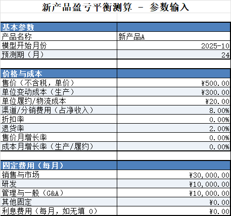
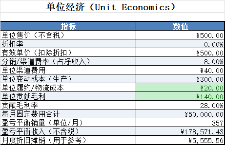
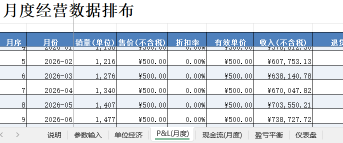
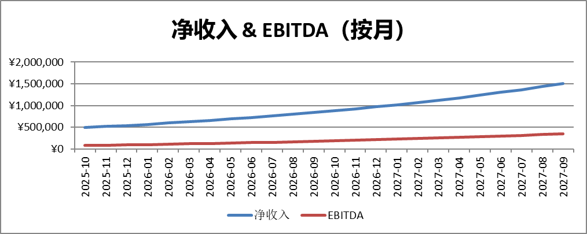
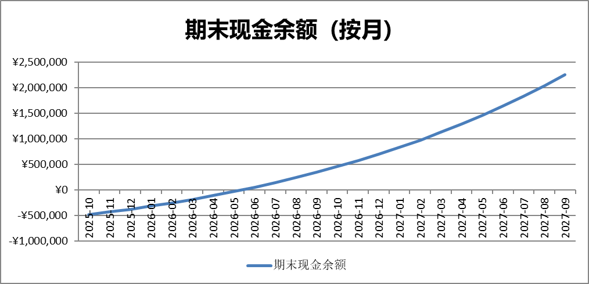

# 新产品盈亏平衡测算模型.xlsx

> 来源：微信公众号「数据熊」 · 作者 宋岳清 · 发布于 2025-10-22 07:30
> 原文链接：http://mp.weixin.qq.com/s?__biz=Mzg2MTg5OTgzNA==&mid=2247490510&idx=1&sn=11c533b2222838b0922af83531c70b29&chksm=ce11469bf966cf8d00ddac7d3dc5c0c096ce24b20d180e5fc00b16b87218d40530e15ee31209
> 摘要：新产品上线后，老板第一句话往往不是“能卖多少”，而是“什么时候不亏”。

新产品上线后，老板第一句话往往不是“能卖多少”，而是“什么时候不亏”。

这篇文章，用我做的一套

盈亏平衡测算模型

，把利润线、现金线和关键假设一口气讲透，给你一把能落地的“试错尺子”。

可编辑版本excel模板，可至文末左下角点击
阅读原文
下载。

## 一、它到底解决什么问题

很多团队在“感觉上盈利”，却在现金流里“看不见钱”。这个模型的目标，是把“

卖多少不亏

、

什么时候不再烧钱

、

价格/成本/销量改一点会怎样

”讲清楚，并把口径统一到一张表里。

- 盈亏平衡

   ：单位贡献毛利与每月固定费用对齐，给出“卖到哪一刻不亏”。
- 单位经济

   ：一单的收入、渠道费、变动成本、履约成本，算出真实贡献毛利与毛利率。
- 利润 vs 现金

   ：把

   P&L(月度)

    和

   现金流(月度)

    放在一起，解释“账上盈利、现金还在亏”的原因（营运资本与一次性投入）。
- 敏感性

   ：一处开关改三件事——价格、成本、销量的“调整因子”，快速观察全局影响。

## 二、模型长什么样：7个工作表，一眼懂

工具好不好用，就看信息布局是否“上手即用”。这版把编辑与展示分离，思路清晰。

- 说明

   ：3步上手，填写口径、页面说明。
- 参数输入

   ：

   唯一

   需要编辑的页面，集中填写起始月份、价格/成本、固定费用、一次性投入、销量增长、税与营运资本（DSO/DPO/DIO）等，还带

   价格/成本/销量

    的敏感性开关。
- 单位经济

   ：一单的贡献毛利与盈亏平衡销量，作为全模型“原点”。
- P&L(月度)：24个月收入→毛利→EBITDA→净利润的推演。
- 现金流(月度)：考虑应收、应付、库存与资本开支后的现金轨迹，告诉你

   现金何时回正

   。
- 盈亏平衡

   ：单位层面的 Q*（销量）与盈亏平衡收入，外加关键里程碑。
- 仪表盘

   ：关键指标卡 + 趋势，适合做汇报的截图位。

## 三、核心逻辑：从单位经济到盈亏平衡

先把一单算清楚，再把一个月跑明白，最后拉出两年趋势。

- 单位贡献毛利

   有效单价 ×（1−渠道费率） − 变动成本 − 履约/物流 示例参数下：有效单价 500，渠道费率 8%，变动成本 300，履约 20，单位贡献毛利=140，贡献毛利率=28%。
- 盈亏平衡销量（Q*）

   Q* = 每月固定费用 ÷ 单位贡献毛利 = 50,000 ÷ 140 ≈

   357 单/月

   ；对应

   盈亏平衡收入 ≈ 178,571

   。
- 利润与现金为何“不同步”

   P&L 看利润，现金流还要扣

   DSO/DPO/DIO

    与

   CAPEX/OPEX

    的时点影响： 应收（DSO）拖后收、应付（DPO）延后付、库存（DIO）先掏钱后卖货——这就是“赚到的利润还没变成钱”的根源。

## 四、用内置示例跑一下（关键结论）

示例假设仅用于演示，方便你对标自己的业务节奏。

- 单位经济

   ： 单位售价

   500

   ；渠道费率 8%；单位变动成本

   300

   ；履约

   20

    →

   单位贡献毛利 140（28%）

   。

   盈亏平衡销量≈357 单/月；盈亏平衡收入≈178,571。
- 利润与现金的节奏

   ： 由于固定费用与增长设定，本例

   EBITDA 从 2025-10 起即为正

   （说明规模与毛利能覆盖固定成本）；

   但考虑

   一次性投入 200,000

    与

   DSO30 / DPO45 / DIO30

   ，

   现金回正在 2026-06

   。

   也就是说：

   利润线先转正，现金线后跟上

   ——非常贴近真实经营。
- 第1年汇总（用于管理层汇报）

   ： 净收入

   7,799,392

   ；EBITDA

   1,481,960

   ；净利润

   1,061,470

   。
- 敏感性“一眼明白”

   （仅变一个因子，其余不变）：

   价格

   -5%

    → 盈亏平衡

   427 单/月

   价格

   +5%

    → 盈亏平衡

   307 单/月

   成本

   +5%

    → 盈亏平衡

   403 单/月

   成本

   -5%

    → 盈亏平衡

   321 单/月

   👉 这组数字告诉你：

   小改价、小控本，对盈亏平衡的“门槛高度”非常敏感。

## 五、正确使用的3步法 + 常见误区

做模型不难，难在口径清晰、长期可维护。

- 3步法

   1）在

   参数输入

    填写：起始月份、价格与成本、固定费用、一次性投入、销量增长、税与营运资本（百分比用

   0~1

   ；如 8% 填

   0.08

   ）。

   2）用

   敏感性开关

    微调价格/成本/销量因子，观察盈亏平衡与现金回正如何移动。

   3）到

   P&L、现金流、单位经济、盈亏平衡、仪表盘

    看关键结论，截图即可用于汇报。
- 常见误区

   · 把“含税价”当“未税价”：若价格已是不含税，增值税率填

   0

   ，避免重复扣减。

   · 把渠道返利算进变动成本：

   渠道/分销费

   建议单列为“占净收入的比例”，口径更干净。

   · 忽视 DSO/DPO/DIO：利润线漂亮，但 DSO 一拉长、库存一堆积，现金线就塌。

   · 固定费用“台阶式”增长：规模扩张时注意

   台阶成本

   （新增团队/产线/仓配），别用一条直线糊过去。

## 六、适用边界与可拓展

模型对

标准化单品、具有渠道与履约成本的业务

 极好用；对

SaaS/订阅

 也可套用（把“销量”替换为“新增订阅数”，把“履约”映射为交付/客服成本）。

拓展建议：

阶梯价/批量折扣

、

多渠道不同费率

、

分区域 DSO

、

台阶式固定成本

、

分产品线

。

如果你有更复杂的场景（如长周期制造、预收/预付显著、季节性强），在“参数输入”里补充对应口径即可，逻辑保持不变。

---

数据熊说

： 别迷信“爆款”预测，先把“亏不亏、亏到何时”算清楚。盈亏平衡不是目的，而是

让团队对价格、成本、销量的每一次微调都有“量化回声”

。当你能在会上用 3 句话讲清楚利润线与现金线，组织的执行力就立起来了。

点击

阅读原文

获取《

盈亏平衡测算模型

.xlsx》

工作没思路，困惑没人问？赶快加入

数据熊的粉丝群

，与2500+财务精英共同成长。

管理报表

定制添加数据熊微信：

