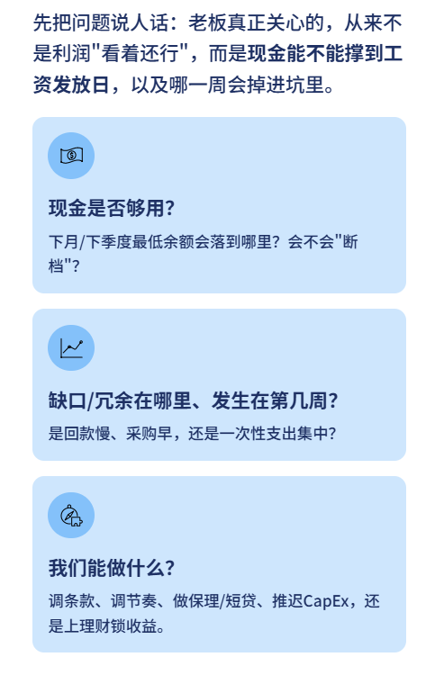
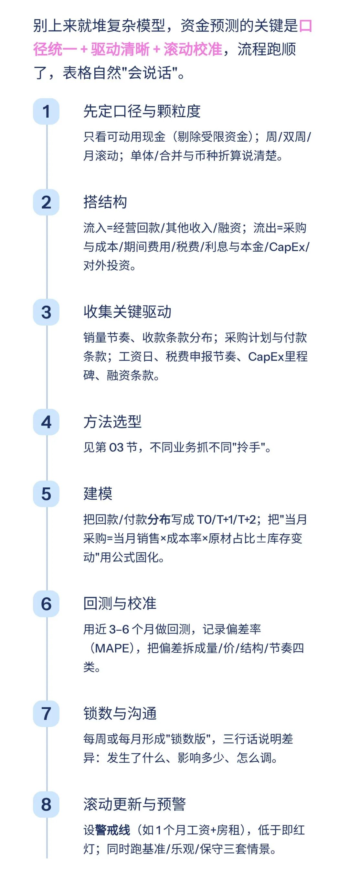
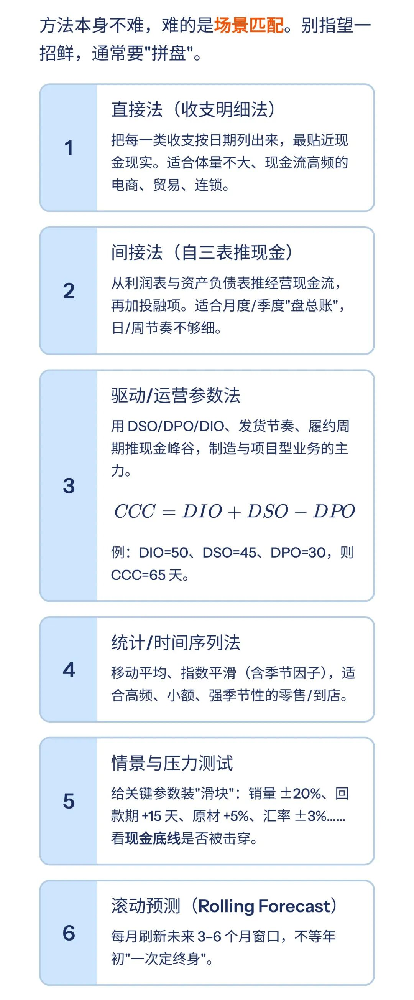
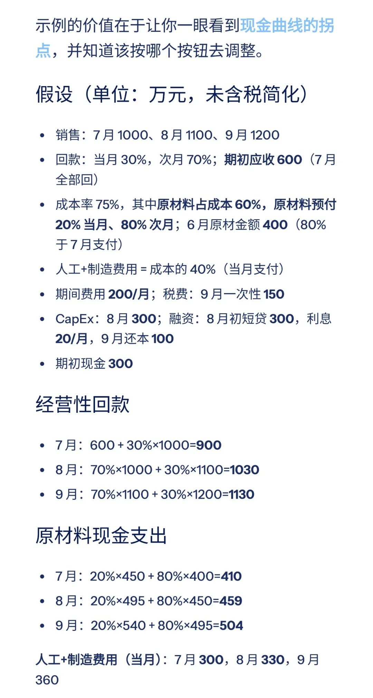
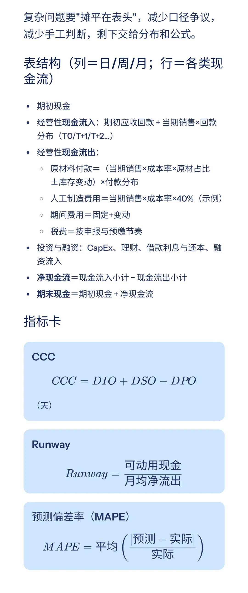
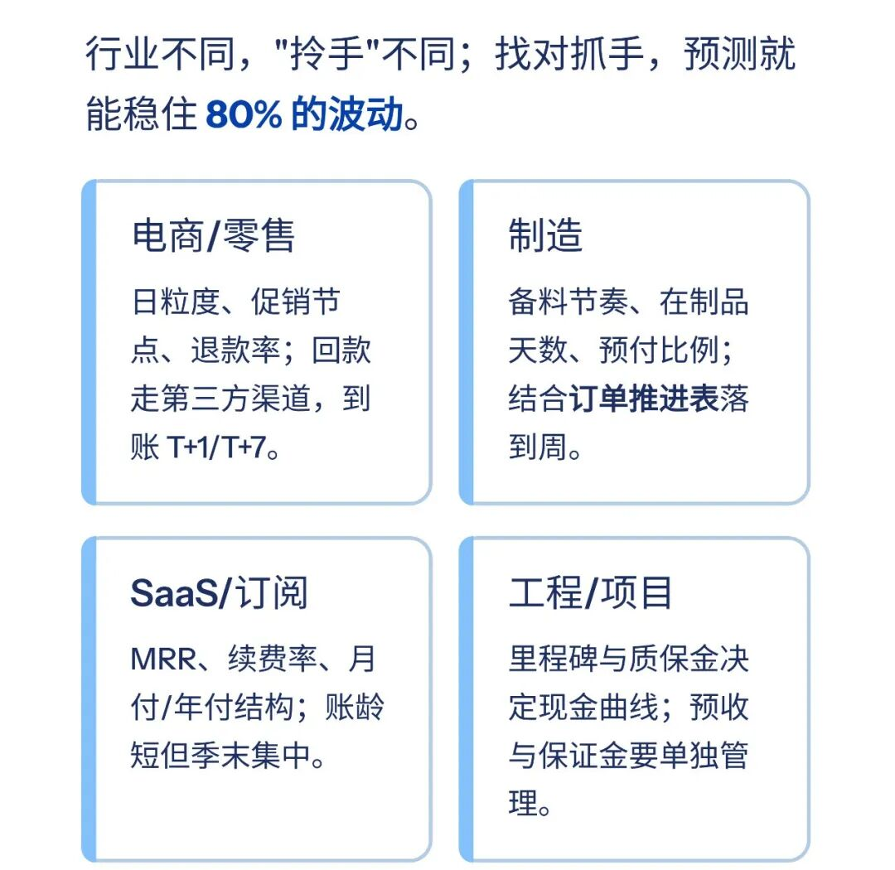
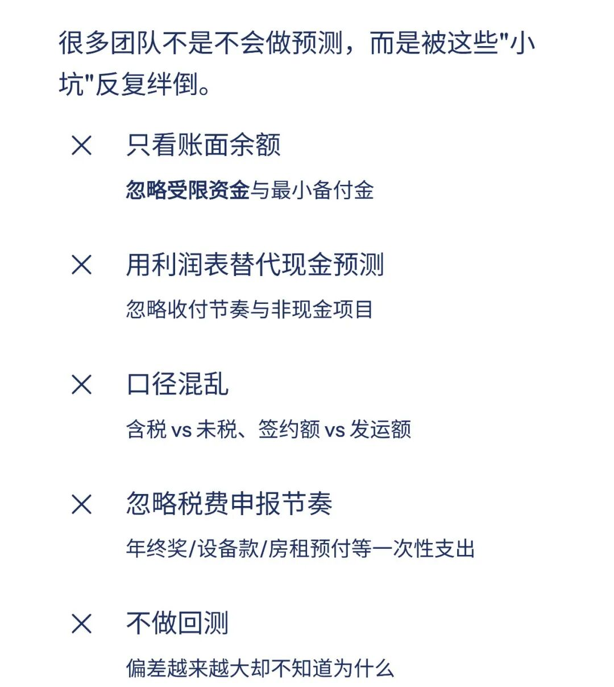
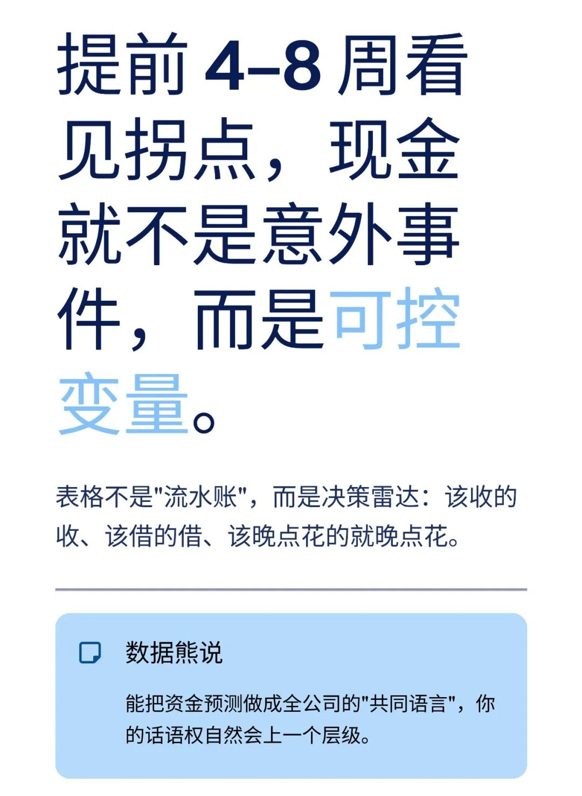

# 资金预测：核心流程与方法（附Excel模型）

> 来源：微信公众号「数据熊」 · 作者 Data Bear · 发布于 2025-10-24 07:37
> 原文链接：http://mp.weixin.qq.com/s?__biz=Mzg2MTg5OTgzNA==&mid=2247490574&idx=1&sn=f72f04452c13aeb8192c4c2bd782515b&chksm=ce11415bf966c84d32548142d1f6d9c1c0d75be600891a851138a7eecb86070107e5b4a395cf
> 摘要：每天积累一点，慢慢就成为了专业高手。

任何时候资金管理都是财务管理的重中之重，也是财务总监的核心工作之一。今天数据熊就和大家分享下，资金预测的核心流程和方法，
文末可下载

Excel版的资金预测模板

。

> 做资金预测，不是算命；是把未来的现金峰谷看清楚，提前摆好动作：加速收现、协调付款、安排融资、腾挪投资。

---

## 01 资金预测到底在回答什么

---

## 02 一套能落地的流程（8 步）

---

## 03 常见方法：什么时候用、怎么用

---

## 04 三个月落地示例（制造业）

> 汇总（万元）

| 项目 | 7 月 | 8 月 | 9 月 |
|---|---|---|---|
| 经营性回款 | **900** | **1030** | **1130** |
| 融资流入 | 0 | **300** | 0 |
| **现金流入小计** | **900** | **1330** | **1130** |
| 原材料现金支出 | 410 | 459 | 504 |
| 人工+制造费用 | 300 | 330 | 360 |
| 期间费用 | 200 | 200 | 200 |
| 税费 | 0 | 0 | 150 |
| CapEx | 0 | 300 | 0 |
| 利息 | 20 | 20 | 20 |
| 偿还本金 | 0 | 0 | 100 |
| **现金流出小计** | **930** | **1309** | **1334** |
| **净现金流** | **-30** | **21** | **-204** |
| 期初现金 | 300 | 270 | 291 |
| **期末现金** | **270** | **291** | **87** |

怎么解读

9 月受税费+还本影响降到

87

。若最低警戒线

100

，差

13

：

- 方案 A：把 8 月短贷由 300 提到

   320

   ；
- 方案 B：对 9 月回款做

   5% 加速收现

   （≈56.5），覆盖缺口并留缓冲。

---

## 05 模板结构与关键公式

---

## 06 不同业务的抓手

---

## 07 常见坑位与修正

---

## 结语

点击
阅读原文
获取完整版《

资金预测模型

》。

加入

数据熊的财务精进营

，与2500+财务精英共同成长。后台点击
「经典文章」阅读数据熊10W+爆文，数据熊微信：

Daniel-songyq

点赞

和

转发

就是最大的支持，关注数据熊，工作更轻松。

