# 2025年财务总监工作总结（可下载PPT模板）

> 来源：微信公众号「数据熊」 · 作者 宋岳清 · 发布于 2025-11-09 07:30  
> 原文链接：http://mp.weixin.qq.com/s?__biz=Mzg2MTg5OTgzNA==&mid=2247491454&idx=1&sn=333042028de0922124ae7284599d5185&chksm=ce11422bf966cb3da80073fa1942364fa76973b3bbab1ad437a97fd0b8596647af964263dda8
> 摘要：模板即思路，点击阅读原文获取《2025年财务总监工作总结PPT（20页）》。加入数据熊的财务精进营，与2600+财务精英共同成长。

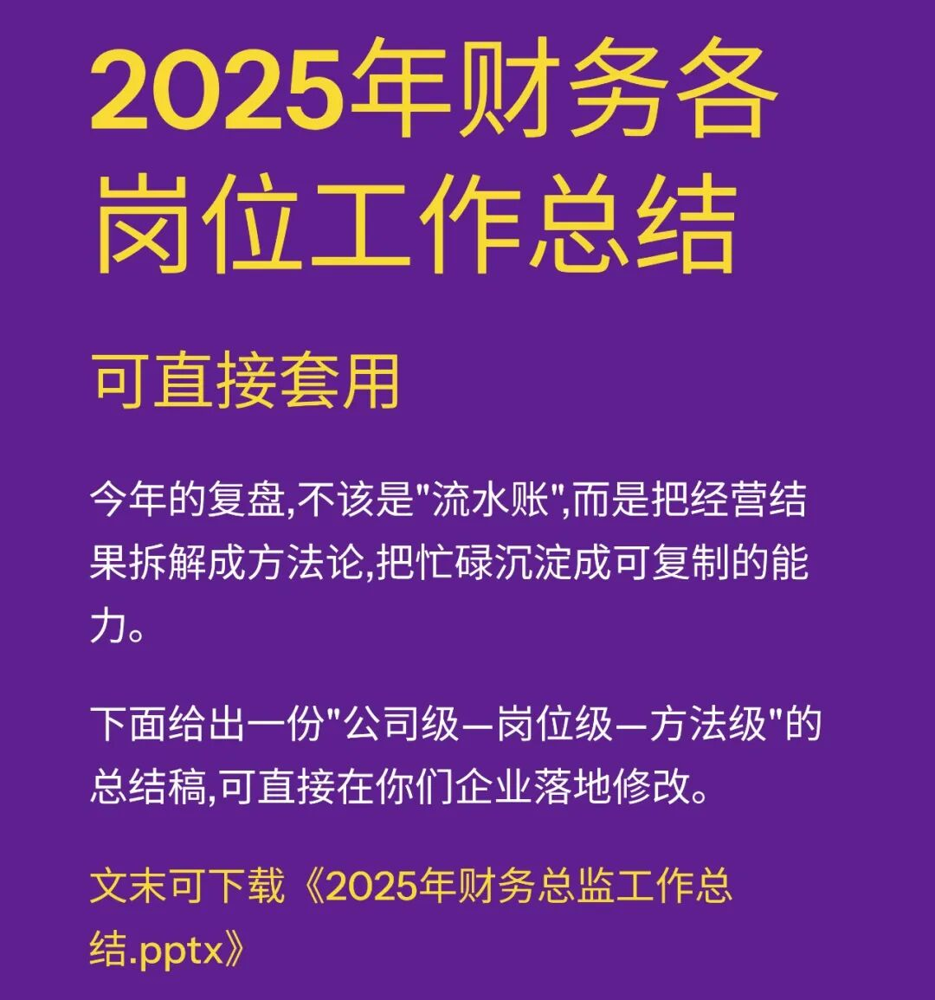

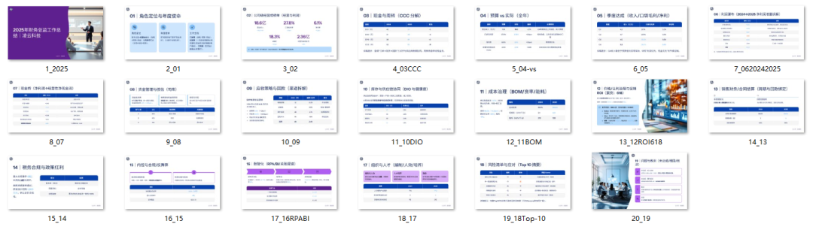

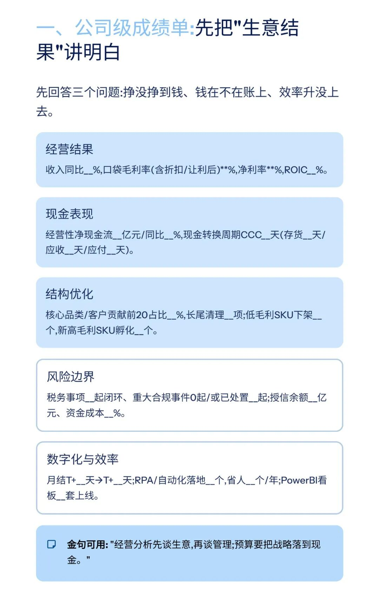

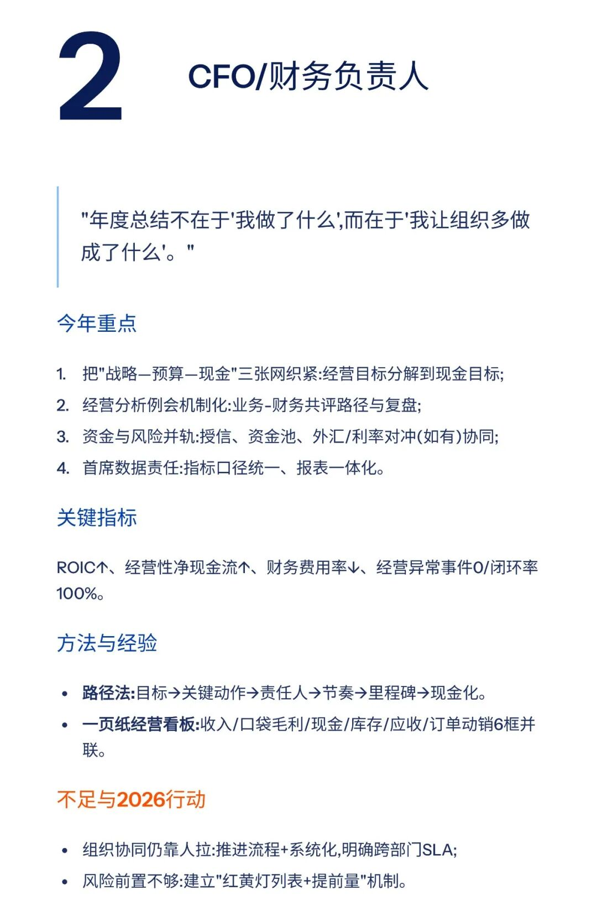

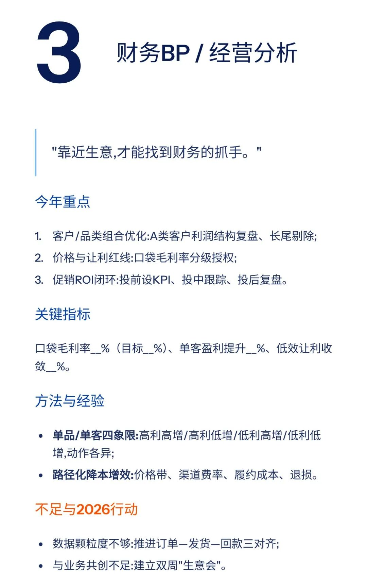

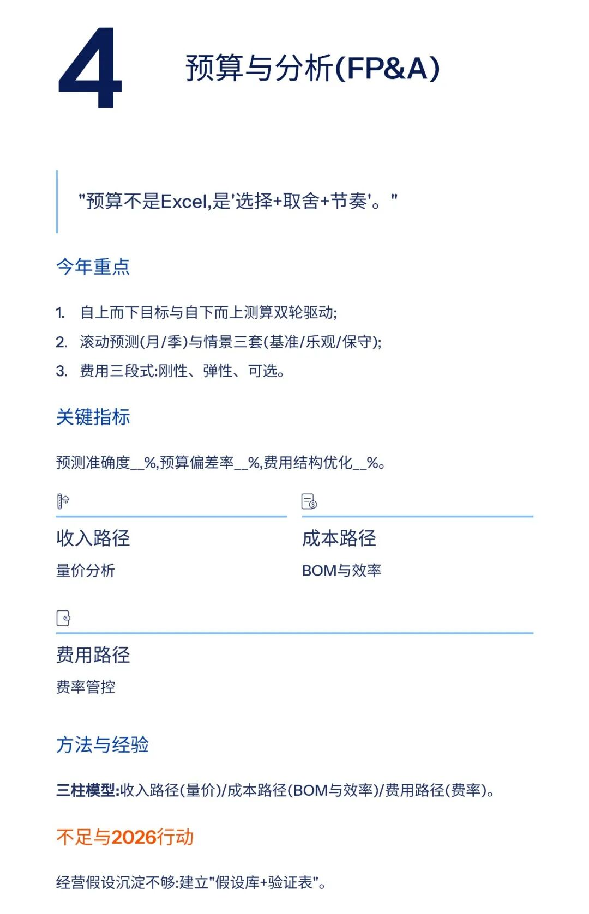

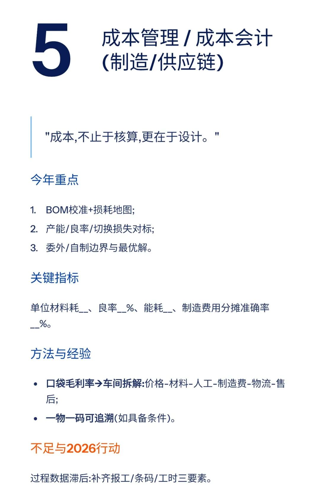

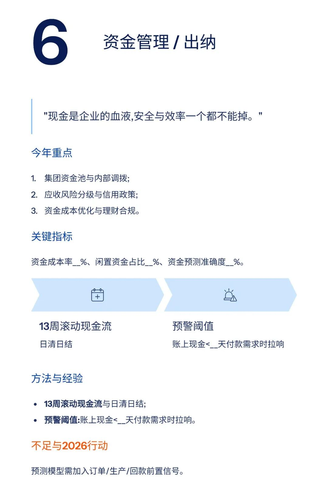

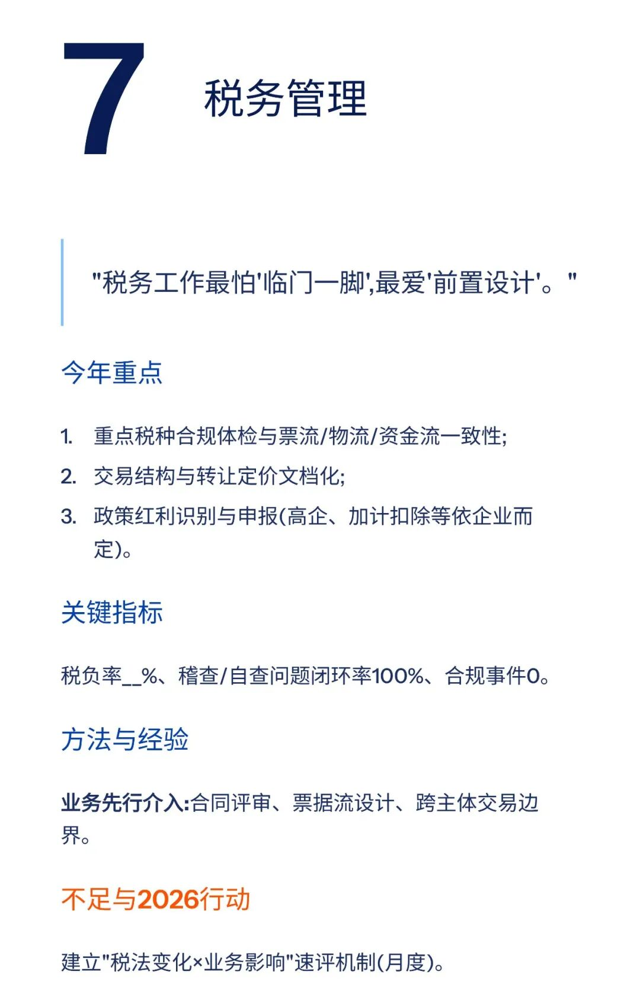

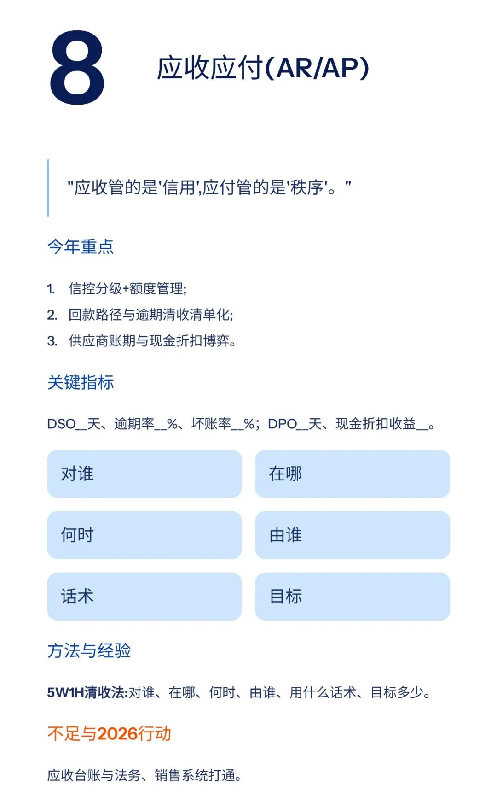

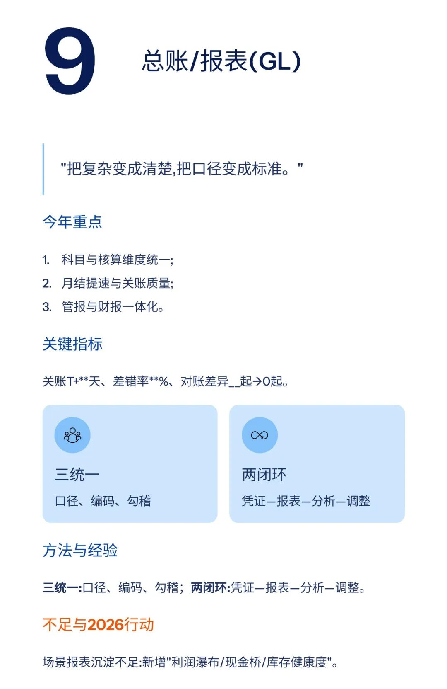

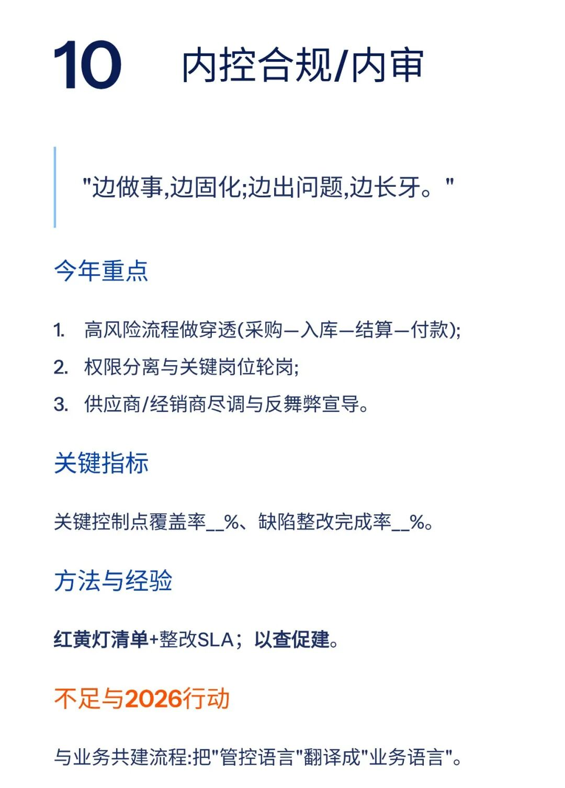

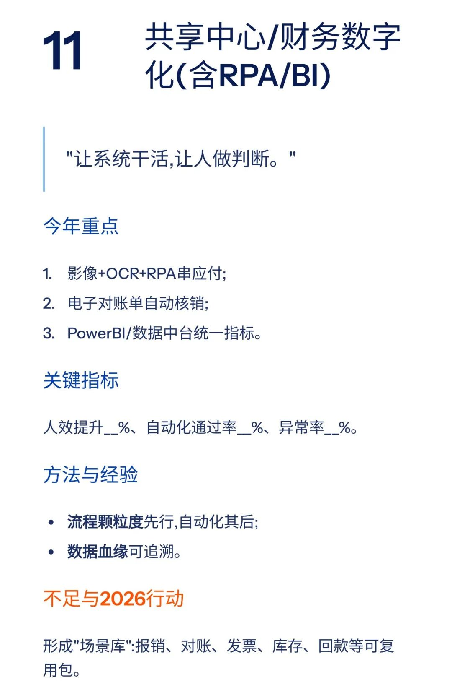

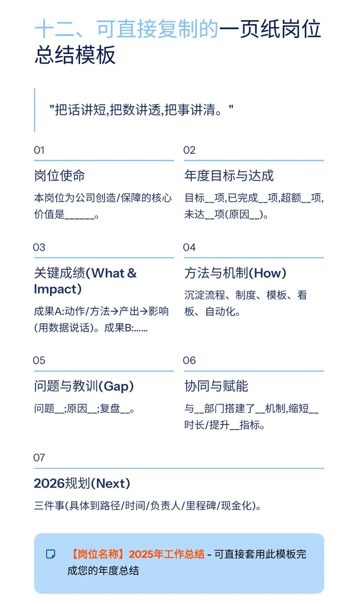

模板即思路，点击
阅读原文
获取《

2025年财务总监工作总结PPT（20页）

》

。

加入

数据熊的财务精进营

，与2600+财务精英共同成长。后台点击
「经典文章」阅读数据熊10W+爆文，
模板定制添加数据熊微信：

Daniel-songyq

