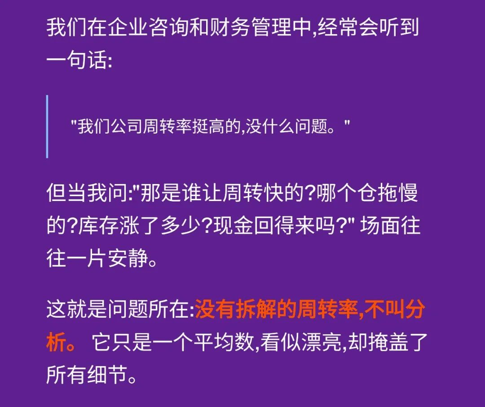
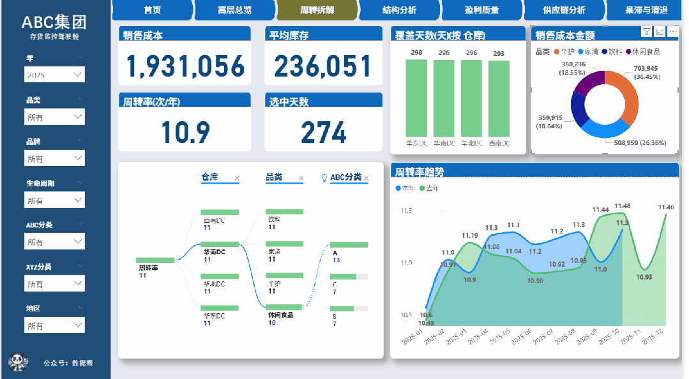
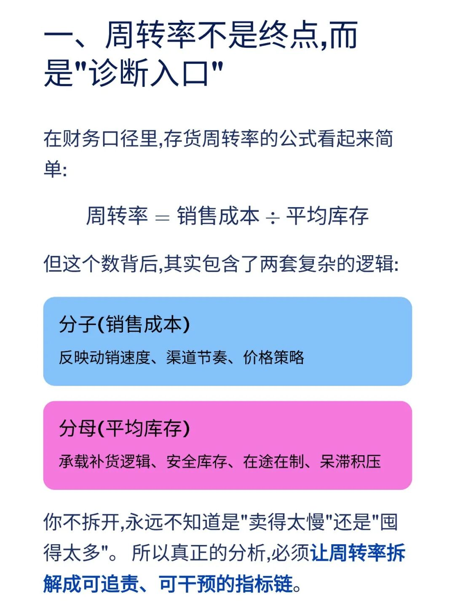
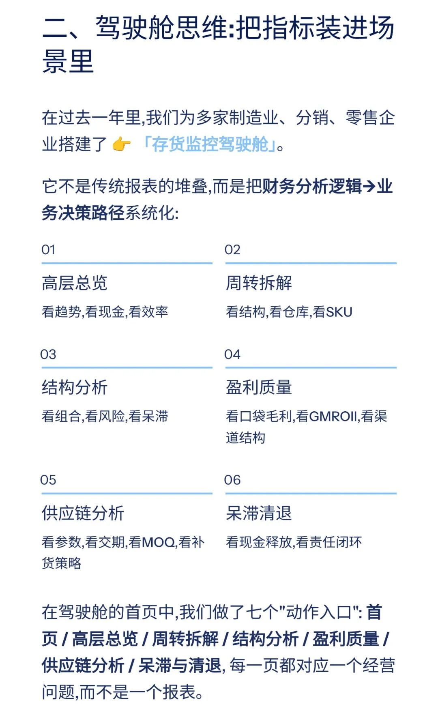
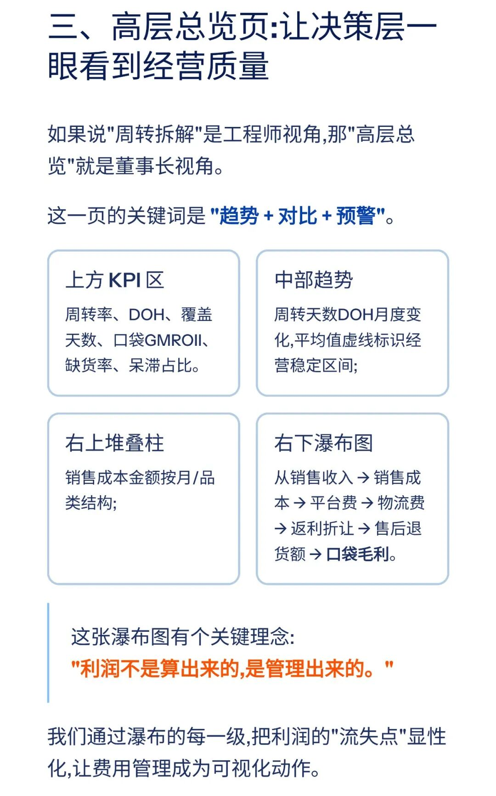
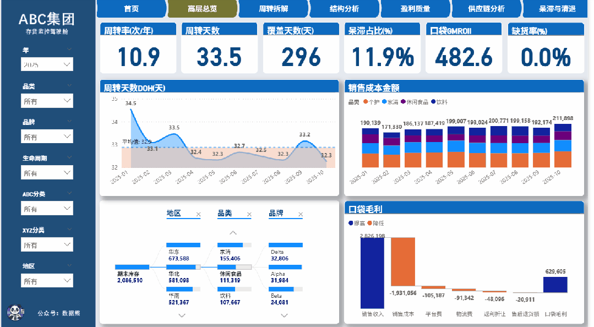
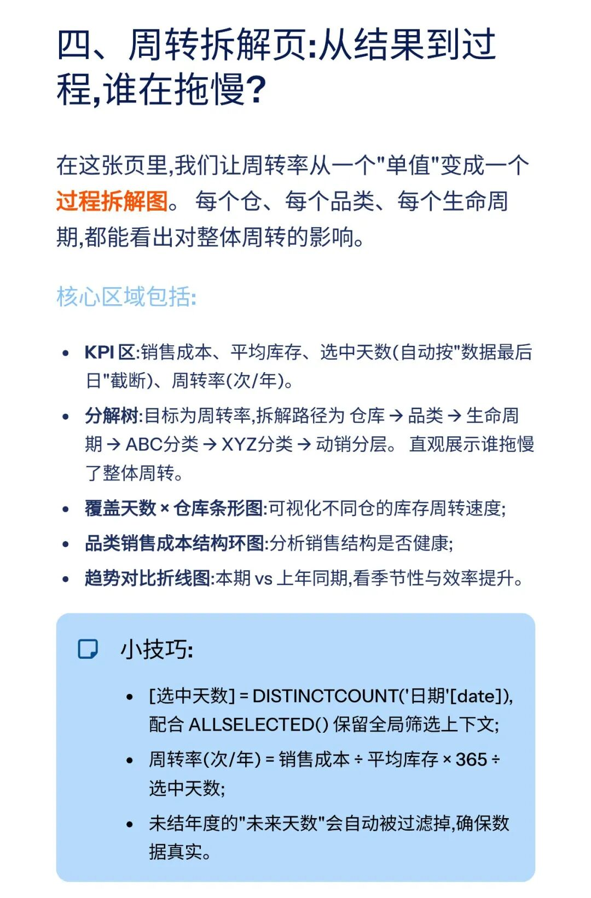
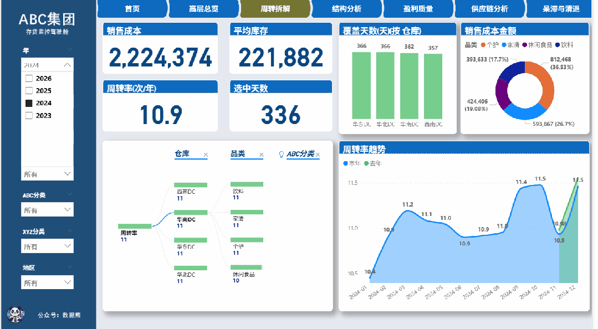
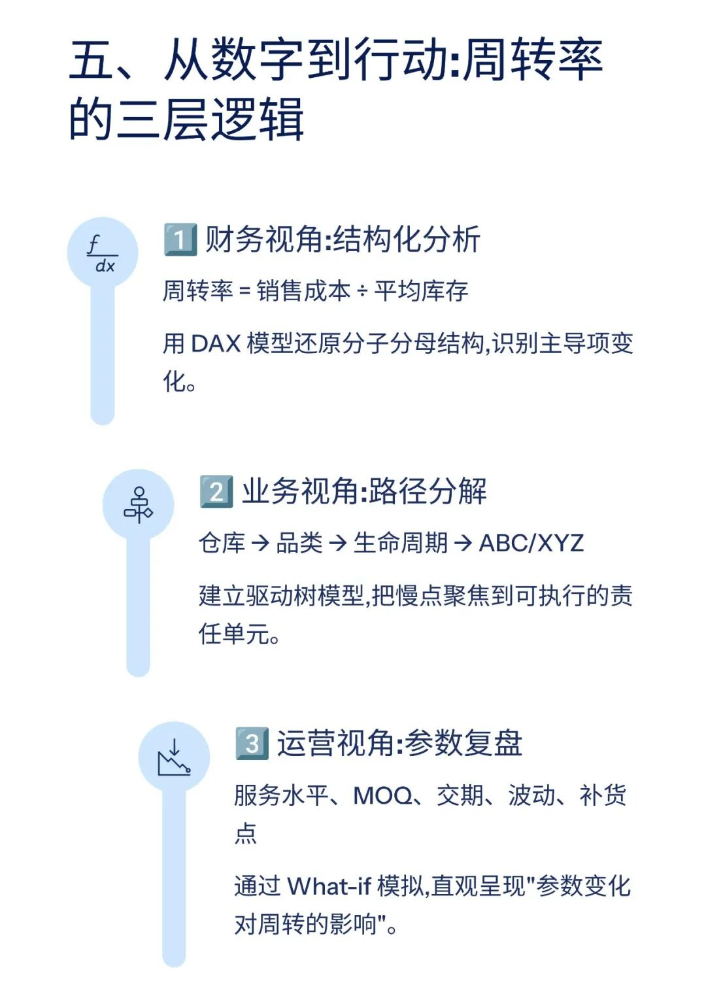

# 存货周转率：没有拆解等于没有分析

> 来源：微信公众号「数据熊」 · 作者 宋岳清 · 发布于 2025-11-10 07:30
> 原文链接：http://mp.weixin.qq.com/s?__biz=Mzg2MTg5OTgzNA==&mid=2247491510&idx=1&sn=adec403e1aa1d14bc1f12250906bed7c&chksm=ce1142e3f966cbf56350ca214ab72e687572f715d35d20b05f11143eb26ad50877f534e963ec
> 摘要：想拥有这套驾驶舱吗？文末左下角点击蓝色阅读原文下载

