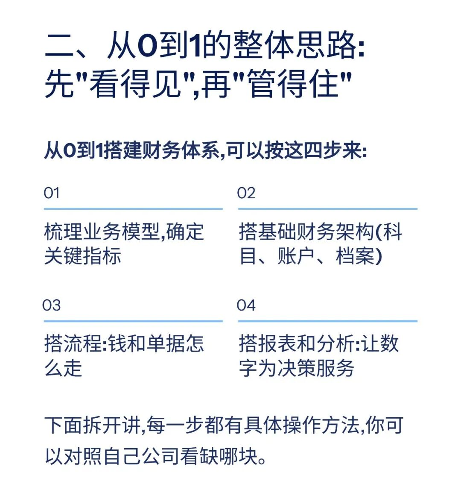
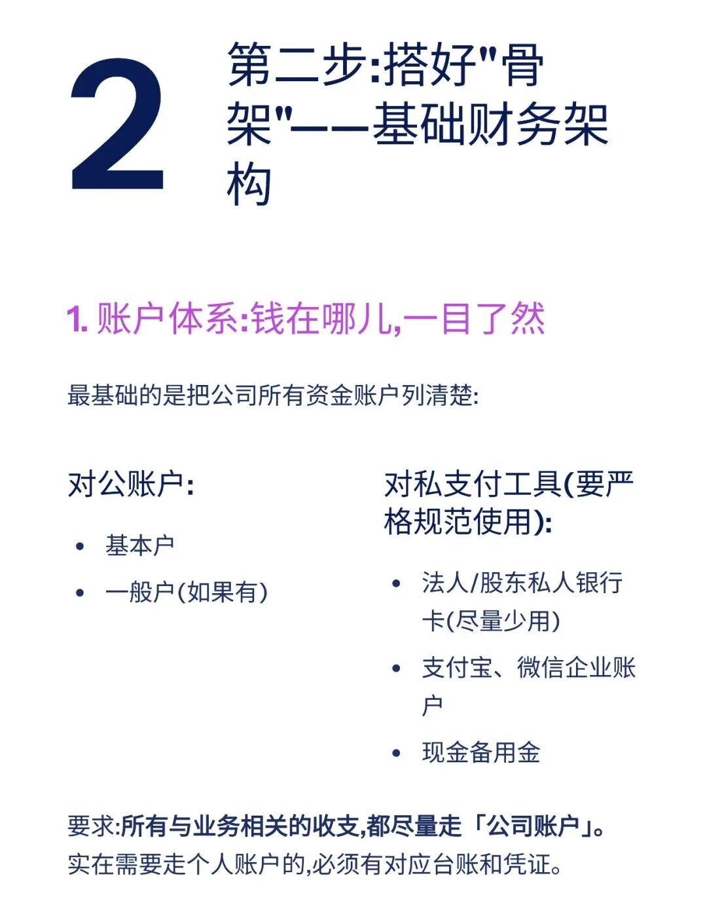
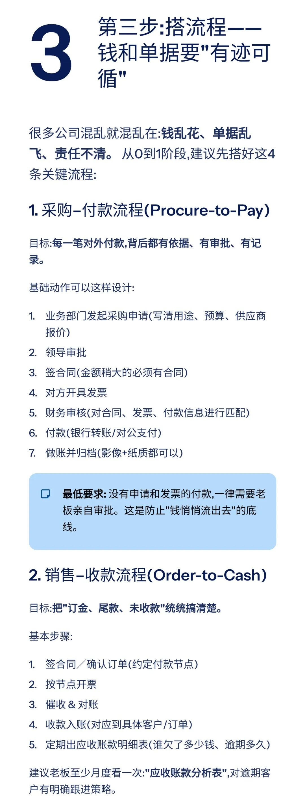
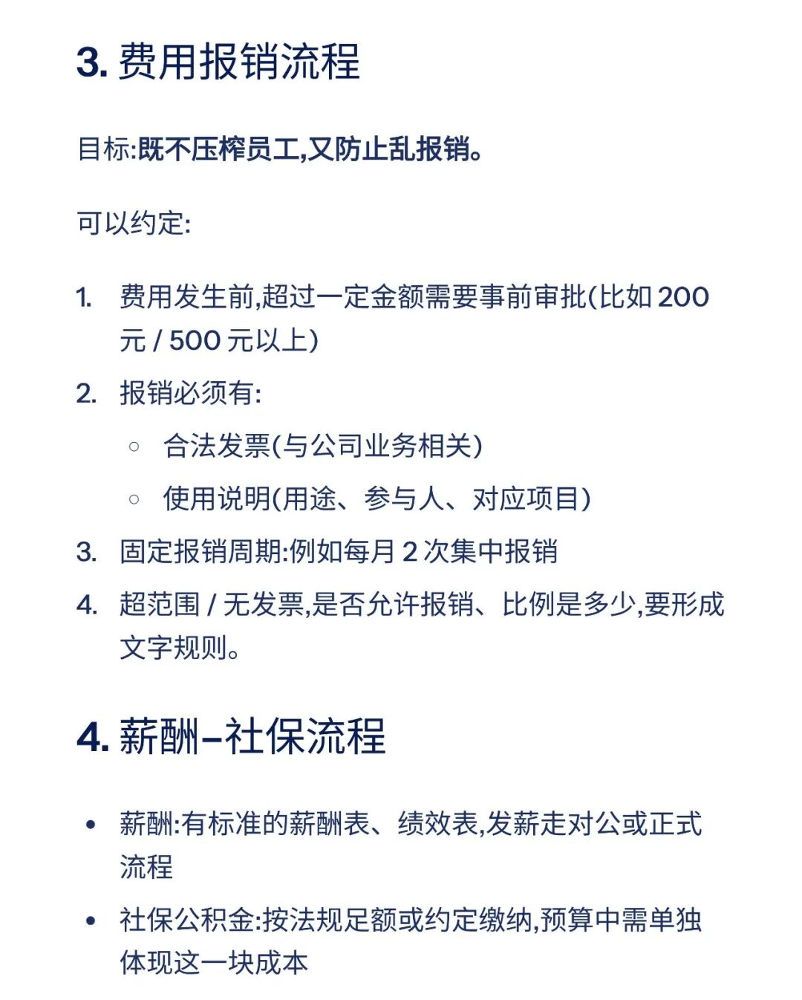
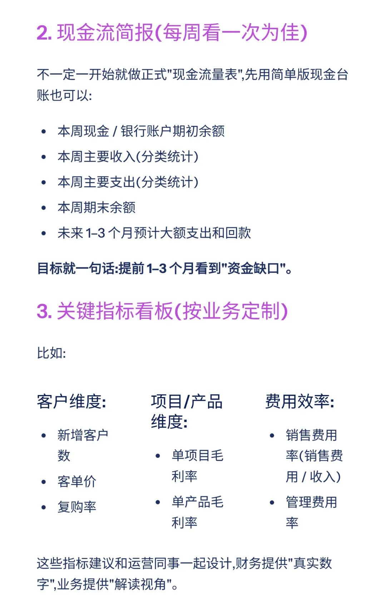
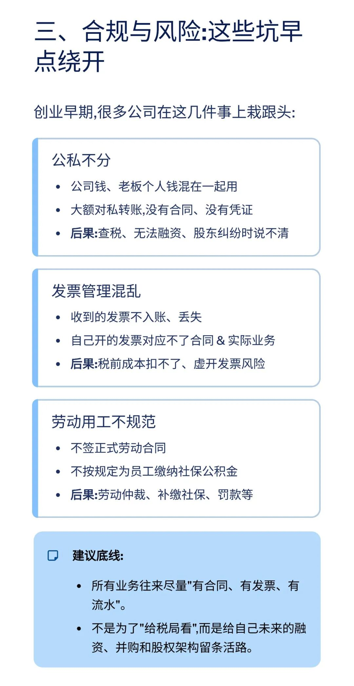
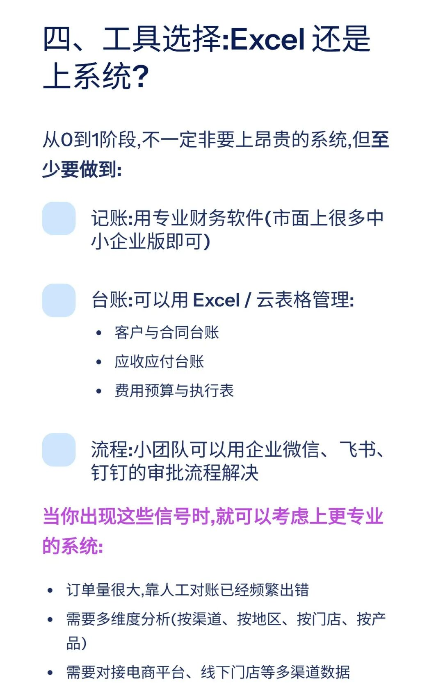
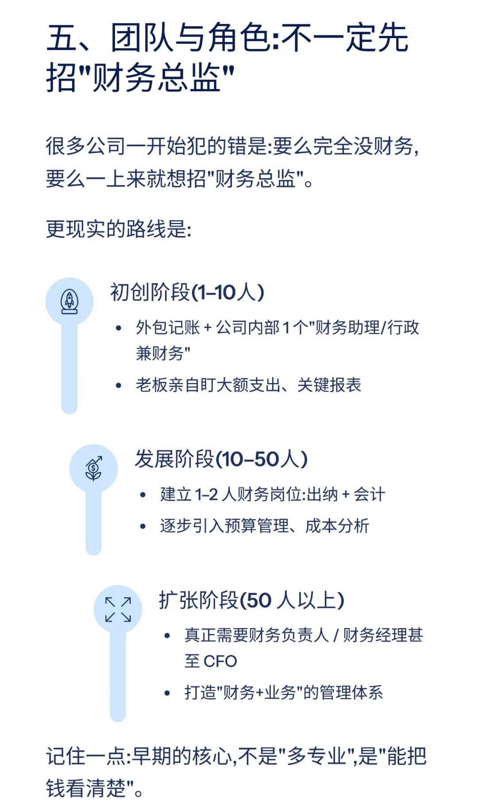
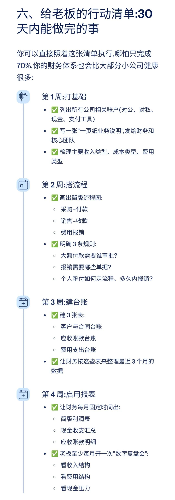

# 从0到1搭建公司财务体系（附思维导图、实操手册）

> 来源：微信公众号「数据熊」 · 作者 宋岳清 · 发布于 2025-11-22 07:30
> 原文链接：http://mp.weixin.qq.com/s?__biz=Mzg2MTg5OTgzNA==&mid=2247492303&idx=1&sn=9140ca136d252eaf4e0affb899bcef13&chksm=ce12bf9af965368cb6d0b5ff4e031fef1333411e0984ab7f8c0c4b501aff9acf900de8f53497
> 摘要：很多老板都会有这样的错觉\x26quot;现在公司还小,找个会记账的就够了,财务体系以后再说。\x26quot;真相是:绝大多数公司死在\x26quot;没钱了\x26quot;,而不是\x26quot;没订单\x26quot;。而\x26quot;没钱了\x26quot;的背后,往往就是——从一开始就没有搭好财务体系。

模板即思路，点击

阅读原文

获取

《实操手册

：从0到1搭建财务体系

》

工作没思路，困惑没人问？赶快加入

数据熊的会员群

，与2700+财务精英共同成长

。

PowerBI看板

定制添加数据熊微信：Daniel-songyq

