# 2025年应收账款分析模型（附Excel模板）

> 来源：微信公众号「数据熊」 · 作者 宋岳清 · 发布于 2026-01-15 07:30
> 原文链接：http://mp.weixin.qq.com/s?__biz=Mzg2MTg5OTgzNA==&mid=2247495578&idx=1&sn=08b9bcdc333a7986782658a56abd4c26&chksm=ce12b2cff9653bd909ea0c419523f127ec0e4d2f66fba415403a708d3df3e80002e7e4dcffcc

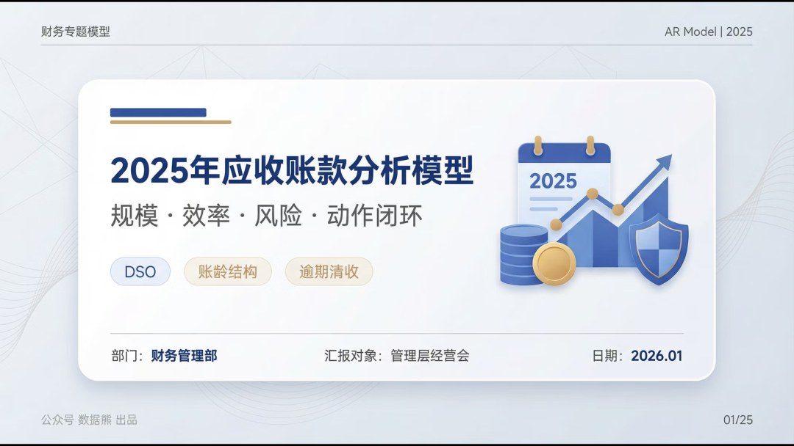

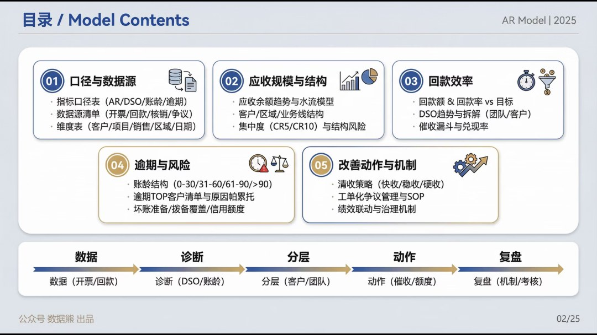

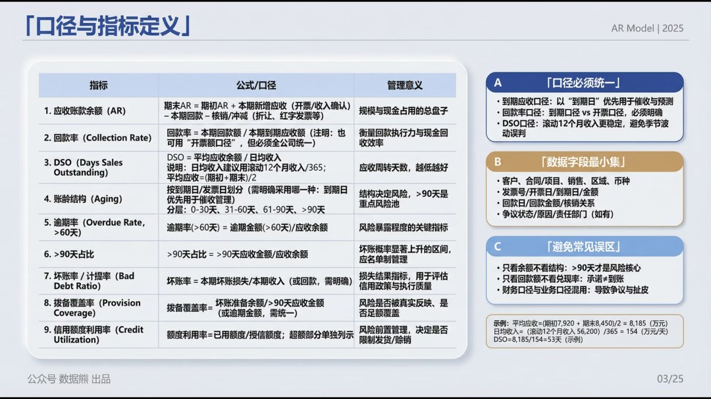

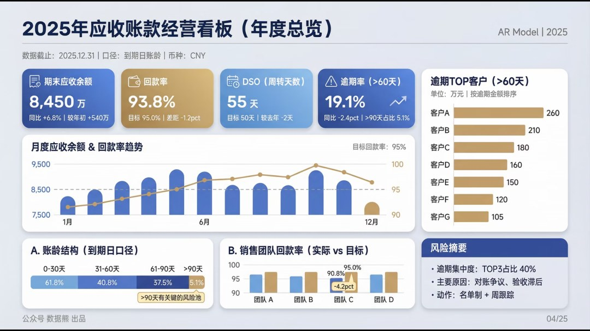

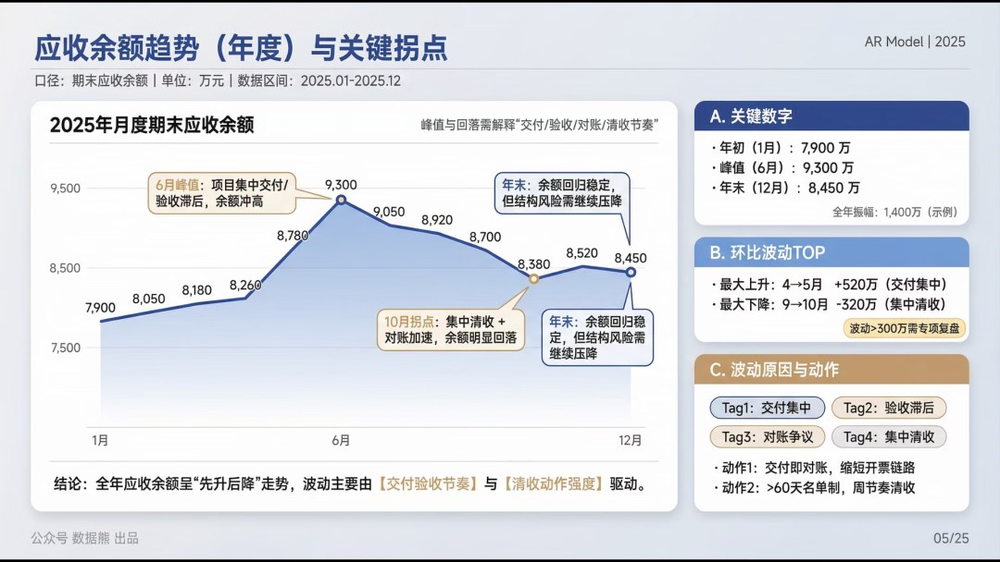

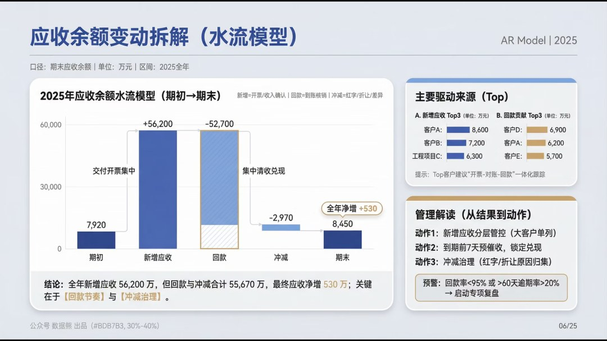

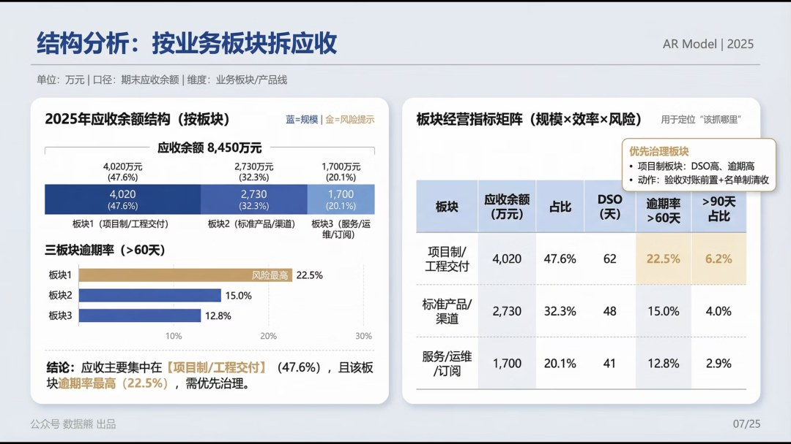

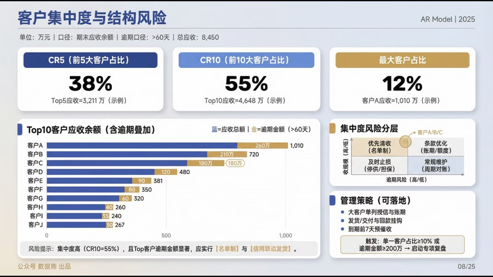

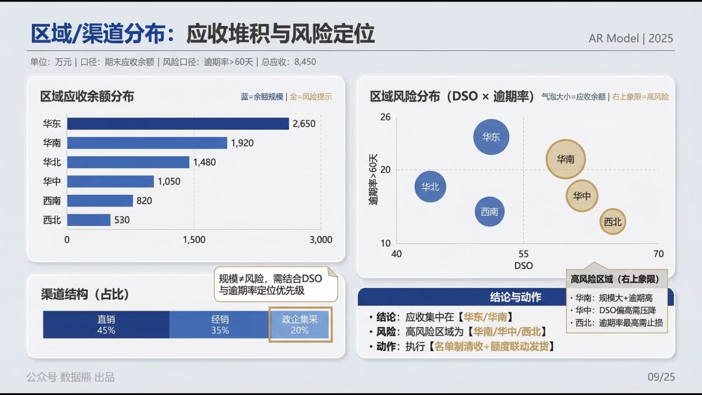

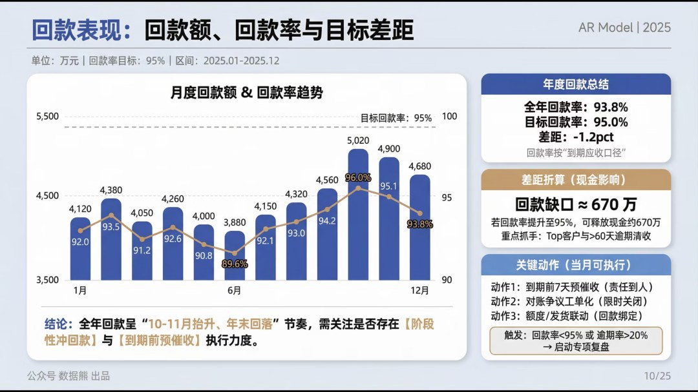

全文共25页内容，剩余15页请点击文末左下角
阅读原文
查看

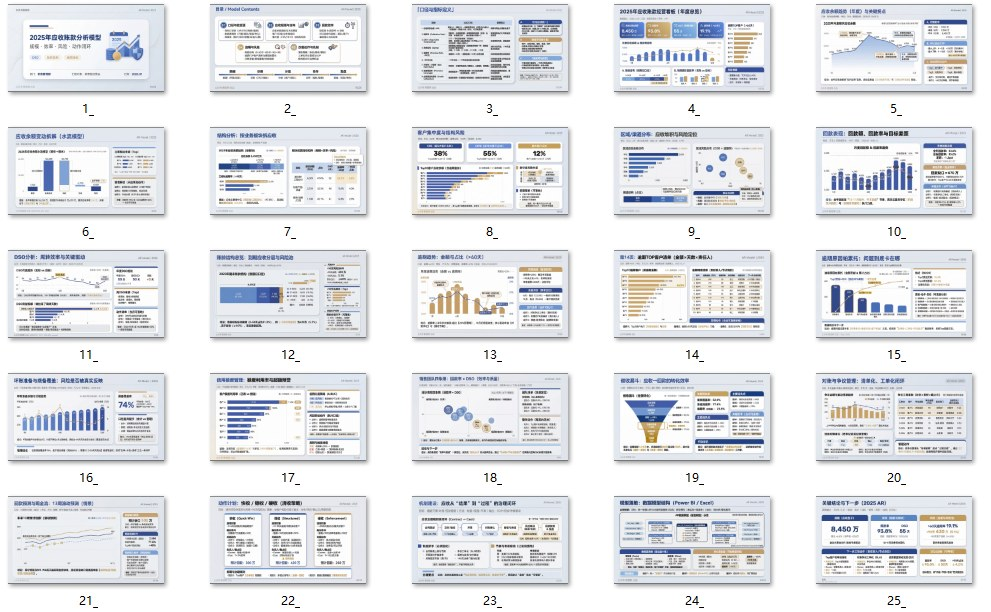

点击文末左下角

阅读原文

，下载完整版

《2025年

应收账款分析模型

》及excel底表。

PPT定制添加数据熊微信：

Daniel-songyq   更多模板加入

会员群

获取

往期推荐

2025年经营分析报告

2025年成本分析报告

2025年资金与现金流分析报告及2026年资金计划

2025年财务部工作总结及2026年工作计划.pptx

2026年全面预算套表.xlsx（可下载）

