# 财务审核合同的关键要点清单

> 来源：微信公众号「数据熊」 · 作者 宋岳清 · 发布于 2026-02-06 07:30
> 原文链接：http://mp.weixin.qq.com/s?__biz=Mzg2MTg5OTgzNA==&mid=2247496190&idx=1&sn=bce92f5790df683d832d6fdc5769b0fd&chksm=ce12acabf96525bdf20a83fa7a7bf962b9c94bc93d878481b13b062809318d07465c69536e5f

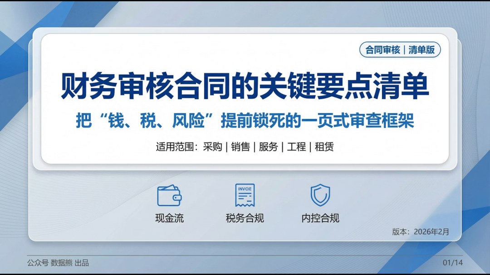

文末左下角点击
阅读原文
可下载此报告及excel版清单

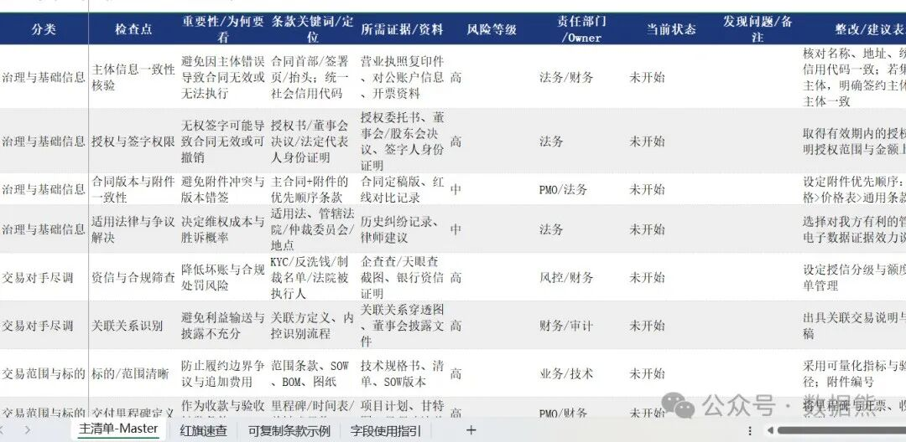

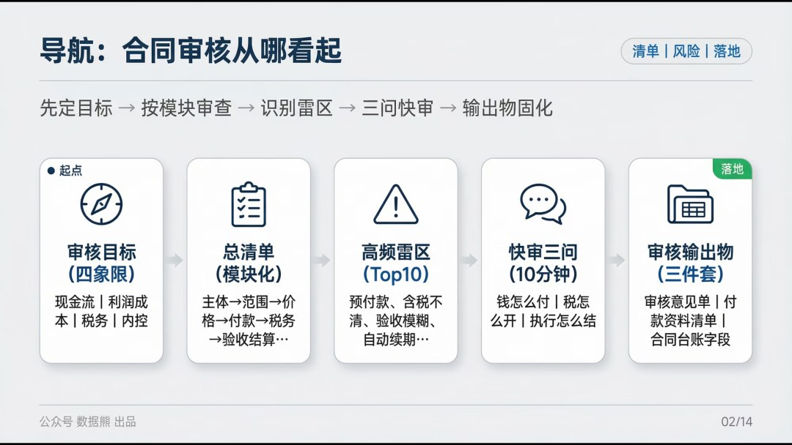

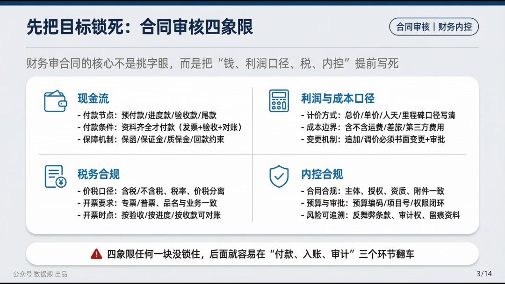

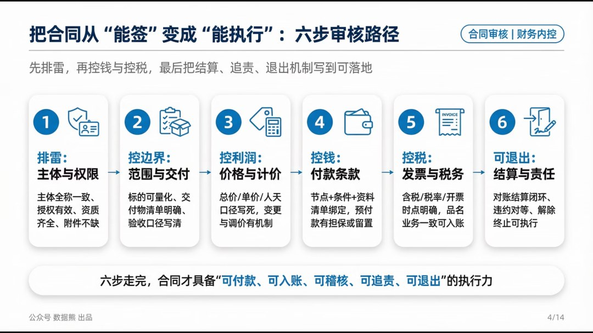

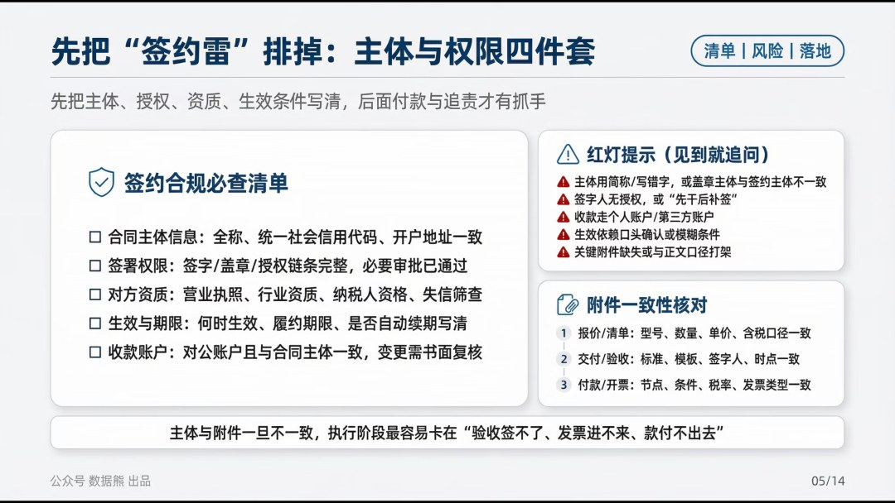

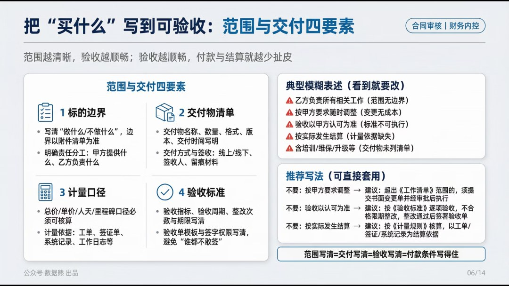

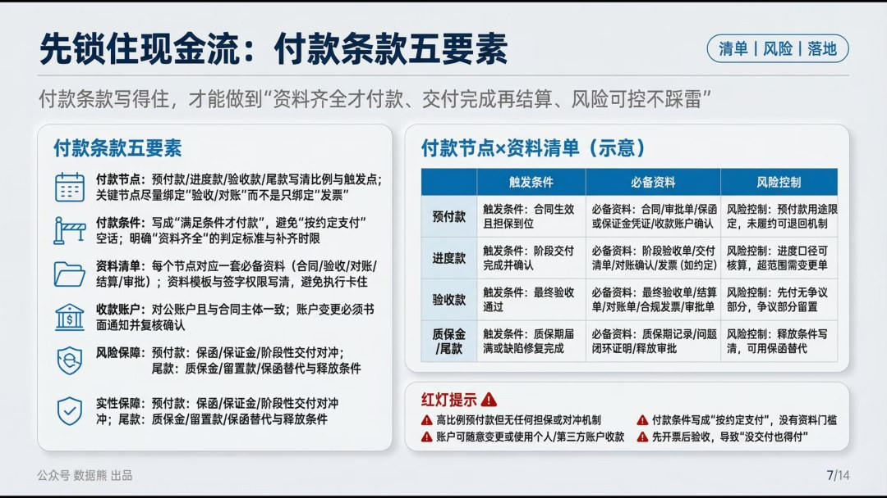

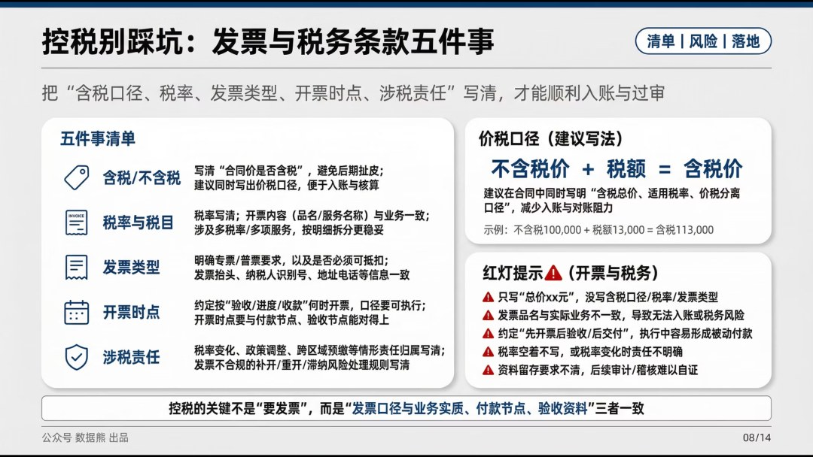

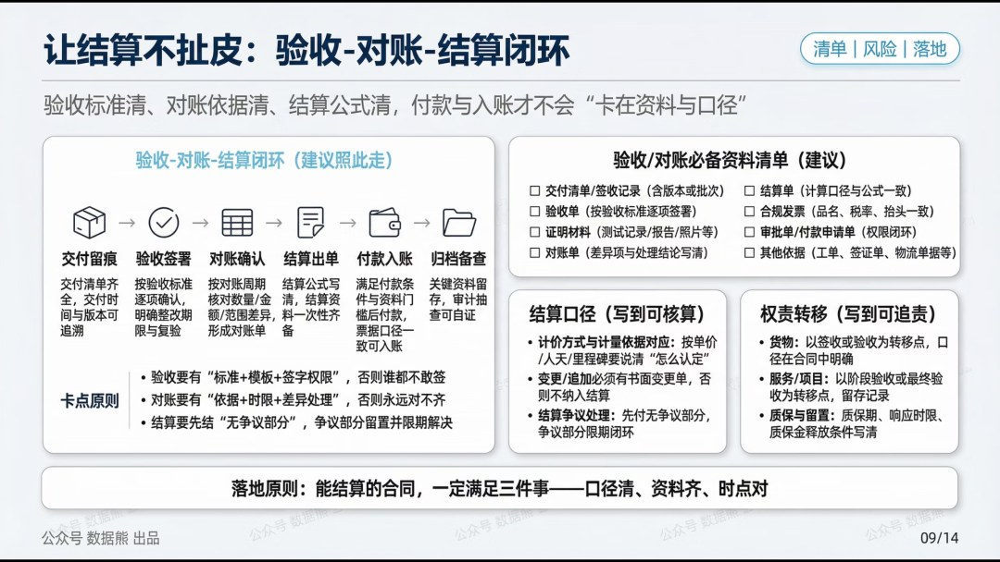

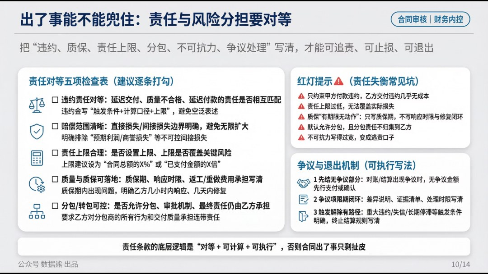

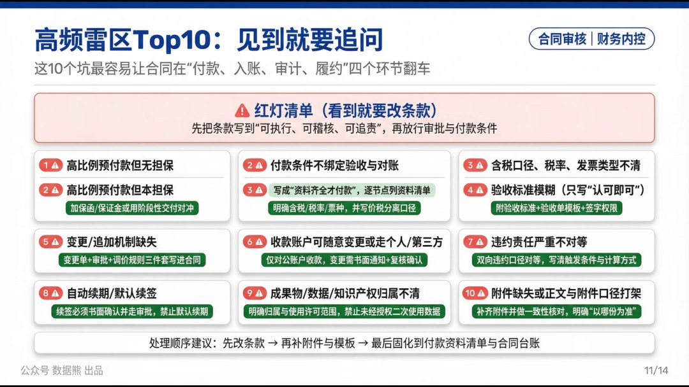

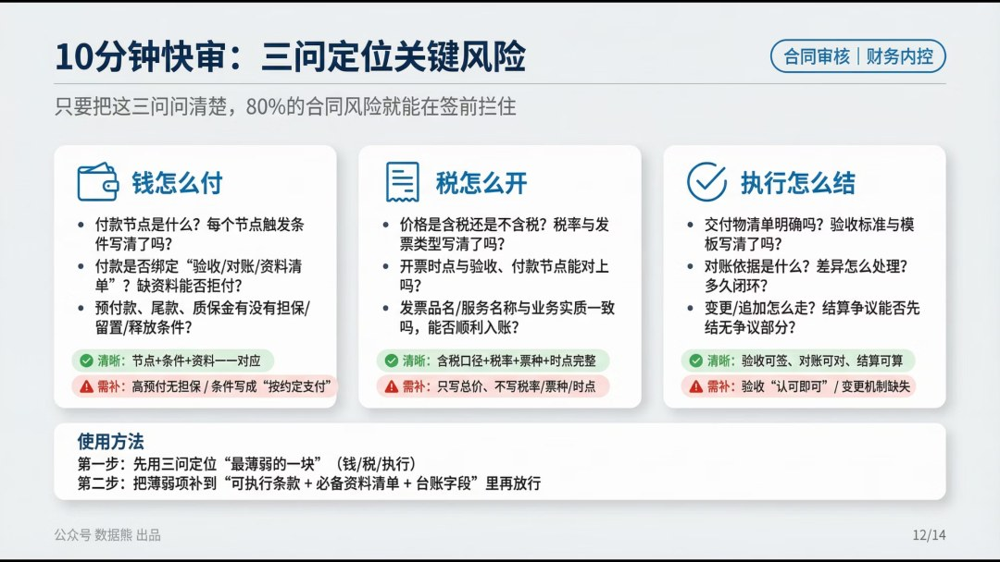

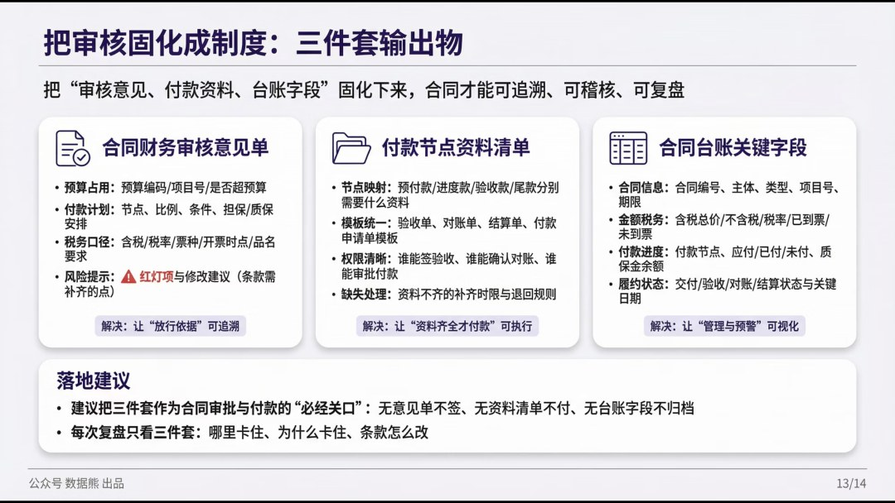

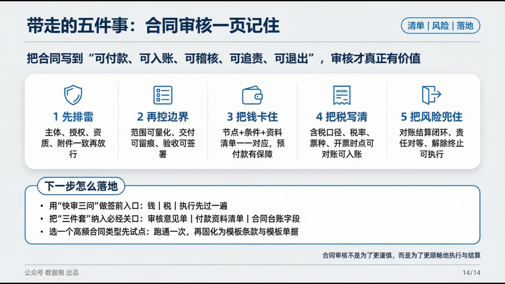

工作没思路，困惑没人问？赶快加入

数据熊的粉丝群

，与4100+精英共同成长。

PowerBI看板

定制添加数据熊微信：

