# 2026年1月资金及现金流分析报告

> 来源：微信公众号「数据熊」 · 作者 宋岳清 · 发布于 2026-02-13 12:08
> 原文链接：http://mp.weixin.qq.com/s?__biz=Mzg2MTg5OTgzNA==&mid=2247496505&idx=1&sn=0734bc29a7dc62ce7b4b00b9b7f4cbf3&chksm=ce12ae6cf965277a9eb5f0c701de203498714ae34cbd1bf86cbb4d9a52ef73c21f17feb46b1e
> 摘要：文末左下角点击阅读原文，下载此报告点击文末左下角阅读原文查看下载完整版《2026年1月资金及现金流分析报告》。

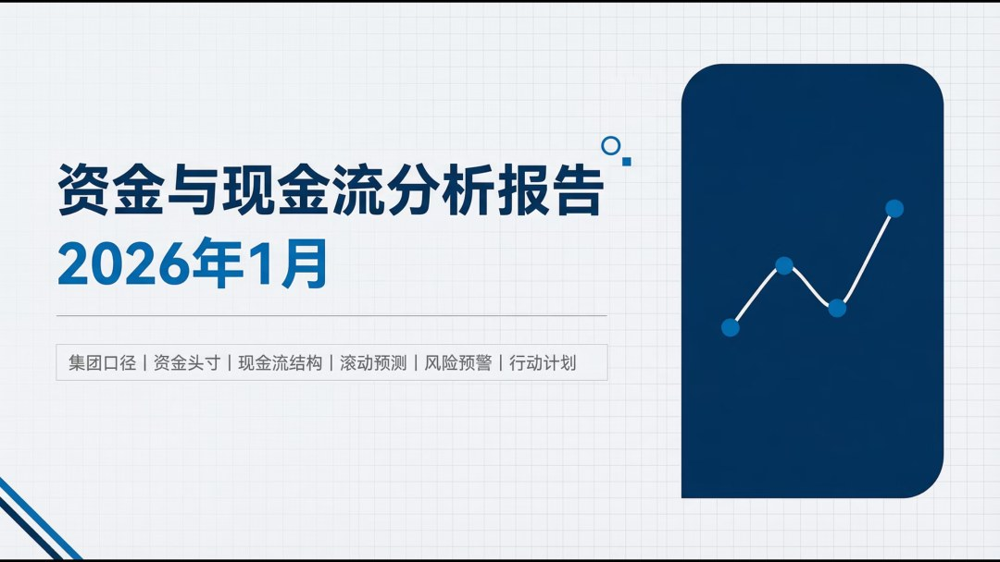

文末左下角点击
阅读原文
，下载此报告

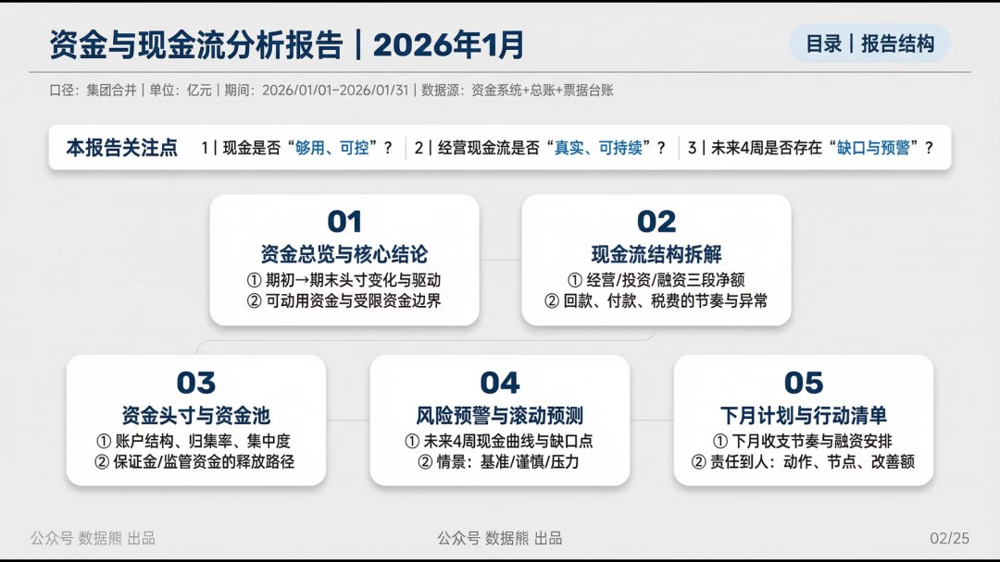

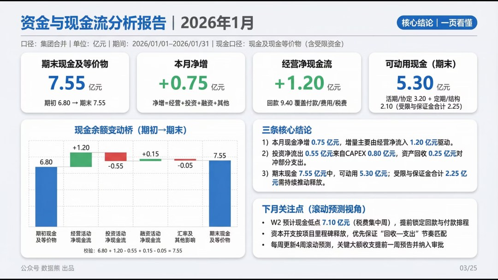

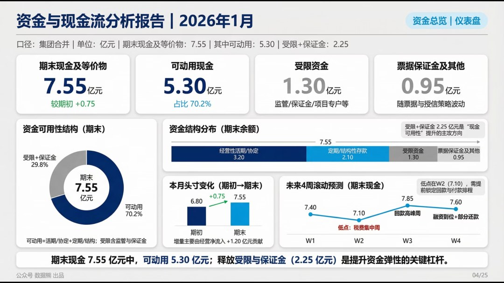

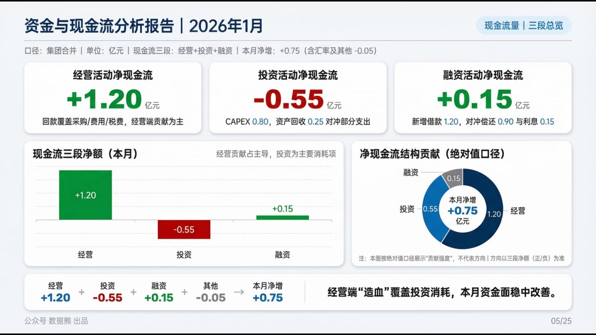

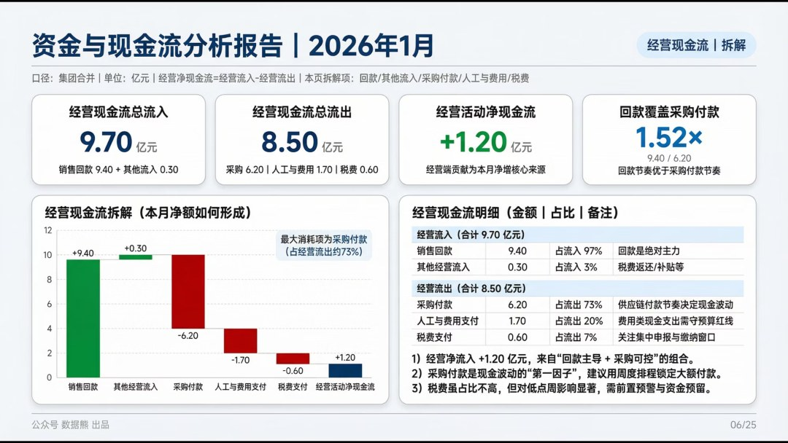

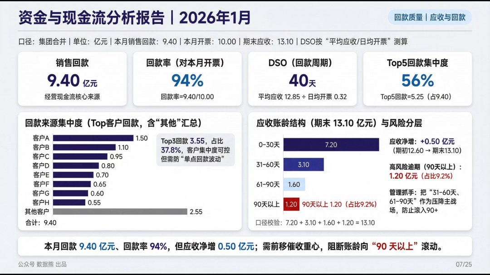

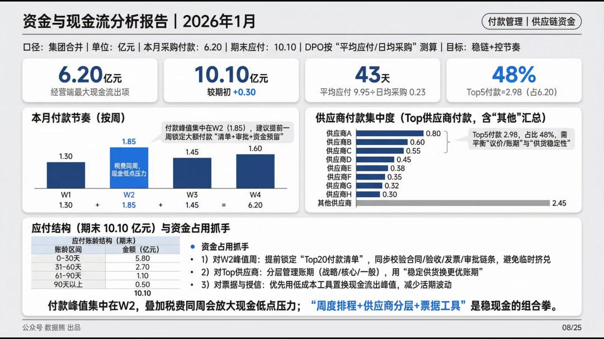

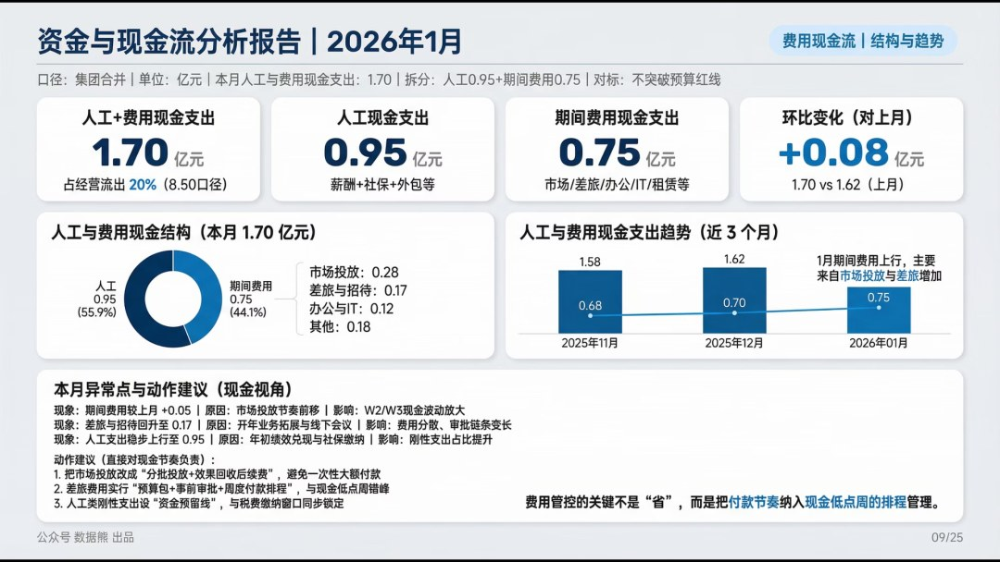

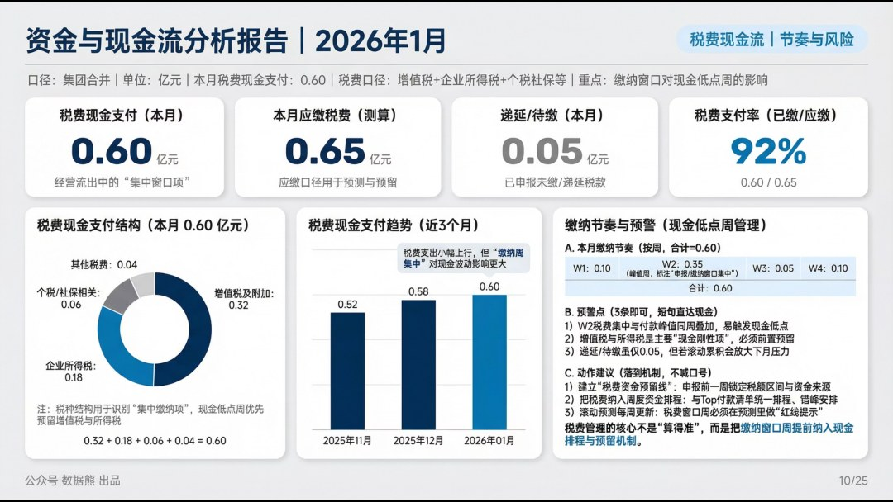

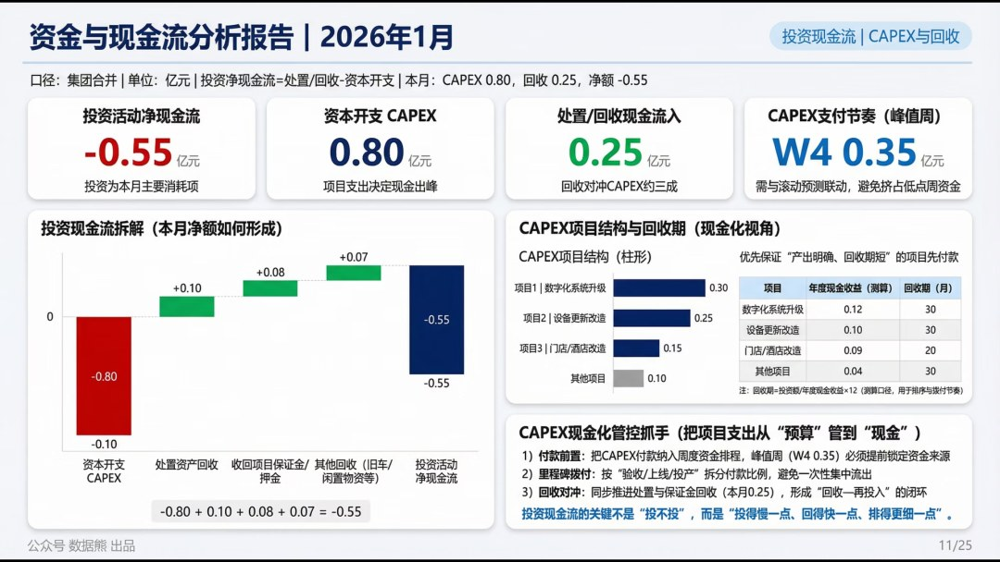

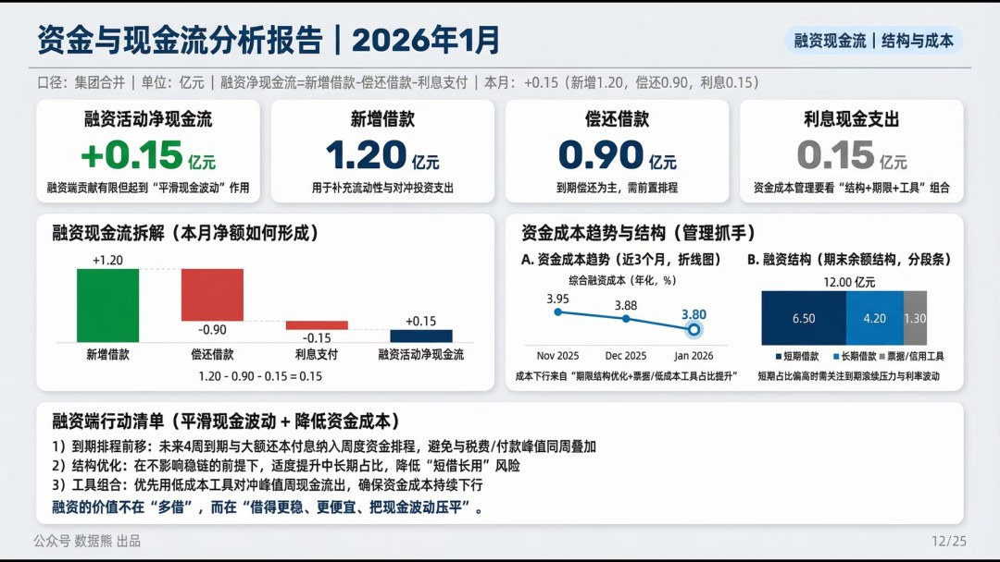

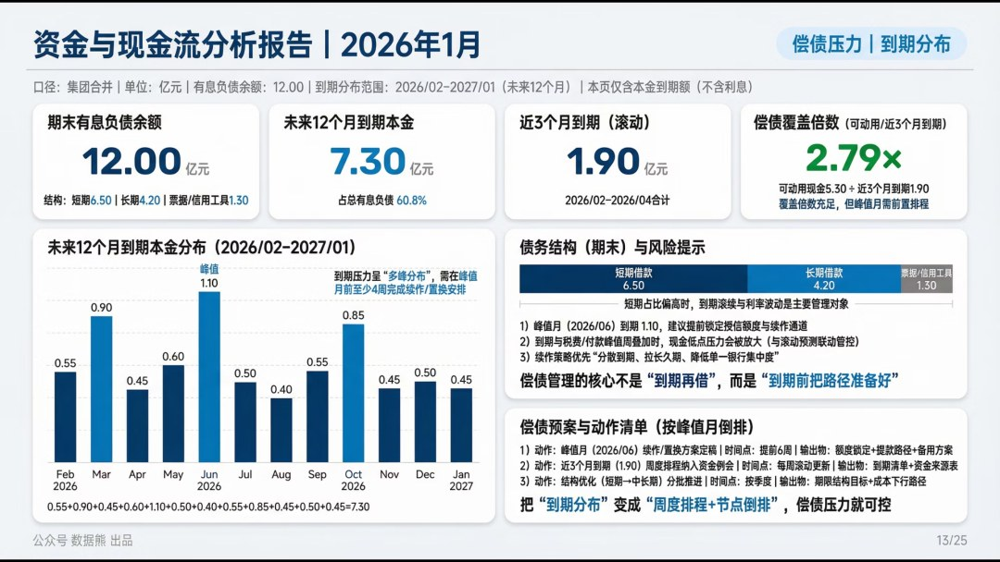

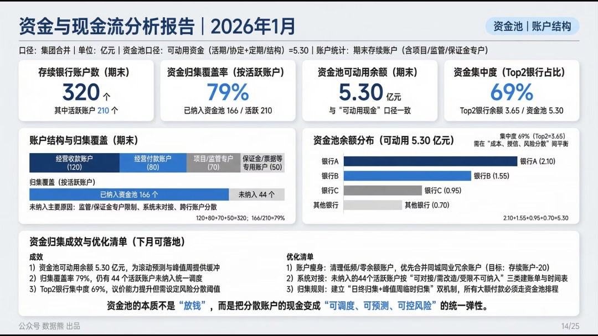

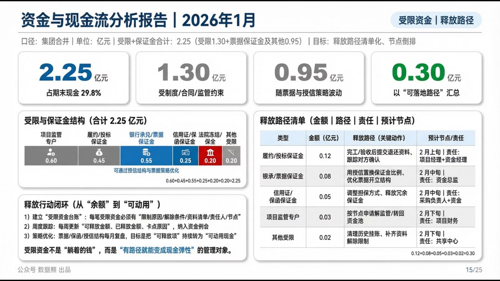

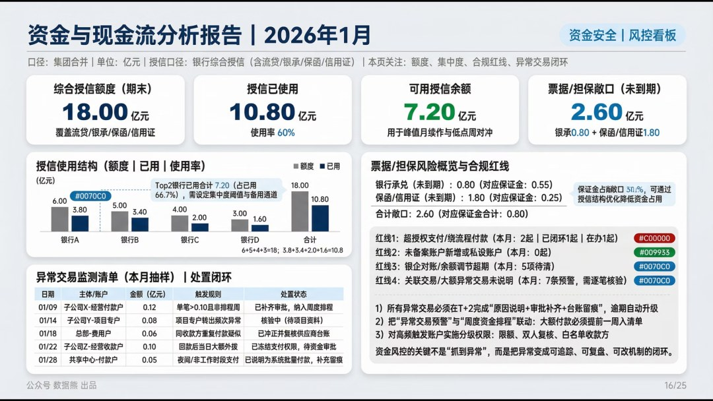

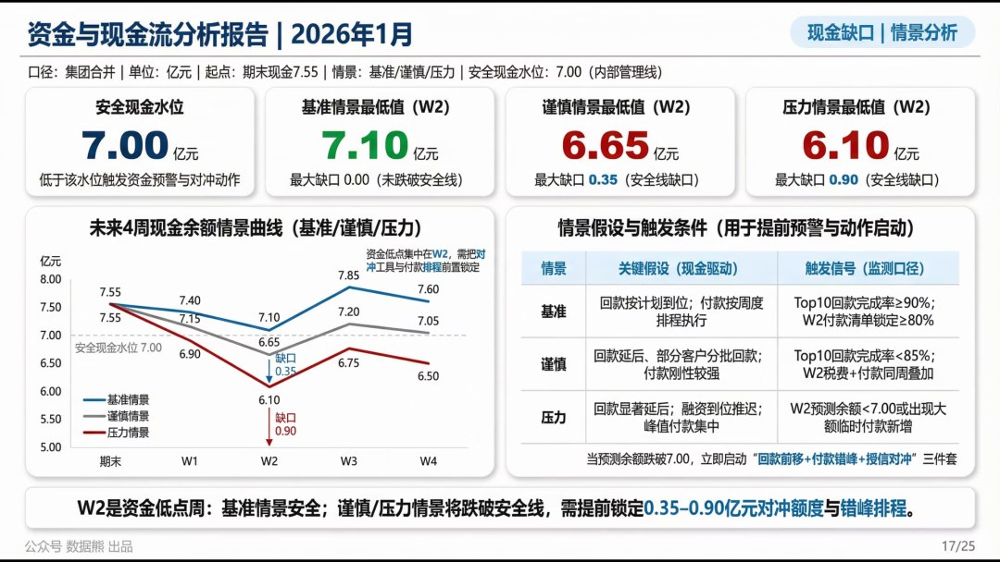

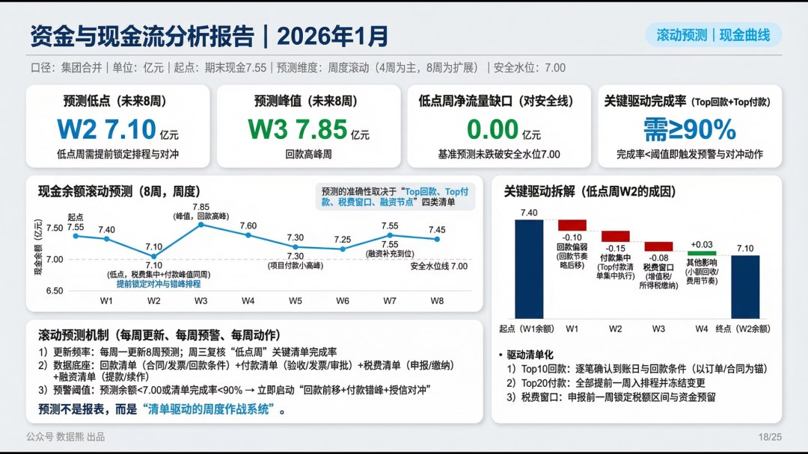

点击文末左下角
阅读原文

查看

下载完整版

《2026年1月

资金及现金流分析报告

》。

PPT定制添加数据熊微信：

Daniel-songyq   更多模板加入

会员群

获取

往期推荐

2025年经营分析报告

2025年成本分析报告

2025年资金与现金流分析报告及2026年资金计划

2025年财务部工作总结及2026年工作计划.pptx

2026年全面预算套表.xlsx（可下载）

