# 2026年1月财务分析报告

> 来源：微信公众号「数据熊」 · 作者 宋岳清 · 发布于 2026-02-16 08:00  
> 原文链接：http://mp.weixin.qq.com/s?__biz=Mzg2MTg5OTgzNA==&mid=2247496576&idx=1&sn=21cbd2627cfe31ce067affcce6477c4c&chksm=ce12aed5f96527c38982b5db0cf1fad7d4f9aacd4f3e78d1ece1676043c08e68e7202c6def84

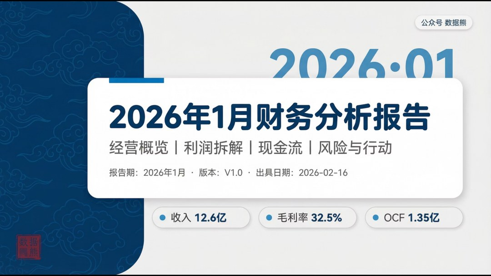

点击文末左下角
阅读原文
，可下载此报告完整版

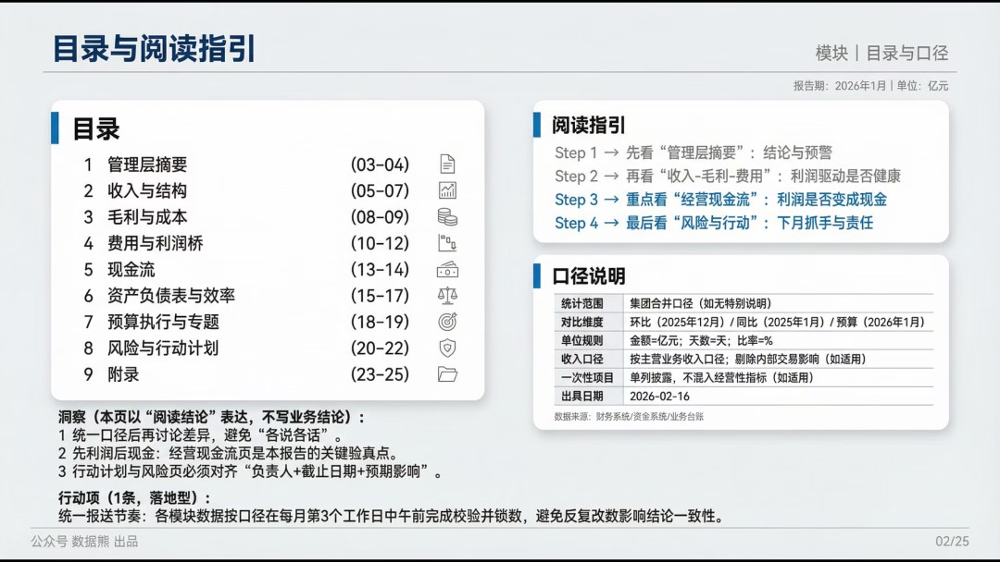

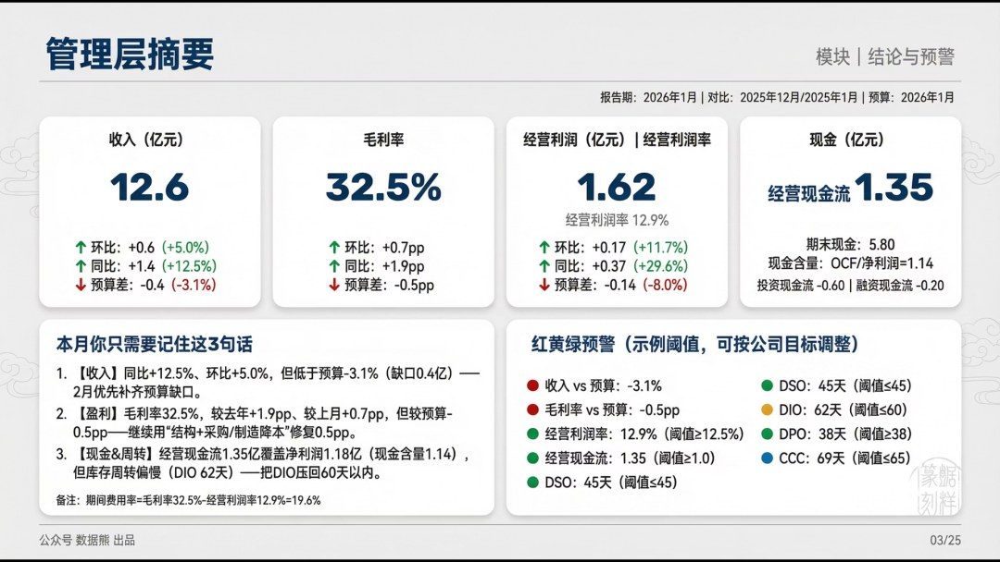

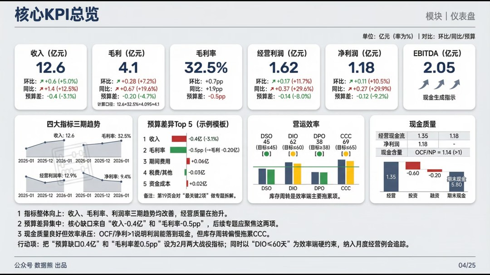

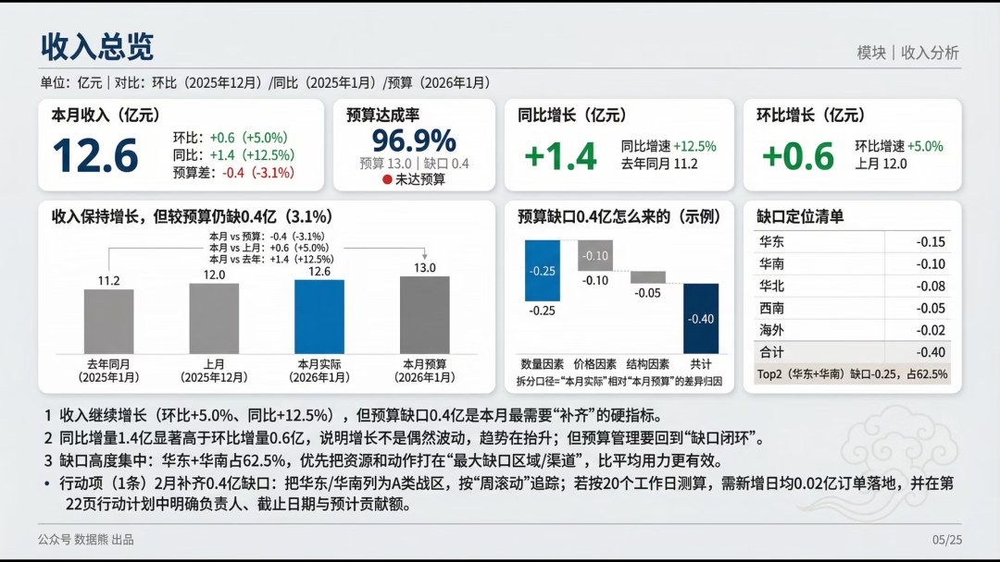

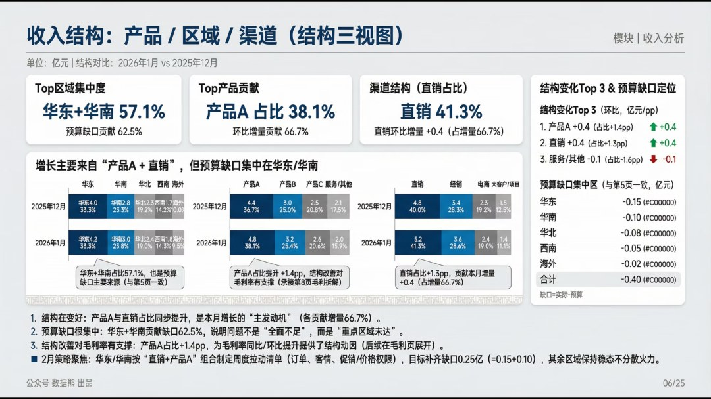

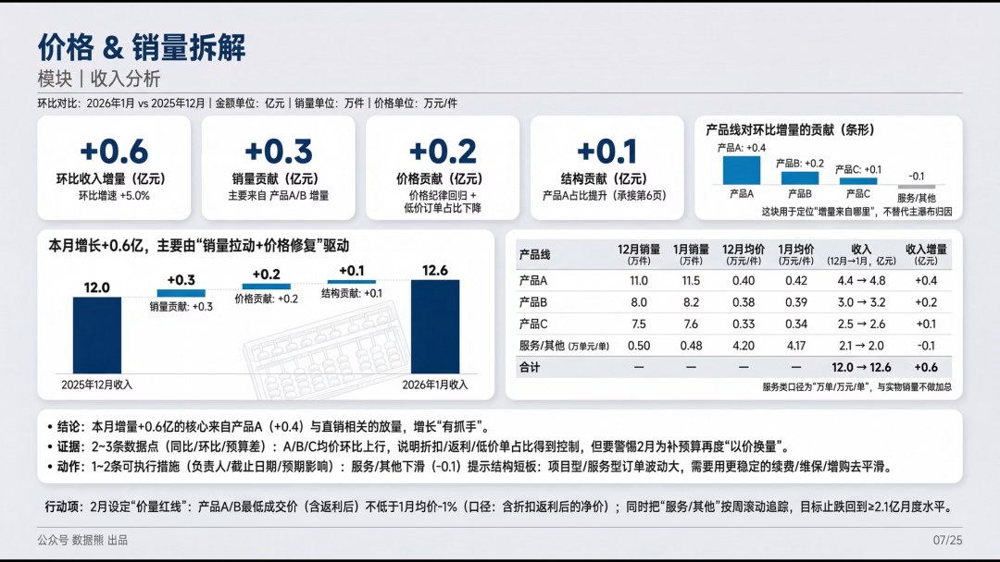

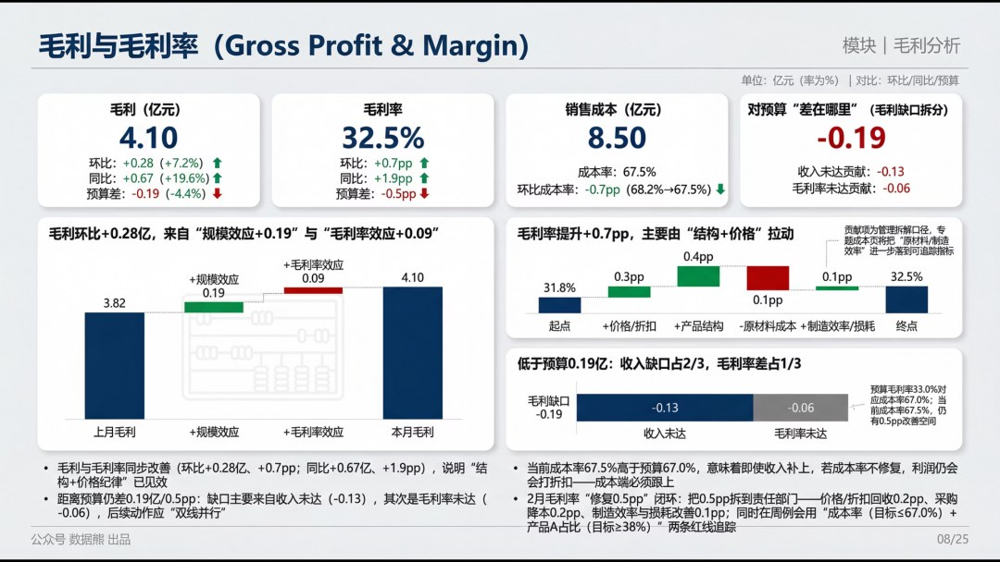

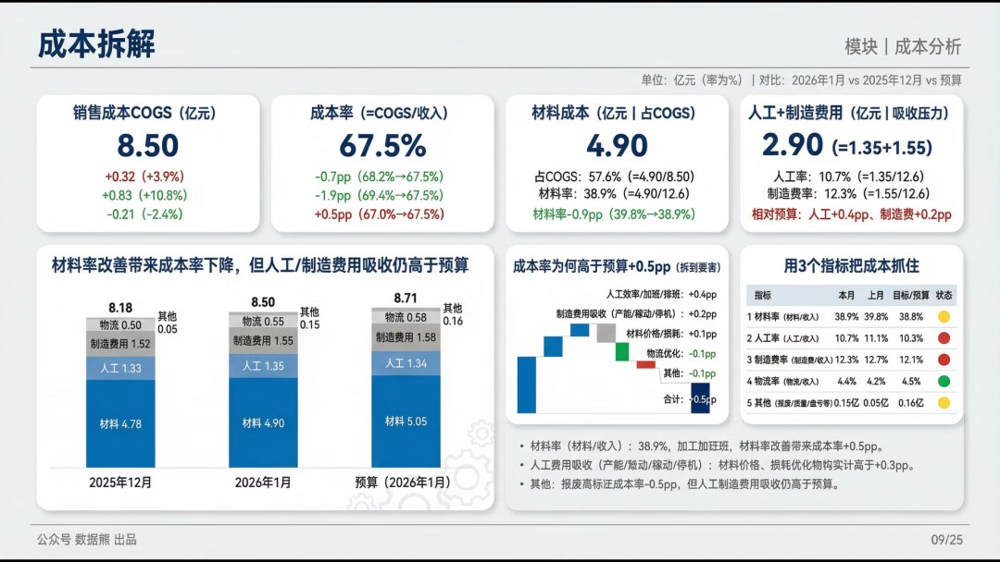

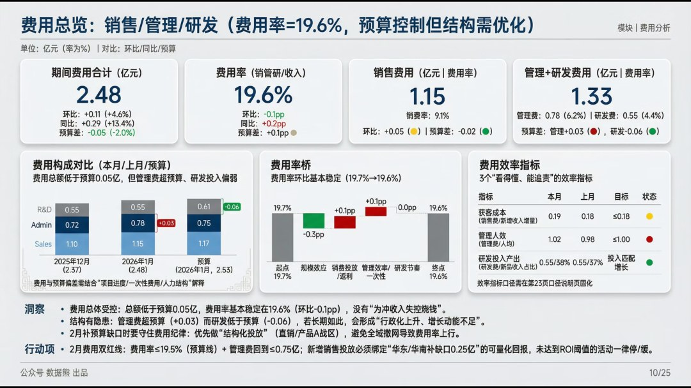

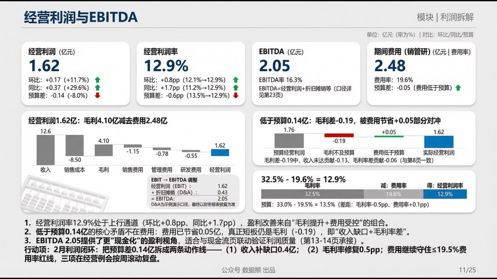

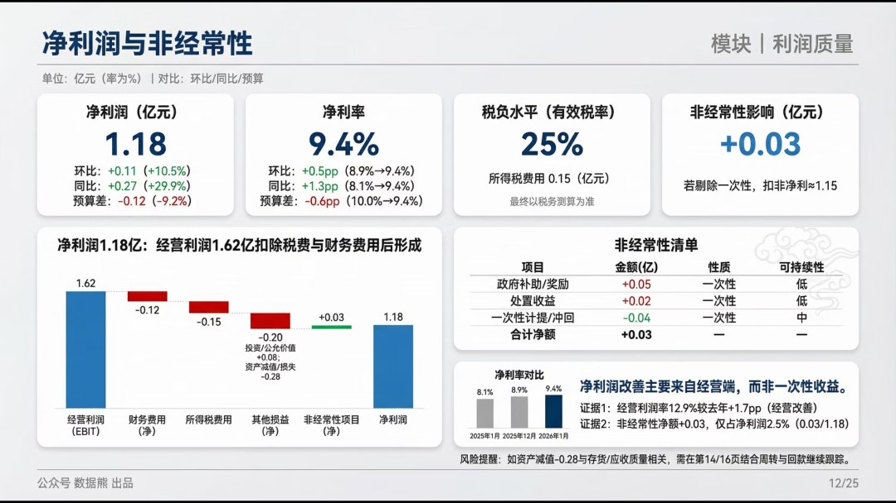

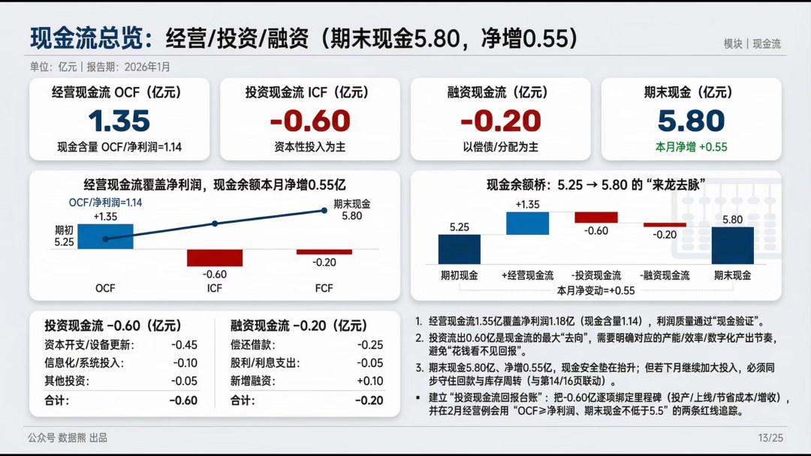

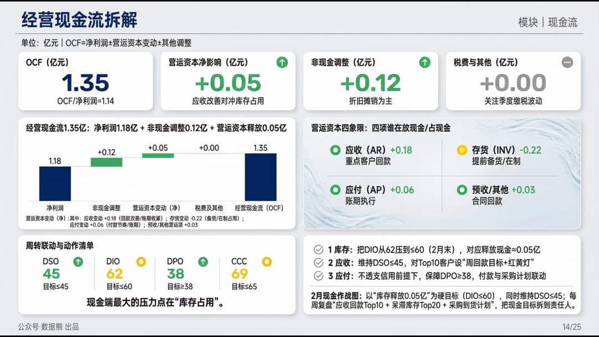

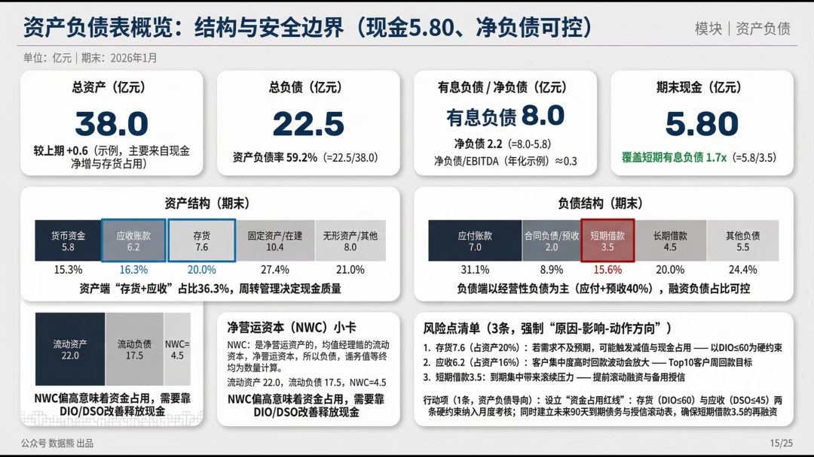

点击文末左下角

阅读原文

，下载完整版

《

2026年1月财务分析报告

》。

PPT定制添加数据熊微信：

Daniel-songyq   更多模板加入

会员群

获取

往期推荐

2025年财务BP年终工作总结.pptx

2025年财务总监工作总结（PPT模板）

数据熊 | 财务分析模型：一键导入、自动计算、自动画图

数据熊丨应收账款分析模型

现金流预测模型.xlsx

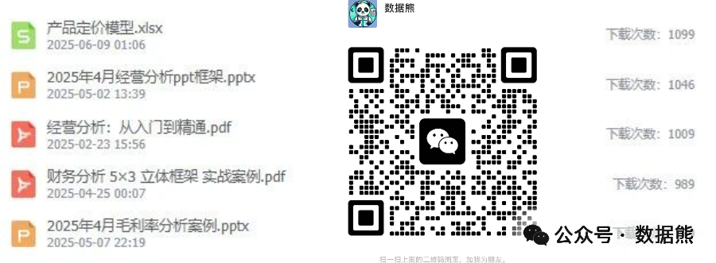

数据熊给大家拜年了，春节红包，仅限前100名，先到先得

