# 财务部各岗位工作流程详解

> 来源：微信公众号「数据熊」 · 作者 宋岳清 · 发布于 2026-02-19 08:00
> 原文链接：http://mp.weixin.qq.com/s?__biz=Mzg2MTg5OTgzNA==&mid=2247496600&idx=1&sn=3ea759a6ca1b5cd6c9a3d202a9ffb3d8&chksm=ce12aecdf96527db160e829aa04b377b60787f58a307ef0664fccc1003113774d494e4967efa

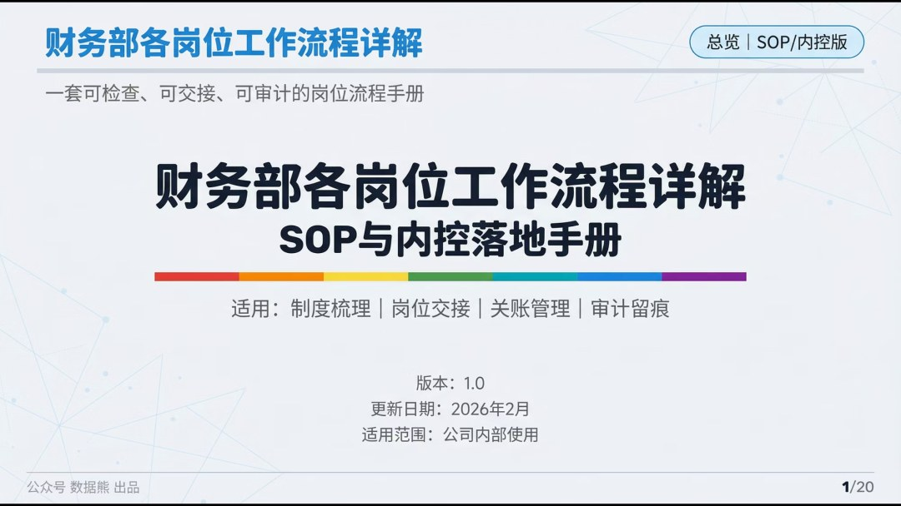

文末左下角点击
阅读原文

可下载此文件，及

《

财务岗位-日常任务工作流程清单.xlsx

》

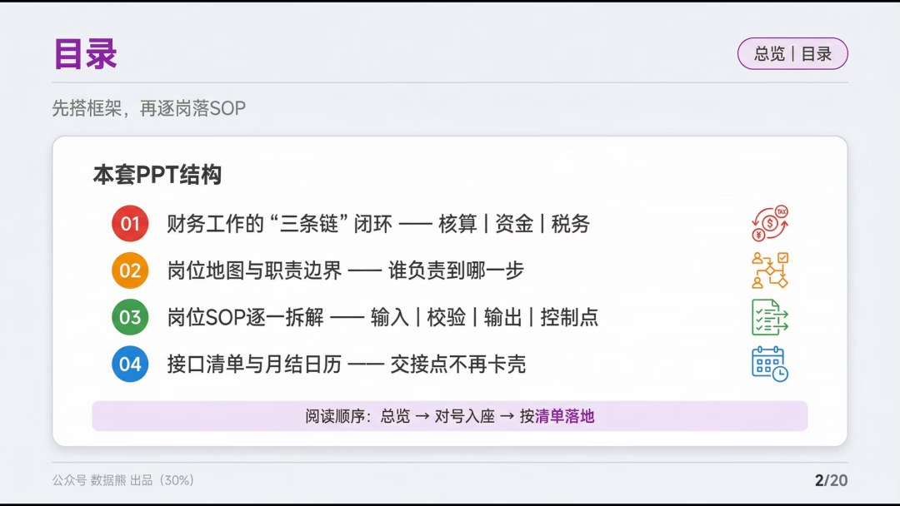

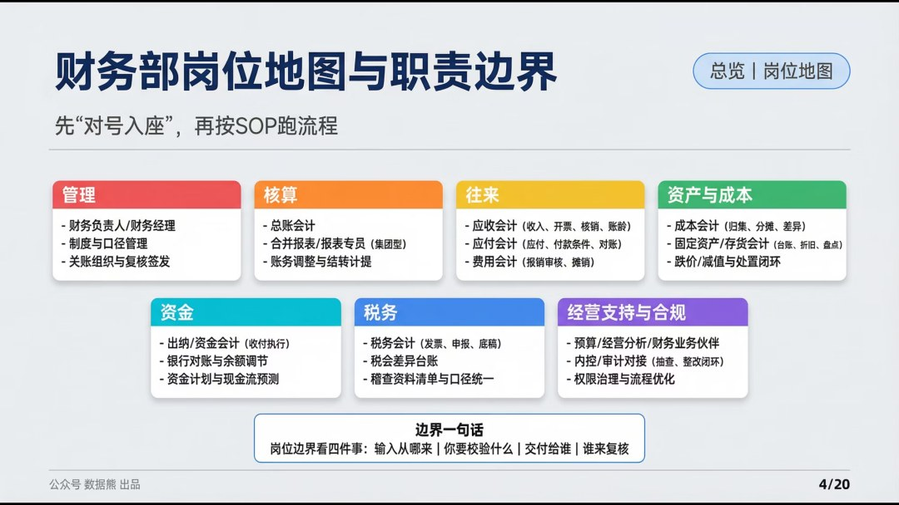

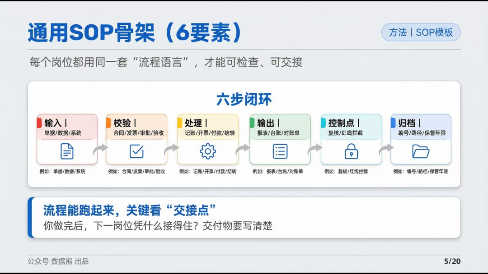

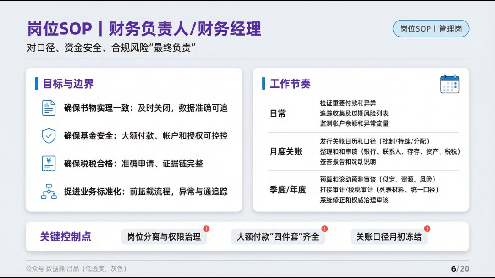

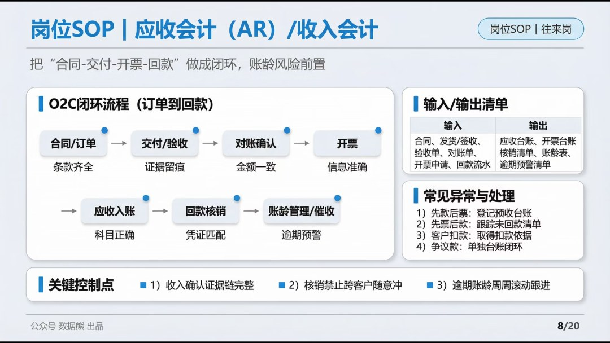

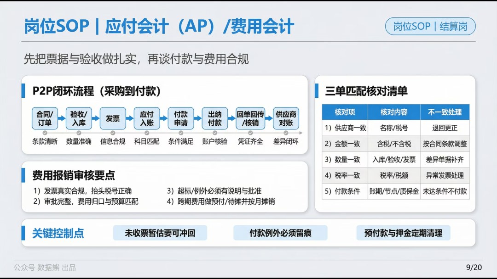

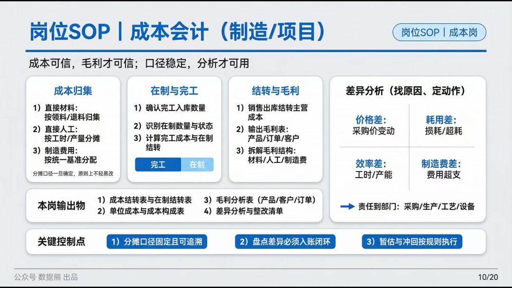

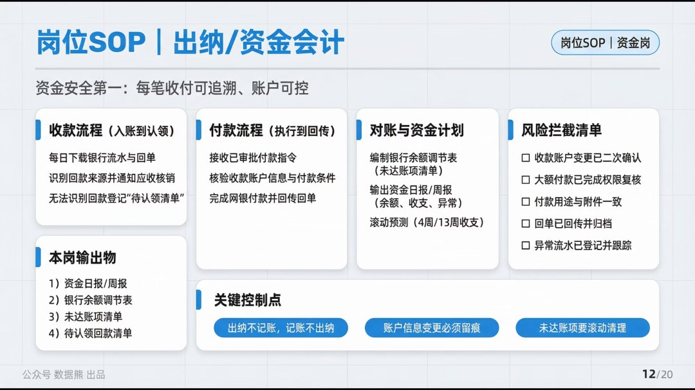

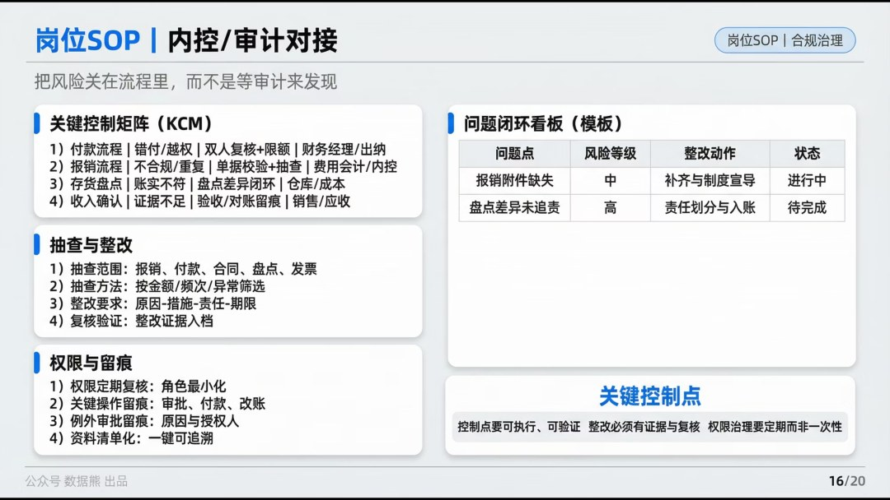

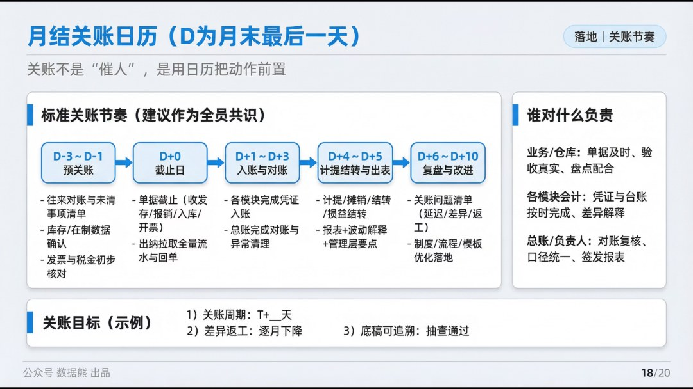

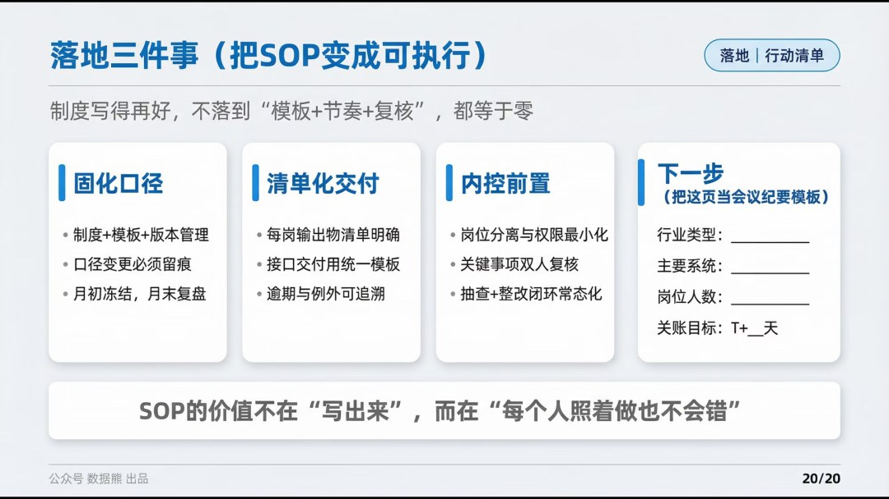

点击

阅读原文

，下载可编辑版本

《

财务岗位-日常任务工作流程清单.xlsx

》。

PPT定制添加数据熊微信：

Daniel-songyq   更多模板加入

会员群

获取

往期推荐

2025年经营分析报告

2025年成本分析报告

2025年资金与现金流分析报告及2026年资金计划

2025年财务部工作总结及2026年工作计划.pptx

2026年全面预算套表.xlsx（可下载）

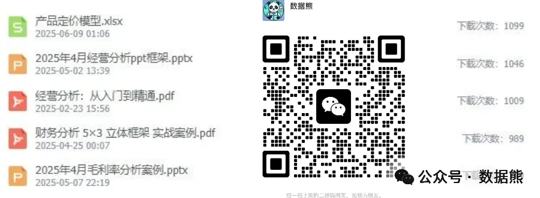
