# 2026年1季度财务工作总结

> 来源：微信公众号「数据熊」 · 作者 宋岳清 · 发布于 2026-03-29 09:10
> 原文链接：http://mp.weixin.qq.com/s?__biz=Mzg2MTg5OTgzNA==&mid=2247497884&idx=1&sn=06d33b13981fa436a178e7eb408c1ed9&chksm=ce12a5c9f9652cdfc11e0f0b9a40fe86fcbcff2f8f34a80ce44acd793887406fb1027c638c35

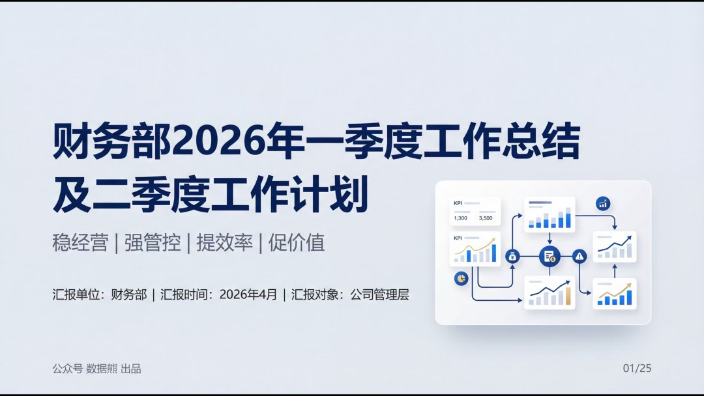

财务人最大的短板，可能不是专业，而是汇报。点击文末做下角

阅读原文

下载完整版《2026年1季度财务工作总结》

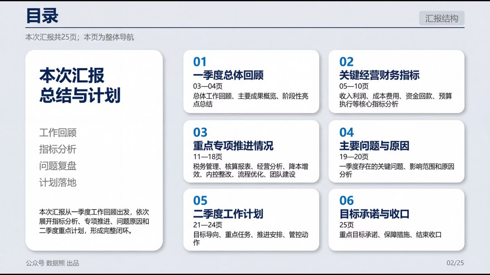

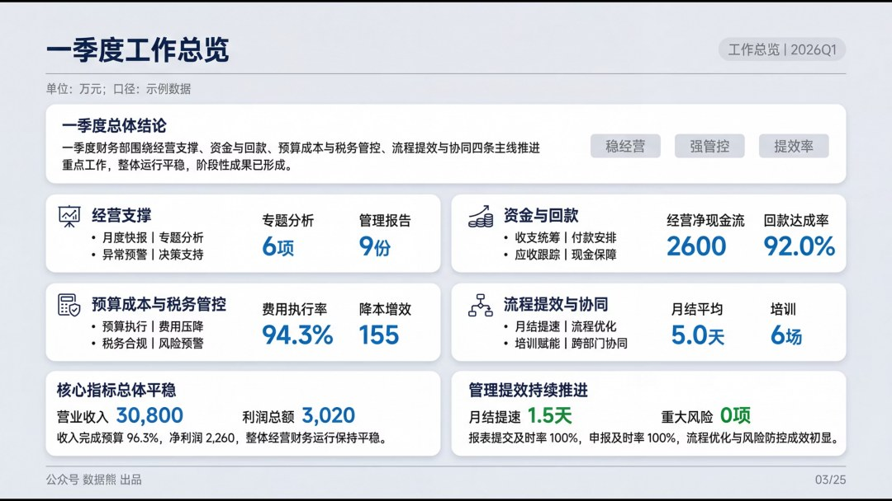

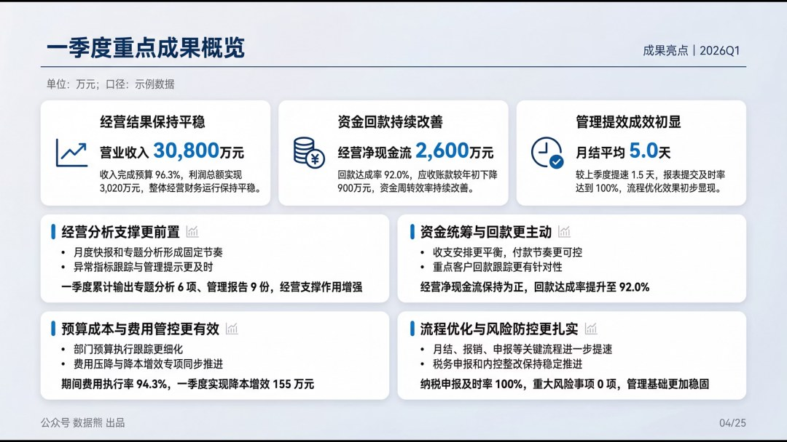

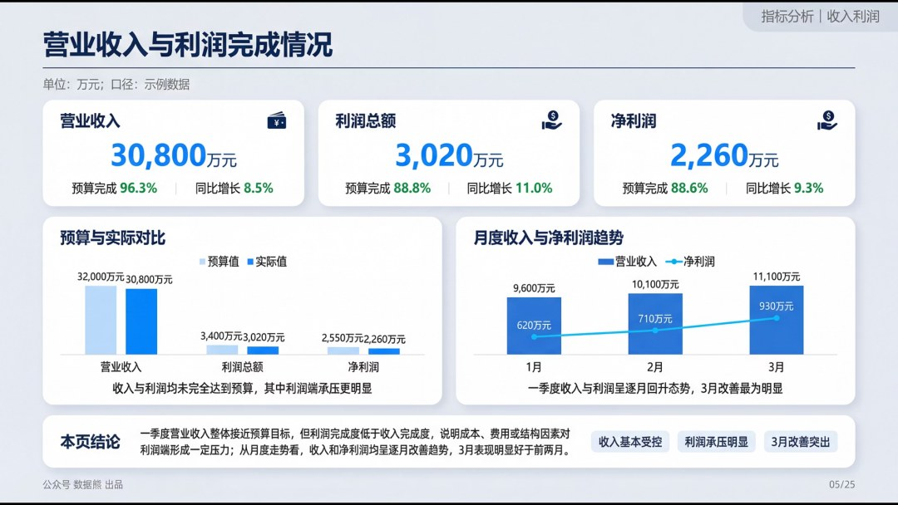

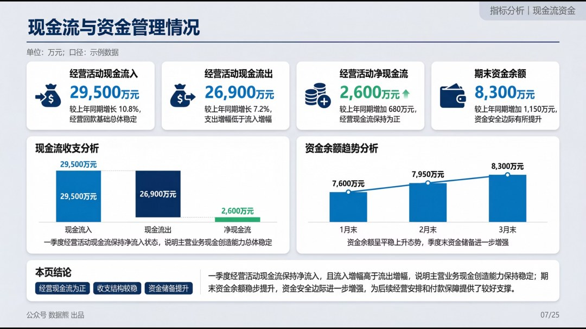

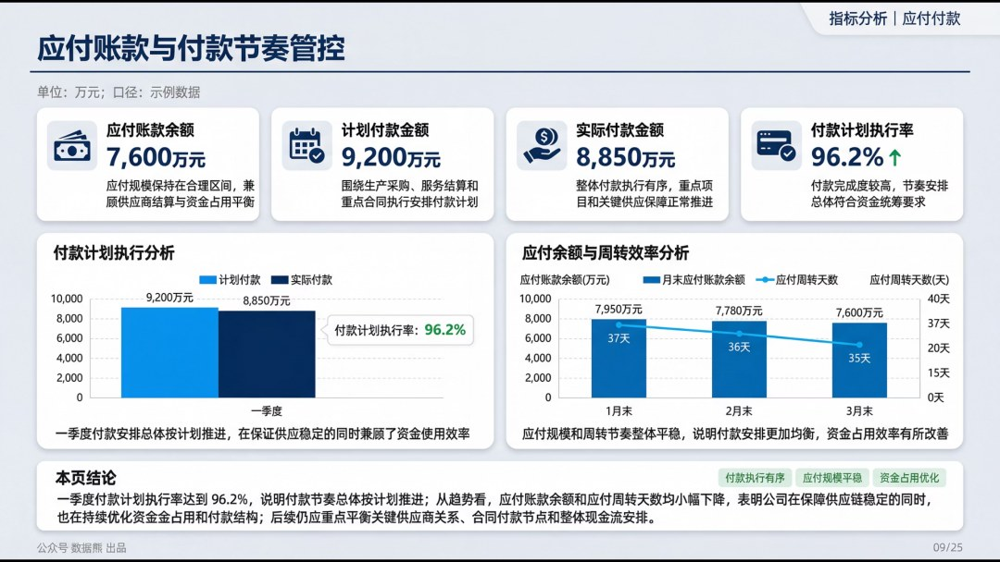

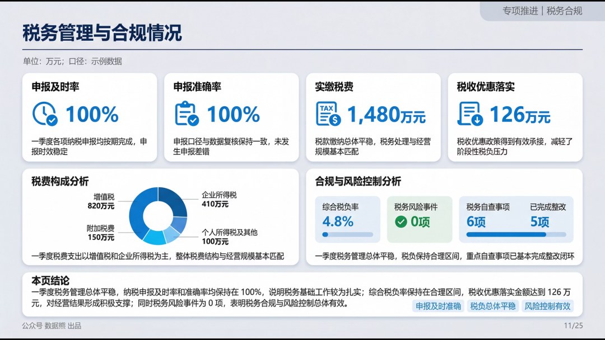

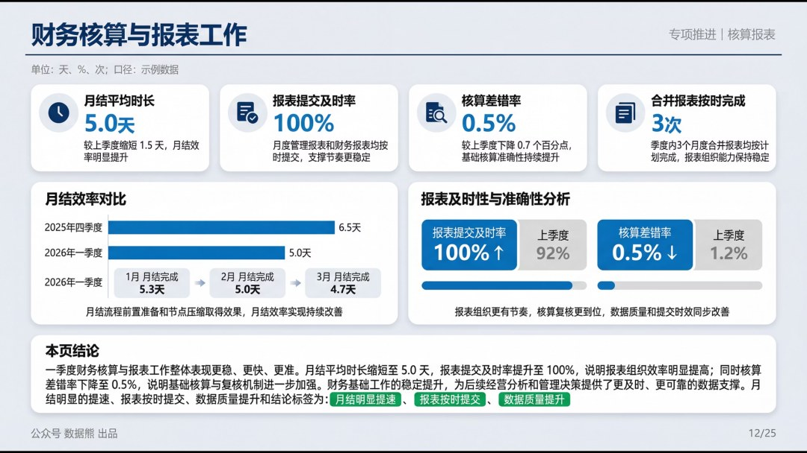

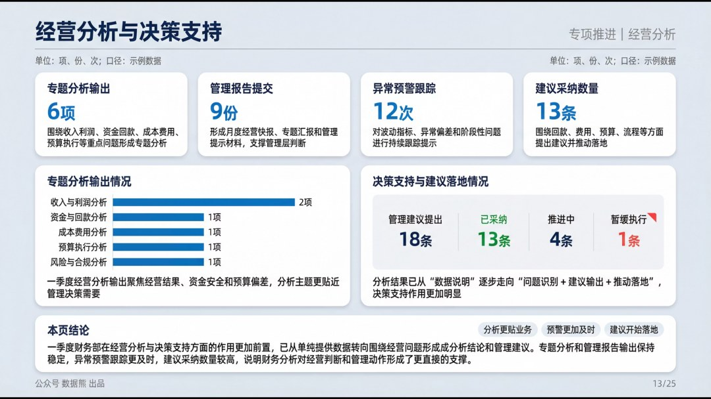

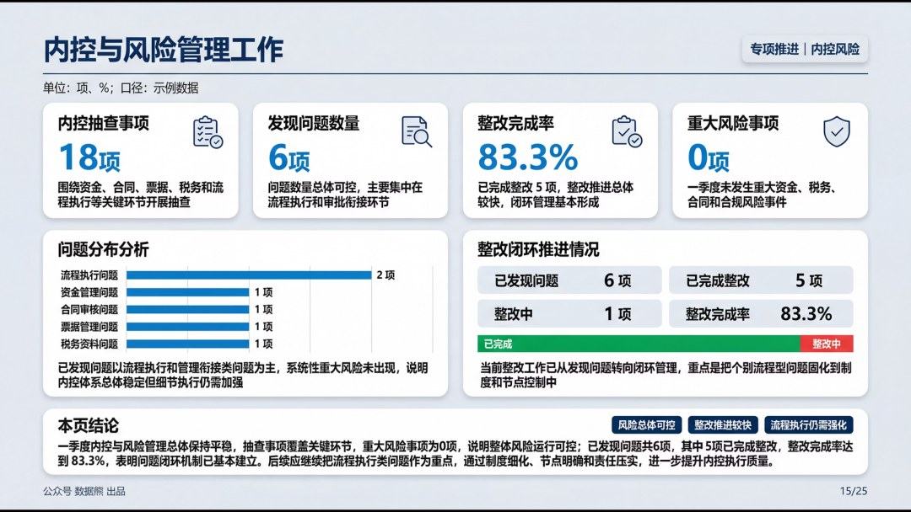

点击

阅读原文

，下载

《

2026年1季度财务工作总结

》。

经营分析框架搭建添加数据熊微信：

Daniel-songyq   更多模板加入

会员群

获取

往期推荐

2026年2月应收账款分析报告

2026年经营计划模板

经营分析报告模板.pptx

财务总监述职报告

2026年2月经营分析报告

详解美的集团经营分析体系

