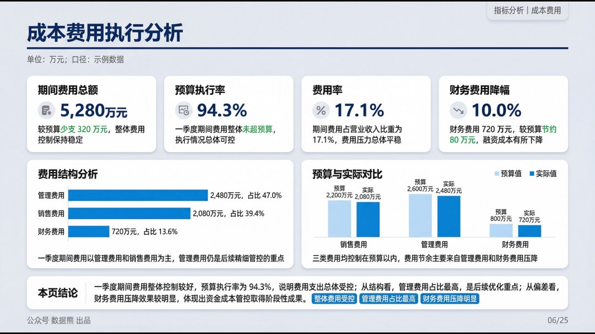
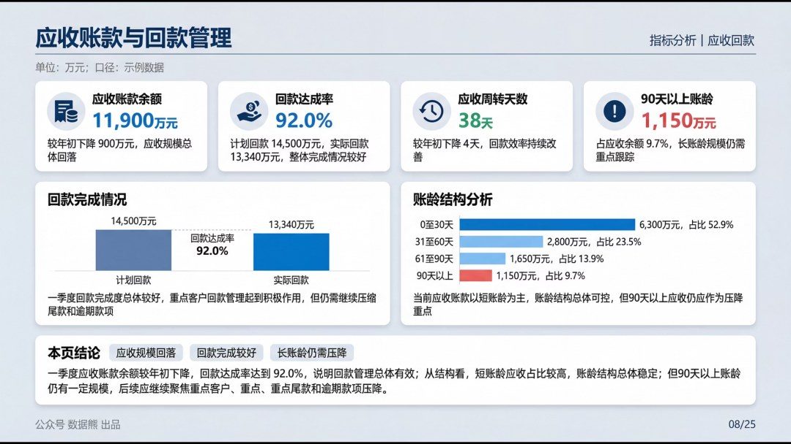
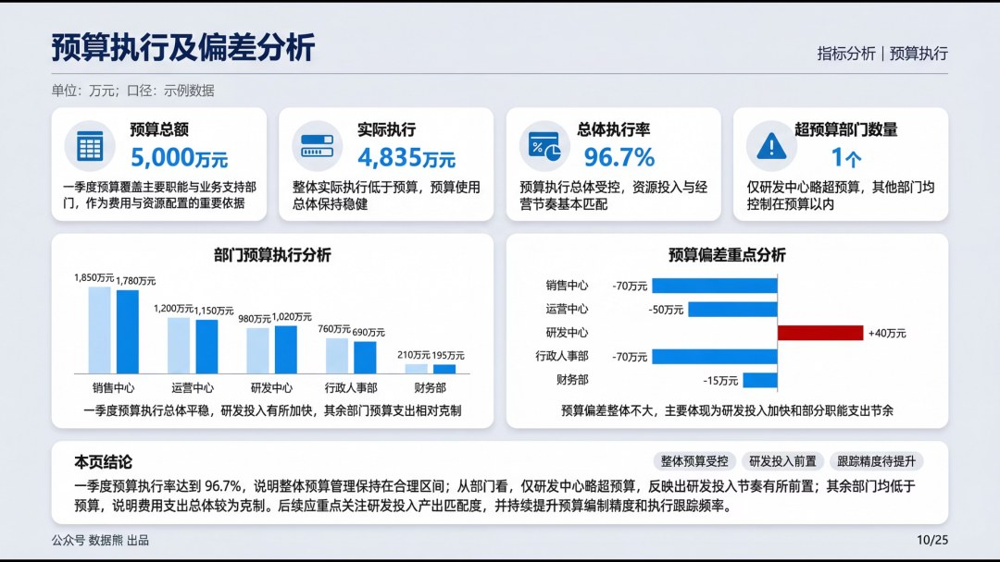
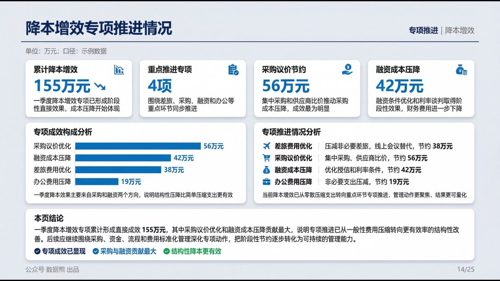

# 2026年1季度财务工作总结.pptx

> 来源：微信公众号「数据熊」 · 作者 宋岳清 · 发布于 2026-04-06 09:30  
> 原文链接：http://mp.weixin.qq.com/s?__biz=Mzg2MTg5OTgzNA==&mid=2247498153&idx=1&sn=4d353c88ef63e9065897393eff267a9d&chksm=ce12a4fcf9652dea73b0561e6b28a2b1d42774bc302a8042a1958b23841f0c826a31a94ac500
> 摘要：财务人最大的短板，可能不是专业，而是汇报。

财务人最大的短板，可能不是专业，而是汇报。点击文末做下角

阅读原文

下载完整版《2026年1季度财务工作总结.pptx》

点击文末左下角

阅读原文

，下载完整版

《

2026年1季度财务工作总结.pptx

》。

经营分析看板搭

建添加数据熊微信：

Daniel-songyq   更多模板加入

会员群

获取

往期推荐

2026年2月应收账款分析报告

2026年经营计划模板

经营分析报告模板.pptx

财务总监述职报告

2026年2月经营分析报告

详解美的集团经营分析体系

