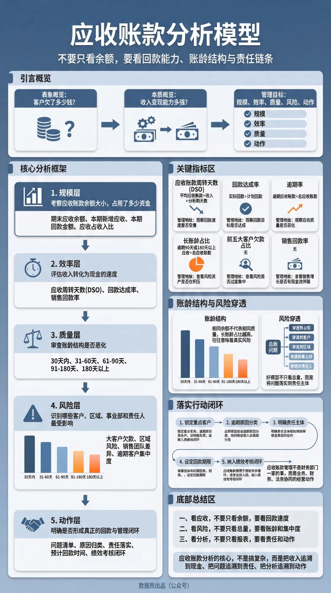
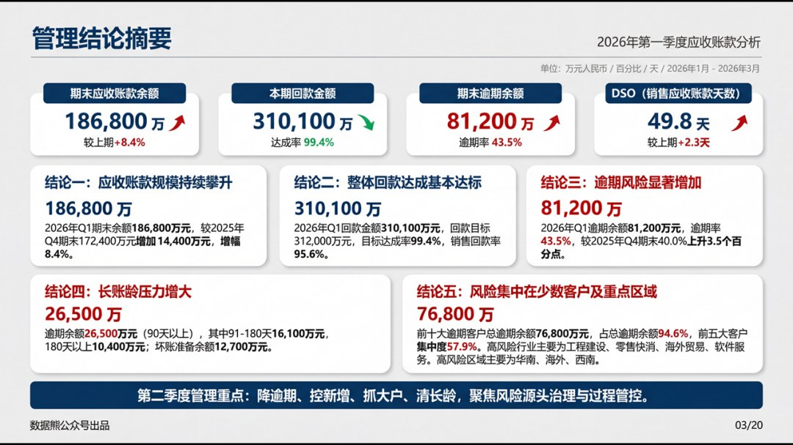
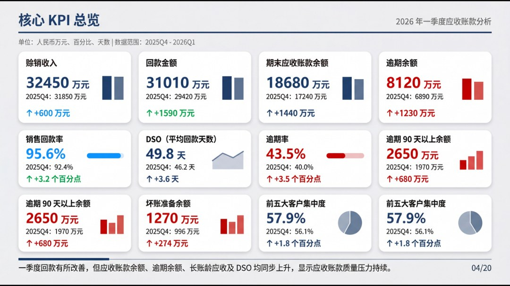
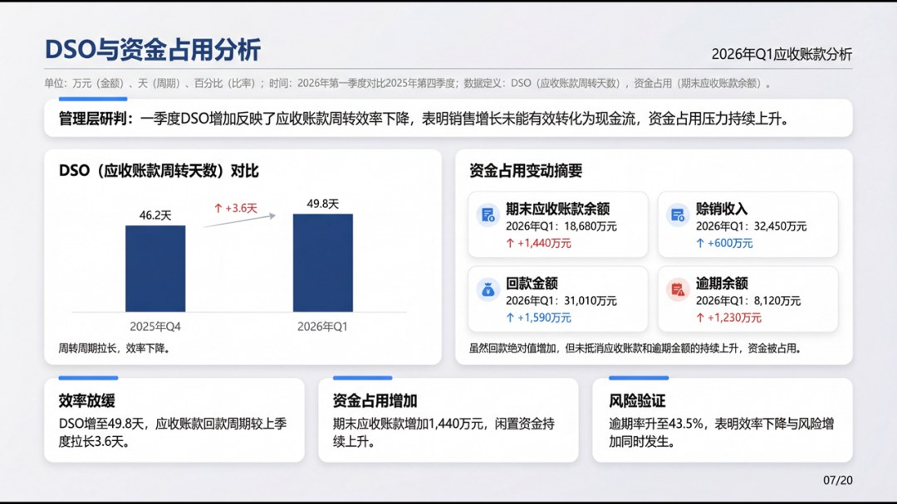
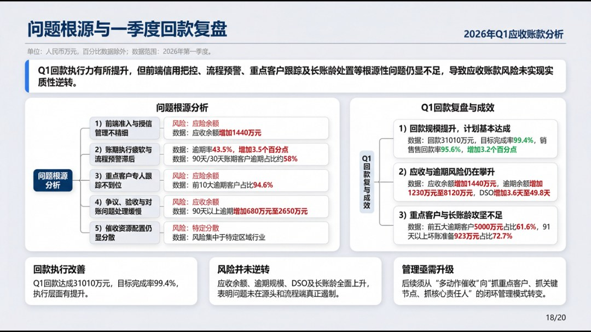

# 2026年1季度应收账款分析报告

> 来源：微信公众号「数据熊」 · 作者 宋岳清 · 发布于 2026-04-11 09:15
> 原文链接：http://mp.weixin.qq.com/s?__biz=Mzg2MTg5OTgzNA==&mid=2247498249&idx=1&sn=e8b137d2da86a12fc0cce9935d58a84e&chksm=ce12a75cf9652e4ae9b0df645d45af97455024be7944bff40d7c668cb05fd43c2cfbdeb22c91

财务人最大的短板不是专业，而是汇报，文末左下角点击
阅读原文

，下载完整版《2026年1季度应收账款分析报告》

往期推荐

2026年1季度财务分析报告.pptx

2026年1季度财务工作总结.pptx

2026年1季度总经理工作总结

经营分析会，要真正成为利润作战会！

预算的关键，从来不是准不准确

