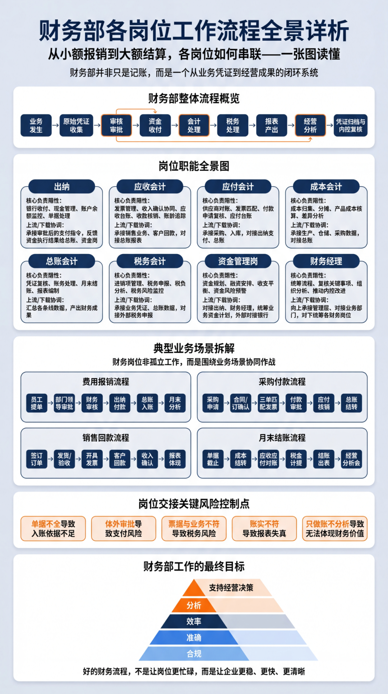
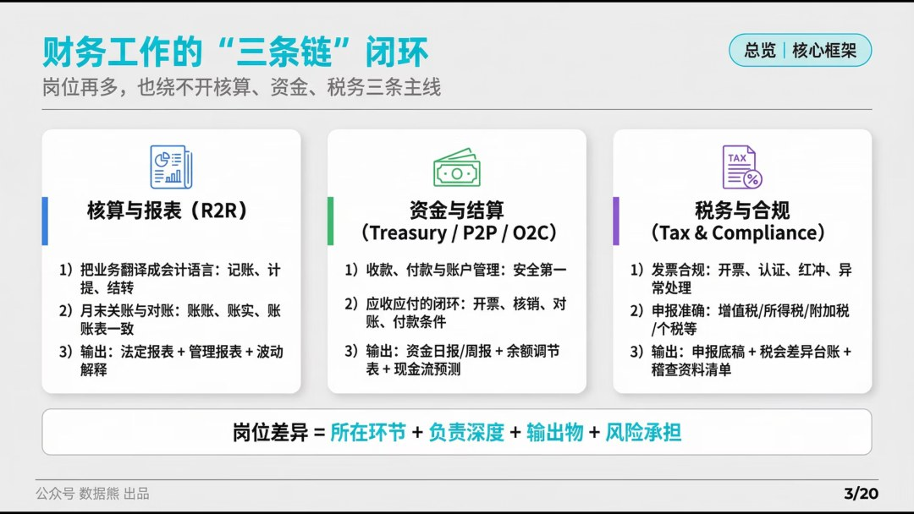
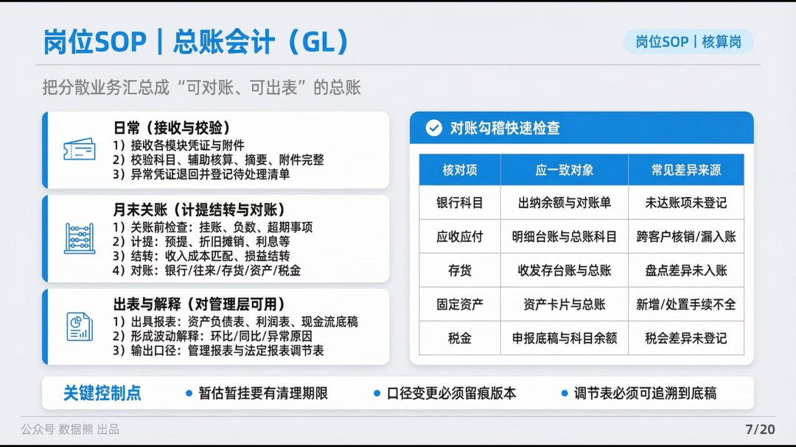
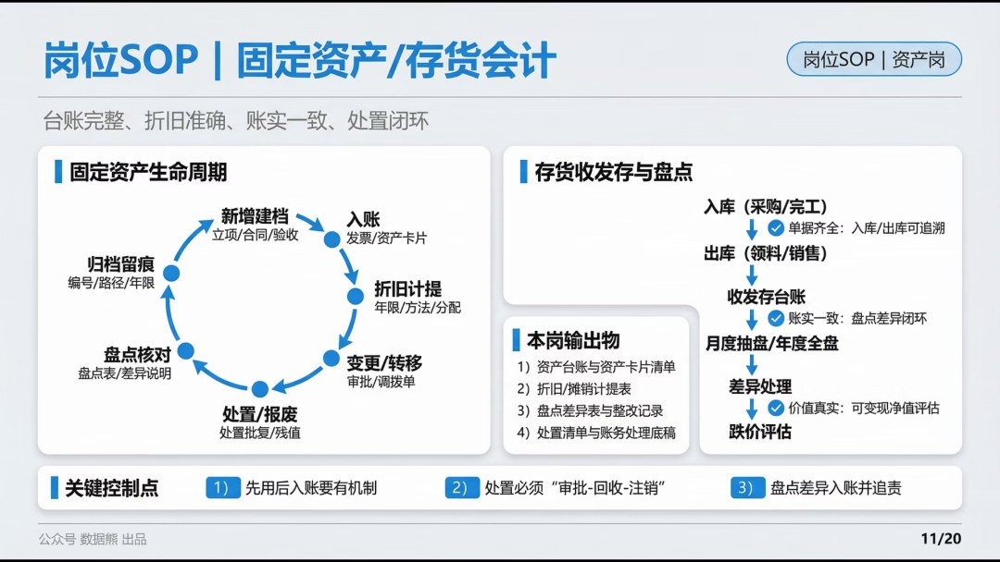
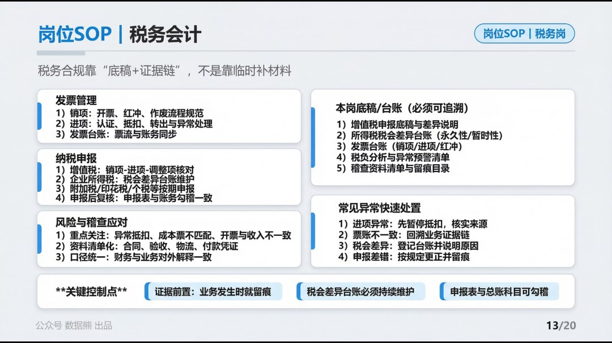
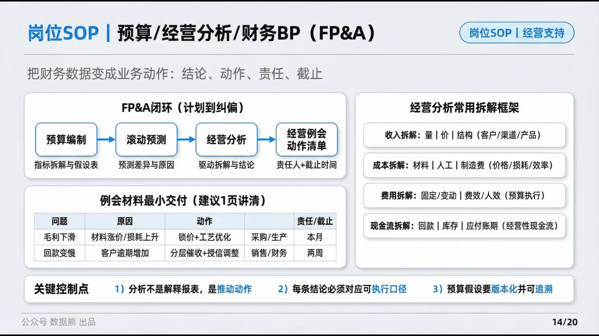
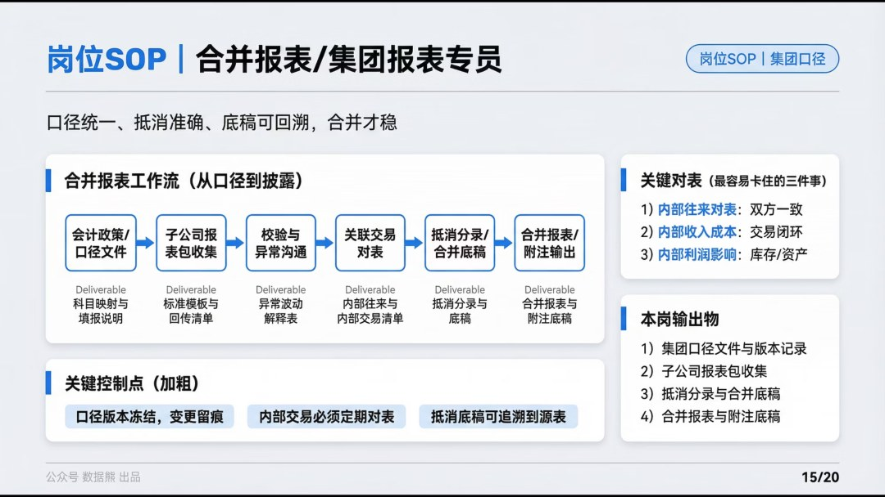
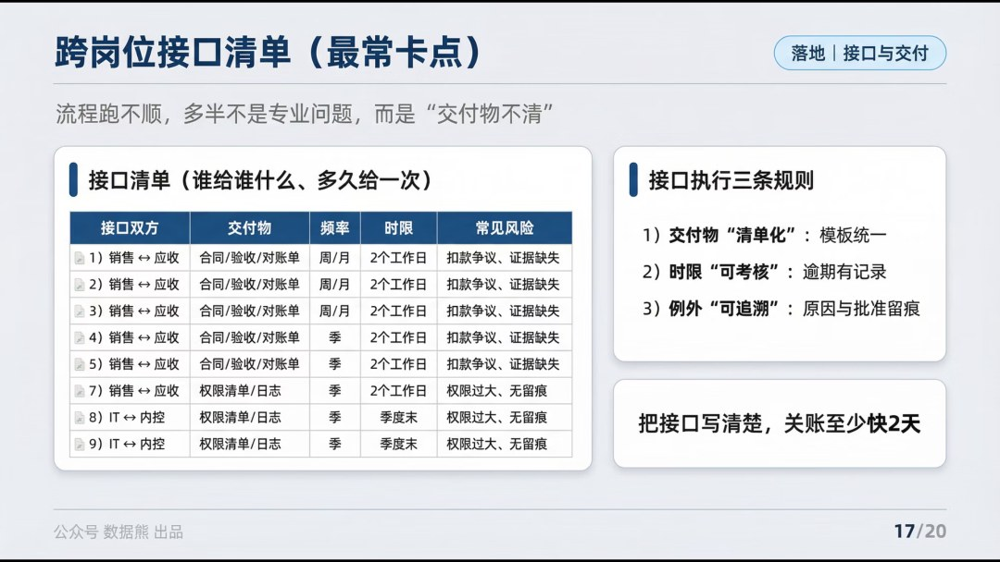
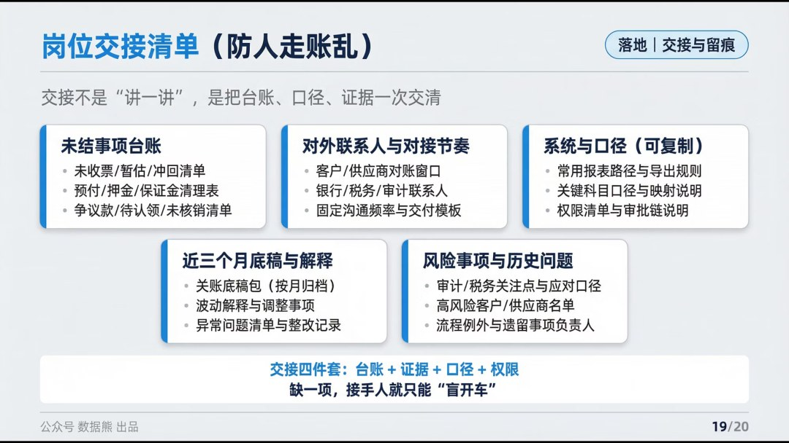

# 财务部各岗位工作流程详解

> 来源：微信公众号「数据熊」 · 作者 宋岳清 · 发布于 2026-04-14 16:09
> 原文链接：http://mp.weixin.qq.com/s?__biz=Mzg2MTg5OTgzNA==&mid=2247498370&idx=1&sn=86c26f32037d202701dda37371178cba&chksm=ce12a7d7f9652ec12acbc68f6e296ebe5c017ab00a64ac46f8eaee48be53e438505a3896044d

文末左下角点击
阅读原文

可下载此文件，及

《

财务岗位-日常任务工作流程清单.xlsx

》

往期推荐

2026年全面预算套表.xlsx（可下载）

经营分析报告模板.pptx

2026年1季度经营分析报告.pptx

2026年1季度财务分析报告.pptx

2026年1季度财务工作总结.pptx

