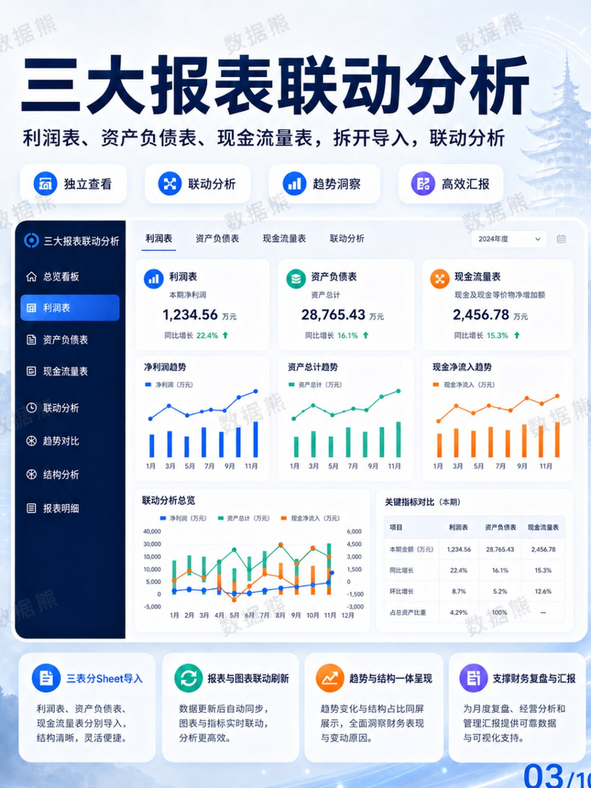
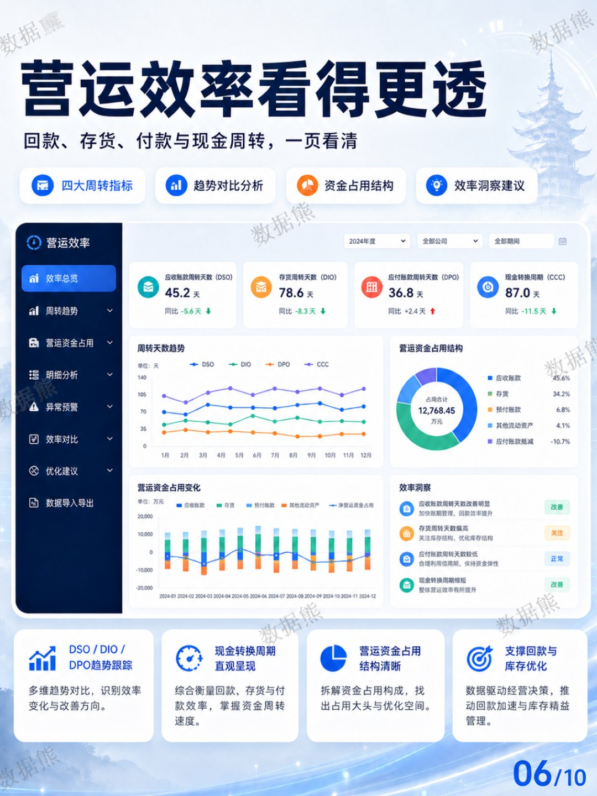

# 数据熊 | 财务分析驾驶舱

> 来源：微信公众号「数据熊」 · 作者 宋岳清 · 发布于 2026-05-07 09:01  
> 原文链接：http://mp.weixin.qq.com/s?__biz=Mzg2MTg5OTgzNA==&mid=2247499056&idx=1&sn=b4ef4d75def4845fdaa314145e70344b&chksm=ce12a065f9652973cf641d5e51cfb6d40b53f37a328c38d95f3a739b4912304b1da0c831b934

