# 2026年4月财务分析报告.pptx

> 来源：微信公众号「数据熊」 · 作者 宋岳清 · 发布于 2026-05-08 09:06
> 原文链接：http://mp.weixin.qq.com/s?__biz=Mzg2MTg5OTgzNA==&mid=2247499098&idx=1&sn=57fe3b3a49330cab5b3b321759adf0ce&chksm=ce12a00ff9652919431ce7b474a89e29d12b68943de7b66fd97436dc3a9f854a9d56db369d00

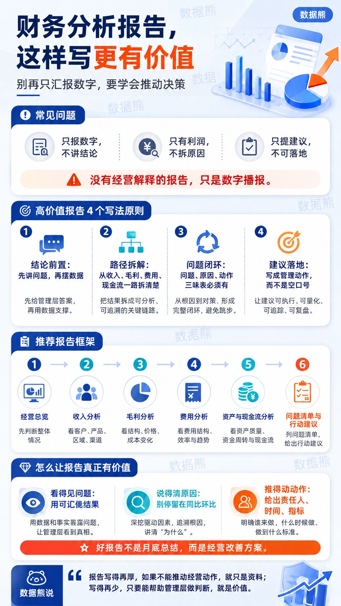

汇报能力才是职场的顶级能力，文末左下角点击
阅读原文

，下载完整版《2026年4月财务分析报告.pptx》及数据图表

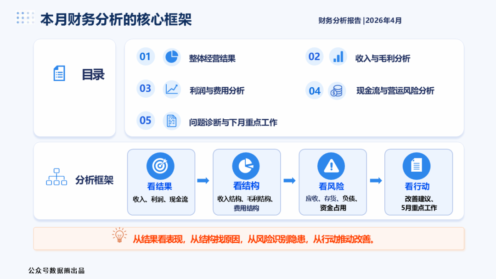

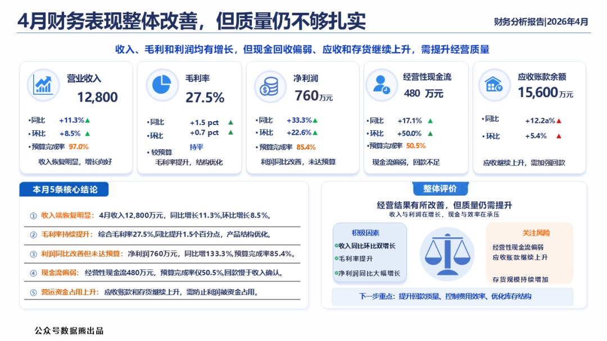

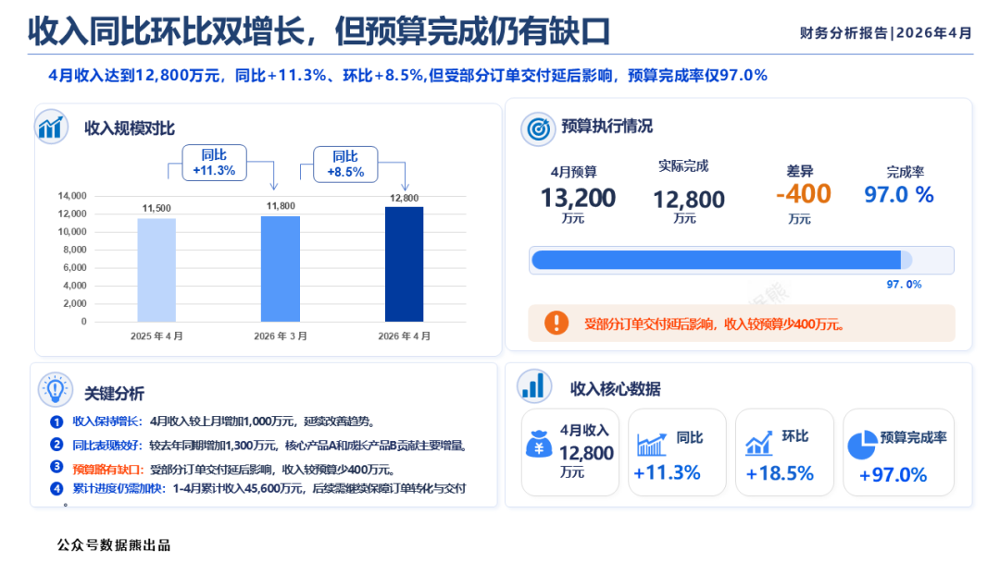

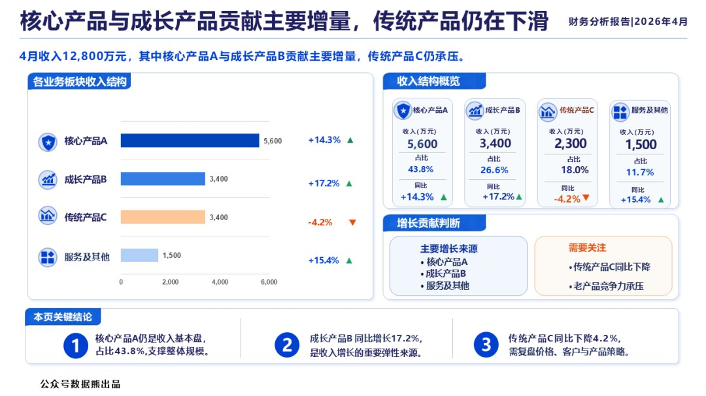

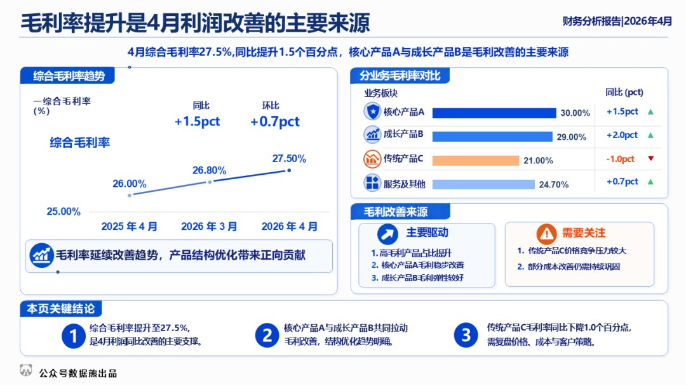

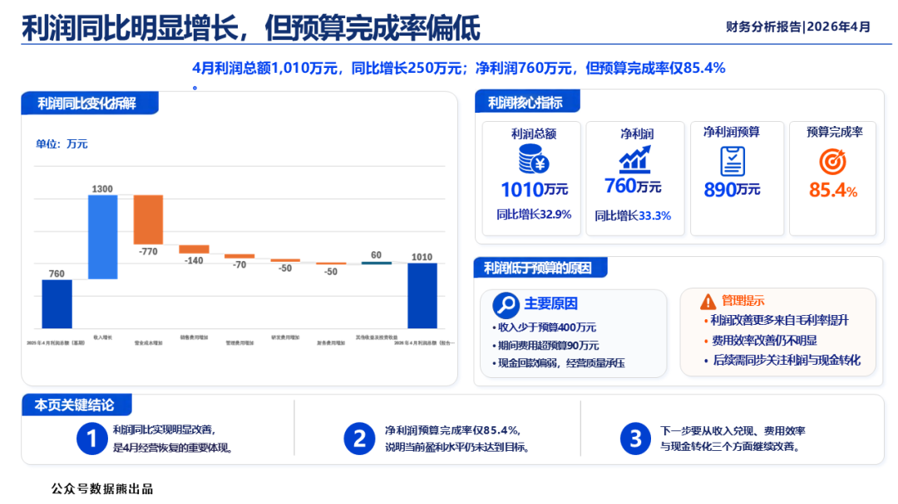

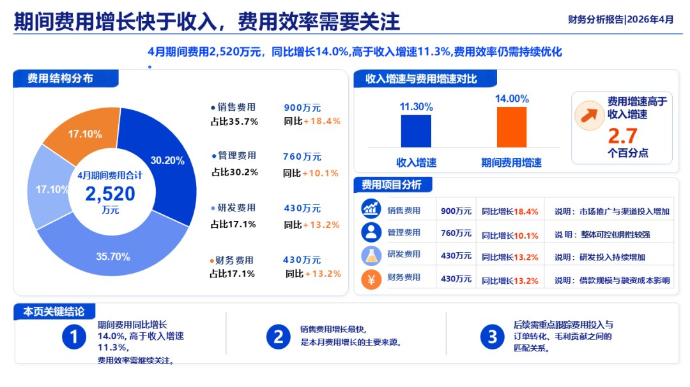

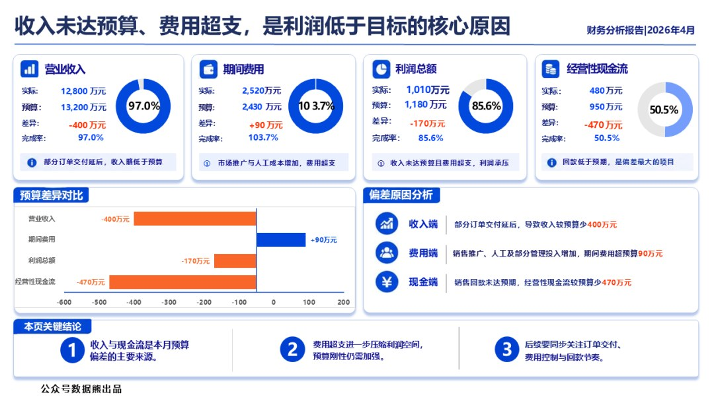

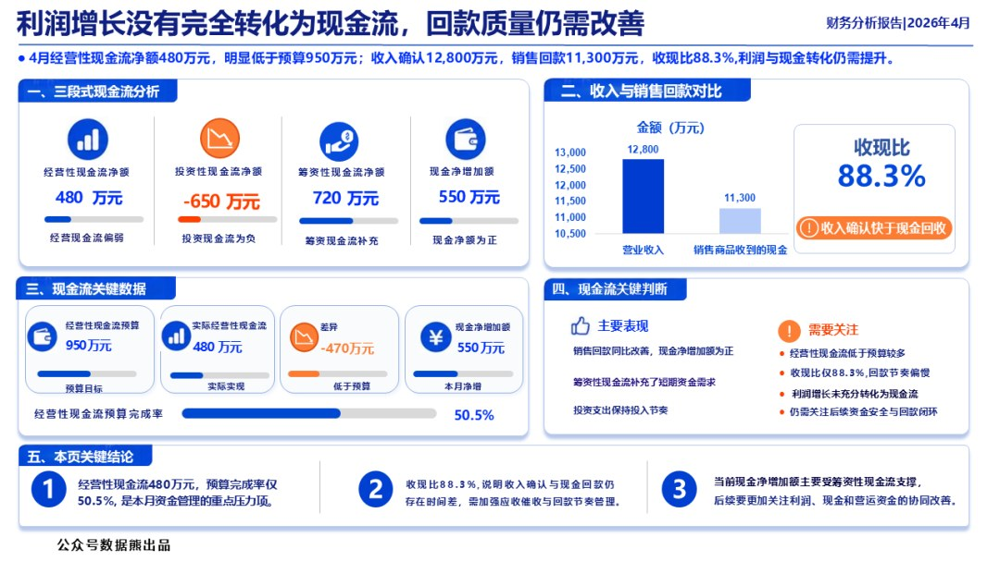

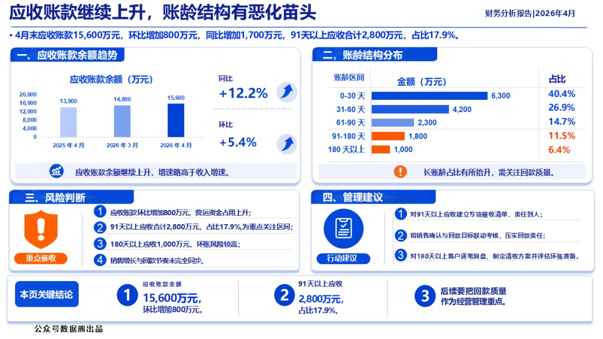

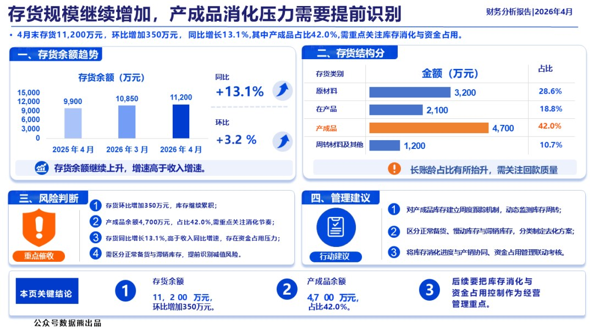

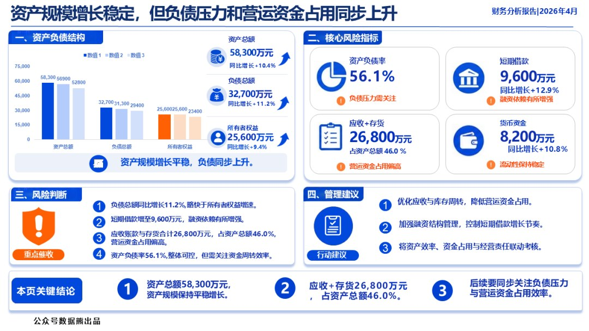

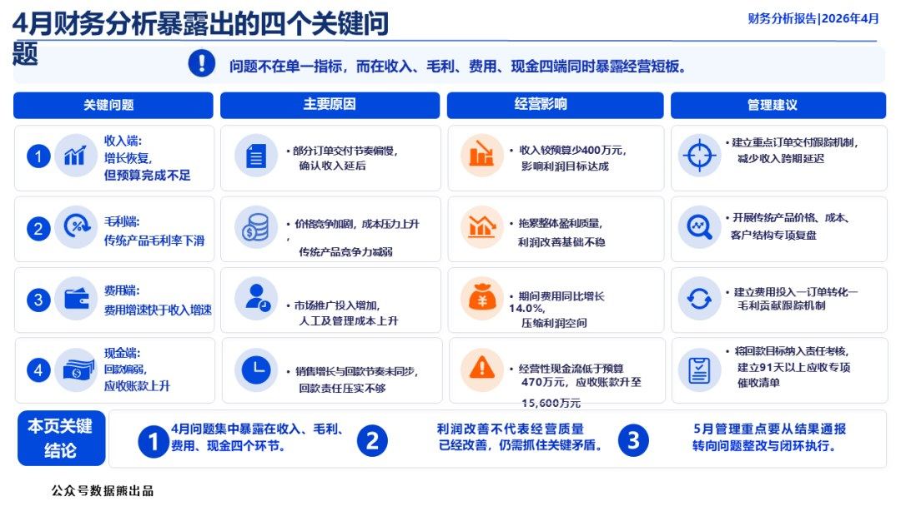

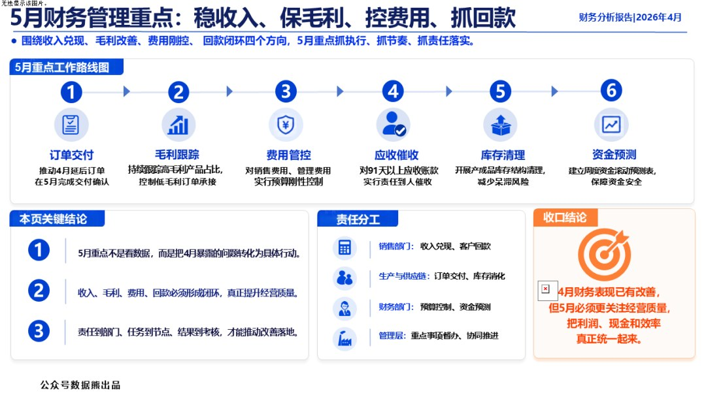

