# 2026年4月应付账款分析报告

> 来源：微信公众号「数据熊」 · 作者 宋岳清 · 发布于 2026-05-16 09:19
> 原文链接：http://mp.weixin.qq.com/s?__biz=Mzg2MTg5OTgzNA==&mid=2247499343&idx=1&sn=7bef29bb809d4a2d76b8f277aba39531&chksm=ce12a31af9652a0cf846223dee776c4633ec4c93ddab547a3590ba9987be0cb7246154f269ff
> 摘要：很多企业做应付账款分析，最常见的做法是把余额表、账龄表、供应商明细表拉出来，看一看欠了多少钱、欠了多久。

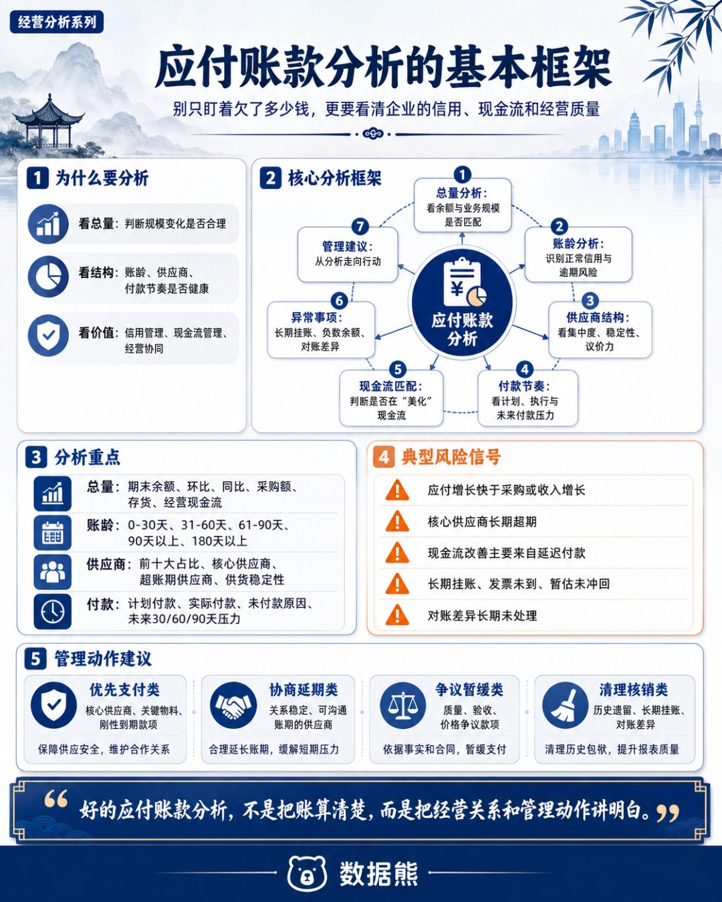

很多企业做应付账款分析，最常见的做法是把余额表、账龄表、供应商明细表拉出来，看一看欠了多少钱、欠了多久。

但真正有价值的应付账款分析，不能只停留在“账上还有多少没付”这个层面。应付账款背后，连接的是采购节奏、供应商信用、资金安排、合同履约、现金流压力和内部管理效率。

余额增加，可能是企业合理利用商业信用；

也可能是付款能力下降、供应商风险上升的信号。

账龄变长，可能是正常账期安排；

也可能是长期挂账、争议未清、资金紧张的表现。

真正好的应付账款分析，不是简单报数，而是帮助企业判断哪些钱该付、哪些钱能缓、哪些钱有风险、哪些问题必须清理。

只有把账款分析和经营管理结合起来，财务分析才真正有管理价值。

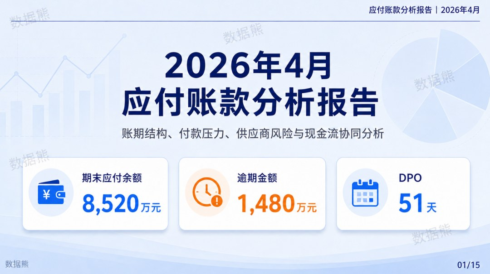

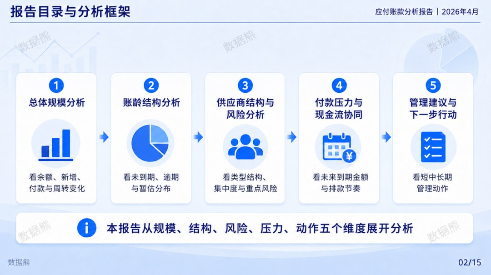

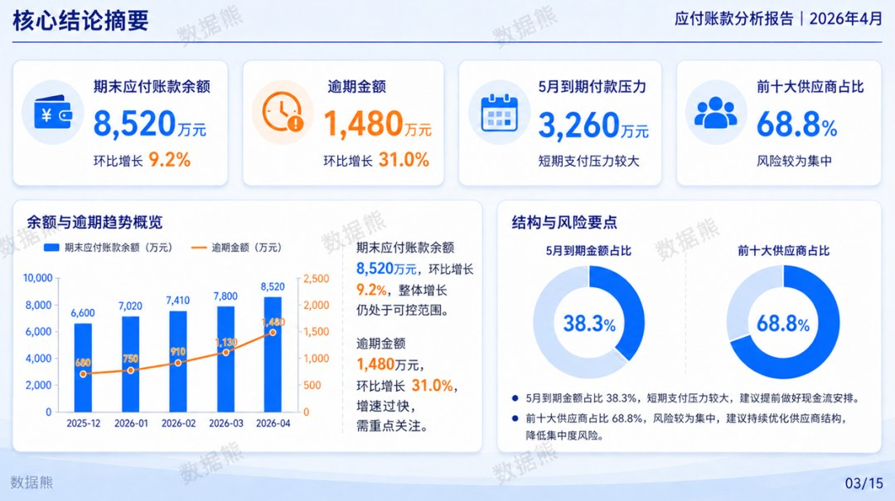

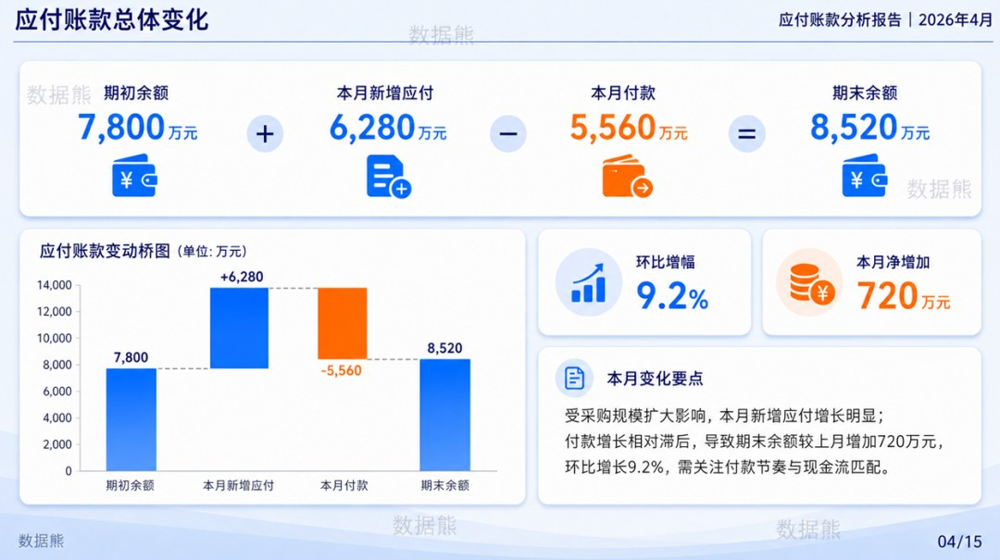

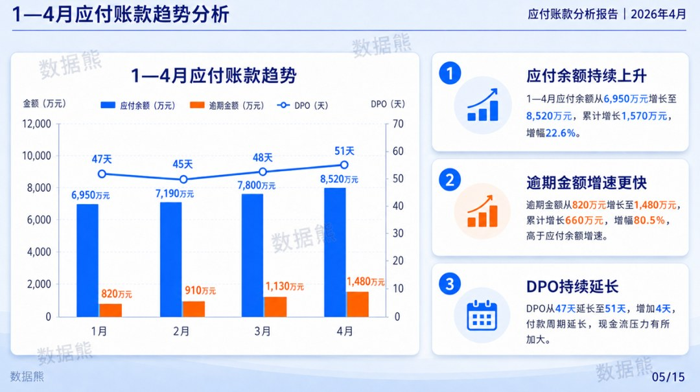

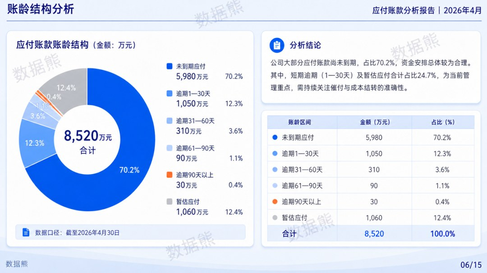

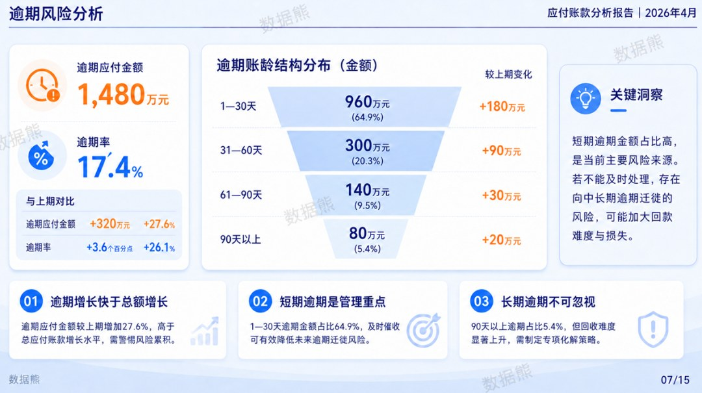

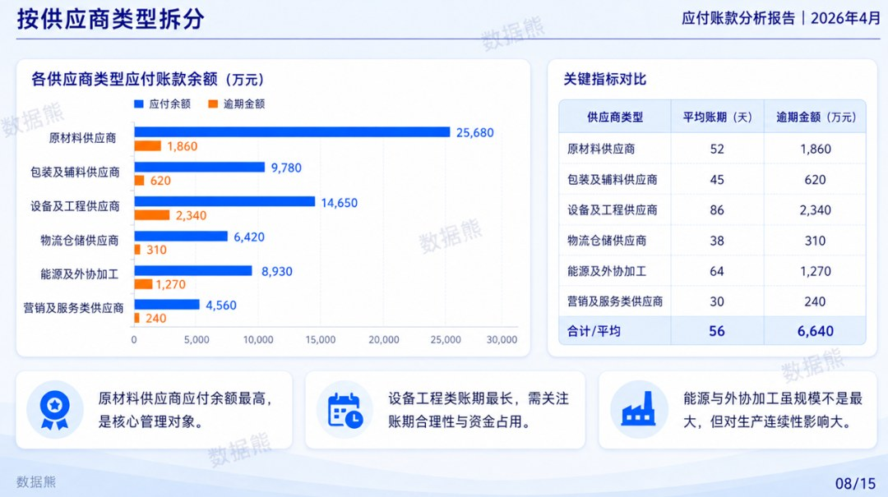

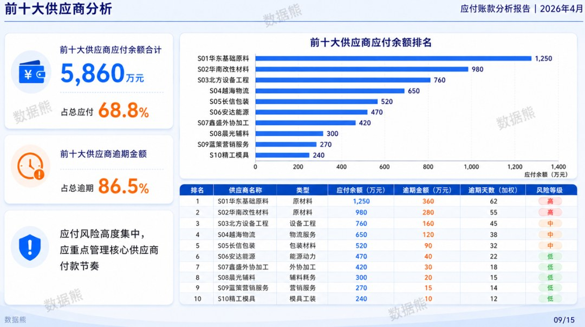

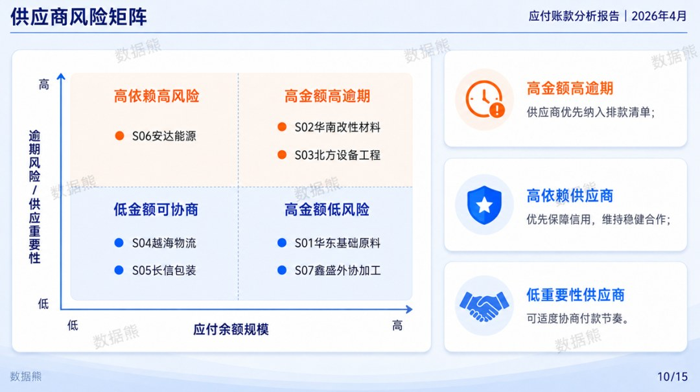

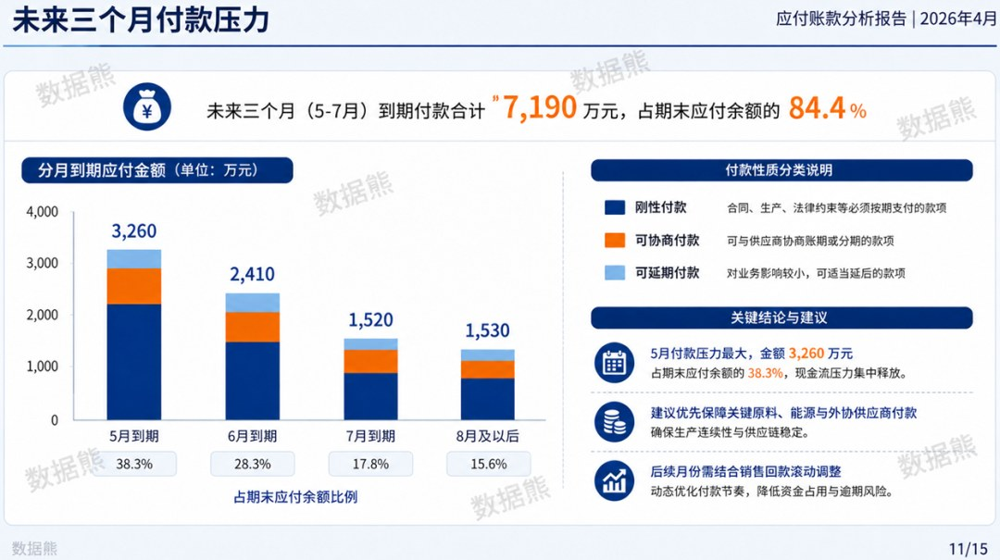

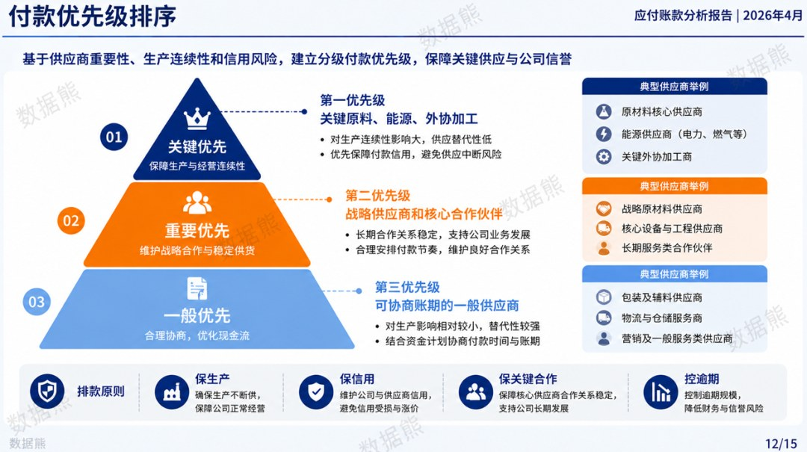

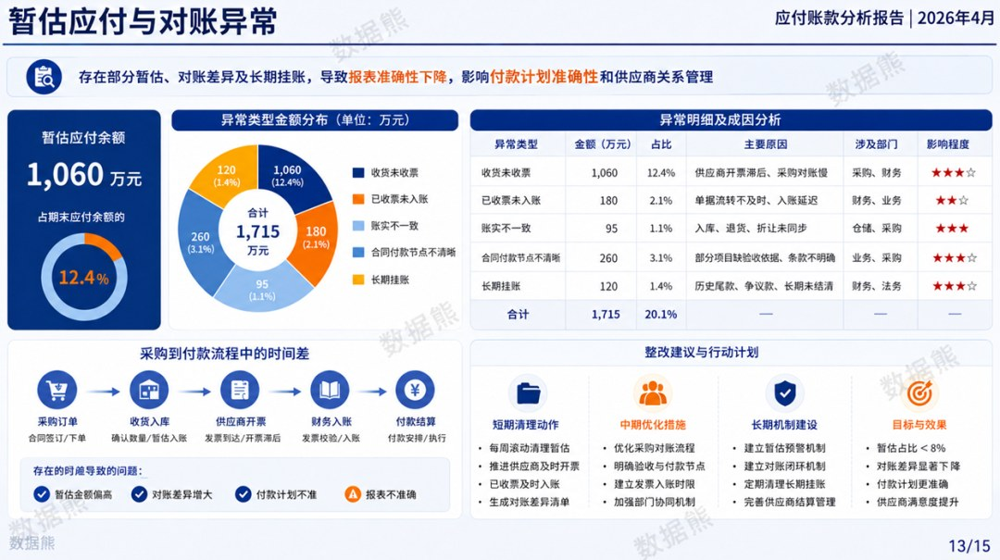

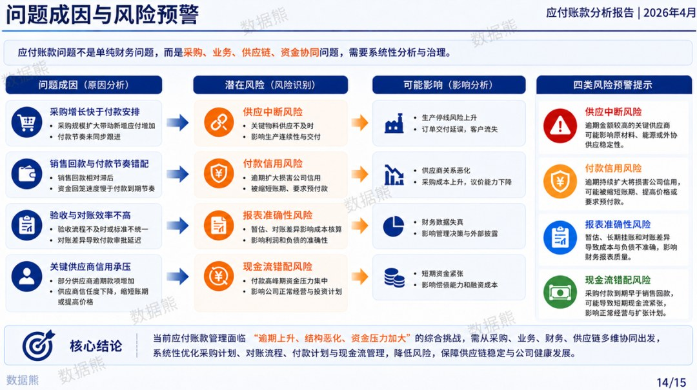

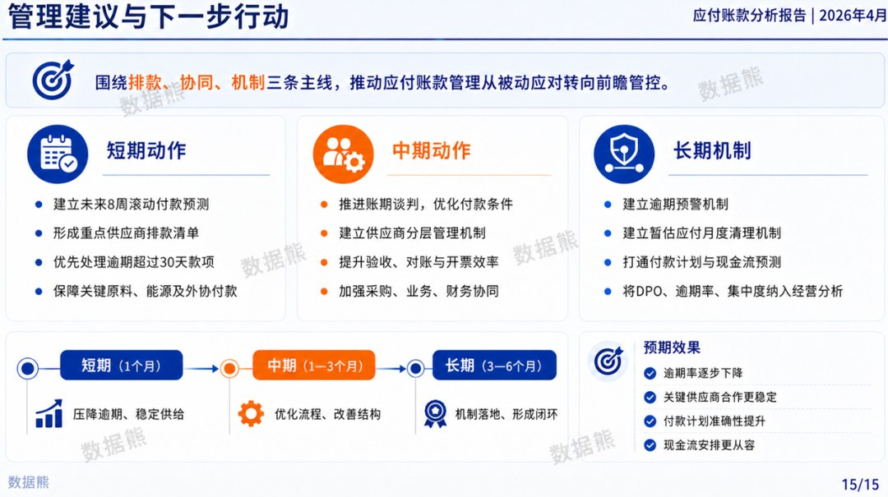

