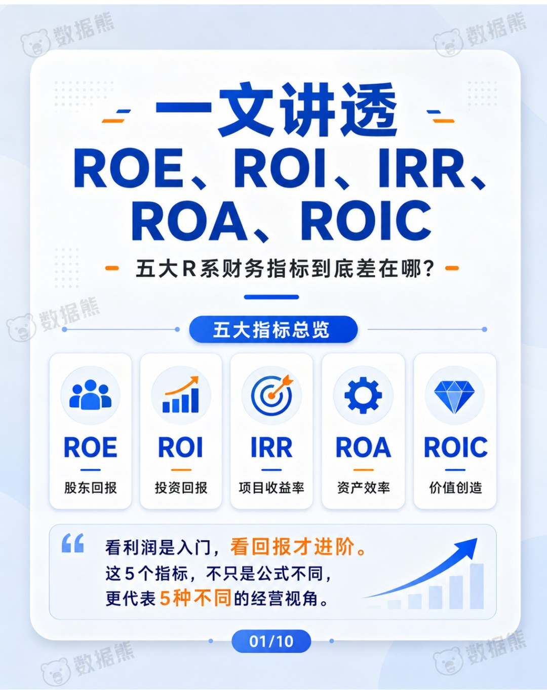
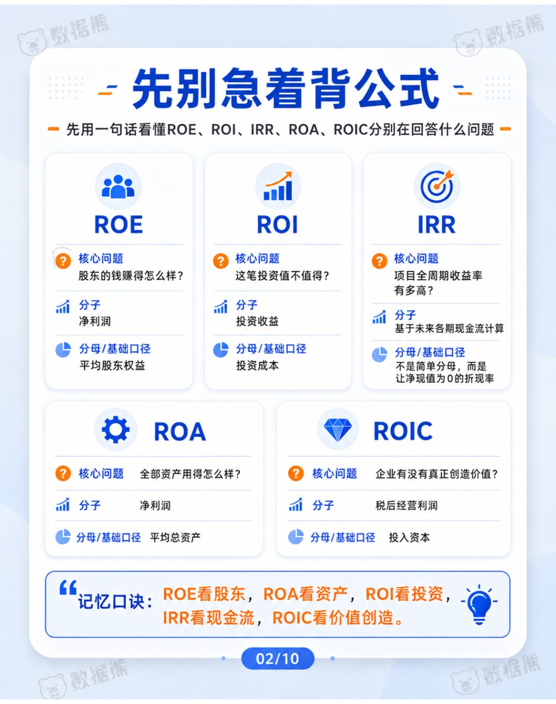
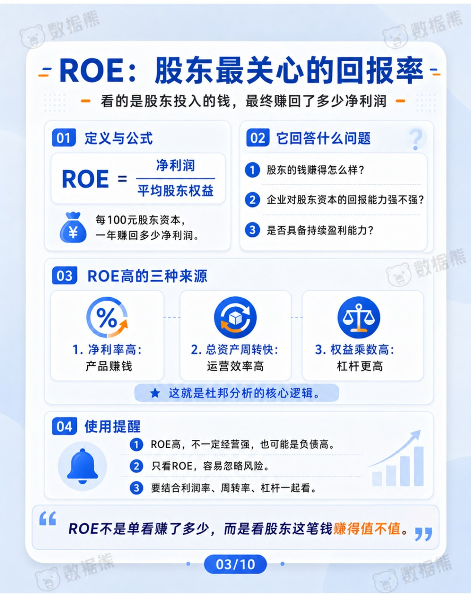
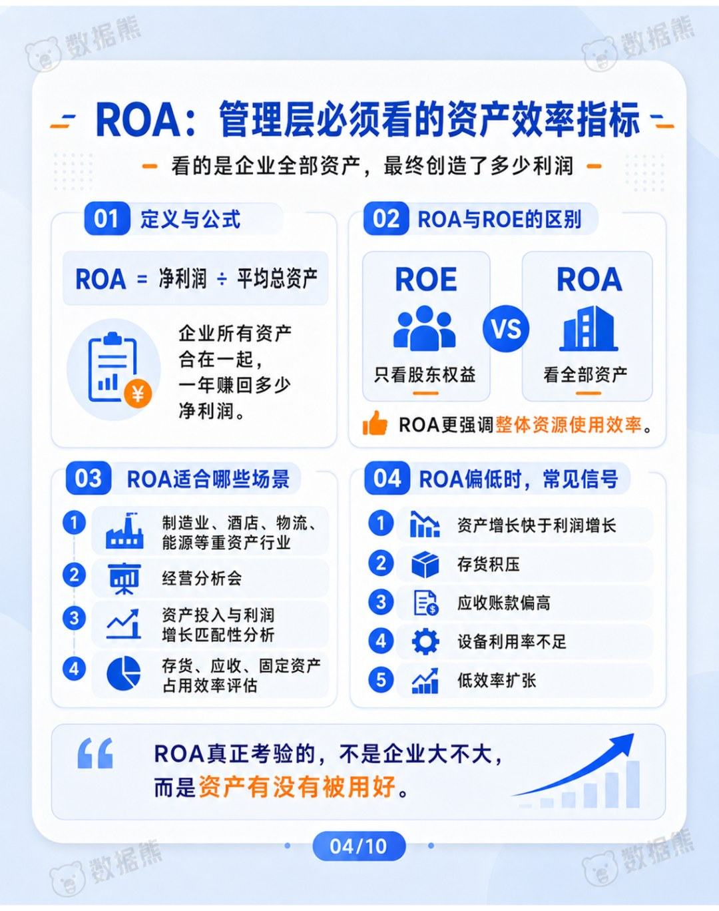
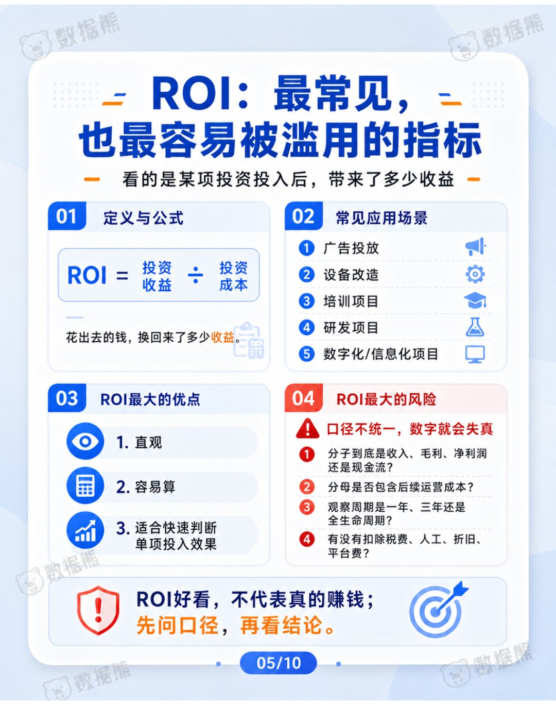
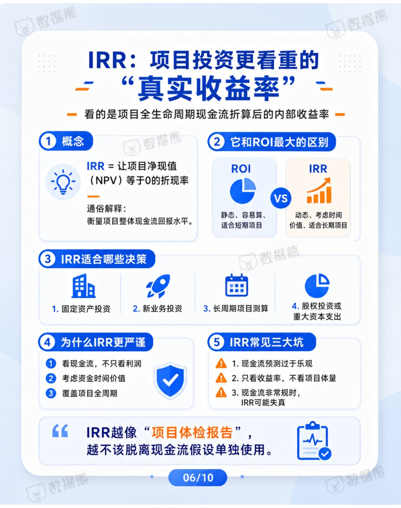
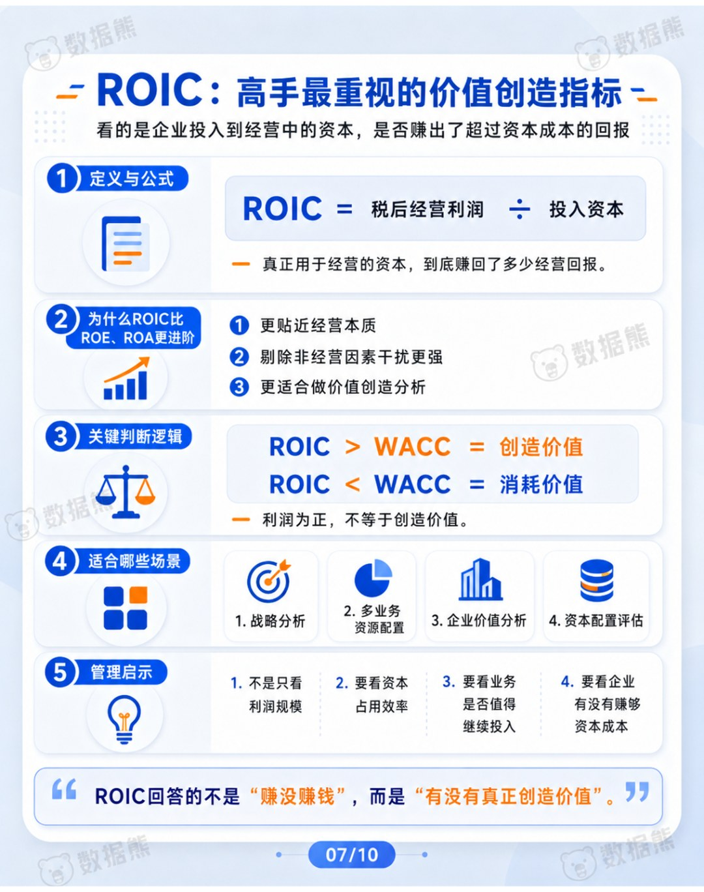
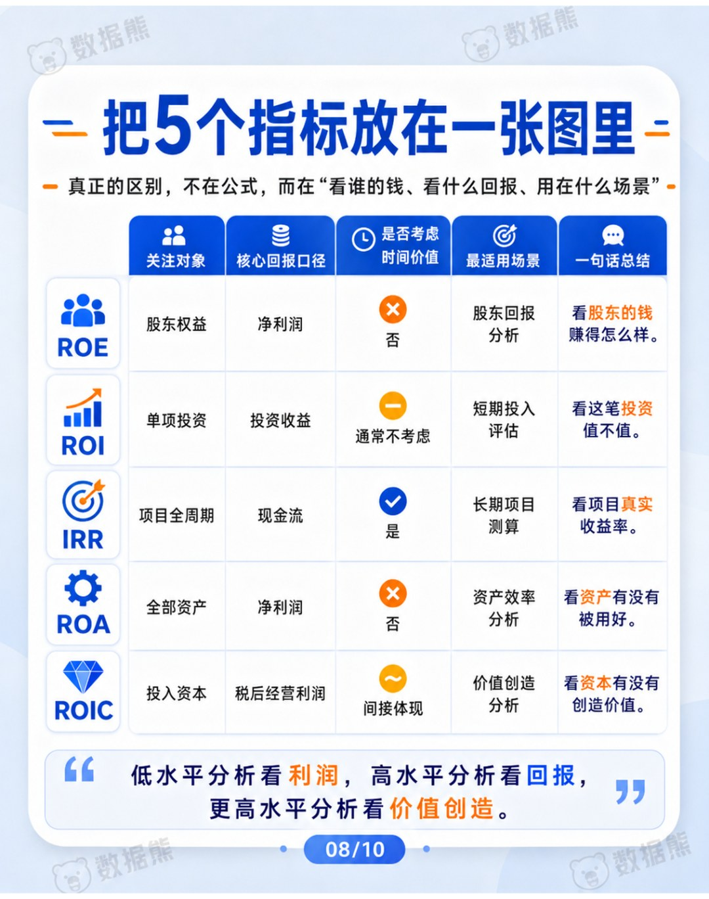
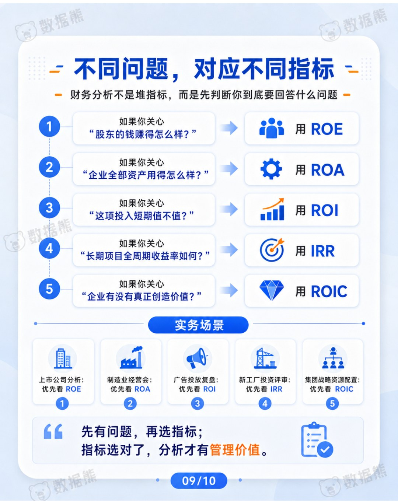
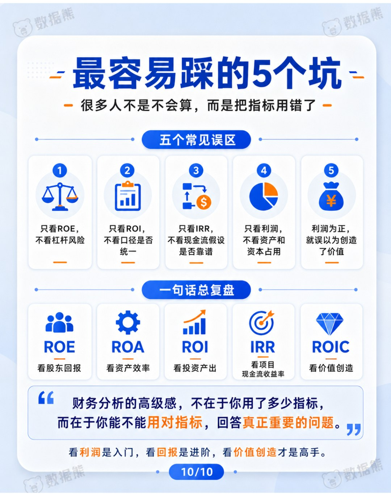

# 一文讲透ROE、ROI、IRR、ROA、ROIC：五大R系财务指标到底差在哪？

> 来源：微信公众号「数据熊」 · 作者 宋岳清 · 发布于 2026-05-18 13:28  
> 原文链接：http://mp.weixin.qq.com/s?__biz=Mzg2MTg5OTgzNA==&mid=2247499400&idx=1&sn=a28e2957a6eb744528d4860cf7ba5925&chksm=ce12a3ddf9652acb72d7e1ccdafc0e49fb31b11feb3b093875bd8dd50f7ee2735bfbc5cc5e7d

