# 2026年4月库存分析报告.pptx

> 来源：微信公众号「数据熊」 · 作者 宋岳清 · 发布于 2026-05-20 14:01
> 原文链接：http://mp.weixin.qq.com/s?__biz=Mzg2MTg5OTgzNA==&mid=2247499429&idx=1&sn=5d76f55e968bf7bf57e21ce9446df652&chksm=ce12a3f0f9652ae692907550ff0c770778db7d6001a90f5f9e45387eb3492bd0b018b789c1a6
> 摘要：很多企业做库存分析，第一反应就是查仓库、看余额、列库龄，但真正有价值的库存分析，远不止这些。

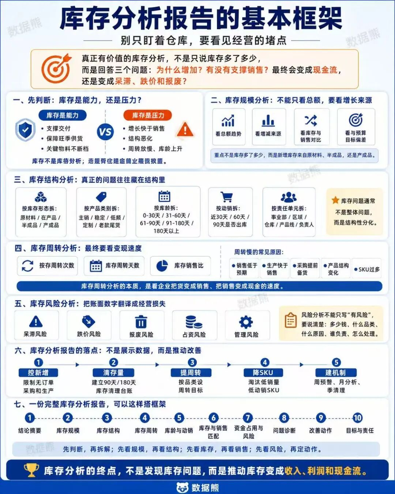

很多企业做库存分析，第一反应就是查仓库、看余额、列库龄，但真正有价值的库存分析，远不止这些。

库存表面上是货，背后却连着销售预测、采购节奏、生产排产、产品结构、资金周转和经营效率。

库存高，不一定坏；库存低，也不一定好。

关键要看这些库存能不能支撑销售，能不能转化为现金流，未来会不会变成呆滞、跌价和报废。

所谓库存分析报告，不是把库存数据搬到纸面上，而是通过库存这面镜子，看清企业经营协同中的堵点。

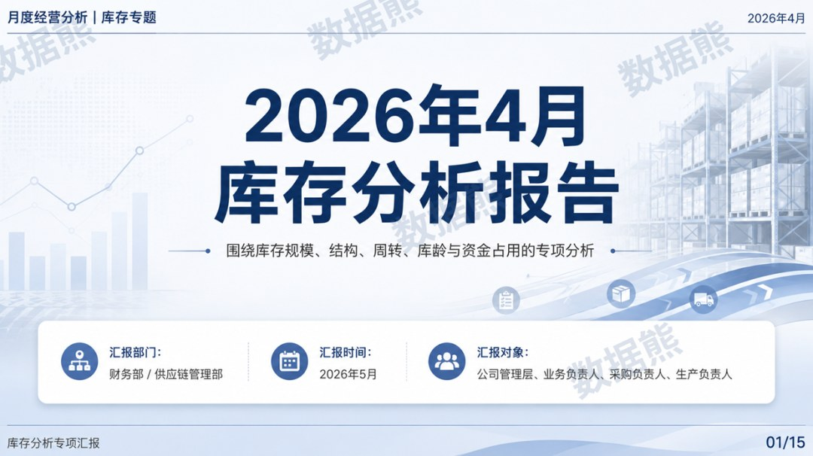

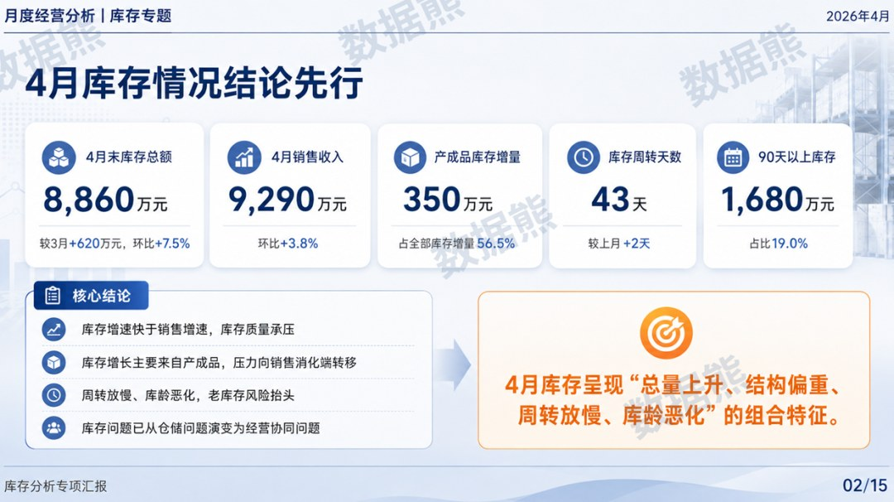

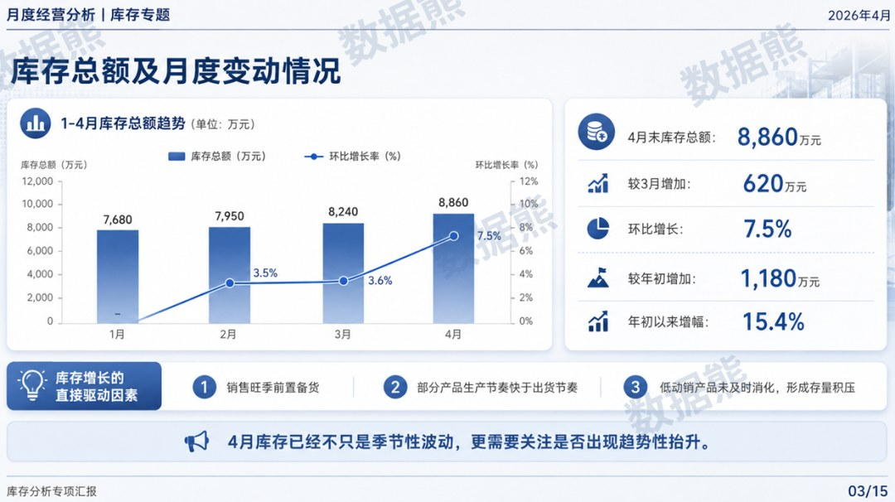

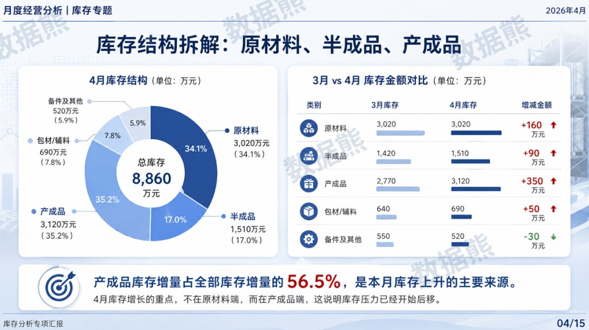

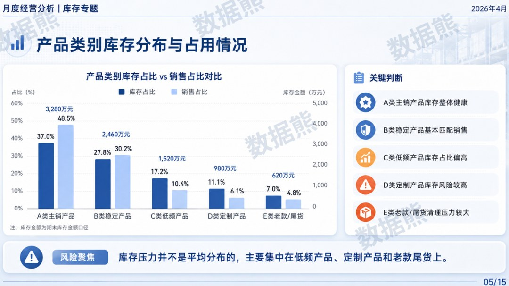

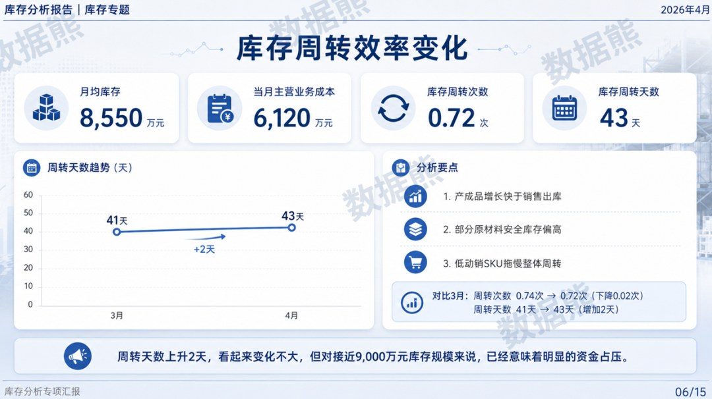

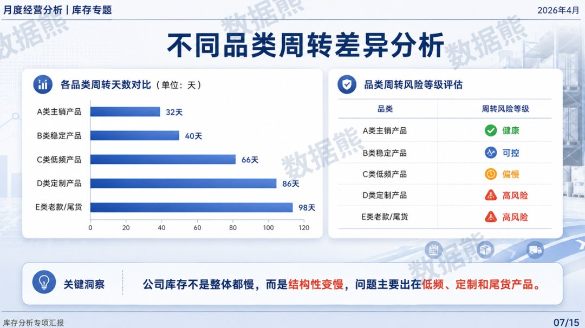

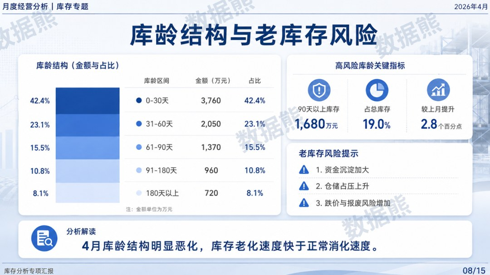

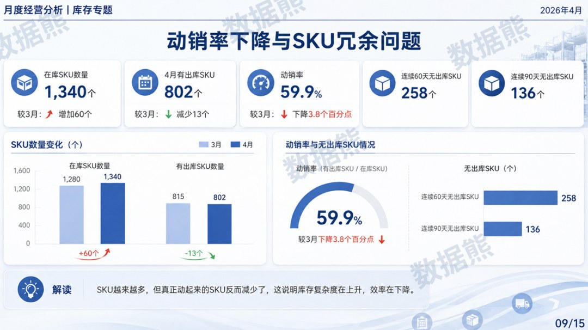

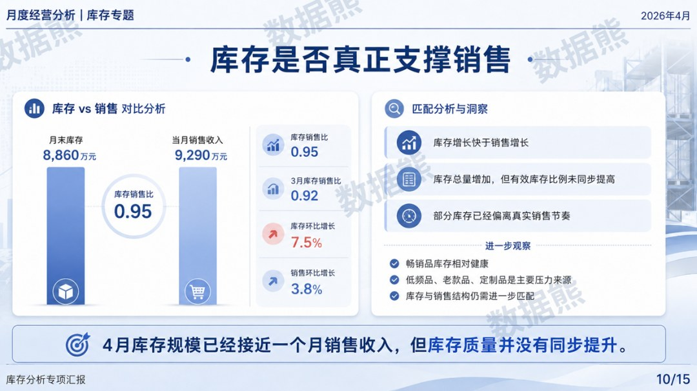

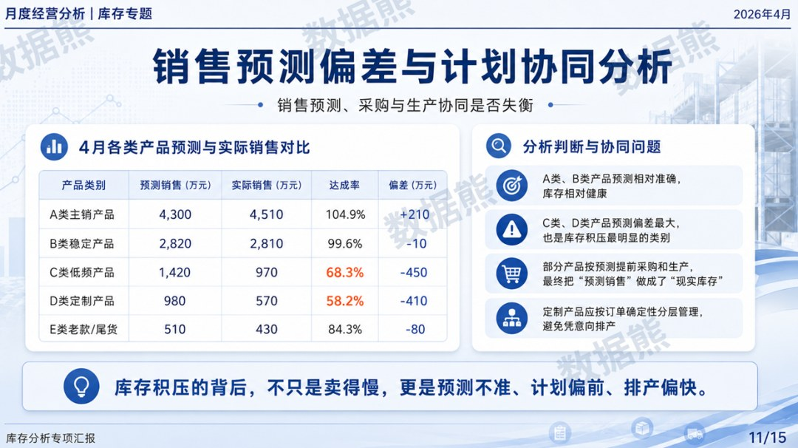

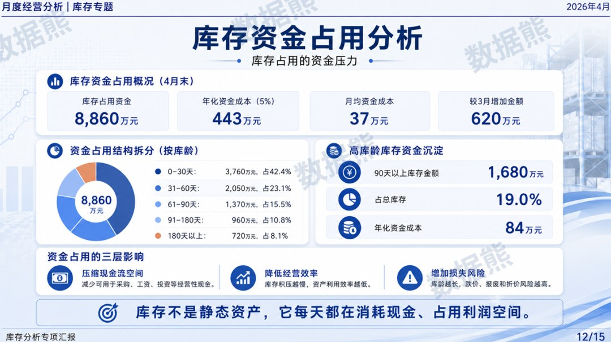

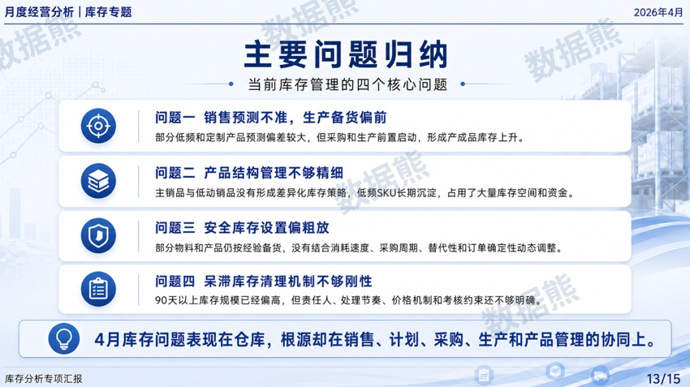

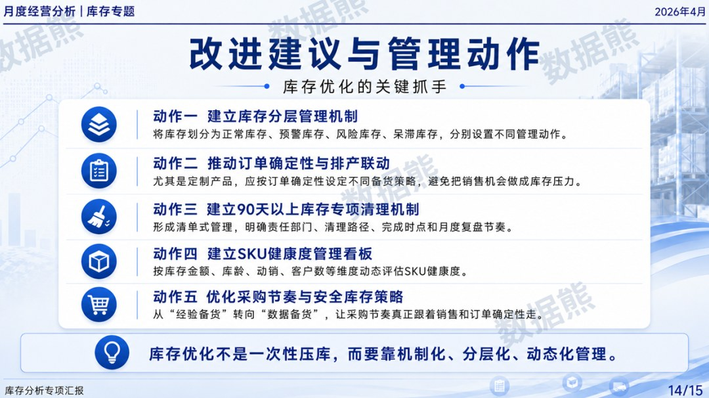

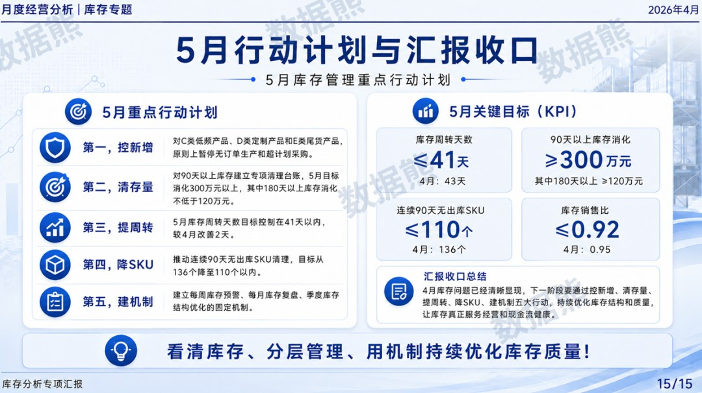
