# 应收账款分析模型.pptx

> 来源：微信公众号「数据熊」 · 作者 宋岳清 · 发布于 2026-05-25 09:08
> 原文链接：http://mp.weixin.qq.com/s?__biz=Mzg2MTg5OTgzNA==&mid=2247499520&idx=1&sn=597c5f77a5ecf4b1c57392a31c7b4dae&chksm=ce12a255f9652b4323bc7cec93e07fef391c9befc61b114bb507fd8c666e8dccc4984a99893c

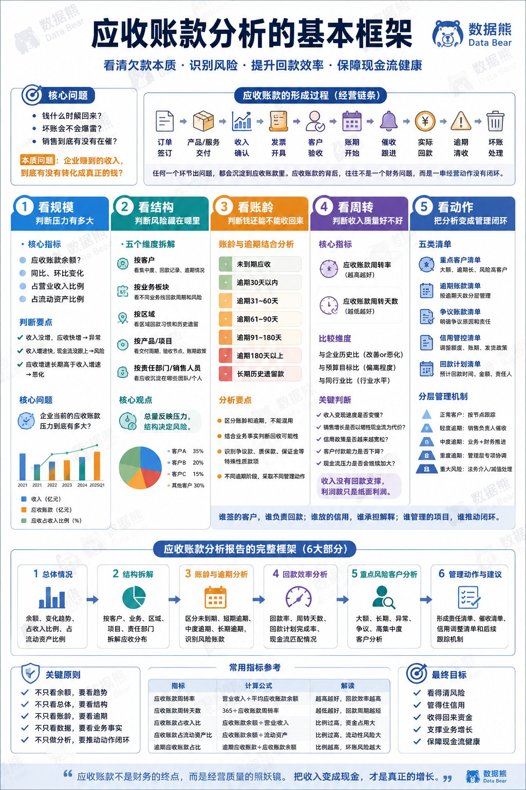

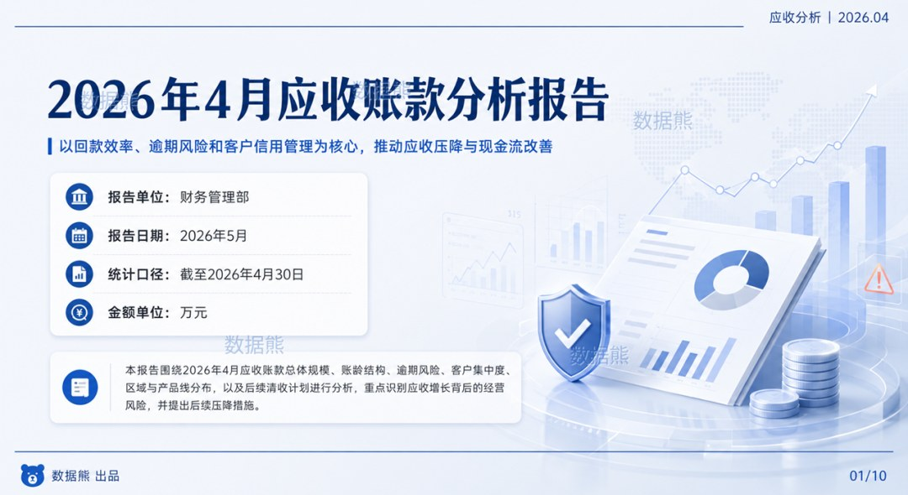

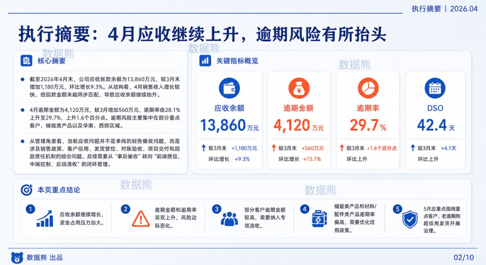

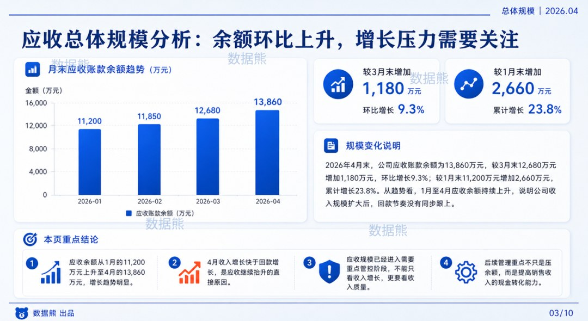

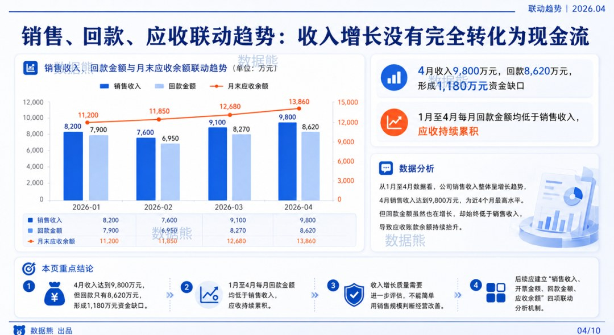

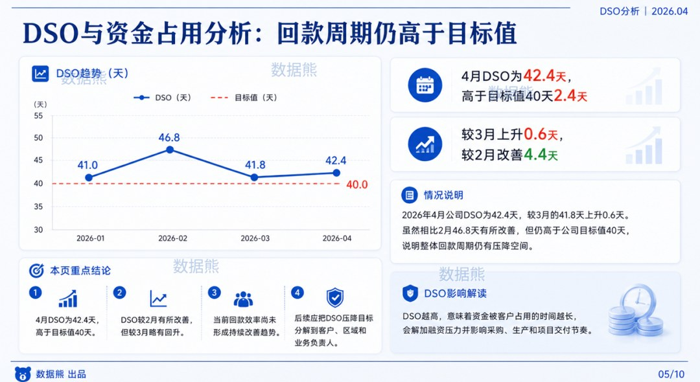

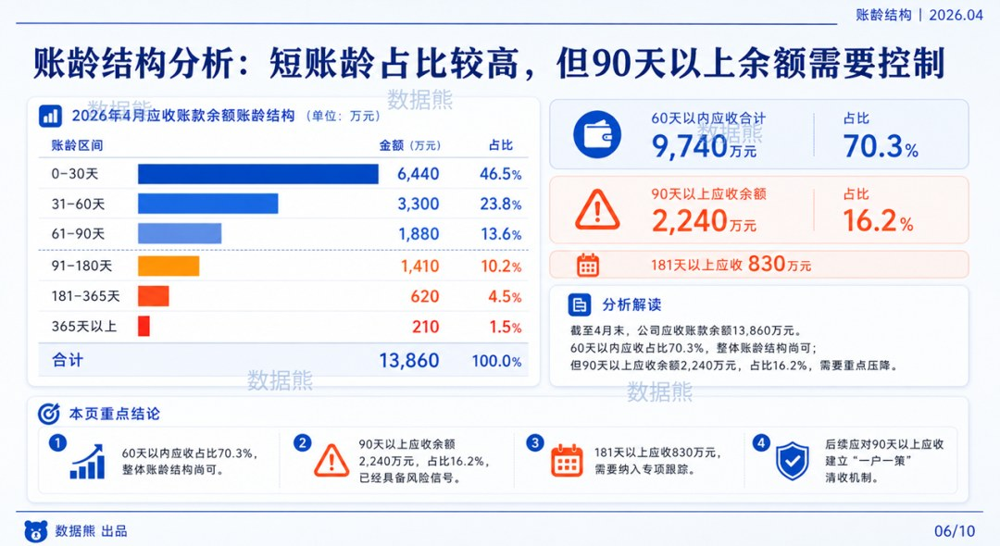

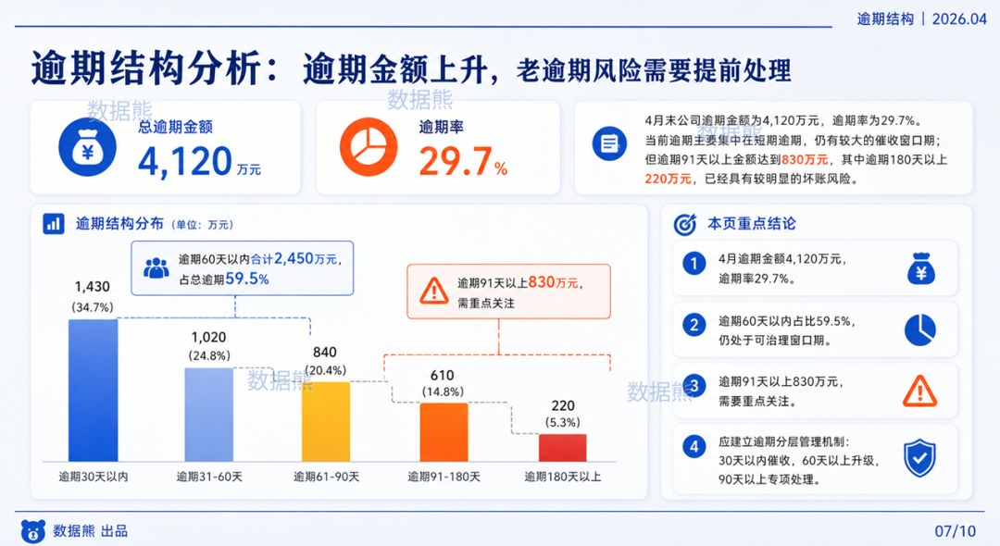

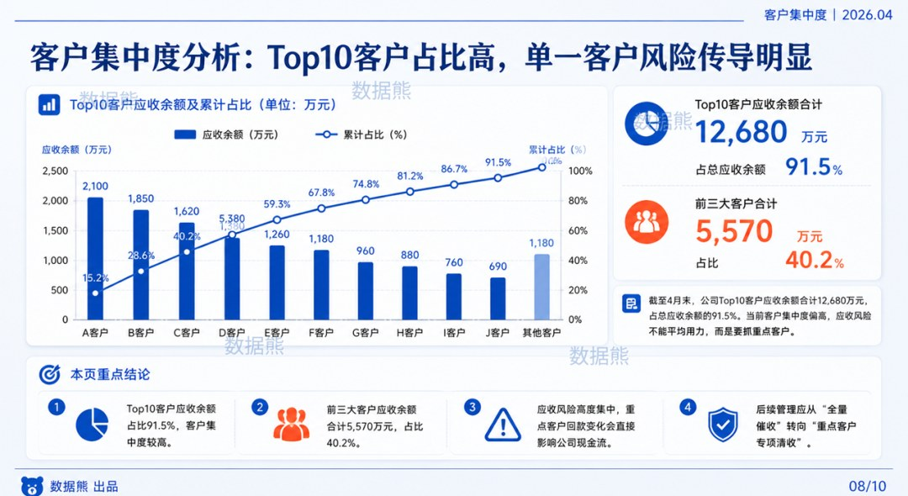

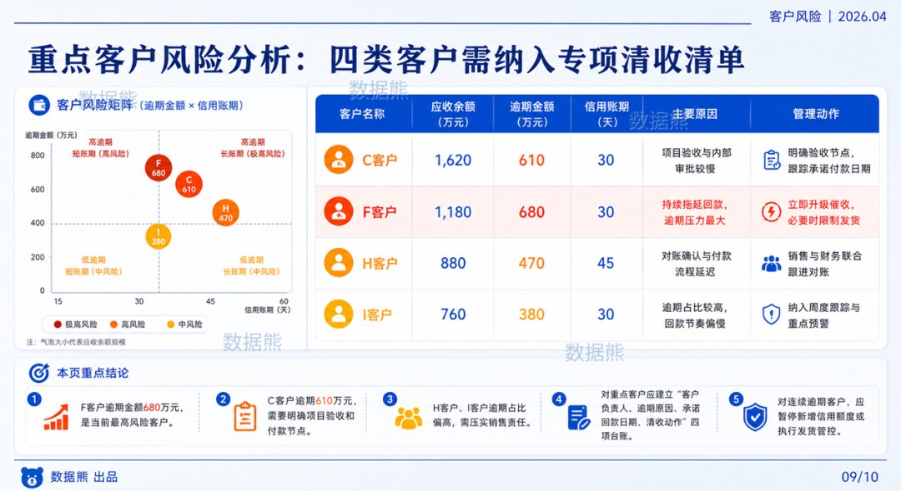

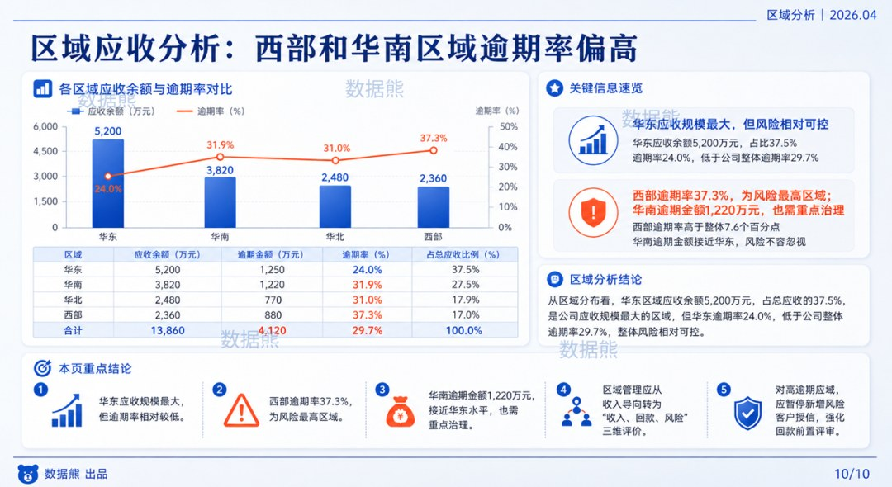

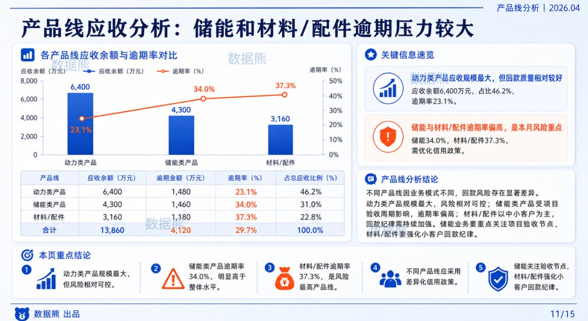

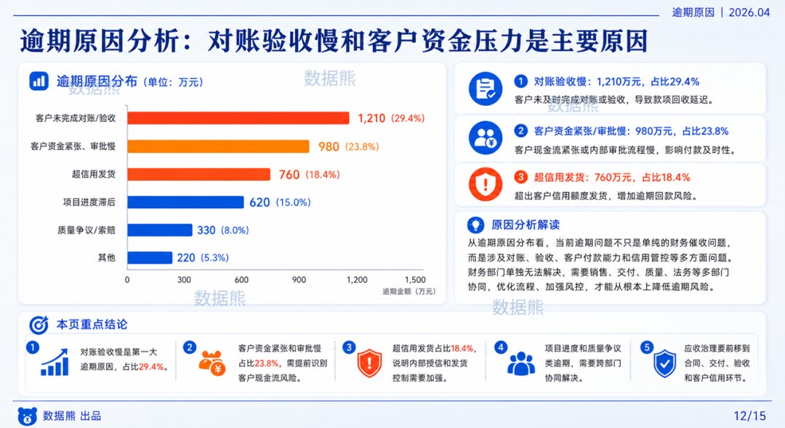

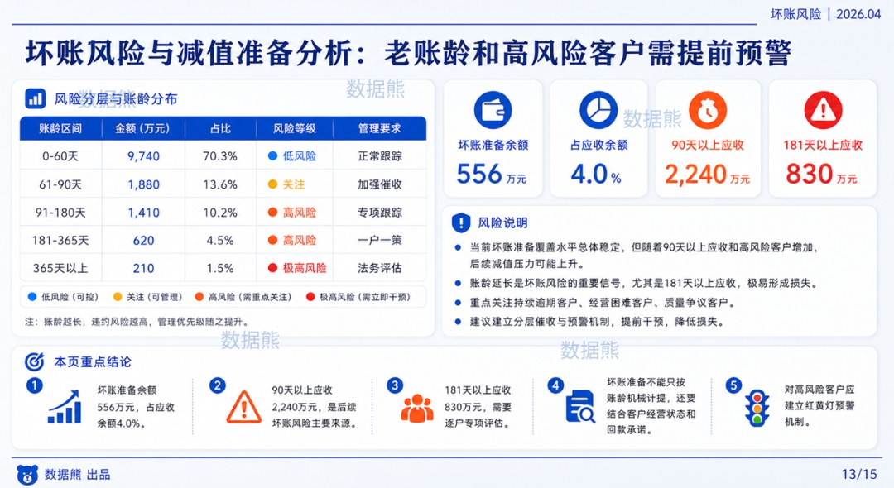

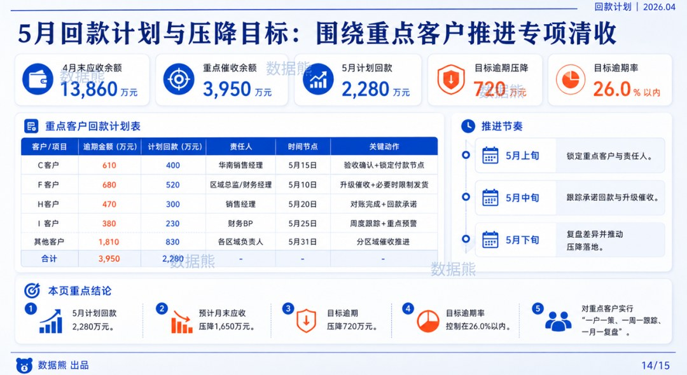

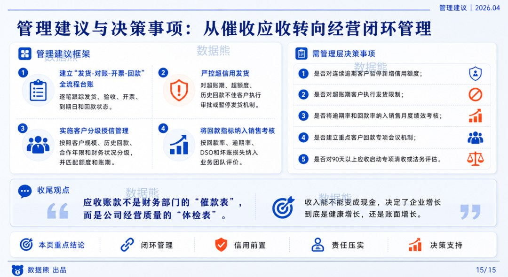
