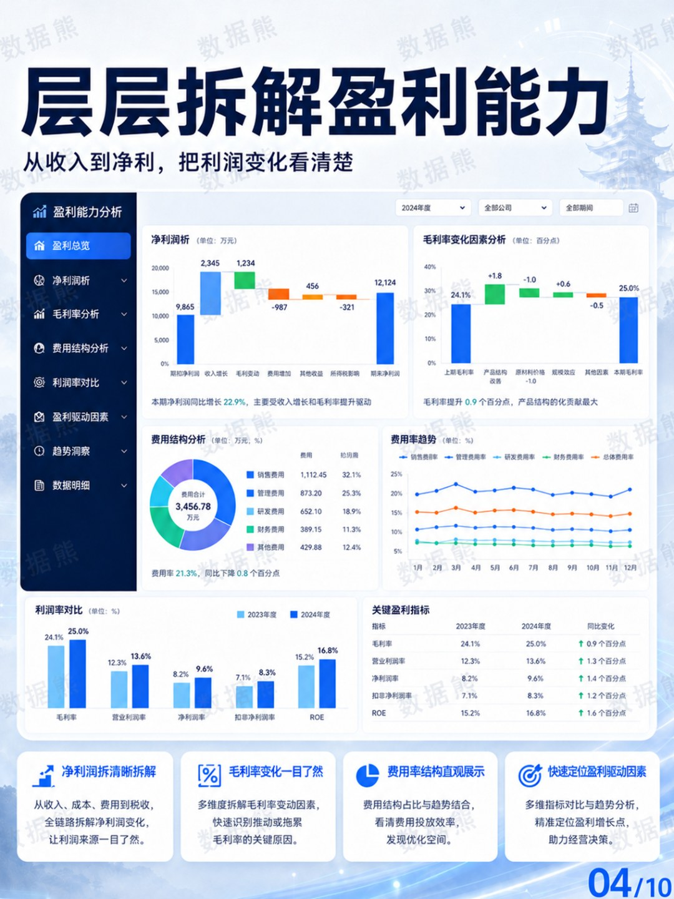
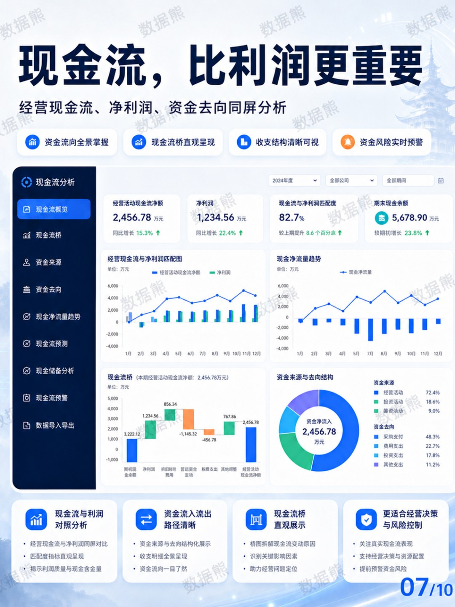
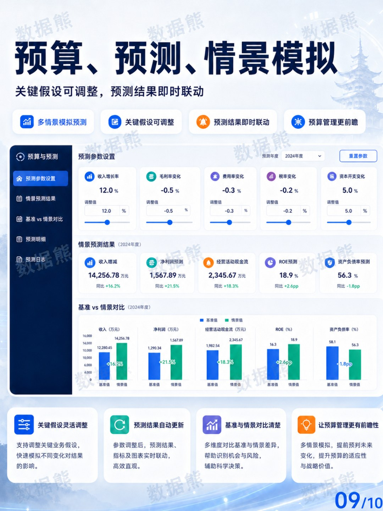

# 小白可用的财务分析驾驶舱

> 来源：微信公众号「数据熊」 · 作者 宋岳清 · 发布于 2026-05-29 09:16
> 原文链接：http://mp.weixin.qq.com/s?__biz=Mzg2MTg5OTgzNA==&mid=2247499573&idx=1&sn=b0f33c4639330a7dcc25927a5a1994c0&chksm=ce12a260f9652b766428e5c85bd8a46995530eceec4fc5924787868f4c657fdc3c60b11d980c

