# 2026年5月应收账款分析报告

> 来源：微信公众号「数据熊」 · 作者 宋岳清 · 发布于 2026-06-01 09:04  
> 原文链接：http://mp.weixin.qq.com/s?__biz=Mzg2MTg5OTgzNA==&mid=2247499650&idx=1&sn=76b6426388f7c3f246ddfead9f588e0e&chksm=ce12a2d7f9652bc1ecca2f9366dbcceb57bd597c485c91b23ff8b9c7d78d3af2490b61e27995
> 摘要：很多企业一做应收账款分析，就习惯性打开账龄表，看谁欠得多、谁逾期久、谁需要催。但真正有价值的应收分析，不能只停留在“催款”层面。

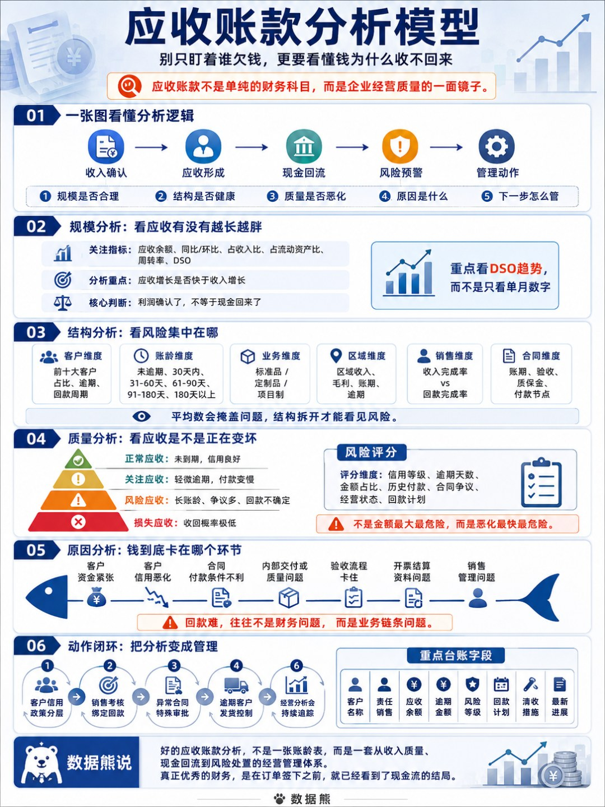

很多企业一做应收账款分析，就习惯性打开账龄表，看谁欠得多、谁逾期久、谁需要催。

但真正有价值的应收分析，不能只停留在“催款”层面。

应收账款背后，藏着客户质量、销售政策、合同条款、交付验收、回款责任和现金流安全。

它不是一个孤立的财务科目，而是一条从订单到收入、从收入到现金、从现金到风险管理的经营链条。

看懂应收账款，本质上就是看懂企业的收入质量和经营韧性。

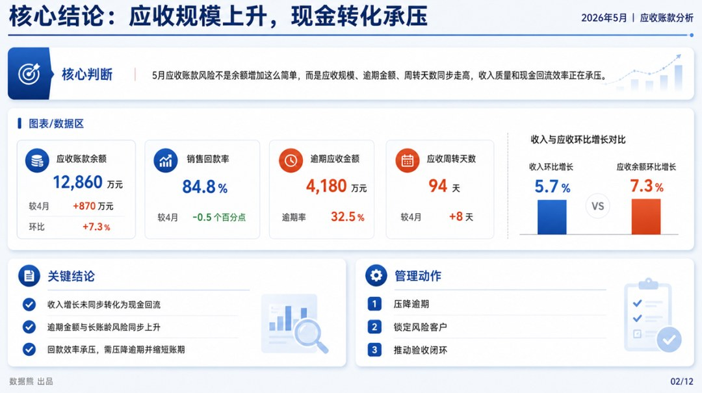

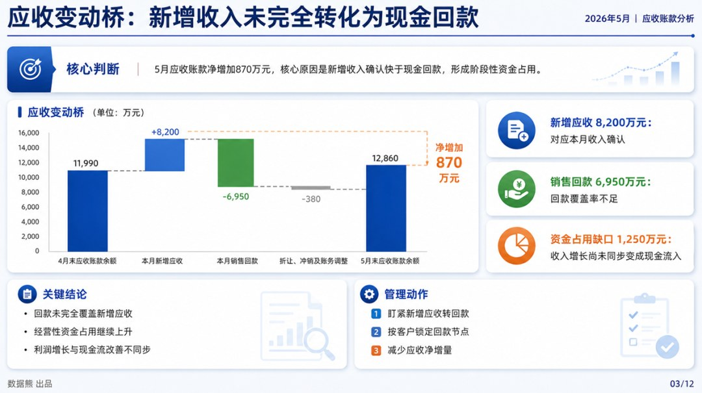

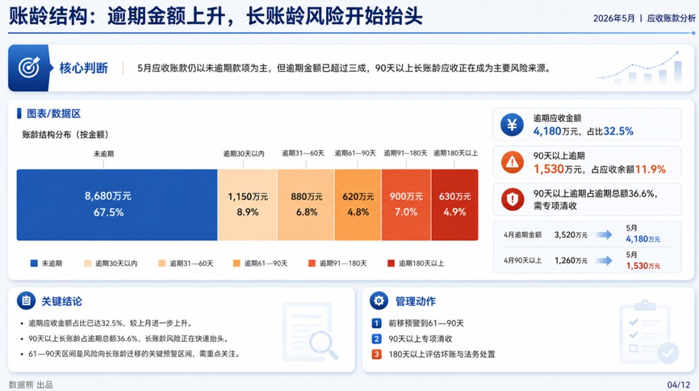

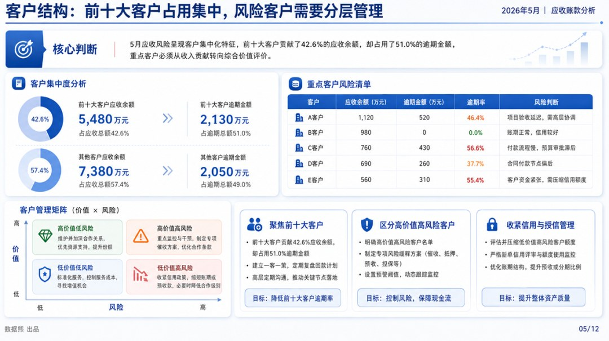

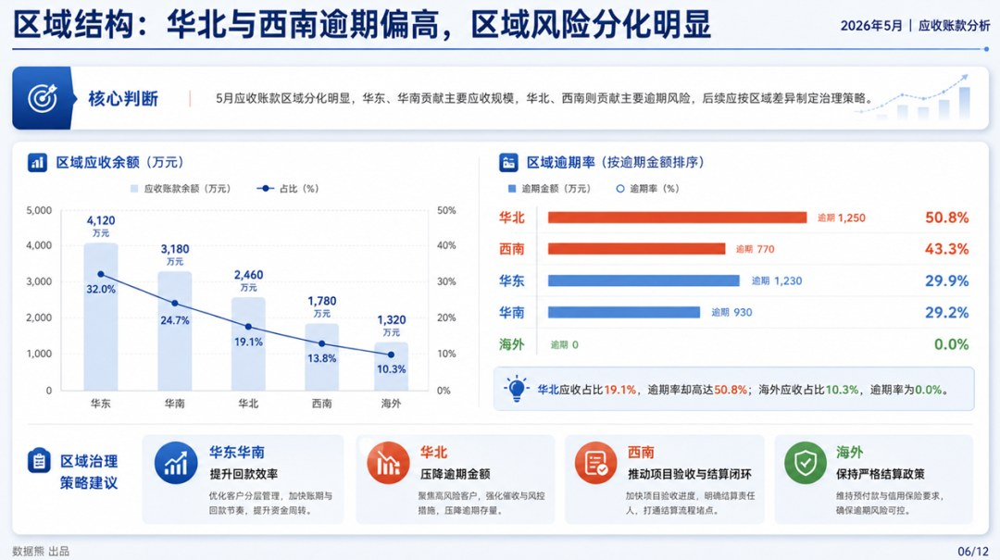

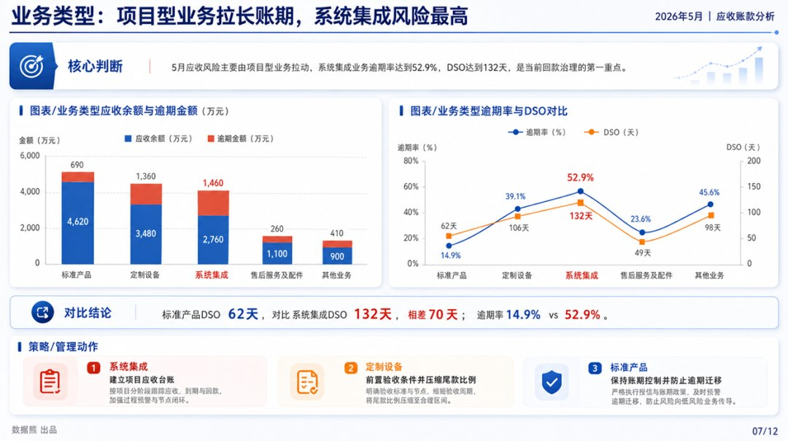

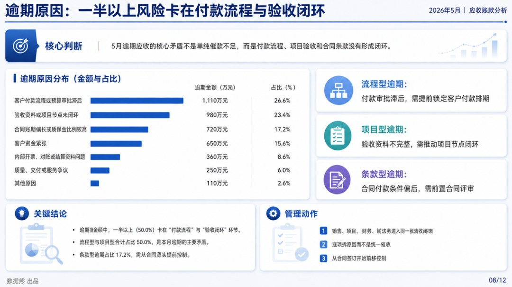

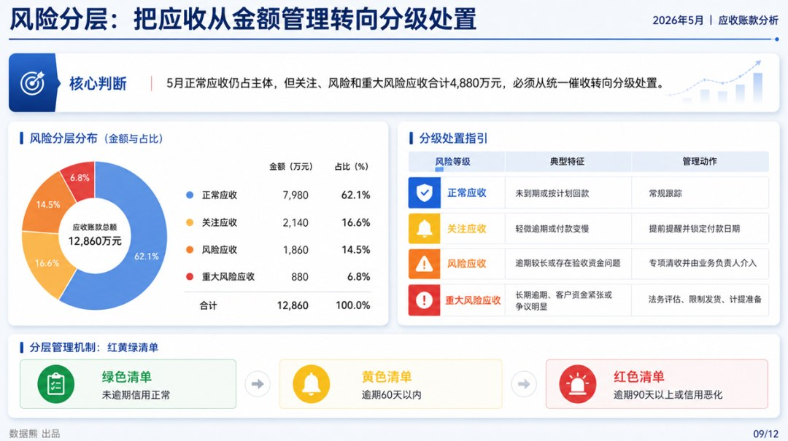

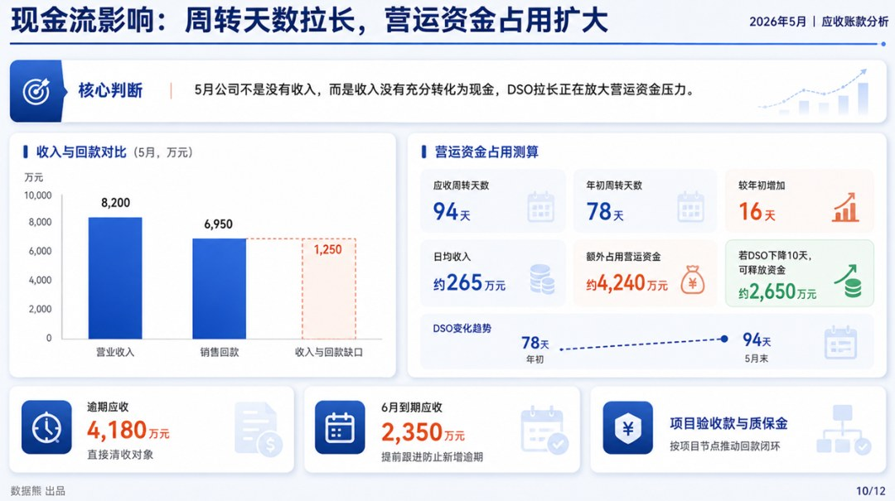

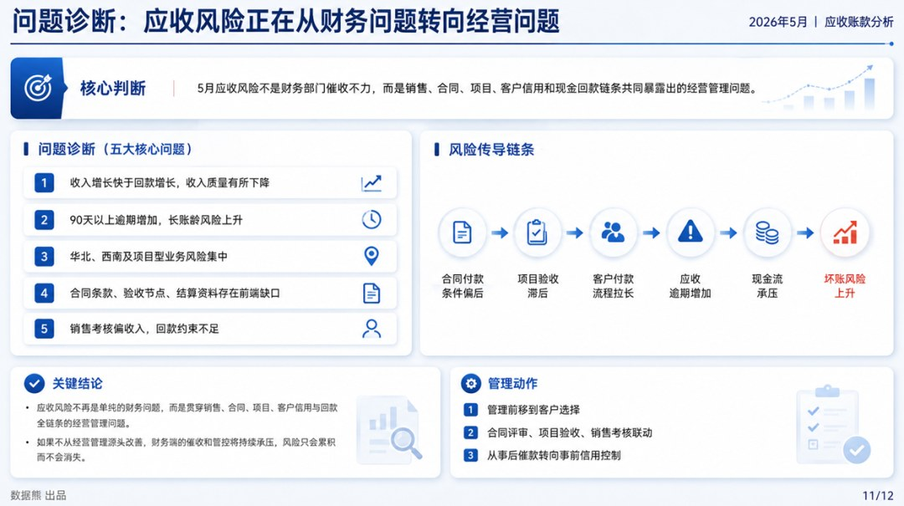

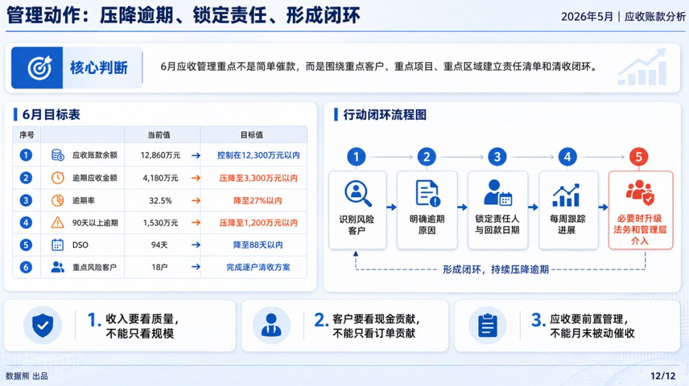

