# 2026年上半年应收账款分析报告

> 来源：微信公众号「数据熊」 · 作者 宋岳清 · 发布于 2026-06-25 09:10
> 原文链接：http://mp.weixin.qq.com/s?__biz=Mzg2MTg5OTgzNA==&mid=2247500095&idx=1&sn=32b5e33f21e6bcea2a59af04a772b7b9&chksm=ce129c6af965157c32247df25621eb824c25c3bc136f34256b3e2f7c6b596253e8aa89d0c3b8

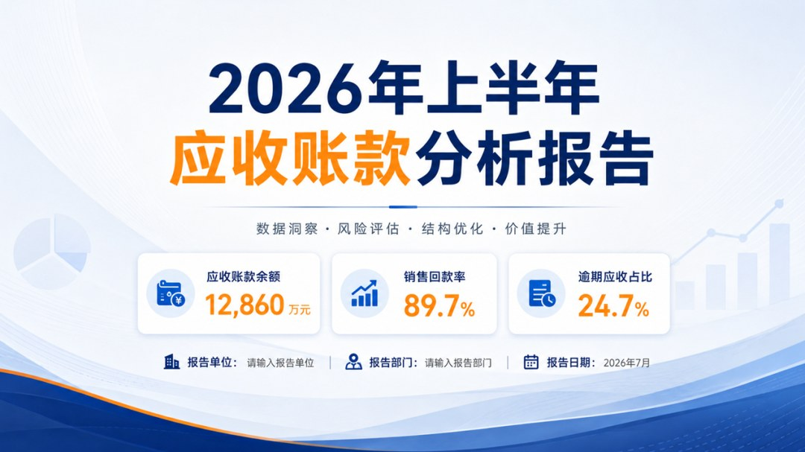

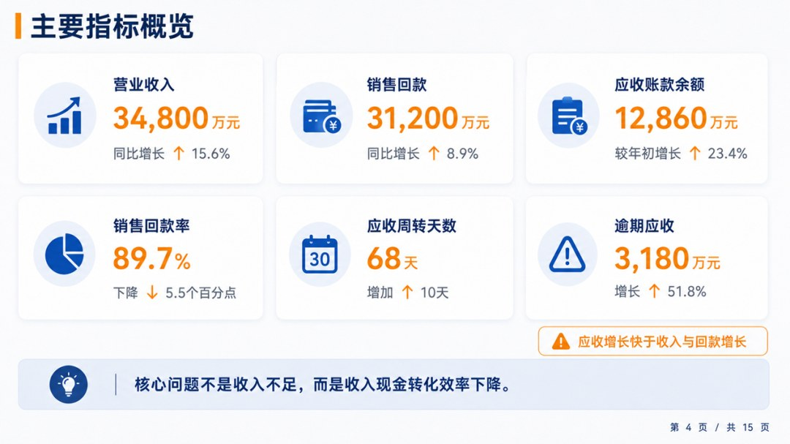

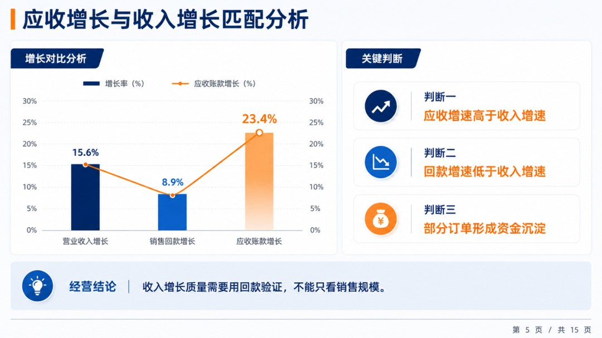

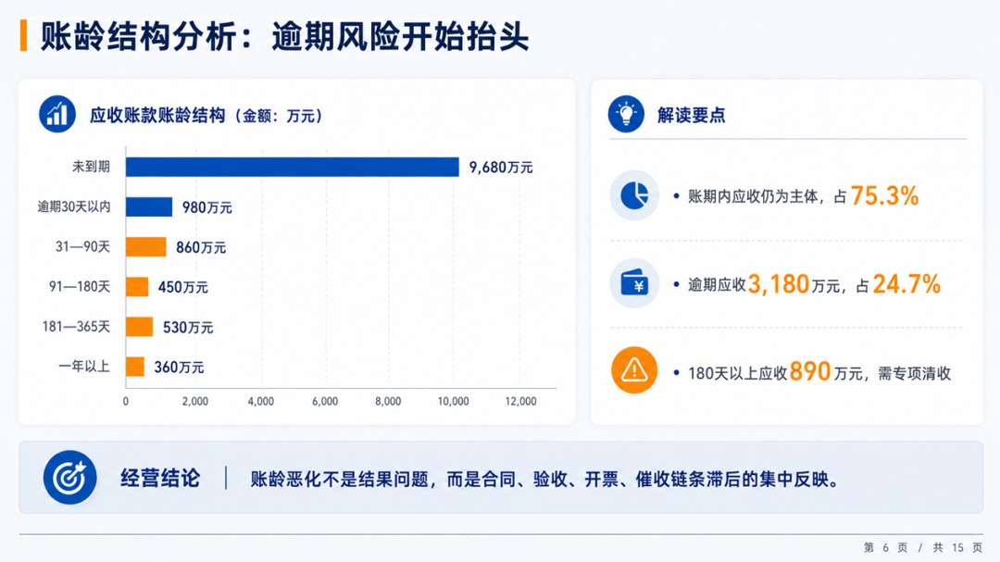

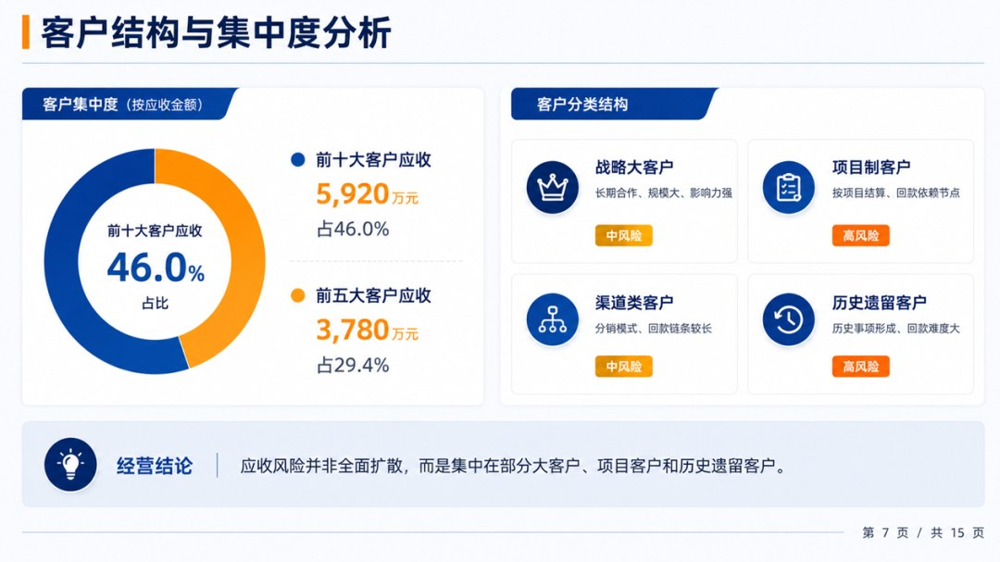

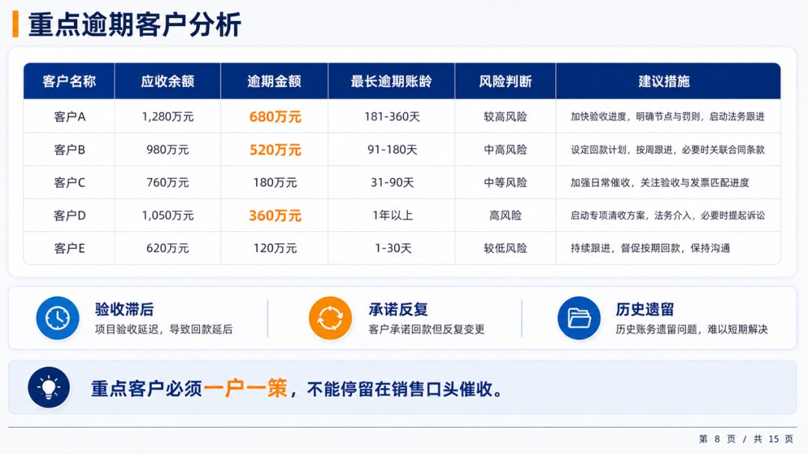

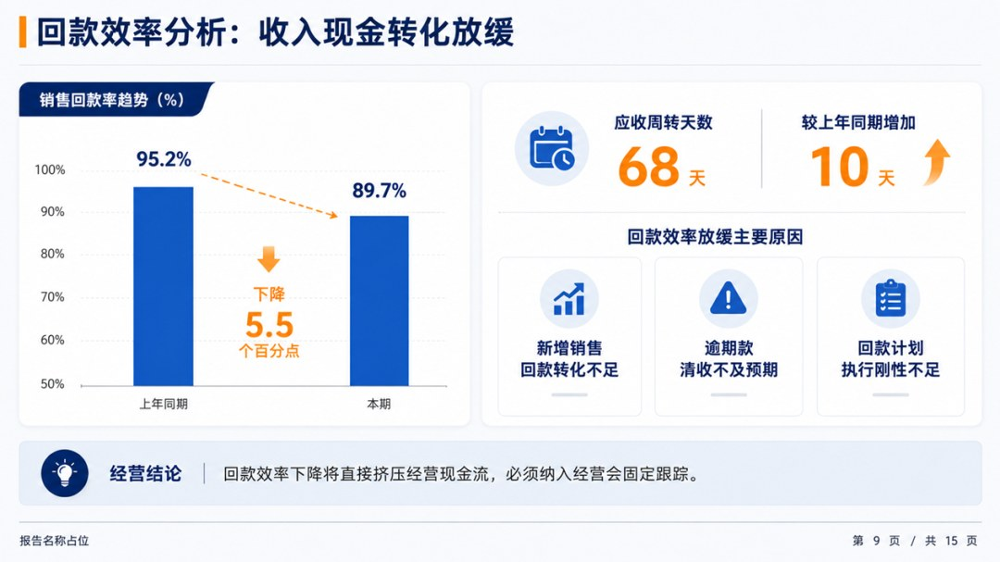

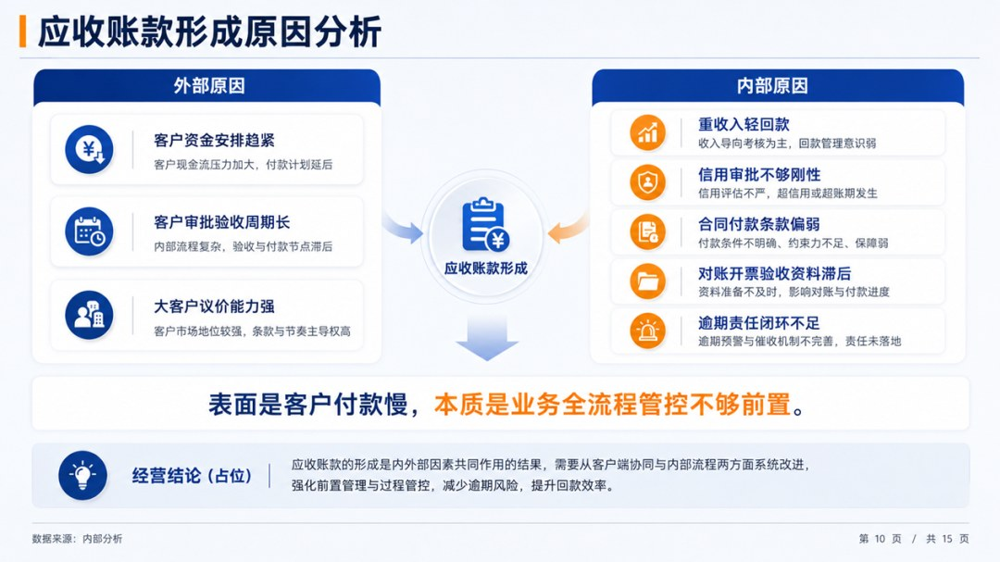

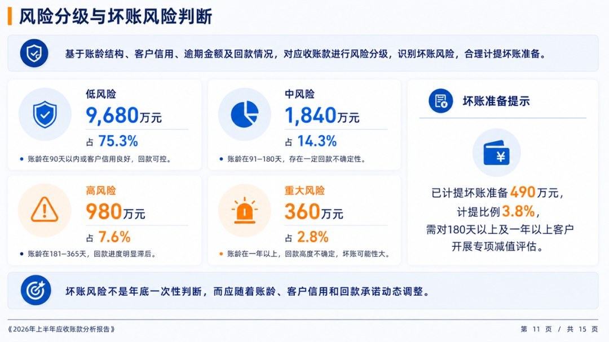

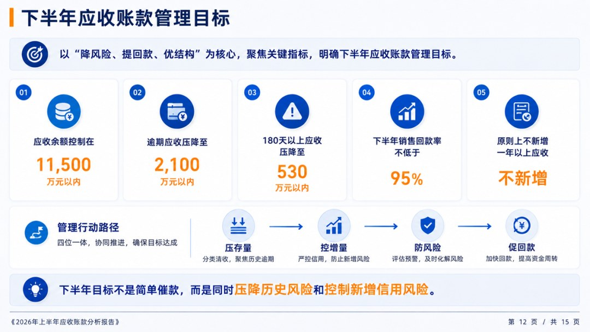

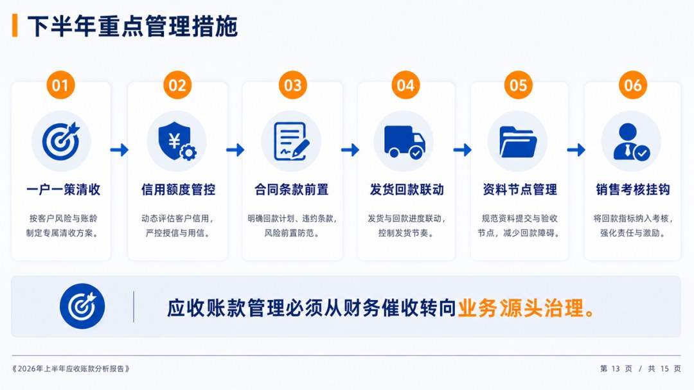

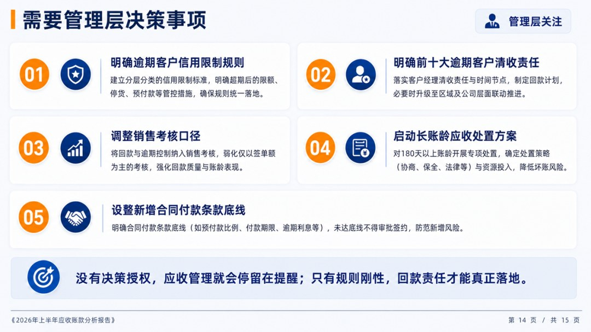

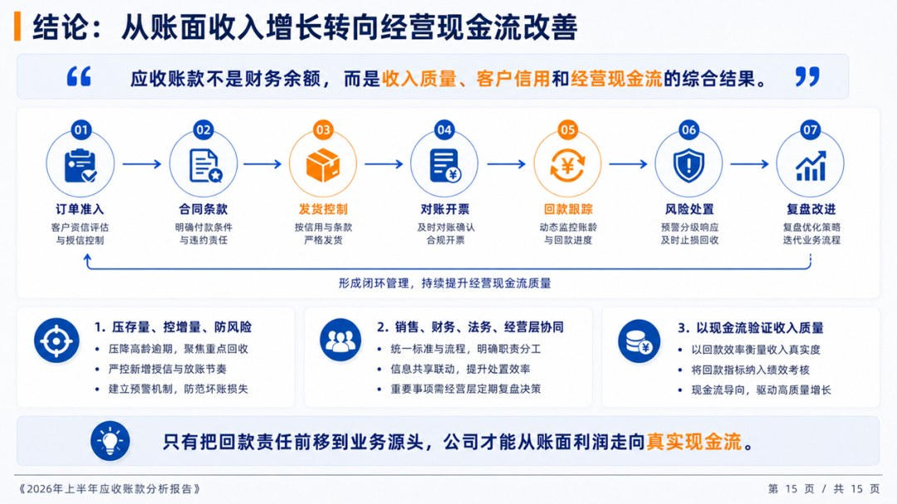

