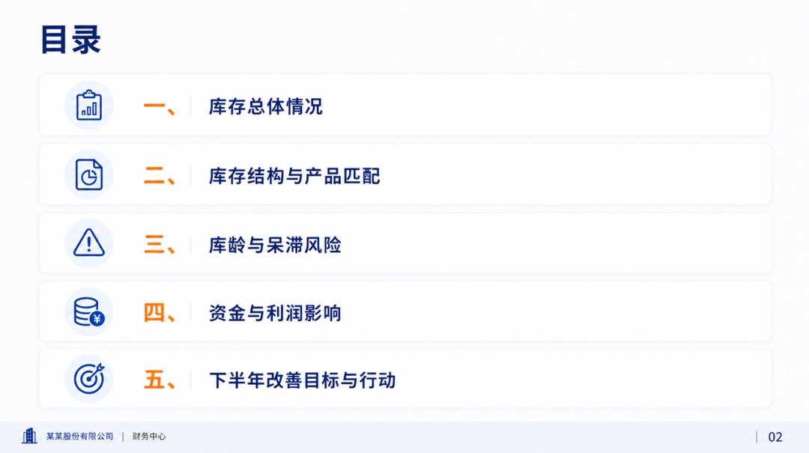
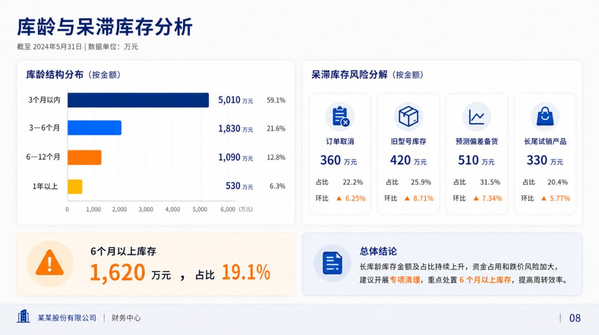
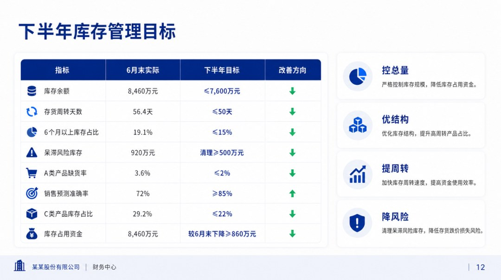
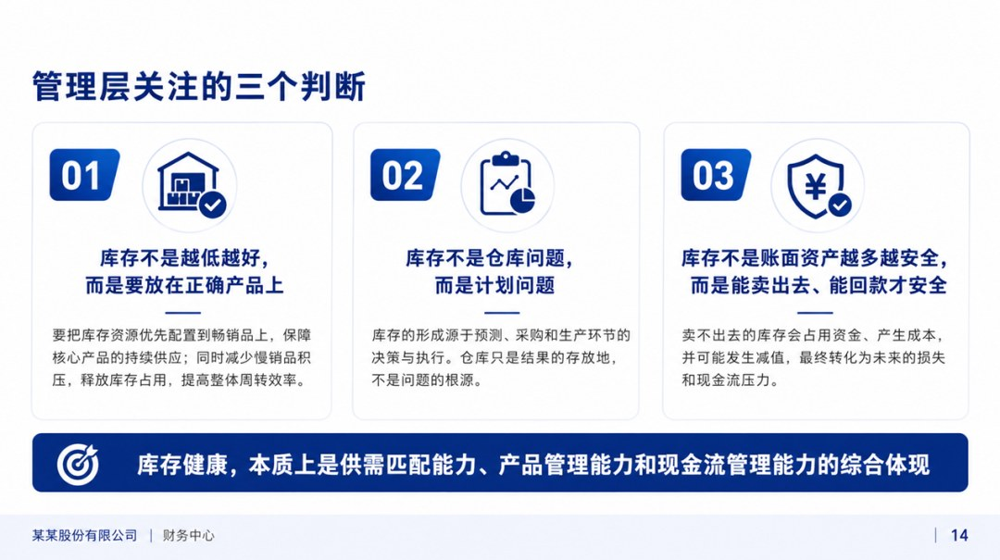
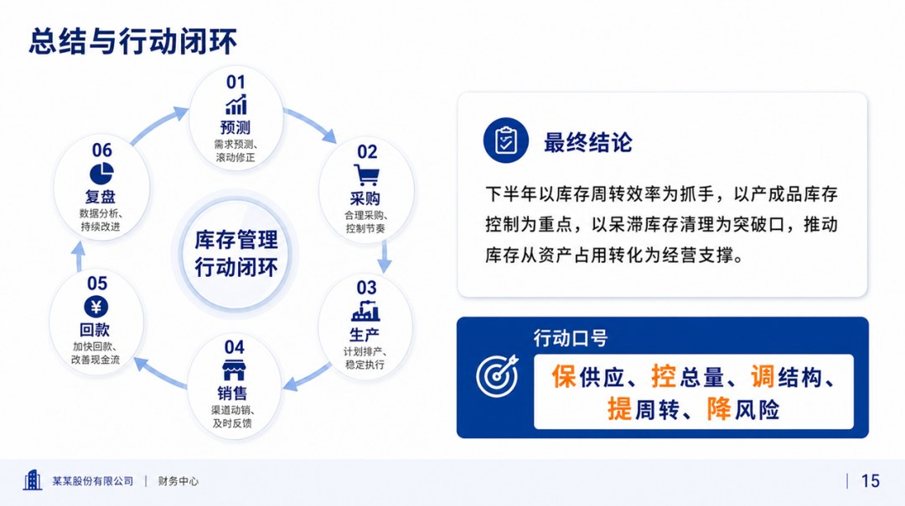

# 2026年上半年库存分析报告

> 来源：微信公众号「数据熊」 · 作者 宋岳清 · 发布于 2026-06-27 08:27  
> 原文链接：http://mp.weixin.qq.com/s?__biz=Mzg2MTg5OTgzNA==&mid=2247500136&idx=1&sn=228beecc3e1cd88a2fce913be9519a8a&chksm=ce129c3df965152bd72ecaf6871bda5e0d3938c94f38171edca48d2f4529481a4ec28a9e661d

