# 2026年7月库存分析报告.pptx

> 来源：微信公众号「数据熊」 · 作者 宋岳清 · 发布于 2026-07-29 09:14  
> 原文链接：http://mp.weixin.qq.com/s?__biz=Mzg2MTg5OTgzNA==&mid=2247500613&idx=1&sn=eaf57e3f6db9aa5a965ac543a2874e64&chksm=ce129e10f965170643bf19385f65ceeabe4f253d3c4520333883d5b87b7de714c4e8768ee2b6

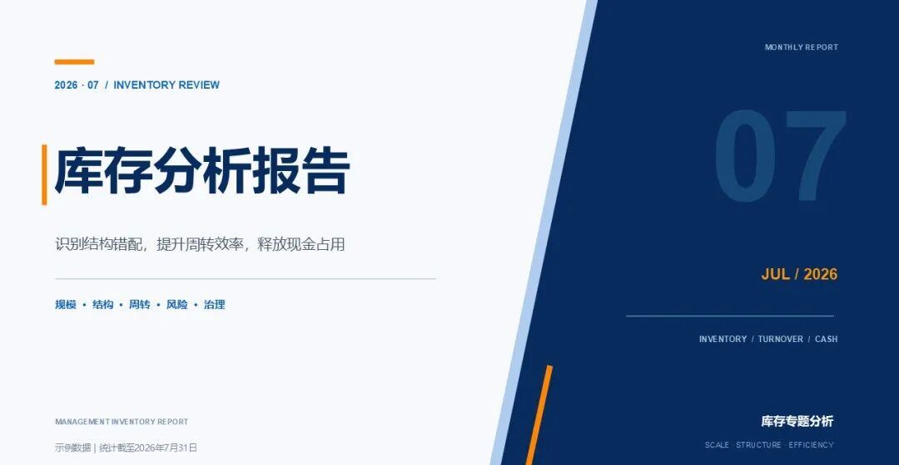

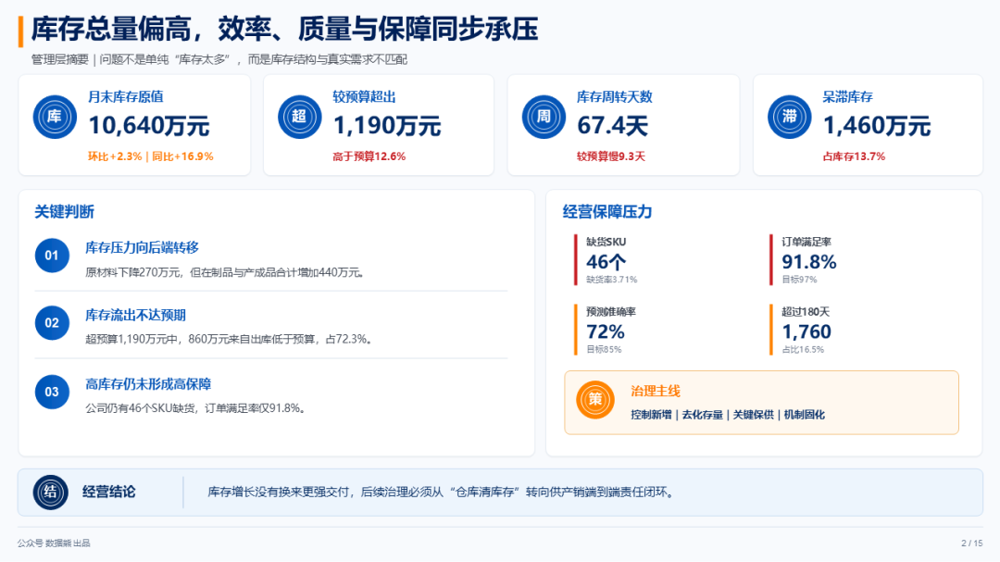

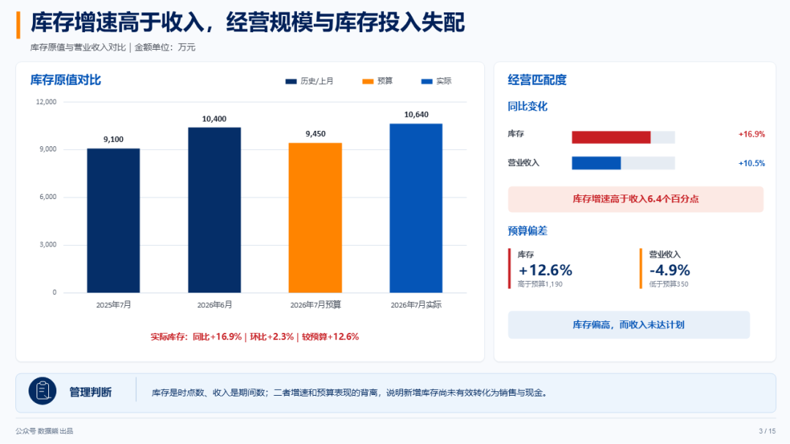

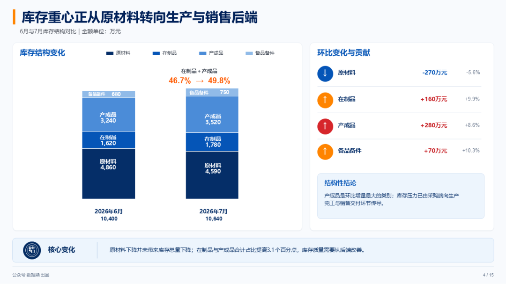

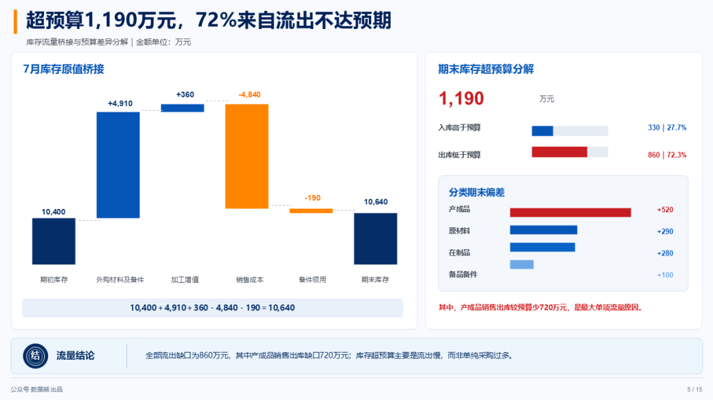

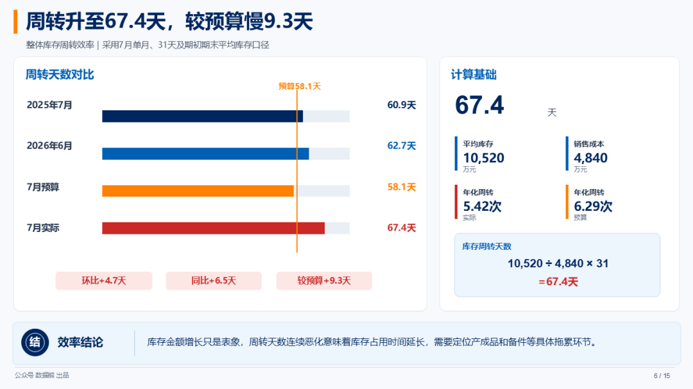

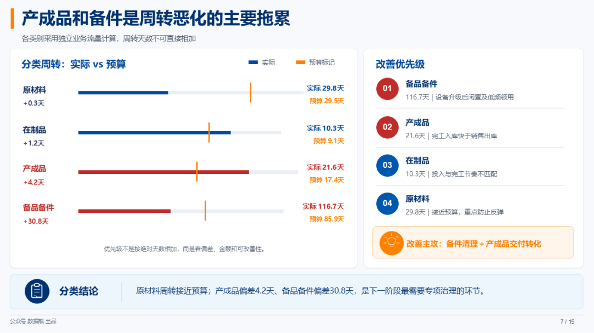

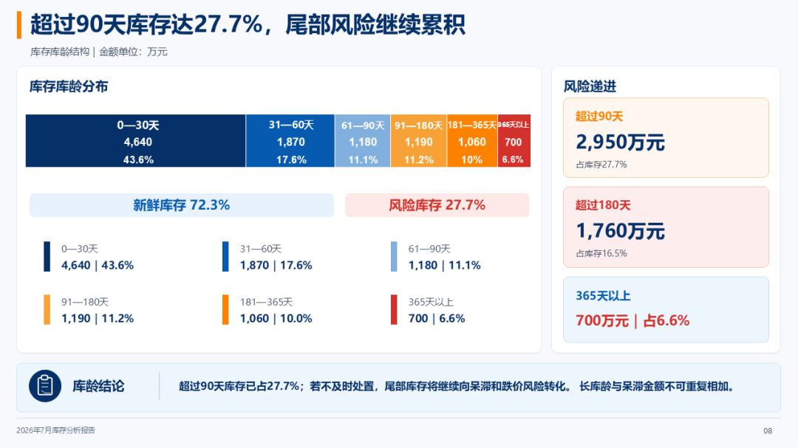

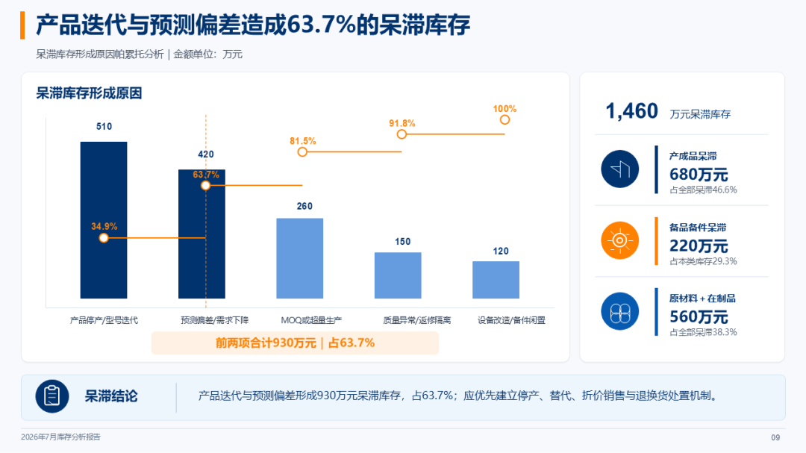

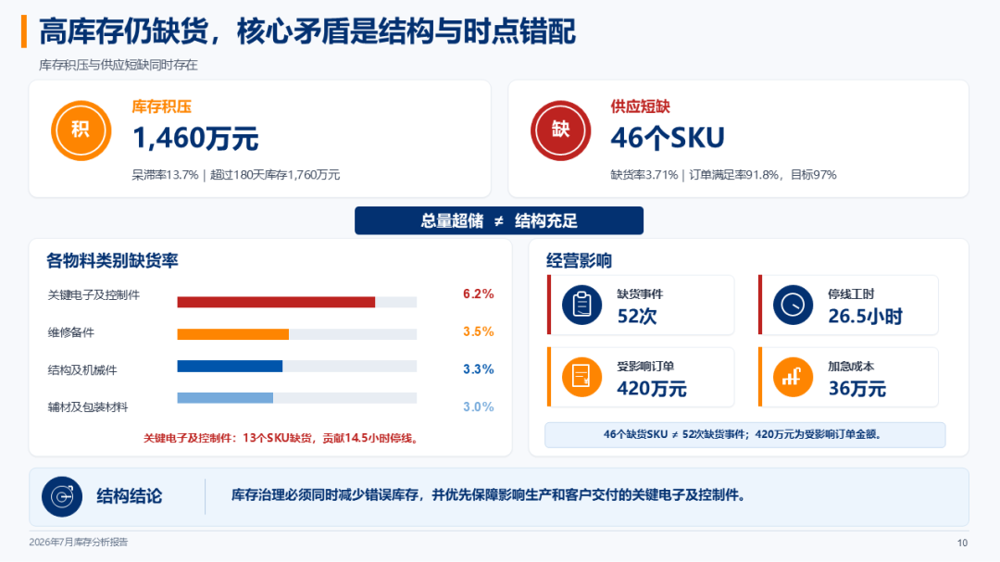

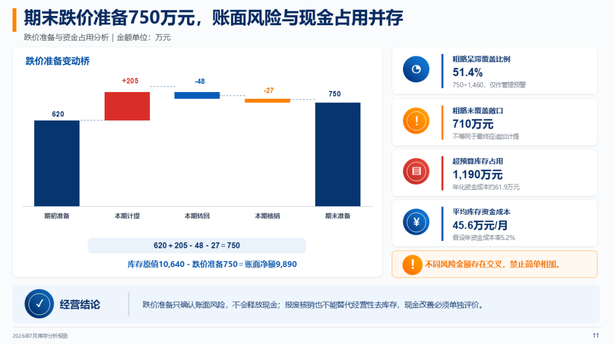

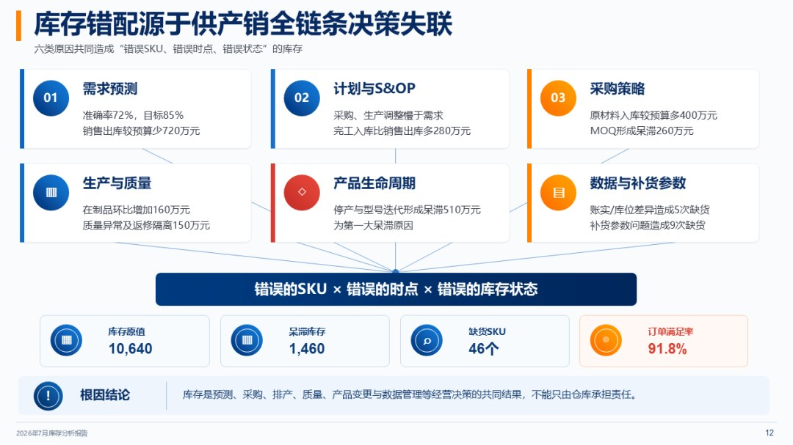

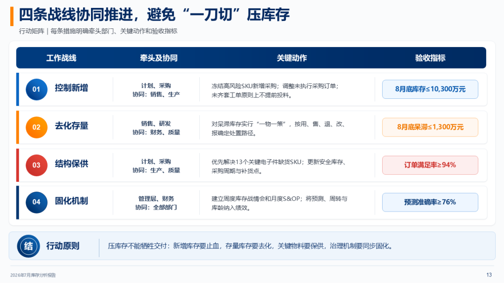

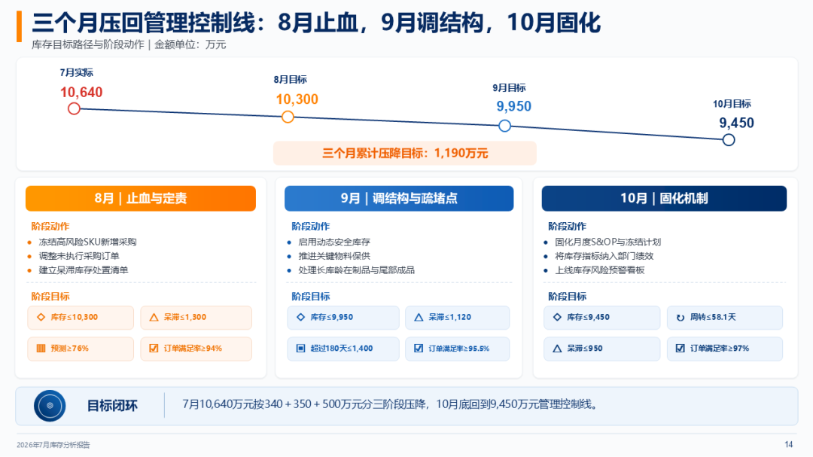

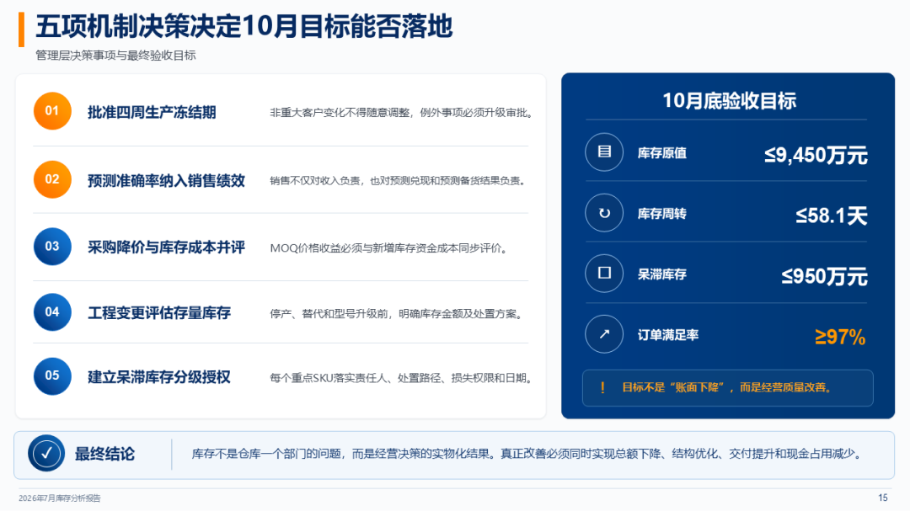

