# 财务部绩效考核方案（附评分细则.xlsx）

> 来源：微信公众号「数据熊」 · 作者 宋岳清 · 发布于 2026-08-08 08:08  
> 原文链接：http://mp.weixin.qq.com/s?__biz=Mzg2MTg5OTgzNA==&mid=2247500829&idx=1&sn=61f638547e011d513843017c4b90f319&chksm=ce129948f965105ee3b2c996ce68b65fad26f7f3ecc328279f538f1301cecebbb1b8817fa4f7

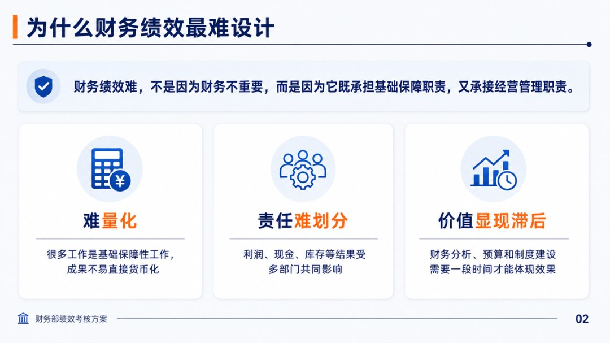

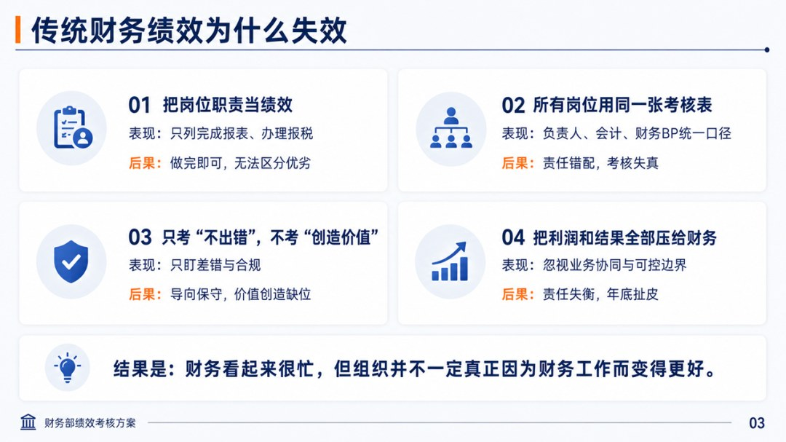

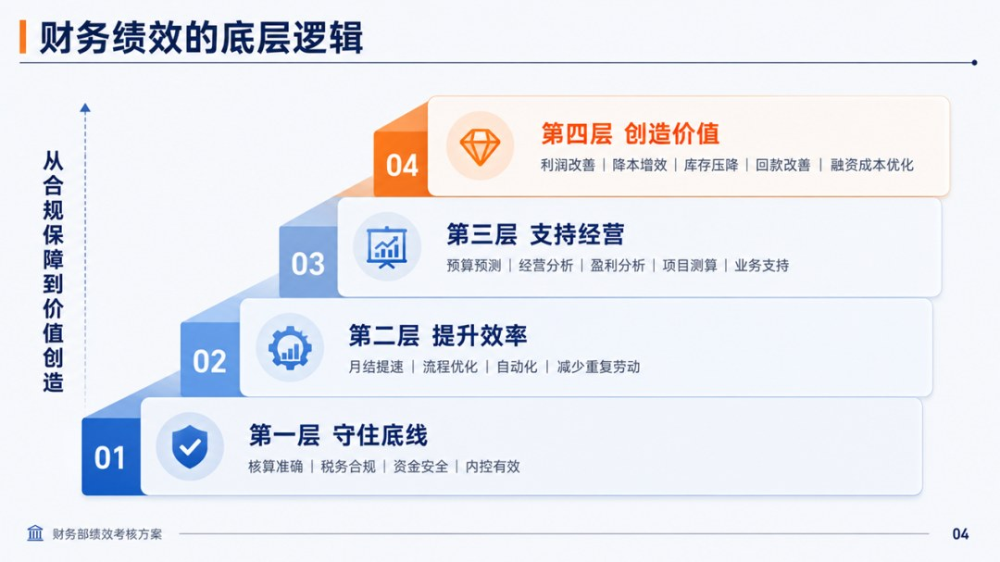

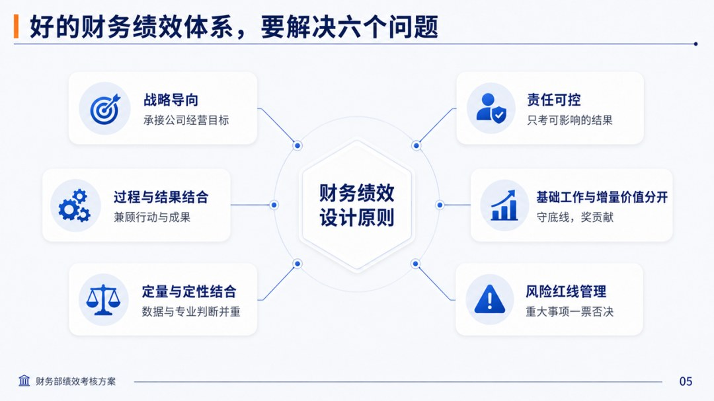

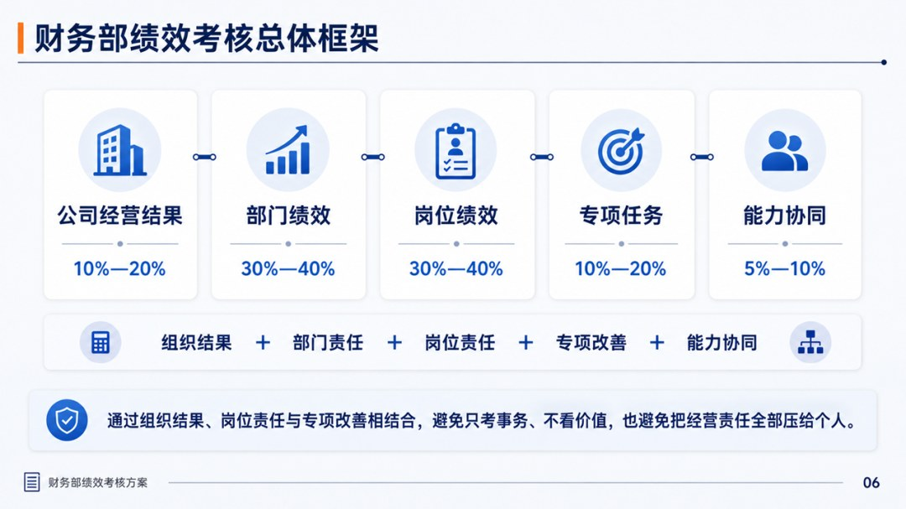

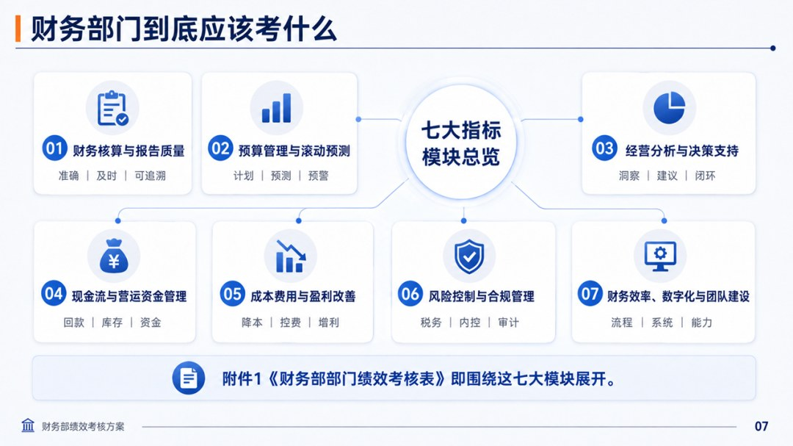

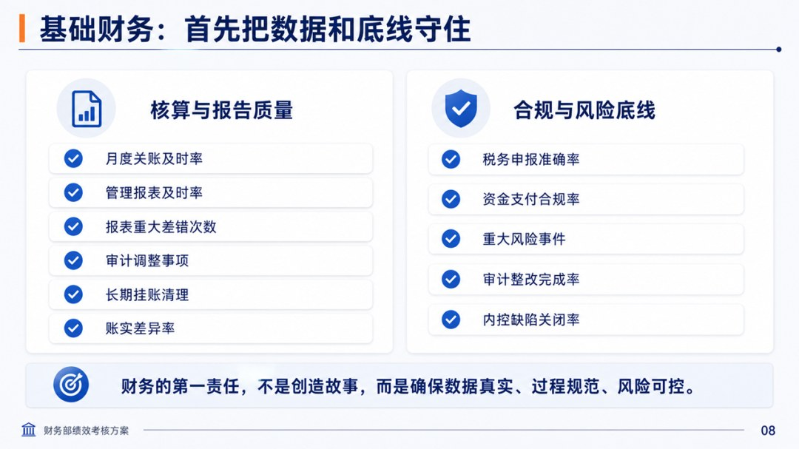

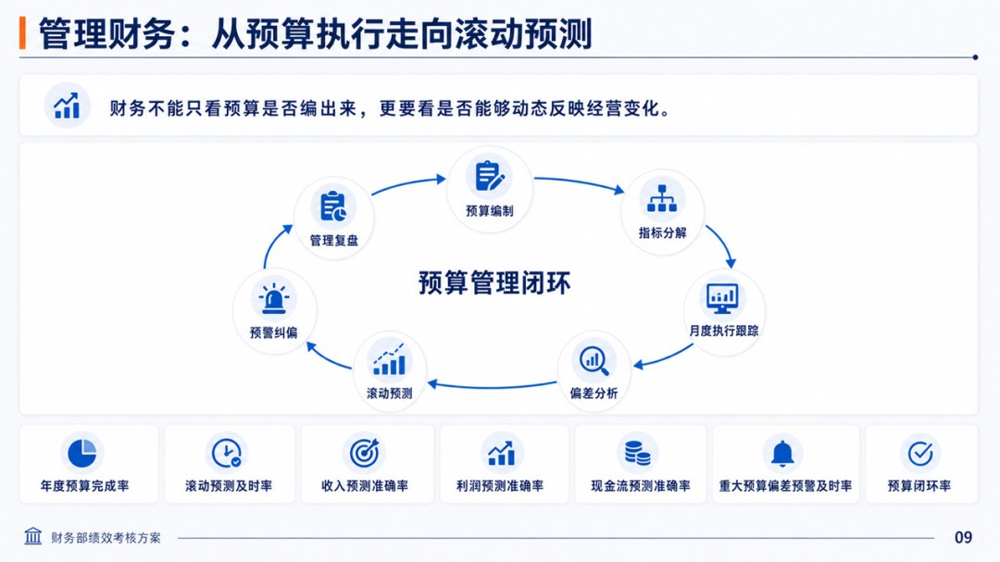

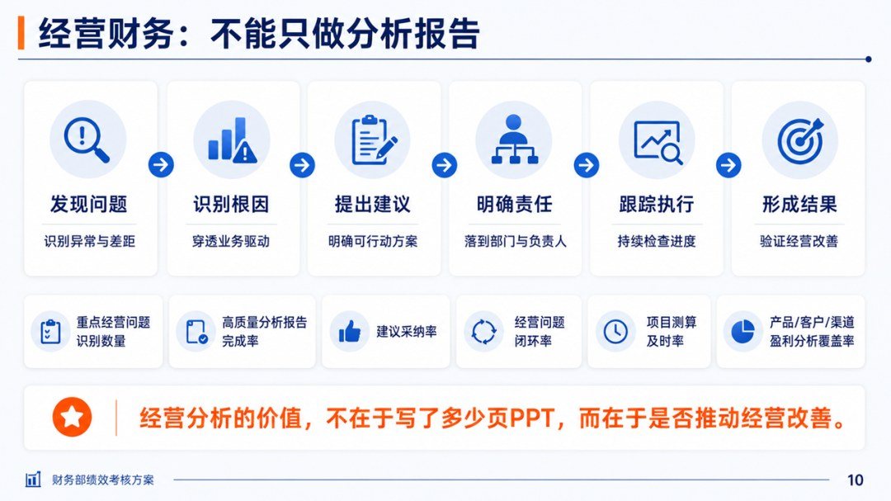

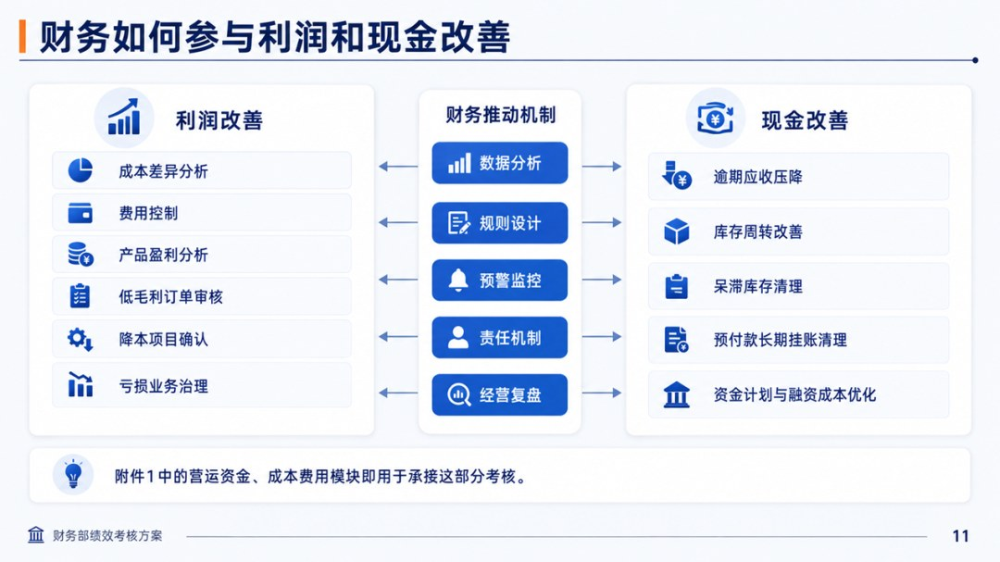

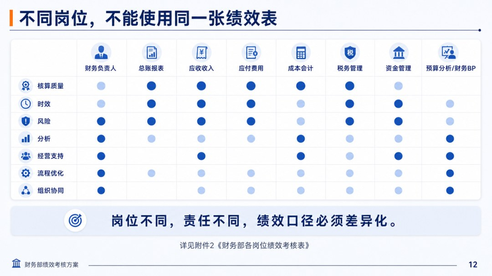

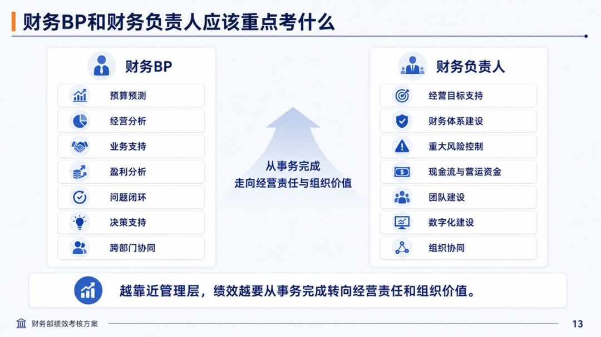

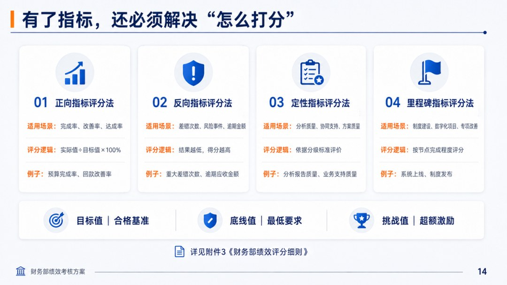

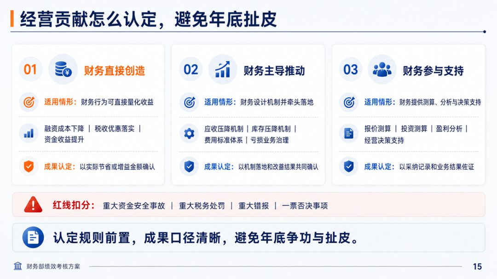

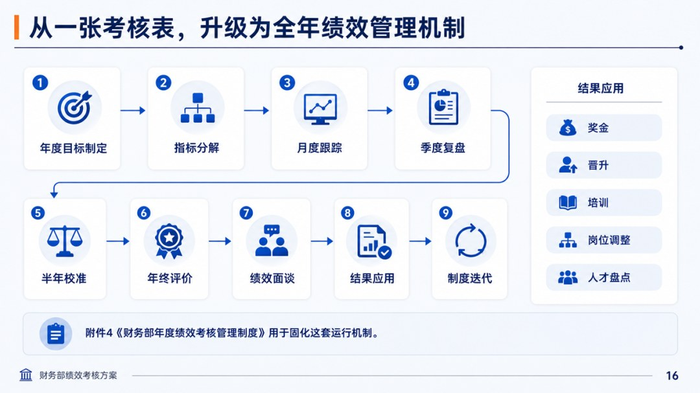

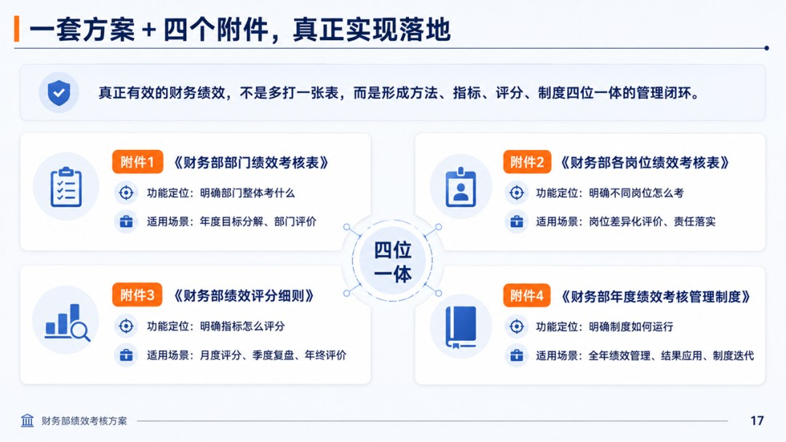

