# 2026年7月应收账款分析报告.pptx

> 来源：微信公众号「数据熊」 · 作者 宋岳清 · 发布于 2026-08-16 08:07  
> 原文链接：http://mp.weixin.qq.com/s?__biz=Mzg2MTg5OTgzNA==&mid=2247500933&idx=1&sn=5aa333b7d32c12bdb3e1cb8c3300caf8&chksm=ce1299d0f96510c6efc634039c47fd8197883ebbdad82981b4ddaad8b6ee8b6ee5b86239c536

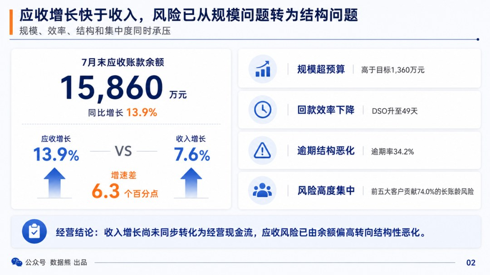

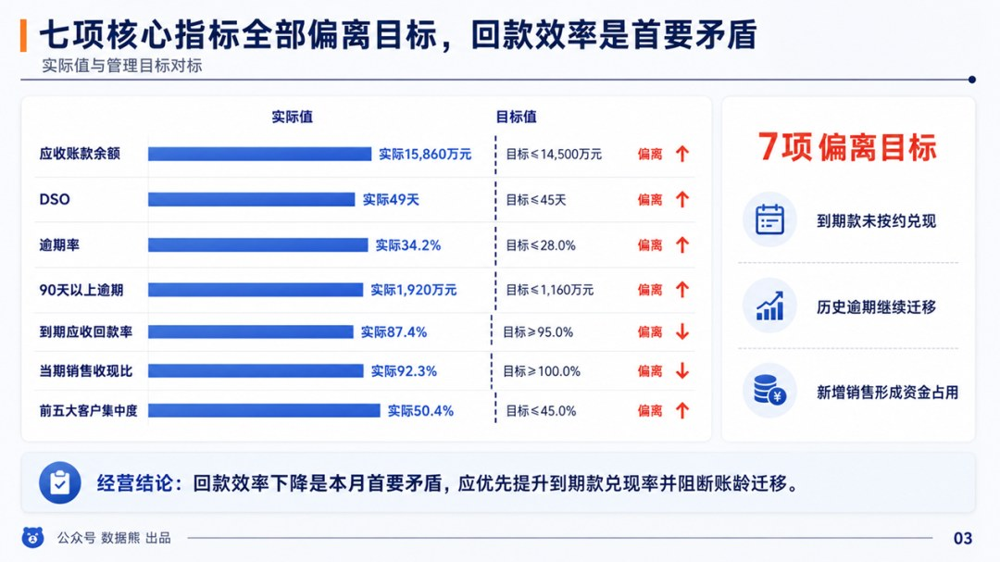

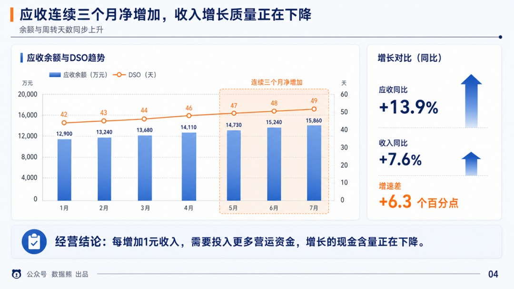

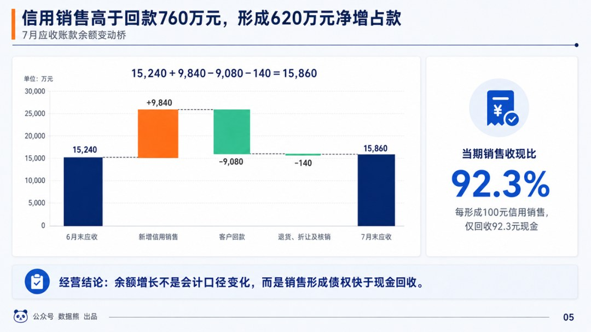

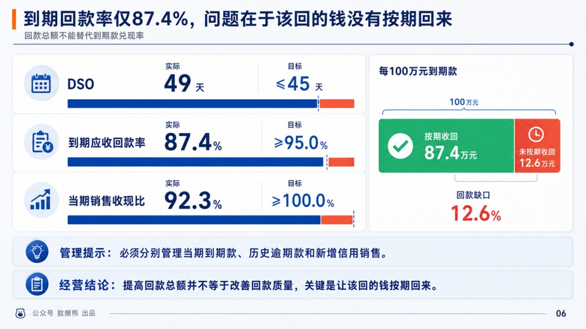

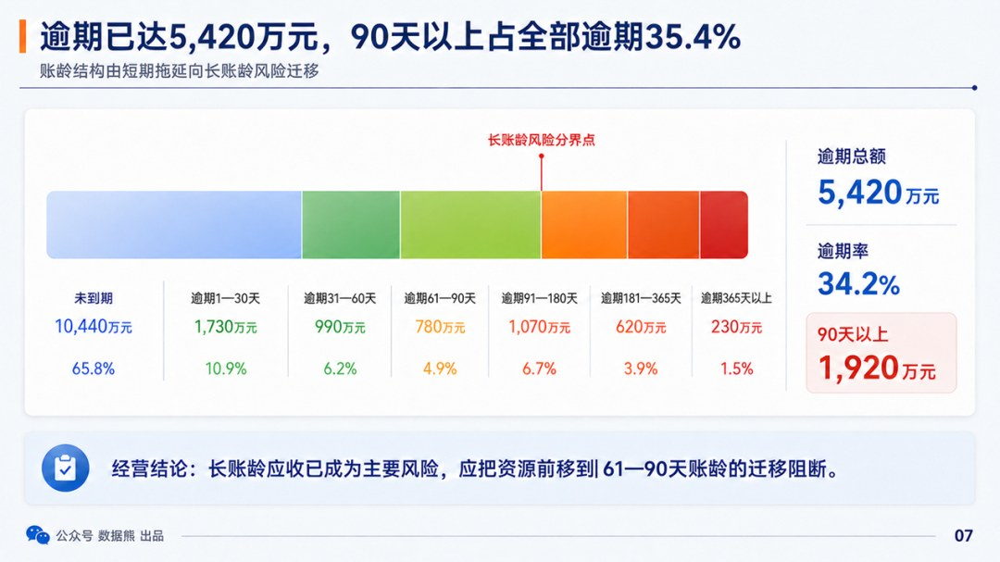

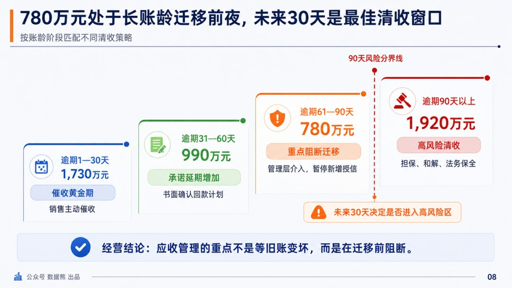

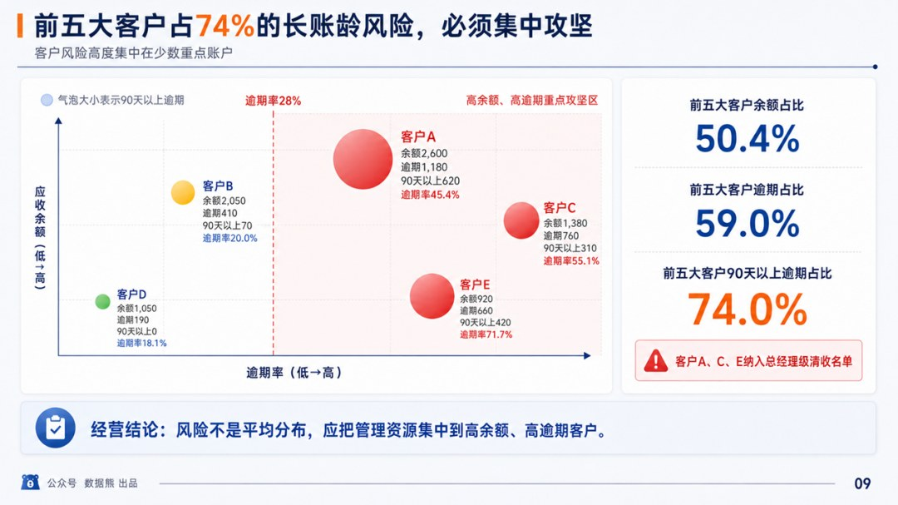

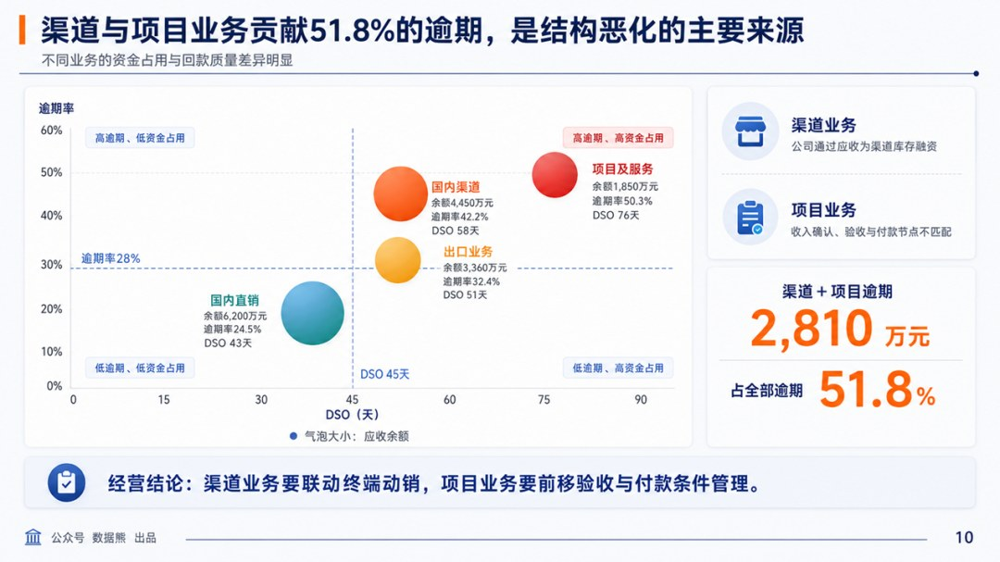

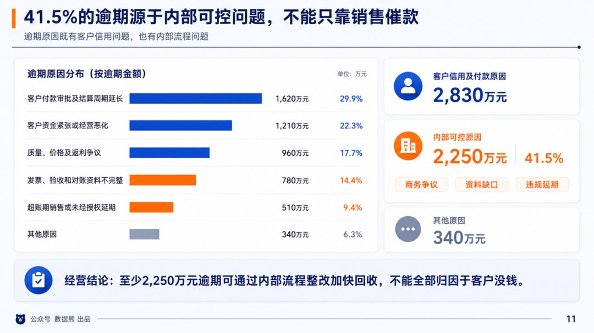

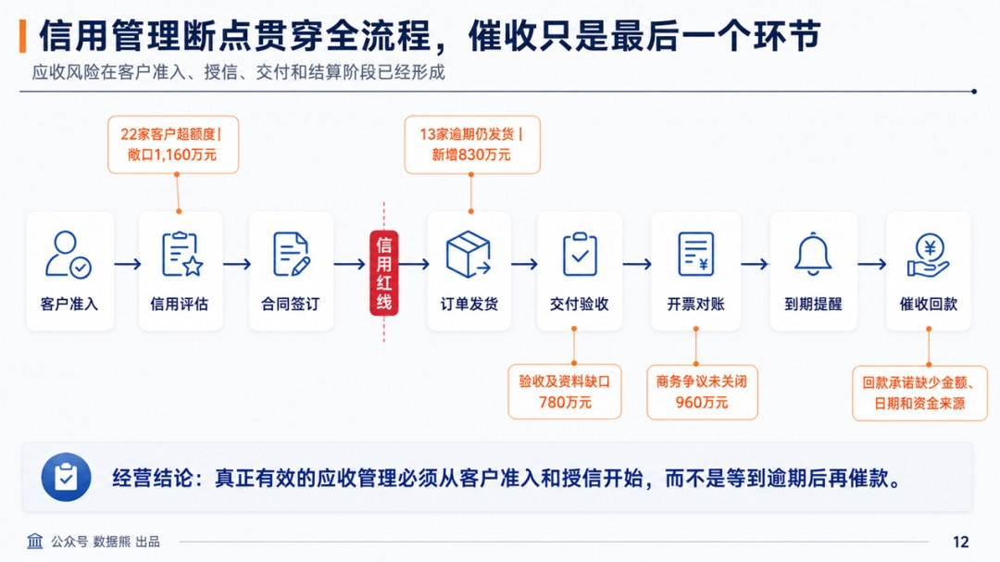

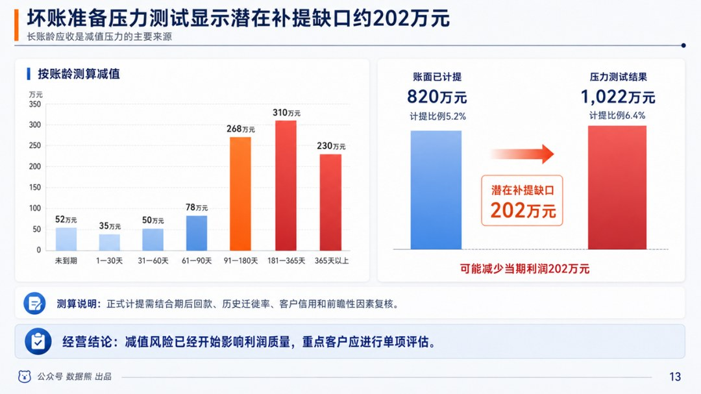

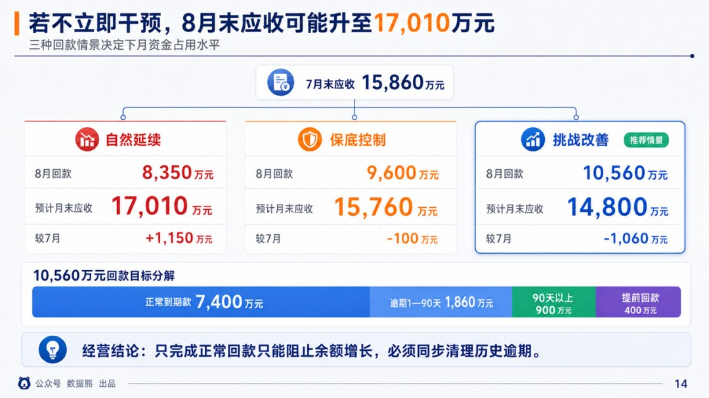

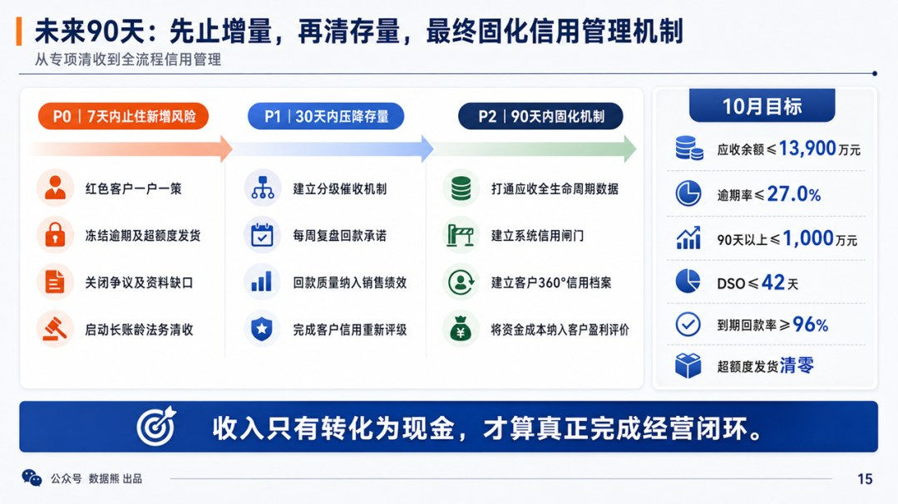

