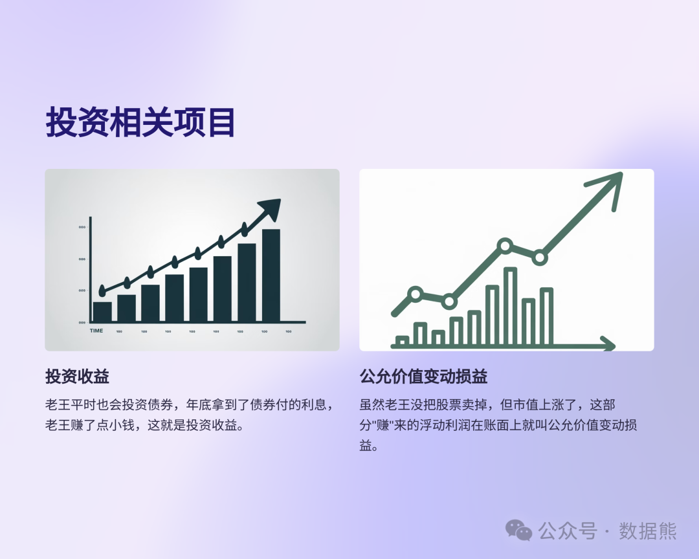

# 利润表大白话

> 来源：微信公众号「数据熊」 · 作者 Data Bear · 发布于 2024-10-07 07:00
> 原文链接：http://mp.weixin.qq.com/s?__biz=Mzg2MTg5OTgzNA==&mid=2247484844&idx=1&sn=e98e9d7efd121fa3c4c385639bfe8435&chksm=ce1158f9f966d1efb21e7b72e9c38e1140d075893a2464d9d61fe2d016a4363361e377fb062f

本文将通过老王开面包店的例子，用通俗易懂的语言解释利润表的各个组成部分。从主营业务收入到净利润，每一项都以生动的方式进行了阐述，让读者能够轻松理解财务报表背后的故事。

关注我，持续分享数据分析及财务相关知识。
