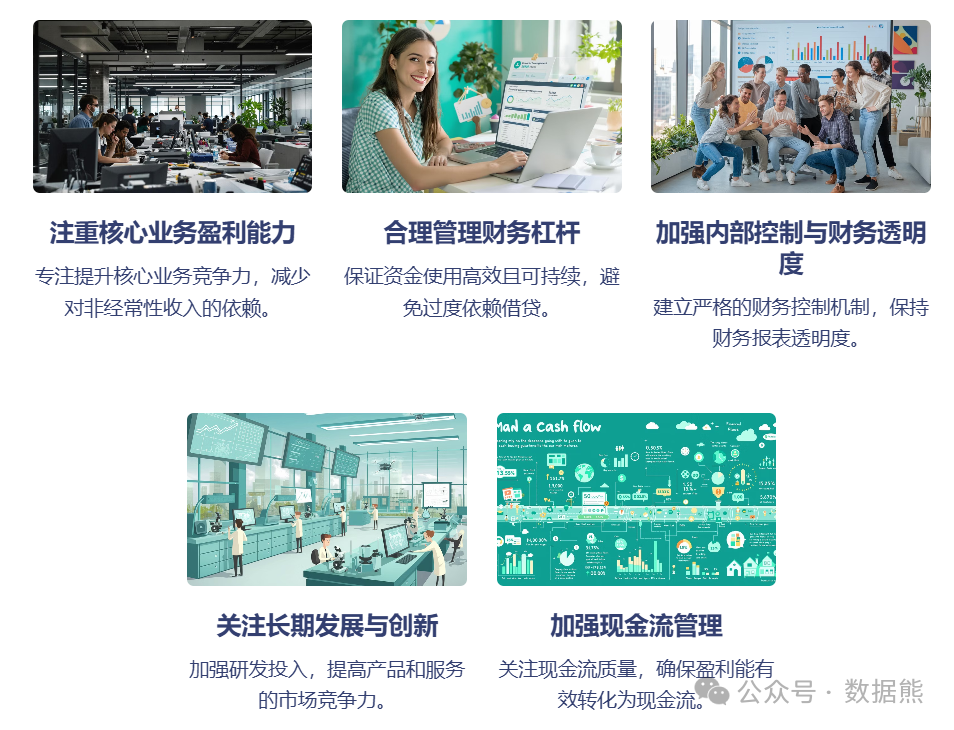

# 净利润，不能只有数量，没有质量

> 来源：微信公众号「数据熊」 · 作者 Data Bear · 发布于 2025-01-30 07:00  
> 原文链接：http://mp.weixin.qq.com/s?__biz=Mzg2MTg5OTgzNA==&mid=2247486838&idx=1&sn=bc3abc65b8a098304ea32036c417124c&chksm=ce115023f966d93528bab36057738aeffc6c67efbaa4fe52505fcfcde393c96409043f5f5e2a

在任何一家企业的财务报表中，净利润无疑是最受关注的数字之一。它是衡量公司经营成果的重要指标，直接影响着股东、投资者、管理层的决策。然而，我们往往忽视了一个关键问题——净利润的质量。

净利润仅仅作为一个数量指标，是否足够准确反映企业的真实盈利能力？是否能够代表企业的可持续增长？如果只看净利润的数量，可能会得出不全面甚至误导性的结论。今天，我们就来聊聊净利润的质量以及如何正确看待和提升净利润的质量。

### **一、净利润的“数量”与“质量”**

净利润是收入减去成本、费用、税费等支出后剩余的部分，通常用于评估企业的经营成果。我们常常看到企业发布财报时，净利润的数量会成为最重要的焦点。但实际上，净利润的质量同样值得关注，甚至更为重要。

净利润的数量

反映的是企业在一定时间内的盈利总额，这是一个“结果”指标，但它并不能全面反映企业的盈利质量。比如，企业如果通过一次性出售资产或获得一次性的政府补助等非经常性收入来增加净利润，那么这部分利润就属于“假性利润”，它不能持续，也不能反映企业正常经营中的真正盈利能力。

净利润的质量

则是指净利润中有多少是来自于企业核心业务的盈利，多少是通过非经常性事件或操作性手段实现的。如果一个企业的净利润大部分来自非核心业务，或者通过财务手段人为增加的，这种净利润的质量就会显得很低。

### **二、净利润“水分”较多的表现**

企业净利润水分过多，可能是以下几种情况：

1. 非经常性收入的贡献过大

    一些企业通过出售资产、投资收益、政府补贴等非经常性方式获得了部分净利润。如果这些非经常性项目占比过大，就意味着公司的核心业务盈利能力并不强。
2. 财务操作手段的影响

    企业通过一些财务操作，如推迟成本支出、提前确认收入等方式，操控财务报表，以提高净利润。这种行为虽然可以短期内提升净利润，但长远来看，会影响财务报表的真实性和公司可持续盈利能力。
3. 负债过高带来的财务费用压力

    通过举债或其他融资方式提升公司短期利润的同时，可能增加了财务费用。如果企业未来无法有效降低负债水平或者继续借新债来偿还旧债，这种短期的利润增长可能转瞬即逝。比如近期暴雷的某科。
4. 管理层短视行为

    有些企业的管理层可能为了完成年度业绩目标而采取过于激进的市场扩张、降低质量控制、或压缩研发投入等手段，最终可能会导致净利润短期内看起来增长，实际上是牺牲了企业长期可持续发展的基础。

### **三、如何提升净利润的质量？**

1. 注重核心业务盈利能力

    企业应专注于提升核心业务的竞争力，打造可持续的盈利模式。对于净利润的来源要有清晰的认识，尽量减少对非经常性收入的依赖，尤其是在财务报表的解读中，需要突出来自主营业务的利润贡献。
2. 合理管理财务杠杆

    企业在利用财务杠杆时，要保证资金的使用是高效且可持续的。高负债并非一成不变的盈利源泉，过度依赖借贷进行扩张可能导致财务风险，影响长期的净利润质量。
3. 加强内部控制与财务透明度

    企业应建立严格的财务控制机制，防止通过财务操作手段人为操控净利润。同时，保持财务报表的透明度，向外界准确反映公司经营的真实情况，避免因虚假利润而导致的市场误判。
4. 关注长期发展与创新

    企业的盈利增长应该依赖于持续的创新和市场拓展，而非短期的资本运作或财务调整。加强研发投入、提高产品和服务的市场竞争力，才能为公司带来稳定的、长期的利润增长。
5. 加强现金流管理

    净利润与现金流并不是完全等同的，净利润的水分过多可能表明现金流存在问题。企业需要关注现金流的质量，确保盈利能够有效转化为现金流，以支撑公司的持续运营和投资。

### **四、结语**

净利润固然是企业经营成果的一个重要指标，但我们不能仅仅停留在“数量”上。净利润的质量，决定了企业的健康状况和未来的可持续发展。作为财务人员或投资者，我们需要更加深入地分析净利润的组成部分，识别出其中的“水分”，并努力提升净利润的质量。通过专注于核心业务盈利、合理使用财务杠杆、加强内部控制和管理现金流，才能真正实现企业的长期增长和稳定收益。

点击左下角

阅读原文

或扫描下方二维码，加入财务成长营，基于财务，高于财务。更多深度阅读，助力您的职业发展。

点赞和转发就是最大的支持，关注数据熊，工作更轻松。
