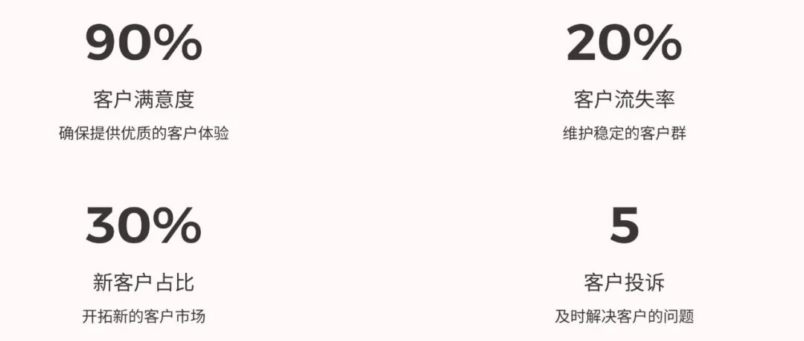
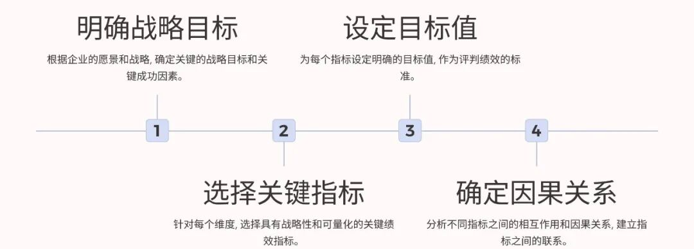
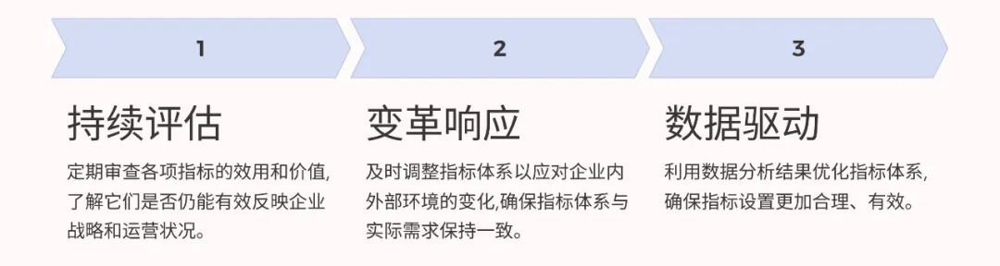

# 基于平衡计分卡的经营分析框架

> 来源：微信公众号「数据熊」 · 作者 Data Bear · 发布于 2024-12-02 07:25
> 原文链接：http://mp.weixin.qq.com/s?__biz=Mzg2MTg5OTgzNA==&mid=2247485703&idx=1&sn=abf974bab627eee1596b90240e4a94fc&chksm=ce115452f966dd44ab28682e89c0e3d997f646a43841728df468eac9ef8f0fd839ab26b26298

平衡计分卡（Balanced Scorecard, BSC）是将企业战略目标转化为具体的行动指标的工具。基于平衡计分卡的经营分析框架，可以帮助企业从多个维度全面洞察运营情况，确保战略目标的有效执行。

以下内容将从框架设计、指标设置、应用流程和案例分析四个方面，详细阐述如何搭建基于平衡计分卡的经营分析框架。

---

### **一、基于平衡计分卡的框架结构**

平衡计分卡从以下四个维度展开经营分析：

1. 财务维度
2. 客户维度
3. 内部流程维度
4. 学习与成长维度

---

### **二、基于平衡计分卡的关键指标设计**

为每个维度设计具体的关键指标（KPI），确保全面反映企业表现。

#### **1. 财务维度**

- 收入增长率
   ：评估市场扩展能力。
- 毛利率/净利率
   ：衡量成本控制和盈利能力。
- 资产周转率
   ：反映资产利用效率。
- 现金流状况
   ：确保企业资金链健康。

#### **2. 客户维度**

- 客户满意度
   ：通过问卷或评分机制获得。

   高满意度是客户忠诚度的基础，也是口碑营销的关键。
- 客户获取成本（CAC）
   ：评估营销投入效率。

   降低CAC可提高利润率，但需平衡客户质量。
- 客户留存率
   ：衡量客户粘性。
- 市场占有率
   ：监控竞争地位

   。
   高留存率和市占率表明企业具有持续竞争优势。

#### **3. 内部流程维度**

- 订单履约率
   ：反映订单交付的及时性和准确性。
- 库存周转天数
   ：评估库存管理效率。
- 缺陷率
   ：衡量生产或服务质量。
- 创新产品收入占比
   ：反映产品开发能力。

#### **4. 学习与成长维度**

- 员工培训覆盖率
   ：评估培训体系的完善程度。
- 员工流失率
   ：衡量员工满意度与稳定性。
- 技术升级投入比
   ：反映技术创新能力。
- 知识管理系统使用率
   ：监控组织学习效果。

---

### **三、基于平衡计分卡的经营分析流程**

#### 1. **明确战略目标**

将企业的总体战略转化为平衡计分卡的具体目标。例如：

- 战略目标：提升市场份额。
- 转化目标：提高客户满意度、扩展市场覆盖率。

#### 2. **构建指标体系**

根据每个维度的目标设计具体的KPI，确保指标与战略目标一致。

#### 3. **数据收集与分析**

- 通过ERP系统、CRM系统或BI工具收集数据。
- 借助分析工具（如Power BI、Excel）对指标数据进行整理和可视化。

#### 4. **评估与反馈**

- 定期对各维度指标进行评估。
- 根据分析结果调整业务策略，如优化低效流程或调整资源配置。

#### 5. **动态调整**

经营环境动态变化，需要持续优化平衡计分卡框架。例如：

- 增加环境、社会与治理（ESG）相关指标。
- 根据市场变化调整客户维度的目标。

### **四、案例：某制造企业的平衡计分卡经营分析框架**

#### 背景

一家制造企业希望通过平衡计分卡提升内部流程效率和市场竞争力。

#### 分析框架

| **维度** | **目标** | **关键指标** |
|---|---|---|
| **财务维度** | 提升盈利能力 | 净利率、单位成本、现金流 |
| **客户维度** | 提高客户满意度与粘性 | 客户满意度、订单增长率 |
| **内部流程维度** | 优化供应链与生产效率 | 缺陷率、库存周转天数 |
| **学习与成长维度** | 提升员工技能与技术创新能力 | 员工培训完成率、技术投入比 |

#### **分析结果**

- 财务维度
   ：净利率提升5%，现金流持续改善。
- 客户维度
   ：客户满意度从75%提升至85%，但市场份额略有下降。
- 内部流程维度
   ：库存周转天数从60天降至45天，生产缺陷率下降2%。
- 学习与成长维度
   ：技术投入增长10%，但员工流失率稍有上升。

#### **改进措施**

1. 增加对市场营销的投入，提升市场份额。
2. 进一步优化生产流程，降低单位成本。
3. 增强员工激励机制，降低流失率。

---

### **五、基于平衡计分卡框架的优势与挑战**

#### 优势

1. 全面性
    ：涵盖财务与非财务指标。
2. 战略对齐
    ：将战略目标转化为可执行指标。
3. 灵活性
    ：可根据企业需求定制化。

#### 挑战

1. 数据收集复杂
    ：需要整合多个系统。
2. 指标设计难度
    ：需平衡全面性与实用性。
3. 动态调整压力
    ：市场变化要求框架不断更新。

### **六、总结**

基于平衡计分卡的经营分析框架，不仅是一个绩效管理工具，更是一个战略执行和优化路径的导航器。通过合理设计指标、动态调整框架，企业能够更加精准地洞察经营状况，从而在激烈的市场竞争中占据有利位置。

> 励志名言
>
> “管理好看得见的数字，优化好看不见的驱动力，这就是经营的艺术。”

点赞、关注就是最大的支持，私信可获得经营分析模板。
