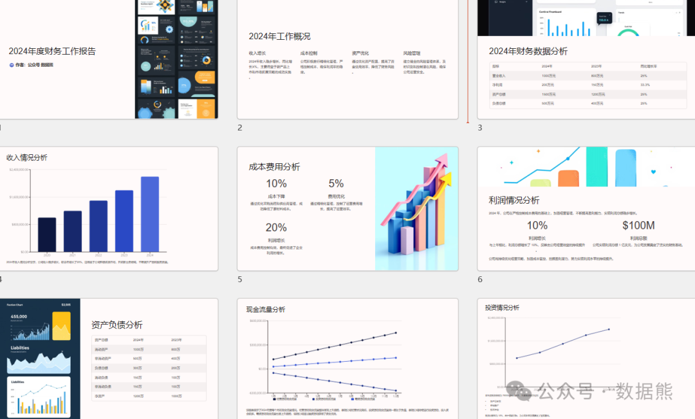

# 财务年度工作报告经典模板

> 来源：微信公众号「数据熊」 · 作者 Data Bear · 发布于 2024-12-21 13:16  
> 原文链接：http://mp.weixin.qq.com/s?__biz=Mzg2MTg5OTgzNA==&mid=2247486311&idx=1&sn=cbcc46dc2424805a6881f745fb260568&chksm=ce115632f966df247e1c58e0f89f8fa6e74e2d5fe57e2832b5b7aced88d5834a0f5a52a82f52

年度财务工作报告是总结成绩、分析问题、规划未来的关键工具。本篇文章为您呈现一份经典的财务年度工作报告模板，助力您高效总结和展望！（文末领取ppt模板）

---

#### **一、报告概述**

#### 1. **报告背景**

- 内外部环境概述
   ：

   总结当前宏观经济形势、行业发展趋势及政策变化，例如经济增长放缓、行业竞争加剧或政府税收政策调整等。

   > 示例：2024 年，随着国内经济复苏，消费升级趋势明显，企业竞争日益激烈。面对市场挑战，财务部门积极调整策略，优化内部管理，支持企业实现稳健发展。
- 企业整体财务目标
   ：

#### **2. 报告框架**

简要概括本报告内容：

- 第一部分：财务数据总结，回顾关键指标完成情况
- 第二部分：部门工作亮点，展示具体项目成果
- 第三部分：问题与挑战分析，明确改进方向
- 第四部分：未来规划与发展策略

---

### **二、年度财务工作总结**

#### **1. 核心财务数据回顾**

以数据为主线，清晰展示关键指标的完成情况：

- 营业收入
   ：全年累计收入达
   XX亿元
   ，同比增长
   X%
   ；其中 XX 产品线贡献了 XX% 的增长。
- 净利润
   ：净利润为
   XX亿元
   ，同比提升
   X%
   ，显示出企业盈利能力的增强。
- 毛利率与净利率
   ：毛利率提升至
   XX%
   ，净利率保持稳定在
   XX%
   。
- 现金流状况
   ：经营活动净现金流同比增长
   XX%
   ，现金流健康度显著提高。

> 示例图表：2024 年主要财务指标对比图

#### **2. 工作亮点**

结合部门工作实际，列出具体的成果与亮点：

- 预算管理
   ：

   2024 年度预算执行率达
   XX%
   ，超过既定目标；各部门预算协同效果良好。
- 成本管控
   ：

   成功优化生产流程，降低单位产品成本
   XX%
   ，全年节省费用
   XX万元
   。
- 融资与投资
   ：

   完成
   X亿元
    的低息贷款融资，用于新产品研发及产能扩张；投资收益率达
   XX%
   。

#### 3. **财务支持业务案例**

- 为市场部制定精确的营销预算，实现重点市场收入增长
   XX%
   。
- 与采购部门合作，通过供应商谈判节省采购成本
   XX万元
   。
- 协助 IT 部门实施财务数字化系统，提高报表生成效率
   XX%
   。

---

### **三、问题与挑战分析**

#### **1. 内部问题**

- 预算执行差异
   ：部分业务线实际开支超预算
   XX%
   。
- 应收账款问题
   ：回款周期由
   XX天
    增长至
   XX天
   ，对现金流管理造成压力。
- 成本压力增加
   ：原材料价格波动显著，直接成本上升
   XX%
   。

#### **2. 外部挑战**

- 政策变动
   ：2024 年新税收政策出台，导致税务筹划难度增加。
- 市场竞争
   ：行业内价格战愈演愈烈，进一步压缩毛利率空间。

---

### **四、财务指标深度分析**

#### **1. 纵向对比：历史数据分析**

- 三年收入趋势
   ：XX% 的年均复合增长率反映出稳健增长态势。
- 净利率波动
   ：从
   XX%
    提升至
   XX%
   ，表明盈利能力持续优化。

#### **2. 横向对比：行业数据分析**

- 企业毛利率
   XX%
    高于行业均值
   XX%
   ，在成本控制上表现突出。
- 应收账款周转天数
   XX天
   ，略高于行业平均值，需加强回款效率。

#### **3. 关键指标细化**

- 费用率结构
   ：销售费用、管理费用、研发费用占收入的比例分别为
   XX%、XX%、XX%
   ，均保持合理水平。
- 资本结构优化
   ：资产负债率由
   XX%
    降至
   XX%
   ，财务风险进一步降低。

---

### **五、未来规划与重点工作**

#### **1. 目标设定**

- 盈利目标
   ：净利润增长目标定为
   XX%
   。
- 现金流目标
   ：确保经营活动现金流达到
   XX亿元
   。
- 成本优化目标
   ：降低单位产品成本
   XX%
   。

#### **2. 行动计划**

- 强化预算管理
   ：通过数字化系统实施动态预算调整，提升预算准确率。
- 提升回款效率
   ：建立重点客户信用评级体系，缩短回款周期
   XX天
   。
- 推动数字化转型
   ：引入 Power BI 等智能工具，实现实时数据分析，提高决策效率。
- 优化资本结构
   ：进一步降低债务融资成本，拓展多元化融资渠道。

---

### **六、总结与展望**

2024 年的财务工作圆满落幕，我们交出了值得骄傲的成绩单，也清晰地看到了未来的努力方向。2025 年，财务部门将以更加积极的态度和创新的思维，助力企业在复杂多变的市场环境中行稳致远。

展望

- 持续打造财务透明化、数字化的管理模式
- 聚焦核心业务，为企业创造更多价值
- 在稳健发展中探索新增长点

点赞、转发是最大的支持，关注数据熊，可获得ppt模板。
