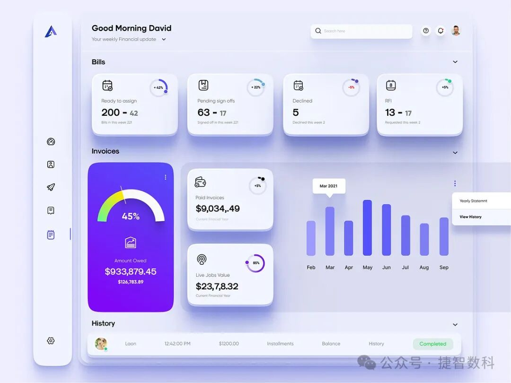
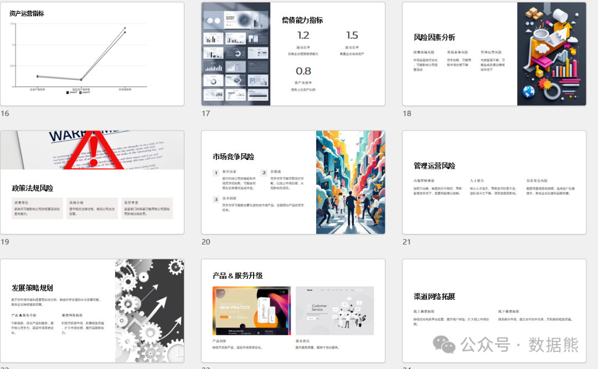

# 总经理2024年度工作总结及2025年工作计划（典型话术、免费ppt模板）

> 来源：微信公众号「数据熊」 · 作者 Data Bear · 发布于 2024-12-24 07:00
> 原文链接：http://mp.weixin.qq.com/s?__biz=Mzg2MTg5OTgzNA==&mid=2247486321&idx=1&sn=fa752918f7de0b9a66507b637088da54&chksm=ce115624f966df32be7709711245e71223f28d62539df93e9e6a5ffd30ad0d6a60c0d92cea45
> 摘要：关注数据熊，工作更​敏捷

#### **一、2024年度工作总结**

尊敬的各位领导、亲爱的同事们：

大家好！在过去的一年里，我们齐心协力，迈过了一个又一个的难关，迎接了新的机遇，取得了令人振奋的成绩。今天，我在这里与大家一起回顾2024年的工作，并展望未来的发展方向。（
文末可免费领取精美经营分析ppt模板
）

##### 1. **战略目标与市场拓展**

2024年是公司战略规划实施的关键一年。我们牢牢把握市场趋势，积极拓展业务，推动了多项战略目标的实现。

- 市场开拓
   ：我们成功进入了东南亚、新兴市场，并进一步巩固了国内市场的领先地位，市场份额较去年增加了10%。特别是在部分核心区域，我们通过加大市场推广力度和加强客户关系管理，实现了区域市场占有率的提升。新客户增长率达到12%，并与多家战略合作伙伴达成了长期合作协议，为公司的未来发展奠定了坚实基础。
- 品牌建设
   ：通过系列品牌活动、媒体宣传和行业展会的参与，我们提升了品牌的市场认知度。我们的品牌形象已经逐步走向国际化，成为行业内知名的品牌之一。

##### **2. 财务表现**

过去一年，我们的财务状况稳中有升，收入、利润均实现了预期增长。

- 营收增长
   ：公司2024年营业收入增长了15%，这一增长来自于新产品的销售、市场份额的提升以及服务的优化。尤其是我们新推出的两款产品，不仅满足了市场需求，还为公司带来了可观的收入。
- 成本控制与效率提升
   ：我们在精细化成本管理方面下了大功夫。通过优化生产工艺、加强供应链管理和提高工作效率，生产成本下降了5%。这种成本管控措施让我们在保持产品质量的同时，进一步提升了毛利率。
- 利润增长
   ：在收入增长的同时，我们的净利润同比增长了20%。这主要得益于我们在运营中提高了效率、降低了冗余成本，同时在核心业务领域实现了更高的利润率。

##### **3. 运营管理**

在过去的一年里，我们加强了内部管理的各个环节，推动了生产力的提升和流程的优化。

- 生产效率
   ：通过引入智能制造设备和自动化生产线，我们的生产效率提升了15%。同时，生产周期得到缩短，交货期更加精准，客户的满意度得到了大幅提升。
- 供应链管理
   ：我们进一步深化了供应链的合作关系，优化了库存管理，确保了原材料供应的稳定性和成本的最优化。通过这些努力，我们减少了库存积压，提升了资金周转效率。
- 质量管控
   ：质量始终是我们公司的生命线。过去一年，我们加强了质量控制体系，提升了产品的生产标准化，客户投诉率下降了10%，客户的满意度提升了8%。

##### **4. 团队与人力资源管理**

人才是公司发展的关键。2024年，我们在团队建设方面持续发力，取得了不错的成果。

- 人才引进与培训
   ：我们加大了人才引进力度，引进了多名行业顶尖人才，进一步增强了公司在技术研发、市场拓展、管理优化等方面的实力。同时，我们通过内部培训和外部学习机会，提升了员工的技能水平，整体员工素质得到了有效提升。
- 员工关怀
   ：我们注重员工的职业发展和福利待遇，员工流失率保持在行业平均水平以下。通过优化薪酬结构、完善激励措施，我们让员工的工作热情和忠诚度得到了极大的提升。

##### **5. 风险管理**

过去一年，我们在风险管控方面也做了大量工作，确保公司在复杂的外部环境中始终能够稳健运营。

- 市场风险管控
   ：针对经济波动、市场竞争等外部风险，我们建立了完善的风险预测机制和应急预案，在多个方面采取了有效的预防措施。特别是对原材料价格波动和市场需求变化的预测，为公司提供了应对策略。
- 合规性和法律风险
   ：公司在法律合规方面做了更细致的工作，强化了对法律法规的学习和执行，确保公司每一项业务都符合国家和行业的相关规定。

#### **二、2025年工作计划**

展望2025年，我们面临着更大的挑战和更高的期望。在此，我将详细阐述公司未来一年的工作计划，明确我们的目标与行动方向。

##### **1. 市场拓展与品牌提升**

- 加强国际化布局
   ：2025年，公司将重点推进国际市场的拓展，尤其是东南亚、欧洲和北美市场。我们计划在2025年增加至少10%的海外市场份额，通过加强本地化运营，提升品牌在全球的影响力。
- 品牌价值提升
   ：我们将加大品牌营销投入，通过线上线下相结合的营销活动，提升品牌的认知度和美誉度。特别是在行业展会、社交媒体平台上的投入将进一步提升品牌曝光度。

##### **2. 产品创新与技术研发**

- 加大研发投入
   ：产品创新是公司持续发展的核心动力。2025年，我们计划加大对研发的资金支持，重点研发三款新产品，并在现有产品的基础上进行技术优化，提升产品附加值。新产品的推出将进一步增强公司在市场中的竞争力。
- 智能制造升级
   ：我们将在生产流程中进一步引入人工智能、大数据分析和物联网技术，提升生产效率、降低成本，并通过智能化的手段实现个性化定制，满足不同客户的需求。

##### **3. 财务管理目标**

- 收入与利润增长
   ：2025年，我们将设定营收增长目标18%，预计通过市场拓展、新产品的销售以及成本控制，实现净利润15%的增长。
- 精细化资金管理
   ：公司将进一步加强现金流和成本的管控，确保资金的安全性与流动性，为未来的发展提供充足的资金保障。

##### **4. 运营效率提升**

- 流程优化与自动化
   ：我们将继续推进流程优化，进一步提升生产线的自动化水平，预计在生产效率方面再提升10%。
- 精益生产
   ：在2025年，我们将全面推广精益生产管理，减少生产过程中的浪费，提升生产线的响应速度和灵活性，从而更好地满足市场需求。

##### **5. 团队建设与人才发展**

- 人才引进与培养
   ：公司将继续加大高端技术和管理人才的引进力度，特别是针对数字化转型和国际化市场的需要，引进更多行业顶尖人才。同时，我们将持续进行员工培训，提升团队的整体能力。
- 员工激励与福利
   ：我们将继续优化激励机制，提升员工的工作热情，并注重员工的工作与生活平衡，进一步改善员工的福利待遇，提高员工的满意度和忠诚度。

##### **6. 风险管控与合规管理**

- 加强风险预警机制
   ：在面对复杂多变的市场环境时，我们将进一步完善公司的风险管理体系，建立更精准的风险预警机制，确保及时响应市场变化。
- 强化合规管理
   ：2025年，公司将继续加强合规管理，确保在所有业务环节中都能遵循法律法规，避免因合规问题带来的风险。

#### **三、总结与展望**

回顾2024年，我们取得了一定的成绩，但未来仍充满挑战。2025年，我们将继续秉承“创新、务实、团队、共赢”的价值观，不断提升核心竞争力，打造更加稳健、创新、具有全球视野的企业。

我相信，在大家的共同努力下，我们必定能够迎接未来的机遇，战胜挑战，实现更大的跨越！

留言、私信可免费领取上图ppt模板。

点赞、转发是最大的支持，关注数据熊，工作更敏捷。
