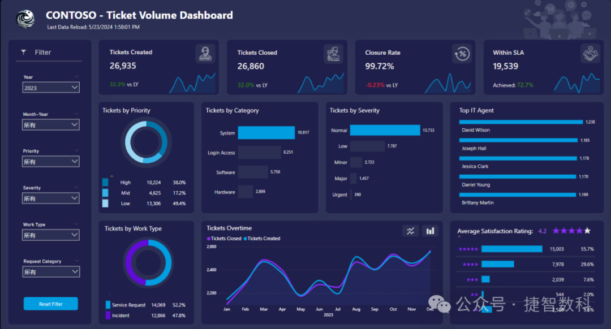
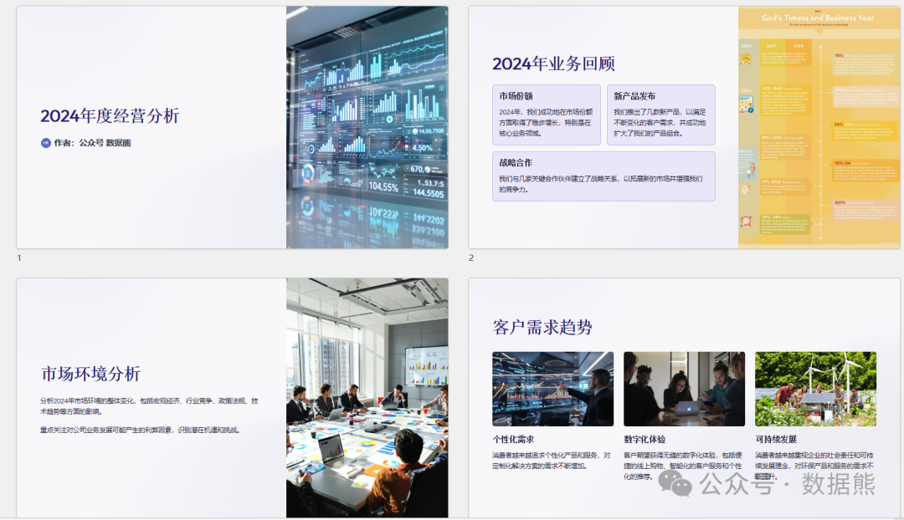

# 经营分析报告模板（含PPT模板）

> 来源：微信公众号「数据熊」 · 作者 Data Bear · 发布于 2025-01-14 20:51  
> 原文链接：http://mp.weixin.qq.com/s?__biz=Mzg2MTg5OTgzNA==&mid=2247486538&idx=1&sn=3e7a04ec6c4d4b36706854333c620c94&chksm=ce11511ff966d809468c2e522823e4e1a994f9a3802c4094b58645538805b0fac2a7d5c070cf

#### 各位伙伴很是抱歉，之前因为完读率比较低，被腾讯断了流量，为了尽快恢复流量好多粉丝之前收藏的长文被我删掉了，今天重新发出来供大家参考使用。为提高完读率，本文进行了大幅改写，案例版内容及可编辑版本的点击文末阅读全文可获得。

#### **一、公司经营概况**

1. 年度经营总结
2. 行业与市场环境

---

#### **二、收入分析**

1. 收入结构分析
2. 增长驱动力分析

---

#### **三、成本与费用分析**

1. 成本构成与变化
2. 费用分析

---

#### **四、盈利能力分析**

1. 盈利指标分析
2. 盈利影响因素

---

#### **五、运营效率分析**

1. 资产运营效率
2. 现金流管理

---

#### **六、市场与竞争分析**

1. 市场表现
2. 竞争对手分析

---

#### **七、问题诊断与风险评估**

1. 经营问题诊断
2. 风险评估

---

#### **八、改进措施与未来规划**

1. 短期改进措施
2. 中长期规划

点击左下角

阅读全文

，可获得案例版经营分析模板、精美

可编辑的经营分析PPT模板。关注数据熊，知识更简单。
