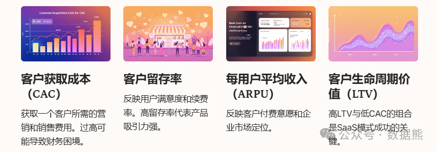
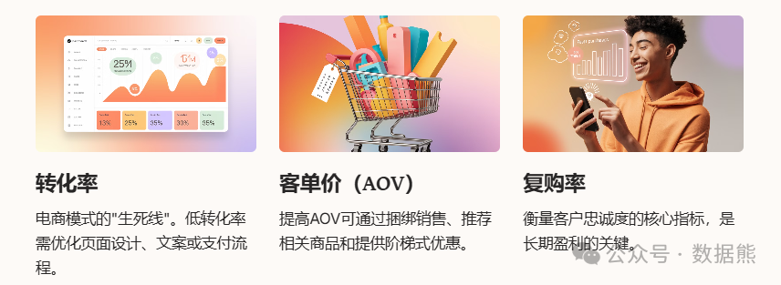
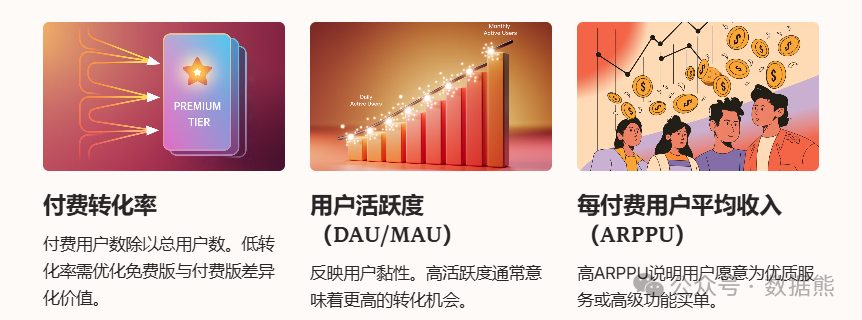
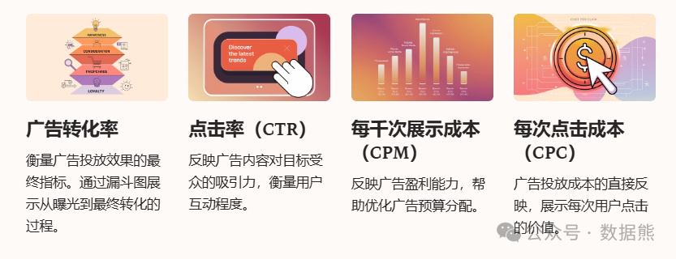
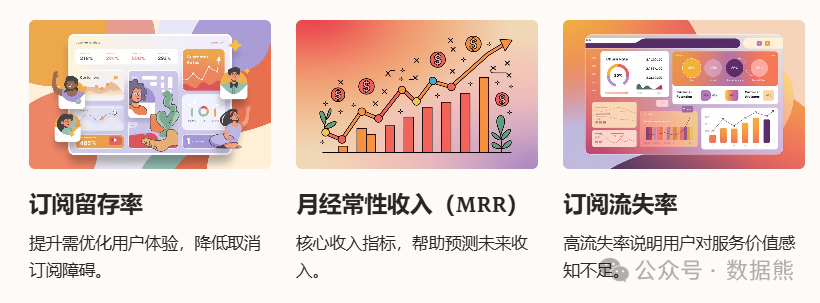
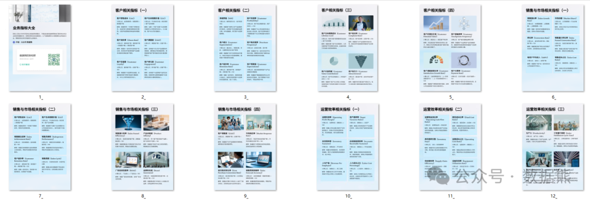

# 不同商业模式下的关键业务指标

> 来源：微信公众号「数据熊」 · 作者 Data Bear · 发布于 2025-01-26 10:01  
> 原文链接：http://mp.weixin.qq.com/s?__biz=Mzg2MTg5OTgzNA==&mid=2247486760&idx=1&sn=4a8b496a597a2c269dc5d68a8a9ac570&chksm=ce11507df966d96b512108a6d807496d3f81fa8ed13edcddb4190aaf251b458b7d8ff50d2b02
> 摘要：\x26quot;数据不是万能的，但没有数据，你连正确的方向都摸不着。\x26quot;

商业模式是企业运转的核心，而关键指标（Key Metrics）则是每种商业模式的“健康体检表”。那么，不同的商业模式下，关键指标各不相同，你真的抓对了吗？今天，咱们就聊聊几种常见商业模式下那些关键的“数字密码”。

---

### **一、SaaS模式：以客户为中心，留住用户是王道**

SaaS（软件即服务）
 企业主要依赖订阅收入，客户的长期留存和持续付费是核心。以下几个指标能精准衡量SaaS业务的健康状况：

1. 客户获取成本（Customer Acquisition Cost，CAC）
2. 客户留存率（Retention Rate）
3. 每用户平均收入（Average Revenue Per User，ARPU）
4. 客户生命周期价值（Customer Lifetime Value，LTV）

---

### **二、电商模式：从流量到转化，数字背后的经营秘密**

电商的成功在于高效地将流量转化为订单，同时提升每个订单的价值。以下几个指标尤为重要：

1. 转化率（Conversion Rate）
2. 客单价（Average Order Value，AOV）
3. 复购率（Repeat Purchase Rate）
4. 购物车放弃率（Cart Abandonment Rate）

---

### **三、免费增值模式（Freemium）：从免费到付费的转化艺术**

在免费增值模式下，核心策略是将免费用户转化为付费用户，同时扩大活跃用户基础：

1. 付费转化率（Free-to-Paid Conversion Rate）
2. 用户活跃度（Daily/Monthly Active Users，DAU/MAU）
3. 每付费用户平均收入（ARPPU）

---

### **四、广告驱动模式：点击与曝光的精细化运营**

广告驱动模式常见于媒体、搜索引擎和社交平台。以下几个指标能够帮助企业衡量广告收入的有效性：

1. 每千次展示成本（Cost Per Mille，CPM）
2. 点击率（Click-Through Rate，CTR）
3. 每次点击成本（Cost Per Click，CPC）
4. 广告转化率（Ad Conversion Rate）

---

### **五、订阅模式：稳定收入的背后靠续费**

订阅模式类似于SaaS，但更注重长期稳定的收入来源。关键指标包括：

1. 订阅留存率（Subscription Retention Rate）
2. 月经常性收入（Monthly Recurring Revenue，MRR）
3. 订阅流失率（Churn Rate）

---

### **六、总结：找到适合自己的指标，让数据“开口说话”**

不同的商业模式对关键指标的关注点不同，但有一个共同点：关键指标的选择一定要
结合企业的发展阶段和核心目标
。无论你处在哪个行业、拥有什么商业模式，以下几点都是选对关键指标的基础：

- 关注能直接反映业务目标的核心数据。
- 定期复盘和调整指标，跟随业务变化动态优化。
- 让团队对这些指标有统一的理解和目标感。

数据熊为大家准备了业务指标大全，涉及7个模块、149个指标，扫描下方二维码或店家文末左下角
阅读全文
获取。

点赞和转发是最大的支持，关注数据熊，工作更轻松。
