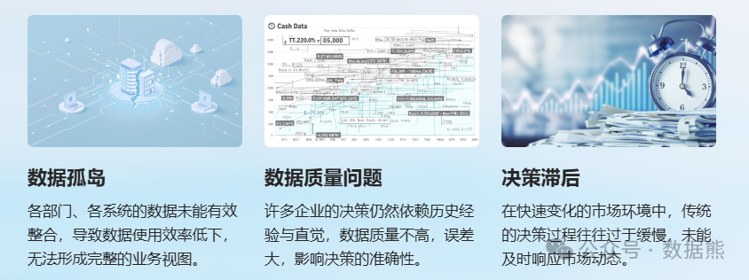
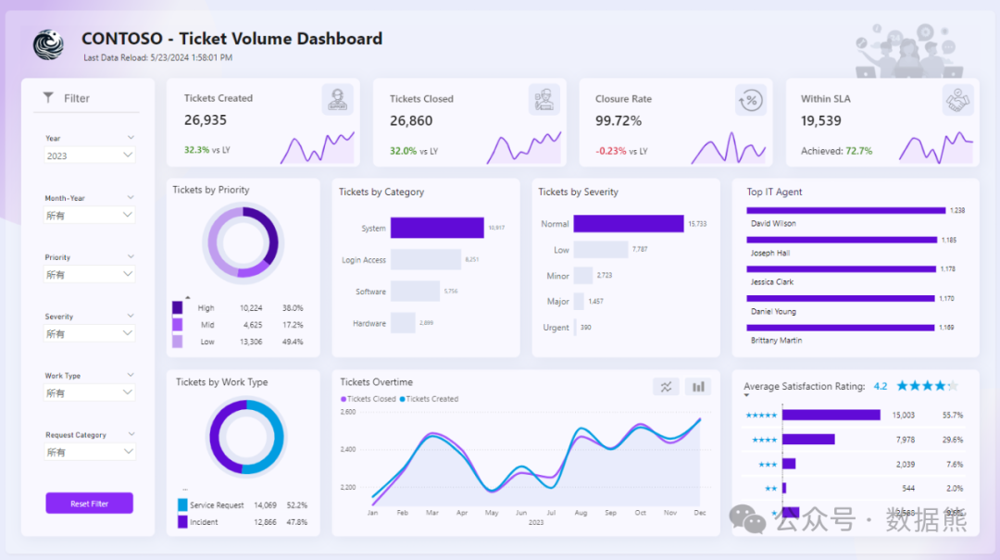
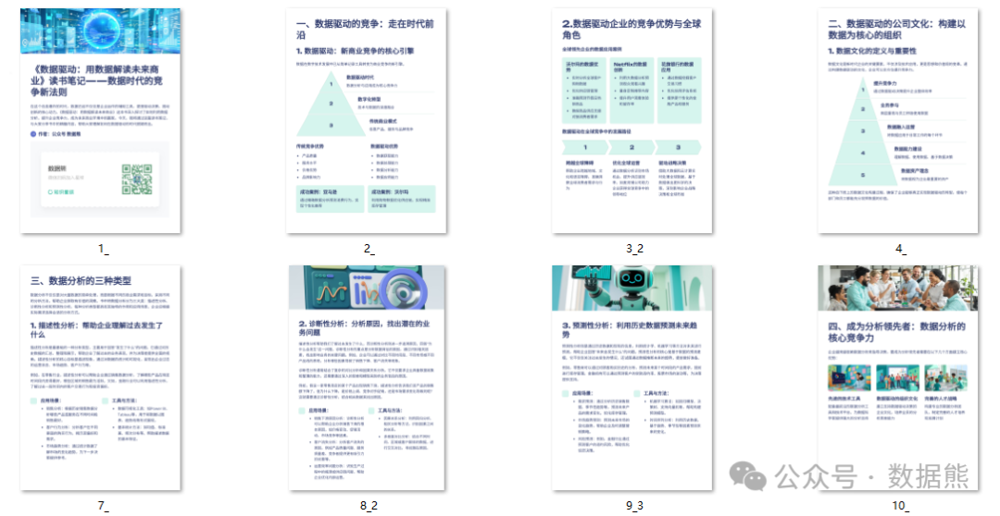

# 数据驱动的经营分析：理论与实践

> 来源：微信公众号「数据熊」 · 作者 Data Bear · 发布于 2025-01-27 07:00  
> 原文链接：http://mp.weixin.qq.com/s?__biz=Mzg2MTg5OTgzNA==&mid=2247486785&idx=1&sn=47251782a3557233e7bb9bc30251a571&chksm=ce115014f966d902d29cb5b0723d05ed8d698c60b794793b03cf400e983f16f1572b6c264ce4
> 摘要：未来的商业竞争将是数据的竞争，谁能更好地运用数据，谁就能更快地找到市场机会，赢得消费者的青睐，成为行业的领导者。数据驱动的经营分析，是企业迈向未来的一条必经之路。

在信息爆炸的时代，决策者迫切需要一种更具前瞻性、更加精准的工具。如何通过数据来驱动决策、提升经营效率和创新能力，成为企业经营的核心竞争力。

今天数据熊将结合《数据驱动：用数据解读未来商业》这本书，探讨实施数据驱动的经营分析的基本原则。

更多内容建议阅读原书或者数据熊的读书笔记，
文末可下载
《数据驱动：用数据解读未来商业》读书笔记

---

### **经营分析的痛点：传统分析方式的局限性**

很多企业在面对海量数据时，往往陷入以下几大困境：

这些痛点不仅影响了

企业的决策效率，还严重拖慢了其在市场中的反应速度。

如何通过数据驱动优化经营分析，提升决策效率与准确性，成为摆在企业管理者面前的亟待解决的问题。

---

### **一、数据驱动经营分析的实施原则**

#### **1. 数据治理：为分析提供可靠基础**

企业在推进数据驱动的经营分析时，首先需要确保数据的质量和一致性。数据治理不仅包括数据清洗、标准化和整合，更包括数据安全和隐私保护。

- 数据质量控制
   ：

   必须确保数据的准确性、完整性和一致性，否则即使是最先进的分析工具也无法给出准确的结果。
- 数据安全与隐私保护：

   随着数据量的增加，企业需要特别注意数据的安全性。合规性要求（如GDPR）也促使企业必须保护客户隐私，避免数据泄露。

通过良好的数据治理，企业能够确保数据分析的准确性和合法性，为决策提供可靠的依据。

#### **2. 强调技术驱动：大数据与人工智能赋能分析**

现代企业的数据驱动经营分析离不开大数据和人工智能技术的支持。从大数据存储、处理到机器学习、自然语言处理（NLP），各种技术的融合使得数据分析不仅更高效，还更加智能。

- 大数据技术：

   通过Hadoop、Spark等分布式计算技术，企业可以处理海量数据，从中提取出潜在的商业洞察。
- 人工智能：

   机器学习算法可以帮助企业识别数据中的模式并进行预测，为业务决策提供深度支持。例如，通过AI预测销售趋势，或通过机器学习优化库存管理。

技术的引入使得数据分析的速度和精度大大提高，企业能够实时把握市场动态，做出更精准的决策。

#### **3. 数据可视化：将复杂数据转化为易懂信息**

在数据驱动经营分析中，数据可视化是一个重要的环节。海量的数字和复杂的统计结果，往往让决策者感到困惑和不知所措。有效的数据可视化不仅能够帮助高层决策者迅速理解数据背后的意义，还能让员工和业务部门更好地参与到决策过程中。

- Dashboard和报表：

   企业通过自定义仪表盘（Dashboard），将关键数据和趋势直观展示，帮助决策者快速捕捉重点，做出及时反应。
- 交互式图表：

   例如，通过Power BI、Tableau等工具，企业可以提供交互式的数据图表，决策者可以在图表中直接点击、筛选，深入探讨不同维度的数据，获得更加精细化的分析。

数据可视化不仅是数据呈现的方式，更是帮助决策者在繁杂数据中洞察关键问题的“放大镜”。

#### **4. 实时数据分析：提升决策的敏捷性**

数据驱动的经营分析不仅仅依赖于静态数据，更要基于实时数据进行动态分析。实时数据分析是当今企业提升决策效率和敏捷性的关键。在传统的分析模式下，企业依赖历史数据进行预测，无法应对市场快速变化带来的冲击。

- 实时监控与响应：

   通过实时采集销售数据、客户反馈、市场动向等信息，企业可以立刻了解市场变化，并迅速调整战略。例如，零售企业可以根据实时库存数据调整补货策略，避免断货或库存过剩。
- 预测与预警系统：

   通过分析实时数据，企业可以提前预判市场趋势，做好应对准备。比如，通过实时分析社交媒体上的消费者情绪，企业可以预测某个品牌或产品的市场反响，从而及时调整营销策略。

实时数据分析能够提升企业在复杂市场环境中的响应速度，帮助企业保持竞争优势。

#### **5. 精准分析与智能决策：基于数据驱动的创新**

数据分析不仅仅是为了解决当前的问题，更重要的是为企业的创新提供支持。通过深入分析客户行为、市场趋势和行业动态，企业可以发现潜在机会，推动业务创新。

- 客户行为分析

   ：

   通过分析客户购买行为、在线活动和互动数据，企业能够实现精准的个性化推荐，提升客户体验和忠诚度。
- 市场趋势预测：

   通过对历史数据和当前趋势的结合分析，企业能够提前发现潜在的市场机会，调整产品和服务，满足客户未被满足的需求。

数据驱动的精准分析不仅能解决当前业务中的痛点，更能为企业创造新的增长点和创新机会。

---

### **二、《数据驱动》的核心启示**

《数据驱动》不仅从理论层面为我们分析了数据驱动经营分析的必要性，还通过大量的企业案例和实践经验，向我们展示了如何利用数据推动企业经营决策。书中详细阐述了如何通过大数据和人工智能技术实现商业创新，并展示了数据治理与技术驱动的重要性。

对于希望实现数据驱动经营分析的企业来说，书中的核心启示是：

1. 构建数据驱动的企业文化：

    从高层到基层，全员参与数据分析，推动数据文化在企业中的落地。
2. 精细化的业务分析：

    通过数据洞察，发现业务中的痛点，推动流程优化，提升整体运营效率。
3. 跨部门协作：

    数据分析不仅是技术团队的责任，更需要业务部门、市场部门、财务部门的紧密协作，形成数据合力。

---

### **三、结语：数据驱动，商业成功的关键**

无论是数据治理、技术驱动，还是数据可视化、实时分析，数据驱动的经营分析已经成为企业提升竞争力的必由之路。通过对《数据驱动：用数据解读未来商业》一书的学习，我们可以看到，企业在实施数据驱动经营分析时，需要结合自身特点，逐步推进，确保每一环节都能发挥作用。

数据熊为大家准备了精美的
《数据驱动：用数据解读未来商业》读书笔记，

扫描二维码

或者点击文末左下角

阅读原文

下载阅读。

点赞和转发就是最大的支持，关注数据熊，工作更轻松。
