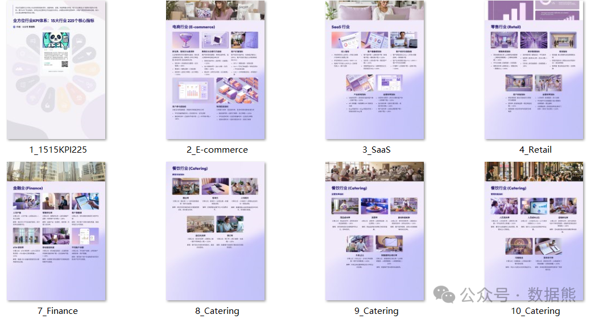

# 15个行业225个关键分析指标

> 来源：微信公众号「数据熊」 · 作者 Data Bear · 发布于 2025-02-01 12:27  
> 原文链接：http://mp.weixin.qq.com/s?__biz=Mzg2MTg5OTgzNA==&mid=2247486869&idx=1&sn=084f3c45a1db63723e6cb63c6cbbb717&chksm=ce1150c0f966d9d62666b8cb033d877c1dbe63d8d65906c4342c7aaabaedbfc8f4f0472355c9

### 本文将聚焦电商、SaaS、零售、制造、金融、餐饮、酒店、教育、医疗、农业、物流、房地产、媒体、IT服务与游戏等 15 个行业，从各自的业务特性与痛点出发，精炼出最具代表性的核心指标，让您在纷繁复杂的数字洪流中，迅速获取可落地执行的洞察与策略。

本文为简版，文末可下载完整版内容（包含15个行业225个指标）。

1. ### **电商行业**

- 转化率（Conversion Rate）
   ：访问者中实际下单的比例，是整体营销成效的第一道检验。
- 客单价（AOV）
   ：订单总额除以订单数量，反映顾客平均消费能力。
- 复购率（Repeat Purchase Rate）
   ：老顾客再次购买的频率，直接体现电商平台的忠诚度与口碑。

### **2. SaaS行业**

- MRR（Monthly Recurring Revenue）
   ：订阅模式下的月度持续收入，用于财务预测和资源规划。
- 客户留存率（Customer Retention Rate）
   ：老客户的续订或持续使用比例，高留存通常代表产品粘性强。
- 流失率（Churn Rate）
   ：在一定周期内终止服务的客户占比，是SaaS经营健康度的重要警示灯。

### **3. 零售行业**

- 同店销售增长率（Same-Store Sales Growth）
   ：排除新店因素后比较销售额增减，直观判断老店活力。
- 客流量（Foot Traffic）
   ：进店顾客数的变化能反映市场推广效果与门店吸引力。
- 库存周转率（Inventory Turnover）
   ：销售成本对比平均库存，体现货品周转效率和资金使用状况。

### **4. 制造行业**

- 生产效率（Production Efficiency）
   ：实际产量与理论产能对比，衡量产线资源是否得到有效利用。
- 良品率（Quality Yield）
   ：合格产品在总产量中的占比，凸显质量管控水平。
- 订单准时交付率（On-Time Delivery）
   ：按时完成交付的订单比例，直接影响客户满意度和信誉。

### **5. 金融行业**

- 不良贷款率（NPL Ratio）
   ：不良贷款占整体贷款比重，是信贷资产质量的核心指标。
- 净息差（NIM）
   ：利息收入减利息支出，再除以生息资产，代表银行主要盈利能力。
- 资本充足率（CAR）
   ：衡量资本总额是否足以覆盖风险资产，保障金融机构稳健运营。

### **6. 餐饮行业**

- 翻台率（Table Turnover Rate）
   ：一定时段内同一张桌子被重复使用的次数，直接关系营收效率。
- 客单价（Average Check）
   ：营业额除以顾客数量，反映人均消费水平和菜品定价策略。
- 菜品成本率（Food Cost Percentage）
   ：原材料成本占菜品售价的比例，影响毛利与定价策略。

### **7. 酒店行业**

- 客房入住率（Occupancy Rate）
   ：已售客房数与可售客房数之比，是衡量客源吸引力的基础指标。
- RevPAR（Revenue per Available Room）
   ：综合入住率和平均房价，体现酒店整体营收能力。
- 平均房价（ADR）
   ：客房收入除以已售客房数，用于评估定价水平和市场定位。

### **8. 教育培训行业**

- 完课率（Course Completion Rate）
   ：报名与完成学习的对比，课程设计与教学质量的晴雨表。
- 续班率（Renewal Rate）
   ：老学员继续报名后续课程的比例，关系培训机构的长期生源。
- 师资满意度（Teacher Satisfaction）
   ：基于学员评价或打分，可洞察教学效果与教师水平。

### **9. 医疗行业**

- 床位使用率（Bed Occupancy Rate）
   ：实际占用床日数相对于床位总数与天数之比，医院运转度的重要体现。
- 平均住院日（ALOS）
   ：住院天数和出院人数的对比，住院管理与诊疗效率的核心指标。
- 再入院率（Readmission Rate）
   ：出院后再次入院的情况，用于评估诊疗效果及康复质量。

### **10. 农业行业**

- 亩产量（Yield per Acre）
   ：作物总产量与种植面积之比，衡量种植效率和品种优劣。
- 成活率（Survival Rate）
   ：从播种或投放到收获过程中的成活比例，反映生产环境与技术水平。
- 饲料转化率（FCR）
   ：养殖业中饲料消耗与体重增量的关系，越低说明饲料利用率越高。

### **11. 物流行业**

- 准时交付率（On-Time Delivery Rate）
   ：物流履约时效的关键评估标准，影响客户信赖。
- 平均交付时间（Average Delivery Time）
   ：从出库到签收的平均时长，体现运作效率。
- 破损率（Damage Rate）
   ：运输过程中包裹或货物的损坏比例，直接影响企业形象与赔付成本。

### **12. 房地产行业**

- 销售去化率（Sell-Through Rate）
   ：在一定周期内销售房源的速度与数量，判断项目热度。
- 平均单价（Average Selling Price）
   ：成交房源总价与总面积或套数之比，市场定位参考。
- 入住率（Occupancy Rate）[租赁]
   ：已出租面积占可出租面积的比重，商业地产盈利水平的写照。

### **13. 媒体行业**

- 点击率（CTR）
   ：广告点击次数与展示次数之比，衡量广告素材对受众的吸引力。
- 完播率（Completion Rate）[视频]
   ：完整观看数占总播放数之比，体现内容质量与用户粘性。
- 用户留存率（User Retention）
   ：用户持续在平台活跃的比例，媒体长期发展的基石。

### **14. IT服务行业**

- 平均响应时间（Mean Time to Respond）
   ：从工单提交到开始处理的速度，影响客户满意度。
- 平均修复时间（Mean Time to Repair）
   ：从故障发生到彻底解决的平均耗时，体现技术支持能力。
- 服务可用性（Service Availability）
   ：正常运行时间占比，系统或网站稳定性的重要保证。

### **15. 游戏行业**

- 日活跃用户（DAU）
   ：每日登录且有有效行为的玩家数，是评估游戏热度的核心指标。
- 付费用户占比（Paying User Ratio）
   ：有付费行为的玩家在总玩家中所占比例，决定营收潜力。
- 留存率（Retention Rate）
   ：从注册至后续多日的持续登录状况，关系游戏生命周期长短。
   ---

数据熊为大家整理了15个行业的225个关键绩效指标，点击文末左下角

阅读原文

或

扫描二维码

获取。

点赞或转发就是最大的支持，关注数据熊，工作更轻松。
