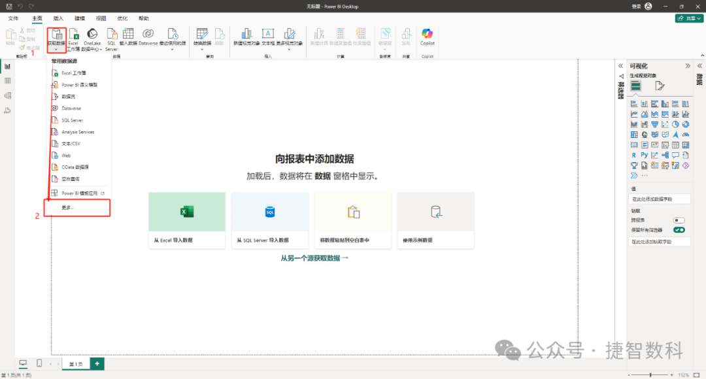
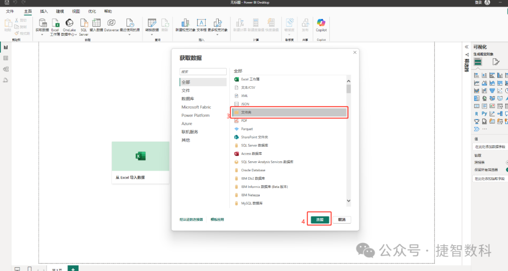
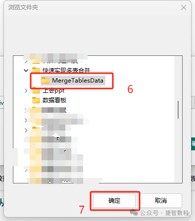
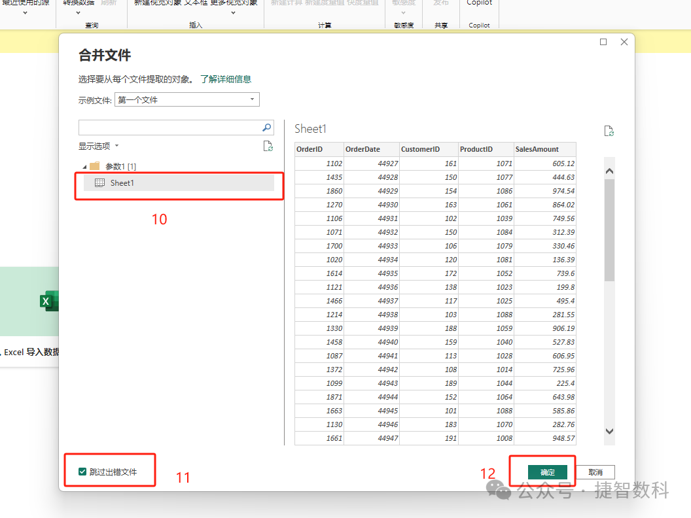
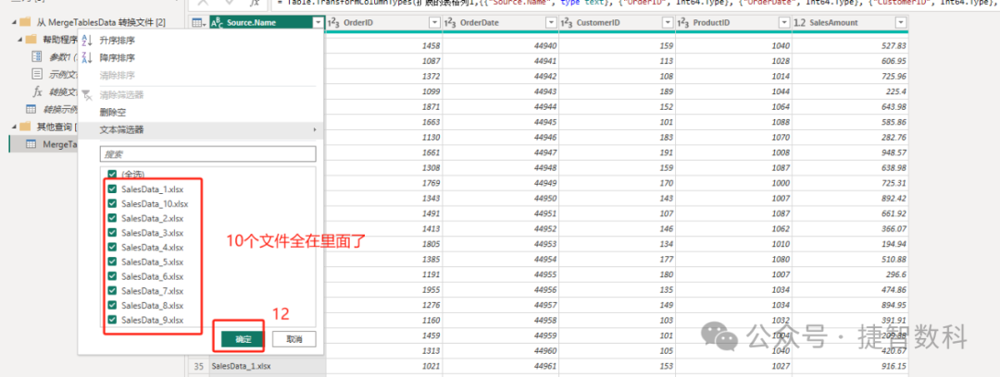
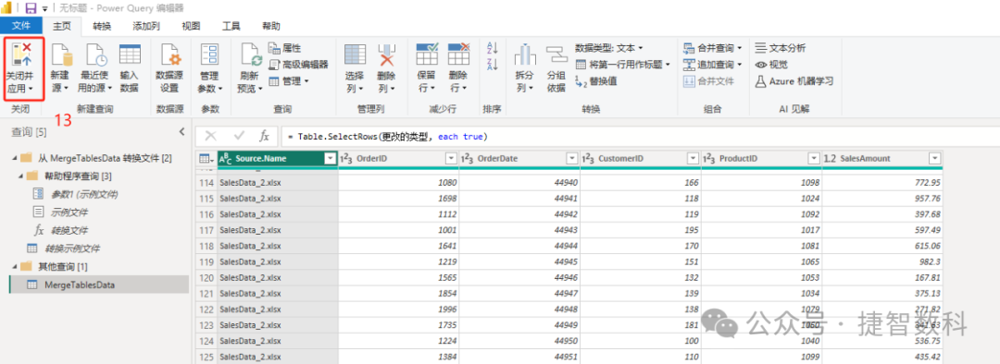

# DeepSeek+PowerBI：一键实现多表合并、自动分析

> 来源：微信公众号「数据熊」 · 作者 捷智数据分析 · 发布于 2025-02-14 07:00  
> 原文链接：http://mp.weixin.qq.com/s?__biz=Mzg2MTg5OTgzNA==&mid=2247486949&idx=1&sn=52cc0eb8d385c1a49c8a6a951eab5344&chksm=ce1150b0f966d9a6d69ed1ad0aba0bf60fdb3d0fbd4d6c6b270fa8a4b4b3a20836f1eaf9797d
> 摘要：在数据分析过程中，我们经常需要将多个表格合并成一个，以便进行全面的分析。

在数据分析过程中，我们经常需要将多个表格合并成一个，以便进行全面的分析。无论是不同时间段的数据，还是来自不同部门的报表，表头相同的数据表合并都是数据整合的重要环节。在这篇文章中，我将通过一个实际案例，详细介绍如何使用Power Query功能批量合并多个表。

（文末可获得示例文件）

开始之前我们先看一个案例文件

一、案例背景与数据集介绍

案例背景：

假设你是一家公司的财务分析师，负责分析公司在不同时间段的销

售数据。公司提供了十个不同时间段的销售数据文件，每个文件的表头相同。你的任务是将这十个文件合并成一个表，以便进行统一的销售分析。

数据集结构：

- OrderID：订单编号

- OrderDate：订单日期

- CustomerID：客户编号

- ProductID：产品编号

- SalesAmount：销售金额

二、在Power BI中批量合并多个表的步骤

步骤1：加载数据文件夹

首先，下载并解压上面的数据集文件夹。在Power BI Desktop中，选择“获取数据”，然后选择“文件夹”选项。这将允许你一次性加载文件夹中的所有文件。

1. 在数据源选择窗口中，选择“文件夹”并点击“连接”。

2. 浏览到你解压数据集的文件夹，点击“确定”。

3. 在“文

件夹”窗口中，点击“组合并

加载”按钮。

这将打开Power Query编辑器，并显示文件夹中的所有文件。

步骤2：检查和清理数据

在Power Query编辑器中，你会看到所有文件的预览。Power BI会自动将这些文件中的数据合并到一个表中。在这里，你可以对数据进行检查和清理。

1. 确保所有列的数据类型正确，如“OrderDate”应为日期类型，“SalesAmount”应为货币或小数类型。

2. 如果某些文件中存在空白行或列，你可以在Power Query中删除这些行或列。

3. 确保所有表的结构一致，如果有列名不一致的情况，需要进行统一处理。

步骤3：合并所有表

Power BI会自动识别并合并文件夹中所有Excel文件的数据。如果文件的表头相同，Power BI将它们合并到一个数据表中，并生成一个新的查询结果。你可以在查询编辑器中查看合并后的数据。

1. 确认合并后的数据没有遗漏行或列。

2. 如果需要，你可以进一步清理数据，比如删除重复行、填充缺失值等。

步骤4：加载数据到Power BI

完成数据检查和清理后，点击“关闭并加载”按钮，将合并后的数据表加载回Power BI。这时，你就可以在Power BI中使用这个合并的数据集进行分析了。

三、案例分析：合并后的销售数据分析

现在，你已经成功将十个销售数据文件合并成一个完整的数据表。接下来，我们可以通过Power BI的可视化功能对这些数据进行分析。

分析过程中可以借助DeepSeek编写度量值。

示例1：销售趋势分析

1. 创建一个折线图，将“OrderDate”拖入X轴，将“SalesAmount”拖入Y轴。

2. 设置时间切片器，以查看不同时间段内的销售趋势变化。

3. 通过分析，可以直观地看到不同时间段的销售额波动，为公司制定销售策略提供数据支持。

示例2：产品销售表现分析

1. 创建一个柱状图，将“ProductID”拖入X轴，将“SalesAmount”拖入Y轴。

2. 按产品分类查看各产品的销售表现，识别畅销产品和滞销产品。

3. 这种分析有助于公司优化产品线和库存管理。

示例3：客户分析

1. 创建一个表格，将“CustomerID”和“SalesAmount”拖入表格中。

2. 按销售额排序，识别贡献最大的客户群体，制定差异化的客户管理策略。

视频是数据熊用PowerBI做的动态帕累托分析，后续会逐步分享更多的财务分析、经营分析案例。

四、结语

通过这篇文章，你学习了如何在Power BI中批量合并多个表格文件，并将其用于数据分析。多表合并是数据整合和分析的基础步骤，能够帮助你从分散的数据中提炼出有价值的信息。在实际操作中，通过Power BI的Power Query功能，你可以轻松地将多个表格合并到一个统一的数据表中，极大地提高数据处理的效率。Powerbi强大的数据分析能力远超你的想象。

扫描下方二维码，跟着数据熊一起学习财务知识、学习数据处理分析技术。

点赞和转发就是最大的支持，关注数据熊，工作更轻松。

点击文末

阅读原文

可阅读

、

下载学习精美

数据分PowerBI模板。
