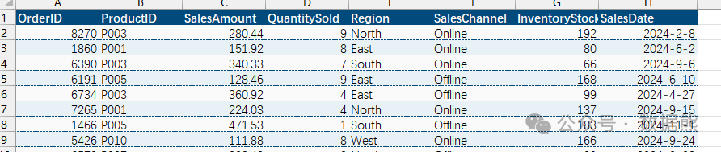
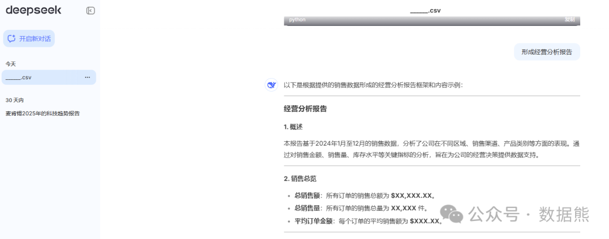
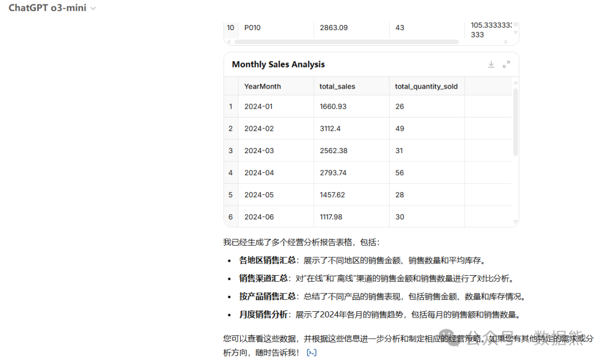
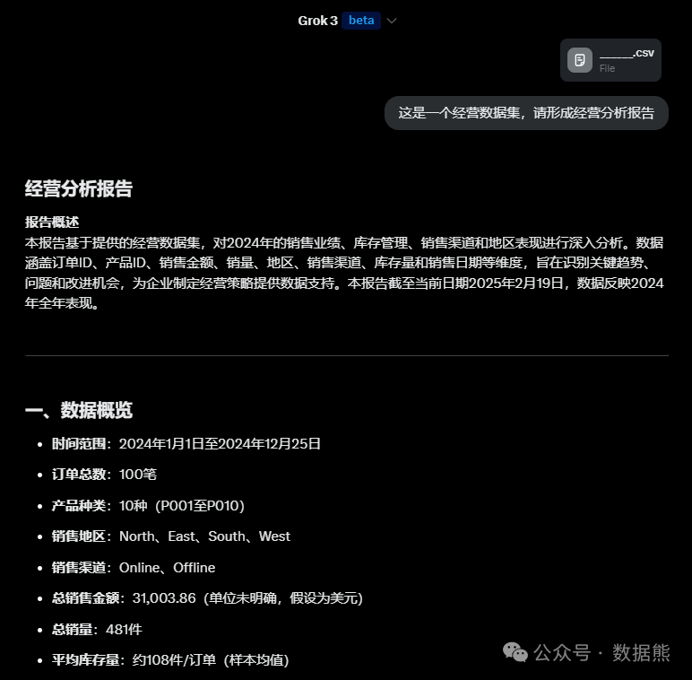

# DeepSeek经营分析实战案例（三大模型分析能力对比）

> 来源：微信公众号「数据熊」 · 作者 Data Bear · 发布于 2025-02-20 07:00  
> 原文链接：http://mp.weixin.qq.com/s?__biz=Mzg2MTg5OTgzNA==&mid=2247487150&idx=1&sn=ca4ef33869176801ce692645d2e70ba9&chksm=ce1153fbf966daed488ef82526194c58a060d2085d631141b38ec7eb06e78ecb3bcca8354d45

大家好，今天我们来聊一聊如何通过DeepSeek在经营分析中的应用，以及如何让它成为决策的得力助手。作为一名财务分析师，我们常常需要处理大量的数据，做出准确的分析判断。然而，如何在繁杂的数据中快速找出关键问题，并基于数据做出明智决策，往往是最具挑战性的部分。

今天，我们通过一个实际案例，来探讨如何利用DeepSeek来辅助我们的经营分析。文末会拿同一个数据集分别测试DeepSeek、ChatGPT、Grok3的分析表现。

案例背景

假设我们是一家零售公司，正在进行季度销售业绩的分析。我们的目标是通过数据分析，发现哪些产品的销售表现不佳，哪些市场渠道存在潜力，以及如何优化库存以减少成本。我们有以下几类数据：

- 销售数据：包括产品编号、销售数量、销售额、客户地域等。
- 市场渠道数据：不同渠道的销售业绩，包括线上和线下渠道。
- 库存数据：各类产品的库存量、补货周期、销售速度等。

步骤一：数据清理与整合

首先，我们将从不同系统（销售系统、库存系统、财务系统等）导入数据。DeepSeek在这里可以帮忙解释数据格式问题，甚至提供如何清理数据的建议。

例如：

- 如果销售数据中有缺失值或异常值，DeepSeek可以提供修复方法。
- 针对时间戳格式不统一的情况，DeepSeek能指导我们如何进行格式转换。

步骤二：趋势分析与问题识别

数据清理完毕后，我们将数据导入到Power BI或Excel进行分析。这时，DeepSeek的作用是帮助我们解读数据中的趋势。

例如：

- DeepSeek可以帮助我们理解销售额下降的原因，分析哪些产品的销售不力，为什么某些地区的销售增长超过预期。
- 根据季节性因素，DeepSeek能帮助我们发现某些产品在特定季节内表现更好。

在分析中，DeepSeek不仅能提供数据解读，还能给出进一步的数据挖掘建议，例如，推荐我们进行市场细分，看看是否有新的细分市场可以开拓。

步骤三：优化建议与决策支持

当我们通过分析得出问题之后，接下来是提出优化建议。DeepSeek在这里可以为我们提供实时的解决方案。

例如：

- 针对库存过剩的问题，DeepSeek可以建议我们调整库存策略，减少滞销品的库存，并根据历史销售数据预测未来的补货周期。
- 如果某个市场渠道表现不佳，DeepSeek可以建议我们调整营销策略，甚至提出针对性改进措施，如加大线上广告投入或优化线下店铺布局。

步骤四：动态报告与决策汇报

最后，所有的分析结果可以通过动态报表呈现给管理层或团队。DeepSeek能够帮助我们生成简洁、易懂的报告，并且根据数据的变化自动更新报告内容。

例如：

- 生成一个季度销售总结报告，并在其中提供图表与趋势分析。
- 针对特定数据变化，DeepSeek能够自动生成提示，如“某产品的销量同比下降20%，建议立即检查市场需求变化”。

经营分析，DeepSeek、ChatGPT、Grok3哪家强？

按照上述思路我让ChatGPT生成了一个案例数据集，分别丢给

DeepSeek、ChatGPT、Grok3，

以下三个模型的生成结果。

DeepSeek生成了一个架构，没有对数据进行分析，看来还得自己来

ChatGPT o3 充分展现了理科男的耿直，经过三次提示后依然只是丢给我几张表，这可是你的兄弟4o生成的数据集啊，怎么可以这么应付？

Grok 3基本上生成了我想要的东西，全文比截图内容更完美，考虑篇幅不在这里展示，有兴趣的伙伴点击文末

扫描二维码

获取。

老马吹的牛看来是真的。。。。

---

点击

阅读原文

或

扫描下方二维码

下载《

Power BI + DeepSeek：轻松打造智能财务报告（含5个精美PowerBI模板）

》。

点赞和转发就是最大的支持，加入数据熊的财经群，与数据熊一起拥抱技术拥抱专业。基于财务高于财务，更多深度阅

读助您实现职业精进。

