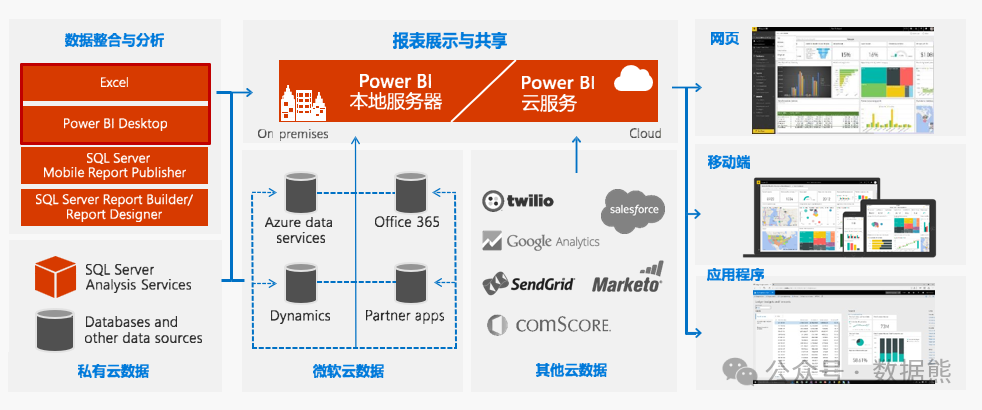

# DeepSeek+Power BI：低成本打造智能经营分析平台含模板

> 来源：微信公众号「数据熊」 · 作者 Data Bear · 发布于 2025-02-21 07:00  
> 原文链接：http://mp.weixin.qq.com/s?__biz=Mzg2MTg5OTgzNA==&mid=2247487175&idx=1&sn=a1eb92e5e44e0a8b8bc185ea9548ec60&chksm=ce115392f966da84912e1e1c364ce3f226e9e59d7e626fccd0a0fe67c01c349c996d7f5ee910

DeepSeek的横空出世，给各行各业带来了革命性的变化，今天我们就来讨论下如何利用DeepSeek+Power BI低成本打造经营分析平台。我们先通过两个个案例看一下这个平台有多好用。文末有模板

https://www.chinapowerbi.com/ActivityShow/WorksList?activityId=18&utm_source=chatgpt.com  这是上述两个案例的链接，大家可自行前往查看。

通过上面两个视频大家应该初步领略了PowerBI的强大，那么问题来了，难不难？使用成本怎么样？

PowerBI使用的主要难点

1. 数据建模：
    表关系设置复杂，度量值与计算列使用场景容易混淆。
2. DAX

    公式：
    函数多且上下文切换（行

    /

    过滤上下文）概念难掌握，复杂度量值逻辑实现困难
    。
3. 数据清洗（

    Power Query

    ）：
    多步骤转换、

    M

    语言语法、异源数据整合较为繁琐。
4. 可视化设计与交互：
    图表选择盲目、下钻

    /

    联动设置复杂、布局不合理。
5. 性能优化：
    大数据量刷新慢、复杂公式影响性能，模式选择（

    Import/DirectQuery

    ）难取舍。
6. 安全与分享：
    行级安全（

    RLS

    ）配置、多用户访问权限管理、外部嵌入复杂。
7. 工具与服务集成：
    多云服务连接配置困难、实时数据报表搭建、与

     Excel/Teams/Power Apps

    集成门槛高。

在没有DeepSeek上述问题确实很难，但有了DeepSeek，上述问题都可以巧妙解决

1. 建模与关系建议：
    描述数据结构，获取星型

    /

    雪花模型思路或纠正关系设置。
2. DAX

    公式示例与调试：
    提出需求或贴出错误公式，获取正确写法与上下文解释。
3. Power Query

    步骤指导：
    说明数据源与目标转换，获得逐步操作或

        M

    语言示例。
4. 可视化设计与交互建议：
    给出图表类型选择、布局优化及高级交互（

    Drill Through

    、

    Bookmarks

    等）操作建议。
5. 性能与模式优化：
    根据数据规模与模型结构，建议合适的加载模式、聚合策略与

     DAX

    优化方案。
6. 安全策略与发布：
    指导行级安全配置、应用工作区权限管理及外部分享步骤。
7. 跨平台整合方案：
    提供多云服务连接排查、实时数据集搭建思路，以及与常见工具（

    Excel

    、

    Teams

    、

    Power     Apps

    ）深度整合的实现方法。

## PowerBI这么好用，会不会很贵？ 一点都不贵，桌面版还是免费的

1. Power BI Desktop（免费）
    本地开发工具，不能直接分享报表。
2. Power BI Pro（$10/用户/月）
    支持在线发布、共享报表，适合小型团队。
3. Power BI Premium

4.Power BI Embedded（按 Azure 资源收费）：适用于外部应用嵌入，按使用量计费。

额外成本

：培训、数据存储、网关维护、Office 365 集成、第三方插件等。

## 以上就是对DeepSeek+Power BI：低成本打造经营分析平台的粗略介绍，更详细的内容及模板，请点击文末阅读原文或扫描下方二维码获取。

- ## 点赞和转发就是最大的支持，关注数据熊，工作更轻松。
- ## 想系统性学习PowerBI的伙伴，请到我的视频号橱窗购买课程。
- ## 本人承接企业培训，有需要的可以私信联系。
