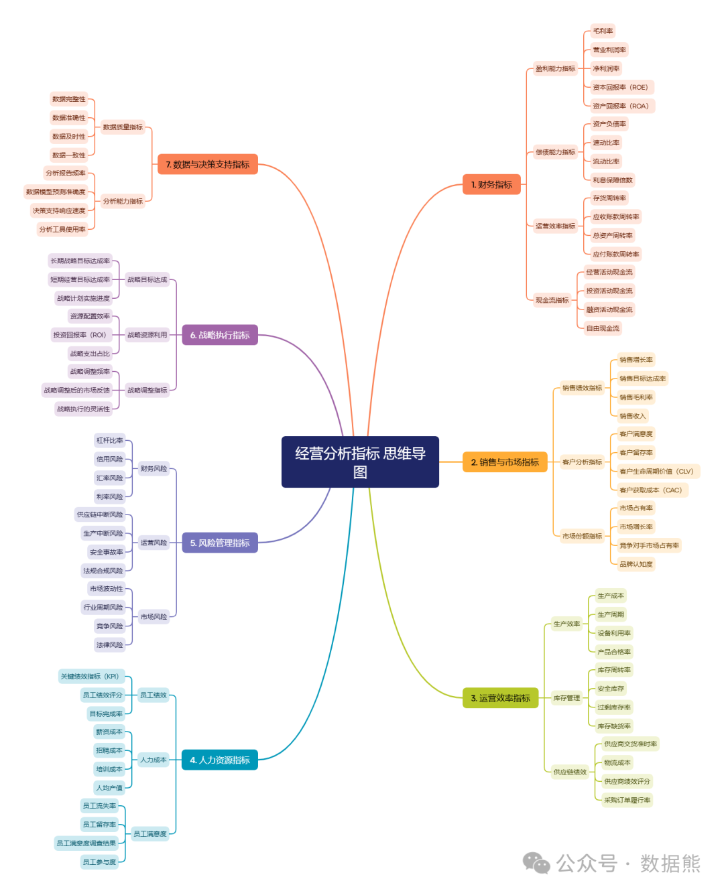
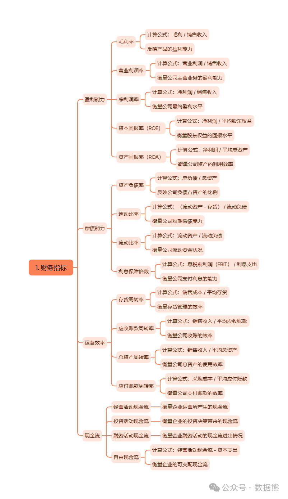
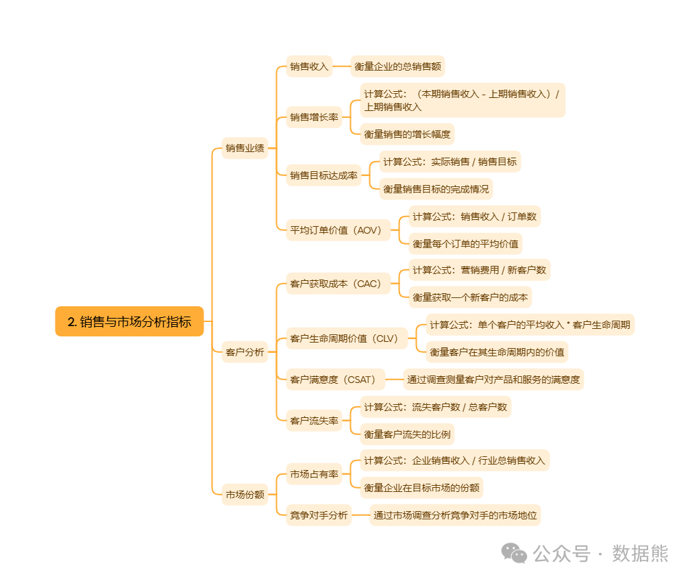
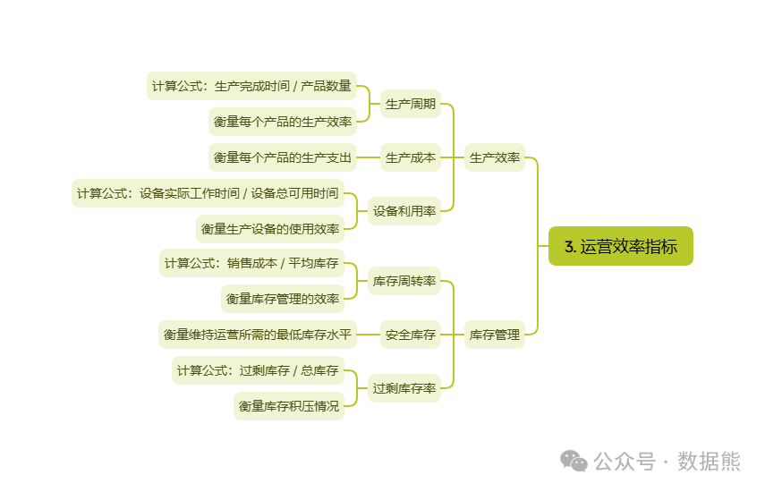
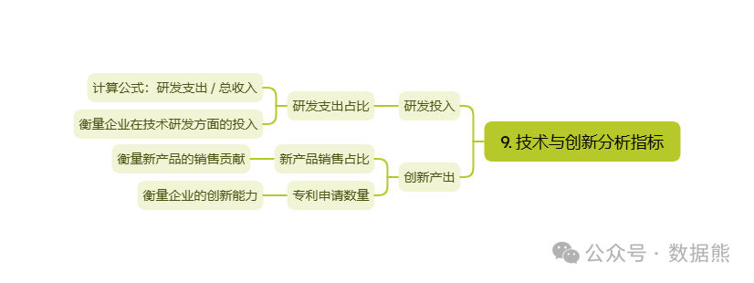
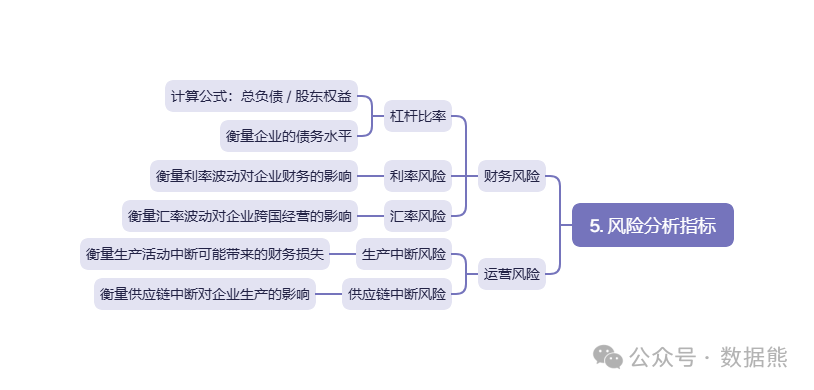
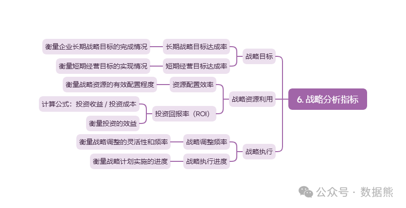
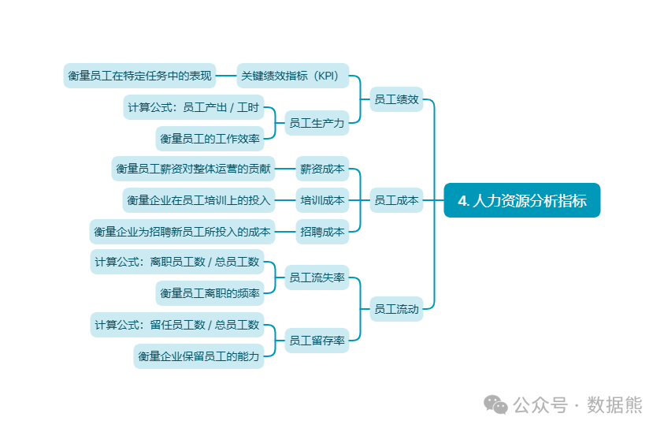
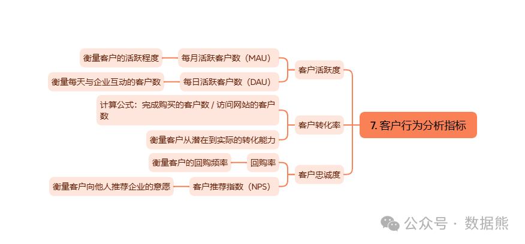
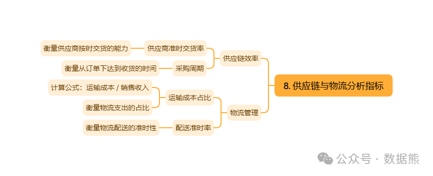

# 10张经营分析思维导图

> 来源：微信公众号「数据熊」 · 作者 Data Bear · 发布于 2025-02-25 13:08
> 原文链接：http://mp.weixin.qq.com/s?__biz=Mzg2MTg5OTgzNA==&mid=2247487284&idx=1&sn=2fc63ebfd92d28bc1a61934fc7db550d&chksm=ce115261f966db774e3503918a9ac01de8faa47da121fb8d4a876a8ee54f880743ae793b4db6

经营分析是企业管理中的关键环节，能够帮助企业全面了解其运营状况、市场竞争力及财务健康状况，从而为战略决策提供有力的数据支持。本文将通过思维导图的形式，介绍多个维度的经营分析指标，帮助企业更好地利用数据优化管理。

---

#### 一、财务分析：评估企业的财务稳健性

财务分析是企业经营分析的基础，关键指标包括：

---

#### 二、销售与市场分析：了解市场竞争力

销售与市场分析帮助企业更好地了解市场表现，关键指标包括：

---

#### 三、运营效率分析：提升企业执行力

运营效率分析帮助企业识别提升空间，重点关注以下指标：

---

#### 四、研发与创新：保持市场领先地位

随着技术的进步，研发投入和创新产出成为企业竞争力的重要组成部分。关键指标包括：

---

#### 五、风险管理：识别潜在风险

经营分析还需要帮助企业识别潜在风险，关键指标包括：

---

#### 六、战略执行：确保企业目标落地

最后，战略执行是确保企业发展目标得以实现的关键。相关指标包括：

七、其他指标

点击

阅读原文

或

扫描二维码

下载完整版本

点赞和转发就是最大的支持，关注数据熊，工作更轻松。
