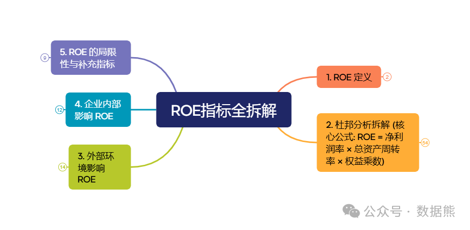
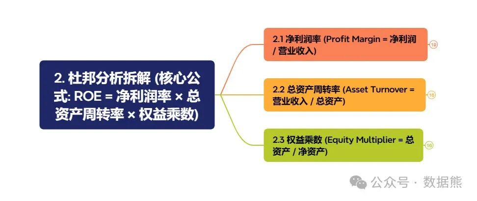
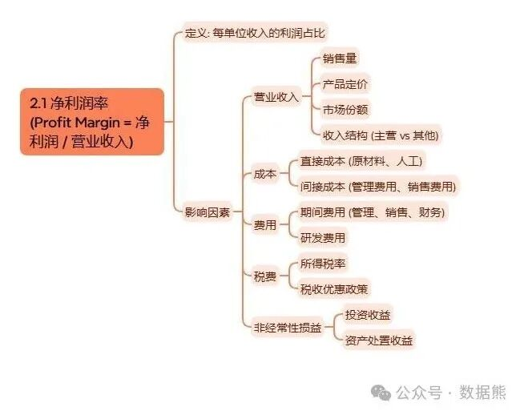
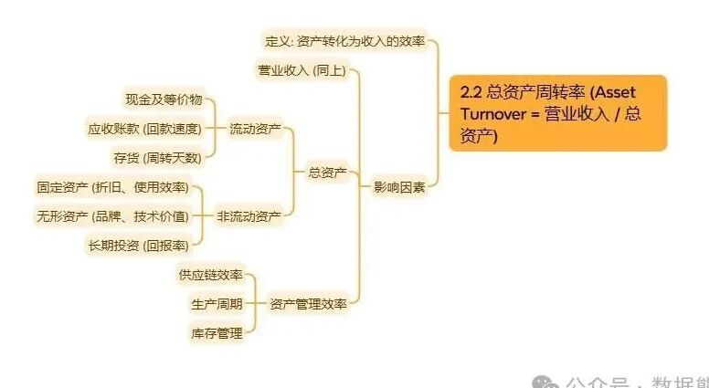
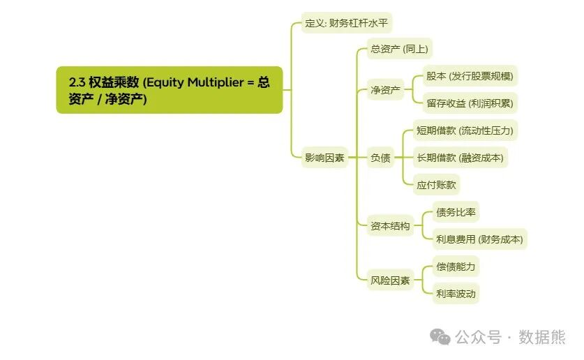
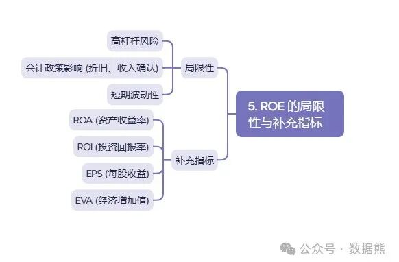

# ROE背后的逻辑：详解杜邦分析

> 来源：微信公众号「数据熊」 · 作者 Data Bear · 发布于 2025-03-05 07:15
> 原文链接：http://mp.weixin.qq.com/s?__biz=Mzg2MTg5OTgzNA==&mid=2247487519&idx=1&sn=85ed2eaad064a947bb63d46583bf0944&chksm=ce114d4af966c45c67d0caffe2a8e9f4fef72821799346fb443dec2d6f1e351f21f3f8fcda58

> 注：因公众号平台更改推送规则，如不想错过数据熊的文章，请将我们设为星标，让数据熊的每一篇文章第一时间到达您的订阅列表。
>
> 方法：点文章左上角蓝色财管笔记进入主页，点击主页右上角"…",然后选择设为星标

> 私信数据熊获取完整版思维导图、案例。

企业经营，ROE（净资产收益率）是一个备受关注的指标，它反映了企业为股东创造利润的能力。然而，仅仅盯着ROE的数值看，往往无法揭示企业真实的经营状况和投资价值。本文将详细解析杜邦分析的原理和应用，带你认识ROE背后的逻辑。

---

大家都知道

，ROE衡量的是企业利用股东投入的资本赚取利润的能力。ROE越高，说明企业的盈利能力越强，股东的投资回报越高。然而，单一的ROE数字无法告诉我们利润从何而来，也无法揭示潜在的风险。这就需要用到杜邦分析法。

杜邦分析法的原理

杜邦分析法起源于美国杜邦公司，它将ROE分解为三个核心指标：

1. 净利率（Profit Margin）：

反映企业的盈利能力。

2. 总资产周转率（Asset Turnover）：

反映企业的运营效率。

3. 财务杠杆（Financial Leverage）：

反映企业的资本结构。

分解后的ROE公式为：

ROE

=净利率*总资产周转率*财务杠杆

通过这个公式，我们可以清晰地看到ROE的构成要素，进而分析企业的盈利能力来源。

杜邦分析法的三大组成部分

1. 净利率（Profit Margin）

计算公式：

  净利率= 净利润/销售收入

净利率反映了企业每单位销售收入能转化为净利润的能力。高净利率通常意味着企业在成本控制、产品定价或市场竞争力方面有优势。

案例分析：假设A公司和B公司同属一个行业，A公司的净利率为10%，B公司为5%。这可能表明A公司在成本管理或产品差异化上更胜一筹。

2. 总资产周转率（Asset Turnover）

计算公式：

  总资产周转率 =销售收入/总资产

总资产周转率衡量企业利用资产产生销售收入的效率。周转率越高，说明企业的资产利用效率越高，运营能力越强。

案例分析：C公司和D公司同属零售业，C公司的总资产周转率为2次/年，D公司为1次/年。这表明C公司能更快地将资产转化为收入，运营效率更高。

3. 财务杠杆（Financial Leverage）

计算公式：

  财务杠杆 = 总资产/净资产

财务杠杆反映了企业债务融资的比例。杠杆越高，说明企业更多地依赖债务，这可能放大ROE，但也增加了财务风险。

案例分析：E公司和F公司同属制造业，E公司的财务杠杆为2，F公司为1.5。这意味着E公司使用更多债务，潜在回报和风险都更高。

杜邦分析法的优势

杜邦分析法之所以强大，主要体现在以下几个方面：

1. 全面性：

通过分解ROE，我们可以从盈利能力、运营效率和资本结构三个维度全面评估企业。

2. 可比较性：

便于将不同企业或同一企业不同时期的指标进行对比，找出差异所在。

3. 指导性：

帮助投资者和管理层识别企业的强项和短板，制定针对性的改进策略。

杜邦分析法的局限性

尽管杜邦分析法很实用，但它并非万能，以下是需要注意的几点：

1. 依赖会计数据：

分析结果基于财务报表，可能受到会计政策或估计偏差的影响。

2. 静态分析：

杜邦分析反映的是某一时点的情况，无法预测未来的变化。

3. 行业

差异

：

不同行业的ROE和分解指标差异较大，需结合行业背景解读。

如何运用杜邦分析法？

掌握了杜邦分析的基本原理后，我们可以将其应用于实际投资中：

1. 比较分析

将企业的ROE分解指标与行业平均水平或竞争对手对比，找出企业的相对优势和劣势。

2. 趋势分析

观察企业历年的ROE及其分解指标的变化，了解经营状况的演变趋势。

3. 综合评估

结合其他财务指标（如现金流）和非财务信息（如行业前景），全面判断企业的投资价值。

结语

杜邦分析法为我们提供了一个简单而有力的工具，让我们能够深入剖析ROE背后的逻辑。通过将ROE分解为净利率、总资产周转率和财务杠杆，我们不仅能更准确地评估企业的盈利能力、运营效率和资本结构，还能在决策中规避风险、抓住机会。

> 更多优质内容及案例、模板
>
> 私信数据熊
>
> 获取。点击
>
> 阅读原文
>
> 获取完整ROE思维导图。
>
>

