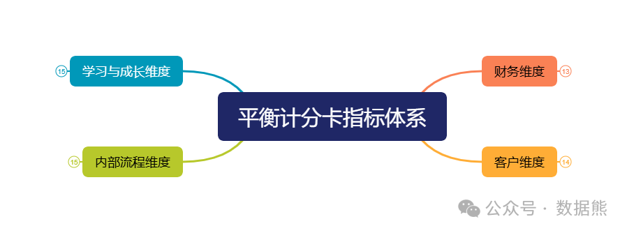
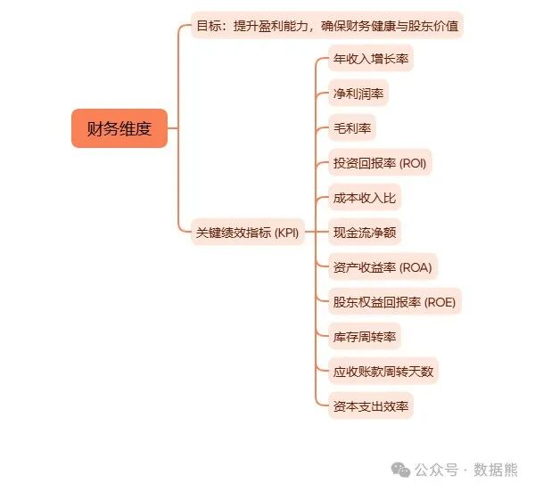
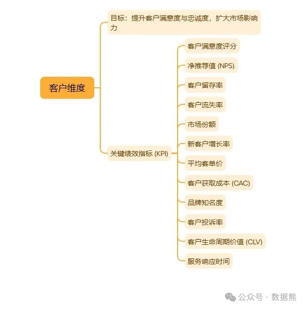
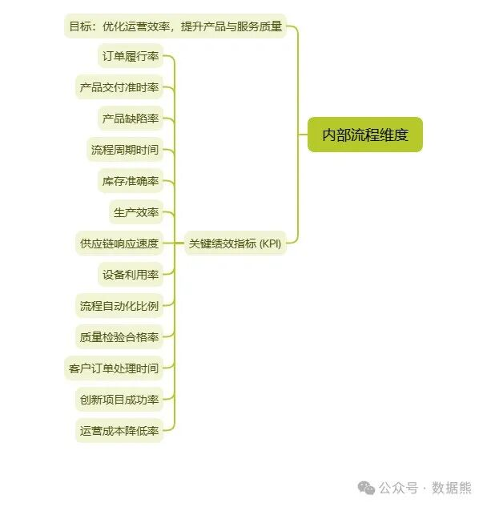
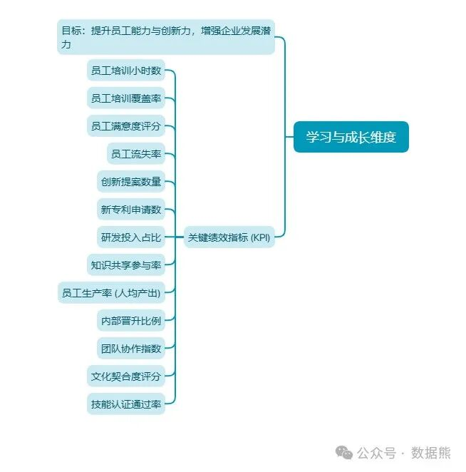
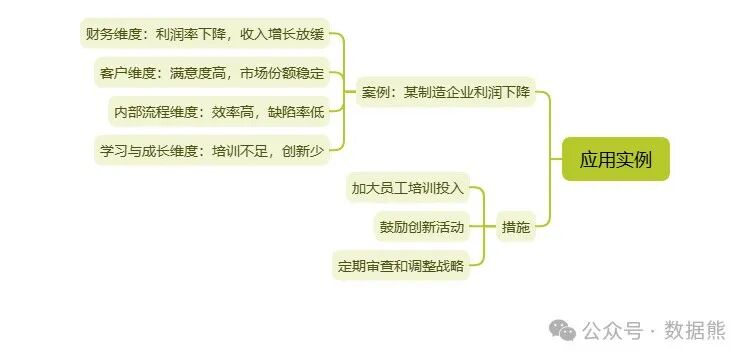
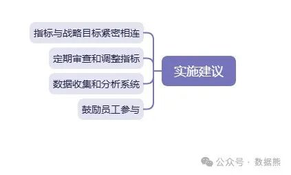

# 基于平衡计分卡的经营分析框架（思维导图、案例）

> 来源：微信公众号「数据熊」 · 作者 Data Bear · 发布于 2025-03-06 07:00
> 原文链接：http://mp.weixin.qq.com/s?__biz=Mzg2MTg5OTgzNA==&mid=2247487544&idx=1&sn=1835d73966e2d83819448d448e32e79a&chksm=ce114d6df966c47b6a6be0d9961d109e56442b1529a8aabe1eea1a25b99cf69c9fd80843f8f0
> 摘要：平衡计分卡为企业提供了一个全面的框架来评估其绩效并指导战略决策。通过关注财务、客户、内部流程以及学习与成长四个维度，企业可以更深入地了解其运营状况，识别改进机会，并确保长期的成功。

> 注：因公众号平台更改推送规则，如不想错过数据熊的文章，请将我们设为星标，让数据熊的每一篇文章第一时间到达您的订阅列表。
>
> 方法：点文章左上角蓝色财管笔记进入主页，点击主页右上角"…",然后选择设为星标

> 私信数据熊可领取基于平衡计分卡的经营分析案例。

在企业管理中，你是否曾感到仅凭财务报表难以全面评估经营状况？利润在增长，但客户满意度却在下滑；成本控制得当，但员工流失率却居高不下。面对这些挑战，传统的财务指标往往显得力不从心。

平衡计分卡（Balanced Scorecard, BSC）

或许能为你提供一个全新的视角。

什么是平衡计分卡？

平衡计分卡是一种战略管理工具，旨在将组织的战略目标分解为可衡量的指标，从而从多个维度评估组织的绩效。维度包括：

通过这种多维度的评估，企业可以更全面地了解其运营状况，不仅关注眼前的财务成果，还关注驱动这些成果的非财务因素。这种方法有助于企业更好地制定和执行战略，确保长期的成功。

平衡计分卡的四个维度

1. 财务维度

财务指标是评估企业盈利能力和财务健康状况的关键。常见的财务指标包括：

在经营分析中，财务维度帮助管理者了解企业的经济成果，并为未来的战略决策提供依据。例如，通过分析收入增长率，企业可以判断其市场扩张策略是否有效；通过利润率分析，则可以评估成本控制和定价策略的成效。

2. 客户维度

客户满意度和忠诚度对企业的长期成功至关重要。客户维度的关键指标包括：

通过衡量这些指标，企业可以了解其在市场上的地位，并识别改进客户体验的机会。例如，高客户满意度通常与高客户保留率相关联，这直接影响企业的收入稳定性。经营分析中的客户维度帮助企业调整其产品和服务，以更好地满足客户需求。

3. 内部流程维度

内部流程维度关注企业的运营效率和效果。关键指标可能包括：

通过分析这些指标，企业可以优化其内部流程，提高生产效率和产品质量。例如，缩短生产周期时间可以加快产品上市速度，增强市场竞争力；降低质量缺陷率则可以减少返工和客户投诉，提升品牌声誉。

4. 学习与成长维度

学习与成长维度关注员工的技能、知识和创新能力。指标可能包括：

通过投资于员工的学习与成长，企业可以培养一支高素质的团队，为未来的创新和增长奠定基础。例如，定期提供培训可以提升员工的技能水平，增强企业的创新能力；高员工满意度则有助于降低流失率，保持团队的稳定性。

平衡计分卡在经营分析中的应用实例

为了更好地理解平衡计分卡在经营分析中的应用，我们来看一个实际案例。假设某制造企业面临利润下降的问题。通过平衡计分卡的分析，管理者发现：

- 财务维度：

利润率下降，收入增长放缓。

- 客户维度：

客户满意度高，市场份额稳定。

- 内部流程维度：

生产效率高，质量缺陷率低。

- 学习与成长维度：

员工培训不足，创新活动较少。

从分析结果可以看出，尽管客户满意度和内部流程表现良好，但学习与成长维度的不足可能是导致财务绩效不佳的原因之一。员工培训不足和创新活动较少限制了企业推出新产品或改进现有产品的能力，从而影响了收入和利润。

基于这一分析，企业决定采取以下措施：

1. 加大员工培训投入：

提升员工的技能和知识水平，增强创新能力。

2. 鼓励创新活动：

设立创新奖励机制，激励员工提出新产品或流程改进的建议。

3. 定期审查和调整战略：

确保企业的战略目标与市场变化和客户需求保持一致。

通过这些措施，企业不仅改善了学习与成长维度，还间接提升了财务绩效，实现了整体运营的优化。

平衡计分卡的优势

平衡计分卡在经营分析中的应用具有以下优势：

1. 全面性：

通过多维度的评估，企业可以更全面地了解其运营状况，避免仅关注财务指标的片面性。

2. 战略导向：

平衡计分卡将战略目标与具体指标相连，确保企业的日常运营与长期战略保持一致。

3. 前瞻性：

通过关注学习与成长等前瞻性指标，企业可以提前识别潜在问题并采取预防措施。

4. 沟通工具：

平衡计分卡可以作为内部沟通的工具，帮助员工理解企业的战略目标以及他们的工作如何为这些目标做出贡献。

实施平衡计分卡的建议

为了成功实施平衡计分卡，企业应注意以下几点：

1. 确保指标与战略目标紧密相连：

选择的指标应直接反映企业的战略重点，避免无关或冗余的指标。

2. 定期审查和调整指标：

商业环境不断变化，企业应定期评估和更新平衡计分卡中的指标，以确保其持续有效。

3. 数据收集和分析：

建立有效的数据收集和分析系统，确保指标的准确性和及时性。

4. 员工参与：

鼓励员工参与平衡计分卡的制定和实施过程，增强他们的责任感和参与感。

结语

平衡计分卡为企业提供了一个全面的框架来评估其绩效并指导战略决策。通过关注财务、客户、内部流程以及学习与成长四个维度，企业可以更深入地了解其运营状况，识别改进机会，并确保长期的成功。

> AI时代，工具和方法同样重要，数据熊强烈建议财务人学会PowerBI，提升职场竞争力。
>
> 私信数据熊
>
> 下载PowerBI练习文件，点击
>
> 阅读原文
>
> 获取平衡计分卡经营分析案例。

点赞

和

转发

就是最大的支持，数据熊，财务人的成长伙伴。

