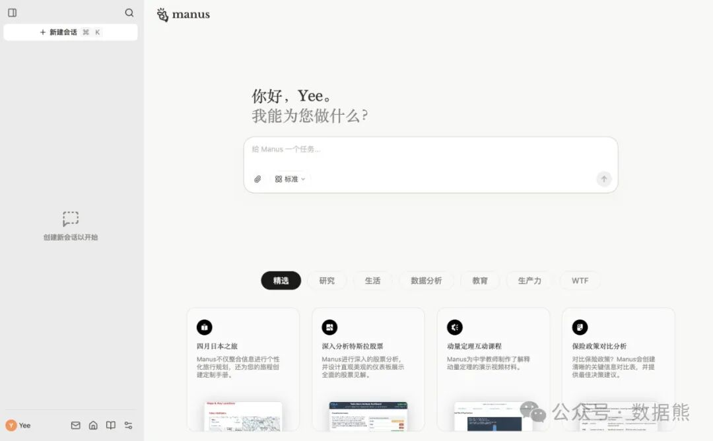
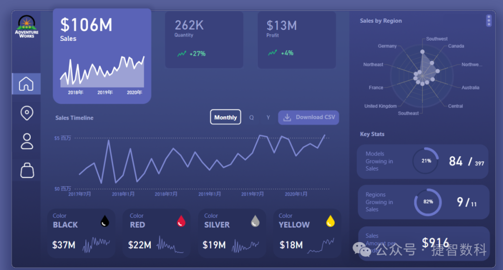
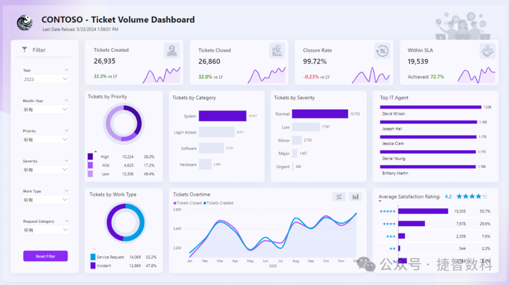

# 不会AI的财务，5年后会怎样？

> 来源：微信公众号「数据熊」 · 作者 Data Bear · 发布于 2025-03-07 07:53
> 原文链接：http://mp.weixin.qq.com/s?__biz=Mzg2MTg5OTgzNA==&mid=2247487551&idx=1&sn=fb2155ad5de07fddcc617027b6ded5f8&chksm=ce114d6af966c47cc1976d9d1aa1c3f67a00f87945143228d6d7976bf5fb34bc96cb79a4e8f3

> 注：因公众号平台更改推送规则，如不想错过数据熊的文章，请将我们设为星标，让数据熊的每一篇文章第一时间到达您的订阅列表。
>
> 方法：点文章左上角蓝色财管笔记进入主页，点击主页右上角"…",然后选择设为星标

> 点击文末
>
> 阅读原文
>
> 获取智能财务分析报告。

嗨，各位亲爱的朋友们，我是你们懂财务、懂分析的数据熊~最近大家都在聊DeepSeek，说实话，我以前觉得AI离我们财务人挺远的，直到最近突然惊觉：不会AI的财务人，真的可能很快要"被时代淘汰"了。

你可能觉得我在吓唬你，别急，我慢慢跟你说。

1. Excel老铁，5年后可能变成职场遗迹

很多财务人对Excel爱得深沉，每天做报表、核对数据、分析数据，甚至用Excel解决一切人生问题。但AI时代，靠着人工一个个手敲Excel公式，显然已经不是一个聪明的选择了。

以后老板可能会说：“你居然还用Excel手动做报表？DeepSeek都能自动给我搞定啊！”听起来有点夸张，但可能真的是大趋势。

2. 汇报沟通变"降维打击"

AI时代来了，懂AI的财务人汇报数据时：“老板，这是AI帮我自动分析出的业务趋势，配合图表一目了然，咱们直接讨论下一步怎么做。”

而你还在苦哈哈地把报表数据复制粘贴做PPT，眼睛熬红，老板却皱着眉问：“你这效率怎么还没隔壁部门高？”

是不是想想就很尴尬？

3. 职业竞争力快速贬值

财务人以前的护城河，可能是扎实的会计知识和细心耐心。但AI时代下，这些基础技能会很快被算法代替。

再过几年，你的简历上写着：“熟练掌握Excel、手工报表编制”，可能HR眼里看到的就是：“落后、低效、淘汰”。

4. 工作越来越机械化

不会使用AI工具的财务人，日常任务可能逐渐沦为AI指令的“执行员”。人家用AI一键处理完的工作，你还在加班加点地算明细，别人准时下班，你在公司挑灯夜战——嗯，加班费可能还不会涨。

5. 被时代边缘化，可能性增加

当越来越多人主动用AI优化业务流程，你却仍在靠手工“码砖”，不管你现在职位多高，都可能面临被AI

“强行降维打击”

的风险。职场道路越走越窄，甚至可能5年后连跳槽都会面临严重困难。

那么我们到底该怎么办？

别怕，时代虽然无情，但AI工具其实并不难学。这里有一套清晰的路线图给你：

- 第一步：尝试入门级AI工具

-

用DeepSeek完成财务报告的文字撰写，提升表达效率；

-

熟悉基本的AI办公插件，让它们帮你完成简单重复的任务。

- 第二步：掌握数据可视化与智能报表工具

-

学习Power BI、Tableau等工具，快速实现数据自动化处理和可视化；

-

定期关注财务领域AI工具的新功能与趋势。

- 第三步：AI辅助财务分析能力提升

-

使用AI辅助做财务数据分析，帮助预测趋势、洞察数据背后的故事；

-

探索智能化预算、风险预测、成本优化等高级财务分析应用。

- 第四步：建立AI思维和持续学习能力

-

培养拥抱变化的思维方式，主动适应新工具和新方法；

-

定期学习财务领域内最新的AI应用和最佳实践，保持竞争力。

财务的未来，不再属于死记硬背和手工劳作，而属于能用AI让自己“事半功倍”的聪明人。

记住一句话：

时代抛弃你的时候，连一声再见都不会说。所以，我们先动起来，让AI为我们所用，而不是被AI所用！

> AI时代，工具和方法同样重要，数据熊强烈建议财务人学会PowerBI，提升职场竞争力。点击
>
> 阅读原文
>
> 获取PowerBI练习文件及下图模板案例，拓宽你的职场护城河。

