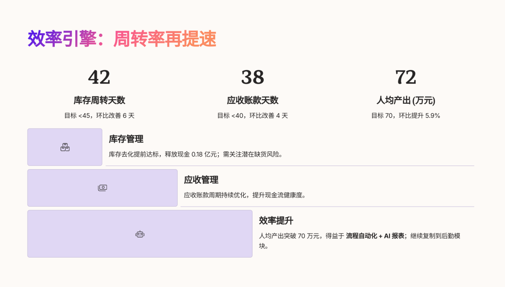

# 2025年5月经营分析PPT模板

> 来源：微信公众号「数据熊」 · 作者 Data Bear · 发布于 2025-06-03 07:00  
> 原文链接：http://mp.weixin.qq.com/s?__biz=Mzg2MTg5OTgzNA==&mid=2247488257&idx=1&sn=c08f8b50a5fdbf4e3969c5cf6e3be2b0&chksm=ce114e54f966c742205d4ae1aded0c7047296ef85bad91af54755a792d740cc89cbcbf0585e1
> 摘要：把复杂留给自己，把简单交给别人；数据会说谎，但趋势不会。

大家好，我是数据熊 🐻。愉快的假期很快就结束了，又到了月初写PPT的时候了：怎么在

20 页左右的 PPT

 里，把 5 月份的经营状况说清楚、说完整、说到点子上？下面这篇文章给你一份「一拿就用」的框架参考，兼顾

硬核分析

与

故事化呈现

，让你的经营汇报更有说服力。

文末可下载PPT模板，

早做完不加班。

---

## 一、先摆结论：5 月外部风向怎么吹？

- 宏观温度计：PMI 49.5

   ，较 4 月回升 0.5，但仍在收缩区间；新订单指数边际向好，价格指数偏弱。
- **消费亮点：4 月社零增速 5.1%**，服务消费继续领跑；预计五一长假效应将部分延续到 5 月。
- 政策风口：LPR 下调 10 BP，逆回购持续加码

   ，市场对下半年进一步宽松有预期。

> 提示
>
> ：把这些外部数据做成 1 ~ 2 张对话式图表（箭头/信号灯），开场就告诉高管「大环境冷暖」与「公司所处地带」。

---

## 二、PPT 总体结构：**「4321」故事线**

| 模块 | 关键问题 | 典型页数 | 关键信息点 |
|---|---|---|---|
| **4 大外部因素** | 宏观、行业、竞争、政策 | 2 | 趋势+机会+风险 |
| **3 个核心目标** | 收入、利润、现金流 | 3 | 目标 vs 实际、同比、环比 |
| **2 条运营主线** | ①增长引擎 ②效率引擎 | 10 | 业务单元/BU 拆解 |
| **1 张行动罗盘** | 下一步举措 | 2 | To-Do & Owner |

> 整体控制在
>
> 18 ~ 22 页
>
> ，提前告诉观众「你将看到什么」，既有导航，又有边界。

---

## 三、逐页拆解：你可以这样讲

### 1. 封面＋一句话 KPI

> 例：「稳住基本盘，盈利环比提升
>
> +8.2 ppt
>
> ，现金流转正」

### 2. 外部环境速递（2 页）

- PMI、社零、出口、CPI、行业景气度（信号灯配色）
- 友商或行业标杆动态（两条新闻标题即够）

### 3. 总体经营成绩单（3 页）

- 收入、利润、现金流跑马灯
- 目标达成率 & 预算偏差

### 4. 业务单元/区域拆解（6 页）

| 页码 | 内容 | 做法 |
|---|---|---|
| 4-1 | **BU 概览** | 瀑布图：贡献度 & 利润率 |
| 4-2 | **增长引擎** | 漏斗＋趋势线：新客 vs 复购 |
| 4-3 | **效率引擎** | 周转率、库存天数、人员效率 |
| 4-4 | **成本管控** | ABC/BVC 分层，条形图对比 |
| 4-5 | **重点项目** | 甘特图+里程碑 |
| 4-6 | **风险雷达** | 热力图：概率×影响 |

### 5. 费用 & 资源配置（2 页）

- 三费率、费效比、ROI
- 资源再分配建议（饼图变向右箭头）

### 6. 现金流 & 资本结构（2 页）

- 经营现金净额趋势
- 杠杆率、债务到期结构

### 7. 行动计划与 owner（2 页）

- OKR 列表

   ：目标-关键结果-责任人
- 里程碑时间表

> 小贴士
>
> ：每页只放
>
> 1 张核心图
>
>  +
>
> 3 条金句
>
> ，对话式标题（先结论再原因），让高管扫一眼就能抓住重点。

---

## 四、可视化技巧加分包

1. 折线 vs 柱状

    ：收入、利润、现金流用堆叠柱+折线，一图看三大目标。
2. 瀑布图

    ：利润桥，说明影响因素。
3. 漏斗图

    ：销售漏斗或人力转化。
4. 热力图

    ：风险矩阵或 BU + 指标对比。
5. 甘特/里程碑

    ：重点项目进度，避免文字块。

---

## 五、高管常问的 5 个「灵魂拷问」

1. 预算不达成的根因到底是什么？
2. 竞争对手有没有新的威胁？
3. 下半年现金流如何保障？
4. 成本还能再削多少？
5. 数据背后的执行动作是什么？

提前在备份页准备

「深挖」数据

 和

方案对照表

，避免现场被问到无话可说。

---

## 六、总结

> 经营分析的 PPT，不是数字罗列，而是为决策者点亮下一步行动的「路标」。
>
> 抓住外部风向，聚焦核心目标，用故事化结构引导听众，让高管在
>
> 10 分钟
>
>  内既看到问题，也拿到解决方案。

---

点击
阅读原文
获取完整版《

2025年5月经营分析PPT模板

》。

加入

数据熊的财务精进营

，与1000+财务精英共同成长。

更多内容后台点击【学习社群】。

往期推荐

2025年4月经营分析PPT框架（含PPT模板）

2025年1季度经营分析报告模板（含ppt模板）

2025年4月财务分析PPT框架（附PPT模板）

2025年4月毛利率分析PPT框架（附PPT模板）

2025年4月成本分析PPT框架（附PPT模板）
