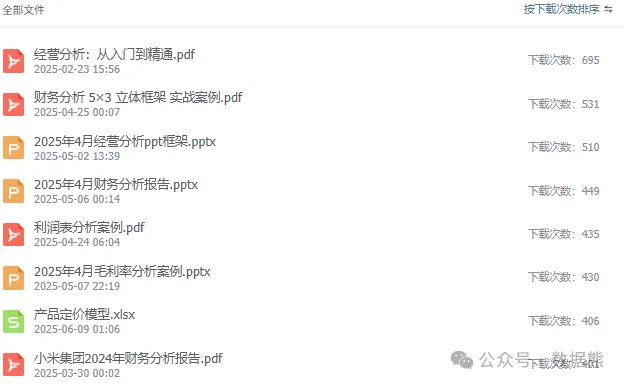

# 年中大考：经营分析会，必须回答的7个关键问题

> 来源：微信公众号「数据熊」 · 作者 Data Bear · 发布于 2025-07-05 07:00  
> 原文链接：http://mp.weixin.qq.com/s?__biz=Mzg2MTg5OTgzNA==&mid=2247488554&idx=1&sn=8289b74770a64ab5b63134d8359217c9&chksm=ce11497ff966c0690882a5de59c71314762825e30c180c036d3fe1467505c46161d20cff7056
> 摘要：方向对了，努力才有意义；目标清晰，行动才有力量。

> 由于公众号推送机制调整，如您不想错过「数据熊」的文章，请务必
>
> 把我们设为星标
>
> ：点文章左上角
>
> 蓝色“数据熊”
>
>  → 主页右上角
>
> “…”
>
>  → 设为星标，这样每篇干货都能第一时间抵达你的订阅列表！

---

2025年下半场已开始，财务伙伴们刚出完报表，又要为年中经营分析会准备材料了。数据熊这几天也是连续加班，中午还薅下来两根白头发，特别扎心。废话不说，今天咱们聊聊：年中经营分析会上

必须

 回答的关键问题，以及如何回答得既专业又接地气。

数据熊为大家准备了经营分析ppt模板，文末有获取方式。早做完，少花点头发。

## 1. 目标达成度：我们到底跑到哪儿了？

- 收入、利润、现金流

    三大核心指标完成度
- 与年度预算、滚动预测的

   差异

    与

   趋势
- 同比 / 环比

    的暖冷信号：增速放缓？成本异动？

> 提示
>
> ：别只说“完成 55%”，要解释背后驱动因子，否则领导只会问：“那下半年怎么办？”

## 2. 增长引擎：是谁在拉动（或拖累）我们？

| 维度 | 关键问题 | 参考分析方法 |
|---|---|---|
| **产品 / 服务** | 哪些产品是“现金牛”、哪些已成“黑洞”？ | 帕累托 20/80、生命周期定位 |
| **市场 / 客户** | 头部客户贡献度？新客户获取成本 (CAC) 是否过高？ | CLV 与 CAC 对比 |
| **渠道 / 区域** | 线上线下哪条赛道更赚钱？区域盈利差异是否扩大？ | 多维毛利地图 |

## 3. 资源效率：花的每一块钱值不值？

1. 费用杠杆
2. 资产周转
3. 资本回报

> 锦囊
>
> ：用
>
> “效率漏斗”
>
>  呈现：投入 → 产出 → 价值，让管理层一眼看懂钱去哪儿了、值不值。

## 4. 风险与机会：哪些暗流要先堵，哪些风口要先抢？

- 外部风险

   ：宏观经济、汇率、利率、供应链安全
- 内部风险

   ：产能瓶颈、关键人才流失、信息孤岛
- 机会窗口

   ：政策奖励、技术升级、市场缺口

使用

SWOT + 关键情景分析

，展示三种“可能的明天”，让决策不再拍脑袋。

## 5. 目标刷新：下半年的“数字底线”是多少？

| 指标 | 年初目标 | 上半年完成 | 下半年建议目标 | 调整理由 |
|---|---|---|---|---|
| 收入 | ¥10亿 | 5.2亿 | 10.5亿 | 行业需求回暖，新增产线 Q3 投产 |
| 利润 | ¥1.2亿 | 0.55亿 | 1.15亿 | 毛利率稳中有升，费用压缩 5% |
| 现金流 | ¥0.8亿 | 0.35亿 | 0.9亿 | 回款专项组生效 & 优惠融资 |

三步法

 让目标更可信：

1. 数据推演（滚动预测）
2. 行动配称（资源、责任、里程碑）
3. 风险缓冲（情景 + 预案）

## 6. 关键举措：不只是说“努力”，而是给“打法”

- 增长曲线

   ：新品 MKT + 老品深耕（交叉销售、价格策略）
- 成本领先

   ：数字化采购 + 自动化产线 + 费用天花板
- 现金为王

   ：应收账款“红黄绿灯”模型、库存 ABC 分层
- 数字赋能

   ：Power BI 全链路经营驾驶舱，让数据自己说话
- 能力建设

   ：OKR + 绩效对齐，关键人才保留计划

## 7. 跟踪机制：会后如何防止“口号散会即散场”？

1. 双周经营例会

     +

    季度复盘
2. 仪表盘实时监控

    （Power BI）
3. 红线预警

    ：指标触碰即邮件 / IM 推送
4. 奖惩闭环

    ：结果挂钩奖金与资源

---

## 结语

年中经营分析会不是秀 PPT，而是

拆解过去、校准现在、锚定未来

 的战略会议。回答好上面这些问题，你就给出了下半场的“打怪策略”，让团队冲刺有方向、有方法、更有底气！

#财务BP

#经营分析

#财务

#业财融合

#财务分析

#财务总监

#述职报告

#PPT模板

点击
阅读原文
获取完整版《

年中经营分析

P

PT模板

》。

加入

数据熊的财务精进营

，与1500+财务精英共同成长。后台点击
「经典文章」阅读数据熊10W+爆文

点赞

和

转发

就是最大的支持，关注数据熊，工作更轻松。

