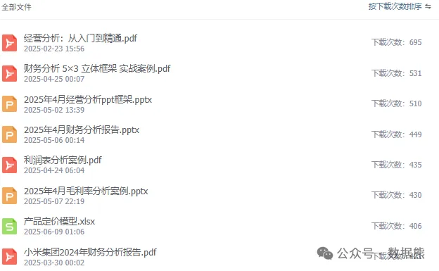

# 经营分析报告的核心价值：问题、根因与行动建议（附PPT模板）

> 来源：微信公众号「数据熊」 · 作者 Data Bear · 发布于 2025-07-08 07:00
> 原文链接：http://mp.weixin.qq.com/s?__biz=Mzg2MTg5OTgzNA==&mid=2247488569&idx=1&sn=b19ddc1219c01e2cf2f9e7486c45fe51&chksm=ce11496cf966c07a5c824531e20083bcaa2ce63c437e584b627c1be2db4ef295b3d66dcf9d1a
> 摘要：财务BP的核心能力，就是把“数据”变成“洞察”，再把“洞察”变成“决策”。

> 由于公众号推送机制调整，如您不想错过「数据熊」的文章，请
>
> 把我们设为星标
>
> ：点文章左上角
>
> 蓝色“数据熊”
>
>  → 主页右上角
>
> “…”
>
>  → 设为星标，这样每篇干货都能第一时间抵达你的订阅列表！

“做经营分析报告，最难的不是写，而是‘说点有用的’。”

很多人写完一份经营分析报告，洋洋洒洒几十页，图表也拉满，但领导翻完一句话：“所以你建议怎么做？”瞬间哑火。

今天我们就聊聊：

怎么在经营分析报告中提出有价值、有深度、有落地的建议？

---

## 一、没有建议的报告，是“汇报工作”，不是“经营分析”

我们常常会把

经营数据的“展示”

当成了经营分析，最终变成了流水账：

- 本月销售额 1.2 亿，同比增长 3%
- 成本费用率 88.5%，环比下降 1.1 个百分点
- 客户流失率 12%，较上月持平……

这些数字当然重要，但只是“现象”。

分析的价值在于解释原因，建议的价值在于指出方向。

---

## 二、一个“建议”要回答的三个问题

判断建议是否有质量，可以用“3问模型”来检视：

1. 问题是什么？

    （不要只是报数字，而要点出矛盾）
2. 根因是什么？

    （有没有数据支持你的判断）
3. 怎么办？

    （有没有具体的可执行建议）

举个例子：

> 🔍【现象】本月销售额环比下降 8%
>
> ✅【问题】重点区域华东下滑 15%，拖累整体销售
>
> 🔍【根因】经销商库存高企、618 推广不力、竞品加大补贴力度
>
> ✅【建议】调整华东促销策略，配合重点客户清库存，并重新评估返点机制

有没有发现，

建议之前，先有“问题”和“解释”

，这才是真正的经营分析。

---

## 三、建议要“具体”，不能“喊口号”

很多报告中也会写建议，但看起来都像“官话”：

- 建议优化结构、提升效率、强化管理……
- 加强过程控制、加强统筹协调、加强内外部协同……

这种建议，看着像是没犯错，但也毫无价值。

高质量的建议，必须具备三个特征：

| 特征 | 说明 | 示例 |
|---|---|---|
| 可操作 | 有明确的行动路径 | “建议7月起暂停低动销SKU，释放铺货资源” |
| 有数据支持 | 建议建立在数据分析基础上 | “毛利倒挂SKU占比15%，建议剔除其中5款” |
| 对症下药 | 针对问题的核心点发力 | “建议调整京津冀价格策略，已失去价格优势” |

---

## 四、建议从哪里来？“三段式分析法”搞定

### 1. **拆解问题**

从现象中找到“谁的问题”、“什么的问题”、“问题在哪儿”。

> 例：本月收入下滑？继续追问—— 是哪个区域？ 哪个产品？ 哪类客户？ 哪种场景？ 哪个业务动作失效了？

### 2. **还原逻辑**

用数据去解释“为什么”，避免拍脑袋：

> 是季节性因素？是渠道变化？是竞争对手动作？是产品生命周期走弱？

### 3. **重构建议**

把分析得出的“因果链”，变成具体行动：

> - 调整预算排期
> - 优化激励机制
> - 更换合作渠道
> - 精准投放广告
> - 聚焦高贡献产品

这三步做完，你的建议就不是“凭感觉”，而是“有证据、有路径、有逻辑”。

---

## 五、建议呈现的三种方式

你写建议时，还可以用以下三种结构化呈现方式：

### ✅【方式一】问题-原因-建议（适合通用汇报）

问题：销售费用率环比上升 1.2 个百分点 原因：广告费用集中投放于三线城市，投产比偏低 建议：8月起调低三线城市预算，转投于ROI更高的渠道

### ✅ 方式二：矩阵式建议清单（适合行动落地）

| 问题 | 原因 | 建议 | 责任人 | 时间节点 |
|---|---|---|---|---|
| 高库存 | 促销未达预期 | 增设限时折扣+清货政策 | 销售总监 | 7月底前 |

### ✅ 方式三：建议地图（适合战略级问题）

将建议分为短期、中期、长期三个阶段，每阶段明确目标与行动方案：

- 短期：聚焦止损与调整资源
- 中期：优化机制与结构
- 长期：重构能力与策略

---

## 六、最后提醒：建议不是“完美方案”，而是“优化路径”

经营分析报告的建议，不是搞科研论文，不需要完美无瑕。

建议的核心，不是“绝对对”，而是“有启发”。

它是你

用数据+逻辑+业务理解

做出的判断，是你作为“财务BP”最能体现价值的地方。

---

## 写在最后

如果你的建议能让老板说一句“这个方向值得试试”，那你这份报告就已经赢了。

#财务BP

#经营分析

#财务

#业财融合

#财务分析

#财务总监

#述职报告

#PPT模板

点击
阅读原文
获取完整版《

经营分析报告PPT模板

》。

加入

数据熊的财务精进营

，与1700+财务精英共同成长。后台点击
「经典文章」阅读数据熊10W+爆文，数据熊微信：

Daniel-songyq

点赞

和

转发

就是最大的支持，关注数据熊，工作更轻松。

