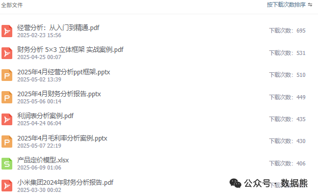

# 第一性原理在经营分析中的应用

> 来源：微信公众号「数据熊」 · 作者 Data Bear · 发布于 2025-07-11 07:00
> 原文链接：http://mp.weixin.qq.com/s?__biz=Mzg2MTg5OTgzNA==&mid=2247488581&idx=1&sn=4a9858eb934a30d0ded12590ddb51131&chksm=ce114910f966c00641dcdee1b782688676d5e5dafdd3320b76da62369207d31864333703d7c3
> 摘要：路虽远，行则将至；事虽难，做则必成。

由于公众号推送机制调整，如您不想错过「数据熊」的文章，请务必

把我们设为星标

：点文章左上角

蓝色“数据熊”

 → 主页右上角

“…”

 → 设为星标，这样每篇干货都能第一时间抵达你的订阅列表！

---

——把“为什么”问到极致，把“怎么办”落到地面

大家好，我是数据熊。今天咱们聊个热门工具——

第一性原理

。数据熊在第一次听这个概念时，还以为“性”是“性别”的“性”，毕竟这是西方的概念，人家玩的比较花，经常整出新词来。

后面研究了下，其实并不是什么高深的理论或概念，万变不离其宗，和

王阳明心学

倡导的

“回归根本，直击本质”

是一个意思，只是咱们商业起步晚，缺乏对圣人经典的挖掘，没有掌握话语权。

废话不说，今天就来聊聊，我们在经营分析中怎么应用这个思维工具。

## 一、先搞清楚：什么是第一性原理？

> “第一性原理就是把事情拆到再也拆不动的‘基本事实’，再从这些事实重新搭积木。”——埃隆·马斯克

通俗点说：

1. 不迷信经验

    ，而是回到“最小颗粒度的真理”。
2. 不人云亦云

    ，而是自己推导结论。
3. 不止步于表象

    ，要挖到底层逻辑。

在经营分析里，这意味着：与其被 KPI、财报行列牵着鼻子走，不如先问一句——

“企业挣钱的底层公式到底是什么？”

## 二、为什么经营分析离不开第一性原理？

- 避免“指标迷雾”

   ：财务指标一大堆，抓错重点就会头痛医脚。
- 拆穿“惯性思维”

   ：别人都这么做≠最优做法；惯性往往掩盖机会。
- 快速定位杠杆

   ：资源有限，找最能撬动结果的那个点，ROI 才高。
- 降本增效更有章法

   ：知道成本真正来自哪里，才能精准动刀而非“削骨疗法”。

## 三、四步法：让第一性原理落地经营分析

| 步骤 | 核心问题 | 工具/方法 |
|---|---|---|
| **1. 问对问题** | 最终要达成的“结果变量”是什么？ | 5 Whys、痛点反问 |
| **2. 拆解本质** | 该结果受哪些**不可再分**的驱动？ | 因果树、价值链拆分 |
| **3. 重建模型** | 驱动之间的数学或逻辑关系是什么？ | 收入=客单价×客流… |
| **4. 迭代验证** | 数据是否支持？假设需不需更新？ | A/B 测试、敏感度分析 |

> 小贴士
>
> ：每拆完一层都问自己一句“这是真的底层吗？”——如果答案是否定的，就继续往下钻。

## 四、三大实战案例

### 1. 库存积压：从“爆仓”到“轻库存”

- 问题

   ：180+ 天库存占比 50%。
- 拆解

   ：库存余额 = 进货量 × 进货单价 − 销售量 × 售价。
- 杠杆

   ：①缩短采购周期；②精细化预测销量；③拆分为快/慢 SKU。
- 结果

   ：当快 SKU 周转率提高 20%，整体库存天数就能降 30+ 天。

### 2. 费用结构：不是所有“削减”都叫降本

- 问题

   ：日常费用占总支出 45%，领导喊“砍费用”。
- 拆解

   ：费用 = 必需开支 + 投资性开支 + 浪费。
- 杠杆

   ：聚焦浪费和无效投资，而不是“一刀切”砍培训、营销。
- 结果

   ：同样降 10% 费用，但营业收入未受负面影响，甚至提高 5%。

### 3. 新业务投资：别让 IRR 变成“好看但不好赚”

- 问题

   ：某项目财务模型 IRR > 20%，却迟迟盈利不了。
- 拆解

   ：盈利 = （客单价 − 单位可变成本）× 付费用户 − 固定成本。
- 杠杆

   ：①提高转化率；②控制 CAC；③优化可变成本。
- 结果

   ：两轮迭代后，项目现金流由负转正，回本期缩短 8 个月。

## 五、如何在日常工作中培养第一性思维？

1. 把目标写成公式

    > e.g. 盈利 = 销售额 − 成本 − 费用，而销售额 = 价格 × 销量……
2. 每周一次“逆向推演”

    把结论倒着推回假设，看看链条哪里最脆弱。
3. 坚持“假设—数据—验证”闭环

    数据只是证据，不是答案；答案来自反复检验后的模型。
4. 跟“标签语言”说再见

    “行业惯例”“领导说”都是标签，拆不动的事实才是底层。

## 六、结语

经营分析不是 PPT 上的花活，而是一场从

第一性原理

 出发，直击企业财富“发动机”的深潜。愿你我都能多一点刨根问底的勇气，少一点亦步亦趋的惰性——让每一次分析都指向真正创造价值的那条主线。

#财务BP

#经营分析

#财务

#业财融合

#财务分析

#财务总监

#述职报告

#PPT模板

点击
阅读原文
获取完整版《

经营分析报告PPT模板

》。

加入

数据熊的财务精进营

，与1800+财务精英共同成长。后台点击
「经典文章」阅读数据熊10W+爆文，如需定制PowerBI看板请加数据熊微信：

Daniel-songyq。

点赞

、

转发和在看

就是最大的支持，关注数据熊，工作更轻松。

