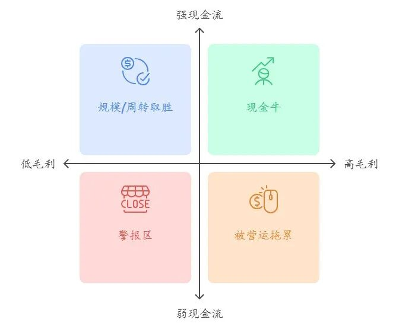

# 毛利率+现金流：经营分析指标的黄金组合

> 来源：微信公众号「数据熊」 · 作者 数据熊 · 发布于 2025-08-22 07:30
> 原文链接：http://mp.weixin.qq.com/s?__biz=Mzg2MTg5OTgzNA==&mid=2247489159&idx=1&sn=4c552f1d8cb7cf39ce86317c9d5478d0&chksm=ce114bd2f966c2c44ca9c33e81d576e96b92cbc37f0d85141c8ec336dc013832b9de38995212
> 摘要：一眼看毛利，三表盯现金

正题开始之前，先跟大家分享我在

深圳湾

欢乐海岸

拍的照片，虽然被朋友喷很丑，但数据熊依然觉得很有意境。

好了言归正传

快到月底了，今天我们重新聊聊老话题，经营分析。如果说经营分析中哪个指标最能体现公司的竞争力，那一定是毛利率，如果非要再给毛利率加个质量维度，那就一定是现金流。

今天我们就来看下怎么用这个指标组合去分析一家公司。

（文末有

经营分析ppt模板

下载方式，有需要的朋友自行获取。）

01

怎么看

看毛利率（Gross Margin）

它回答两个问题：

- 公司卖一块钱货，能留下多少“毛利润”？

- 产品/业务的“护城河”厚不厚（品牌、技术、议价力）？

经验值：

- 消费品龙头（白酒、潮玩）常见 >60%；

- 芯片/软件平台强势期 50%~70%；

- 平台零售 5%~10% 正常；

- 地产在下行期毛利会被计提、降价“按在地上摩擦”。

看经营性现金流（CFO）

它回答：

- 利润是不是“纸面繁荣”？

- 公司把利润变成现金的速度快不快（应收、存货、预收的质量）？

快速判读：

- CFO/营收 稳定为正且提升 = 生意越做越“来钱”；

- CFO大幅波动，要追问：预收变化？渠道压货？一次性因素？

把两者放在一起看“四象限”

- A 高毛利 + 强现金流 = 现金牛（白酒、潮玩高景气期）

- B 高毛利 + 弱现金流 = 被营运拖累（渠道去库存/一次性挤压）

- C 低毛利 + 强现金流 = 规模/周转取胜（平台零售）

- D 低毛利 + 弱现金流 = 警报区（周期底部或模式失效）

补两把尺：

- 现金储备（现金及等价物+短期存款等）：抗周期与“进攻”的底气；

- 自由现金流（FCF）：CFO 扣资本开支后还能剩多少“可分配的钱”。

02

家知名公司（2025 最新）

注：均为公司披露的最近一期财务期末或对应季度/半年度数据（截至 2025-08-22）。

英伟达 NVIDIA ——“高毛利 + 爆表现金流”的教科书

毛利率：

Q1 FY26 GAAP 60.5%；刨除旧品相关费用，非 GAAP 71.3%（管理口径）。

经营现金流（单季）：

274.14 亿美元（Q1 FY26 10-Q 现金流量表）。

解读：

AI 资本开支旺季里，NVIDIA 同时拿到了高定价权与现金前置，属于 A 象限的极致。

特斯拉 Tesla ——毛利承压，但现金流在修复

总 GAAP 毛利率：

Q2 2025 17.2%。

经营性现金流：

25 亿美元；自由现金流：1 亿美元（同季）。

解读：

价格战与新品过渡期压住了毛利，但营运拉回现金，处在 B/C 之间，看下半年新车型与降本速度。

小米 ——“现金弹药 + 新业务毛利上行”

现金储备：

截至 2025-06-30，2,359 亿元人民币；现金及等价物360 亿元。

经营现金流（上半年）：

280.55 亿元，同比 +1008.9%。

智能电动汽车 + AI 等新业务毛利率：

Q2 2025 26.4%（公司披露口径）。

解读：

核心手机/IoT 现金“养”新业务，新业务毛利爬坡明显；现金厚度让它敢于长期投入，接近 A 象限。

京东 ——低毛利行业里的“强现金”范本，但 FCF 短期承压

京东零售经营利润率：

Q2 2025 4.5%（同比 +0.6pct）。

经营性现金流（单季）：

244.09 亿元；自由现金流：220.18 亿元，同比约减半。

解读：

零售低毛利但周转快，本应稳产现金；但新业务投入加大，C 象限里现金仍强，但 FCF 短期被“抽水”。

贵州茅台 ——高毛利稳，但经营现金流显著下滑

营收/净利（上半年）：

约 910.94/454.03 亿元，均 +~9%。

经营性现金流（上半年）：

131.2 亿元，同比 -64.18%；公司解释为子公司资金项与准备金等因素所致（半年报备注）。

解读：

典型 高毛利 消费龙头，但本期现金流受金融项与结算结构扰动，仍属 A→B 的临时“偏移”，需跟踪回补速度。

万科（地产代表）——低毛利 + 现金压力的周期写照

2025H1 预计净亏损100~120 亿元；

公司直言“结算规模大幅下降，毛利率处于低位”。

解读：

销售去化慢、价格让利与计提并存，D 象限风险；此时更要盯住“预售回款/有息负债到期结构”。

泡泡玛特 ——“潮玩中的茅台”，毛利与现金创造力兼备

营收（

2025H1）13

8.76 亿元

，+204.4%；

净利润

4

6.82 亿元，+385.6%；

毛利率

70.3%（同比 +6.3pct）。

解读：

高毛利 + 全球扩张带来的规模效应，A 象限；核心 IP（如 THE MONSTERS）单品拉动明显。

03

把方法落到实操（你可以直接照着查）

Step 1：定位象限

先抓两行：毛利率、经营现金流/自由现金流。

对照 A~D 四象限，判断公司当下质地与阶段。

Step 2：拆“为什么”

现金流不佳？看 三表勾稽：应收、存货、预收、一次性税费/罚款、渠道政策变化。

毛利突然走弱？看 产品/价格/汇率/结构，以及是否有一次性计提。

Step 3：盯三件事

- 现金储备是否足以覆盖未来 12 个月的刚性支出/到期债；

- 资本开支与研发是否在扩产/卡位（决定 1~2 年后毛利与现金流的“坡”）；

- 管理层指引是否与现金流匹配（口径 vs. 现金）。

Step 4：行业差异别忘了

- 平台零售：低毛利 + 强周转也很健康；

- 消费龙头：高毛利更要看渠道真回款；

- 半导体/软件：看结构性高毛利 + 现金前置；

- 地产：毛利与现金对政策/价格极度敏感，优先看表外/预售回款与债务期限。

数据熊说：一眼看毛利，三表盯现金，这套“黄金组合”在牛市、熊市都好使。用同一把尺量不同公司，你会更快分辨：谁是真现金牛，谁是“会计利润牛”。

数据熊致力于打造一个高端的财务社群，这里我们提供优质模板、高质量问答，现诚招会员，点击加入

数据熊的粉丝群

与2200+精英共同成长。

往期推荐

经营分析报告模板（附PPT模板）

财务分析报告，这样写，更有价值（附PPT模板）

财务尽职调查：工作流程及审查要点（附案例报告模板）

国有企业“十五五”规划编制要点（附1.6万字模板）

成本分析报告模板（附PPT模板）

如何通俗的看懂财务三大报表？
