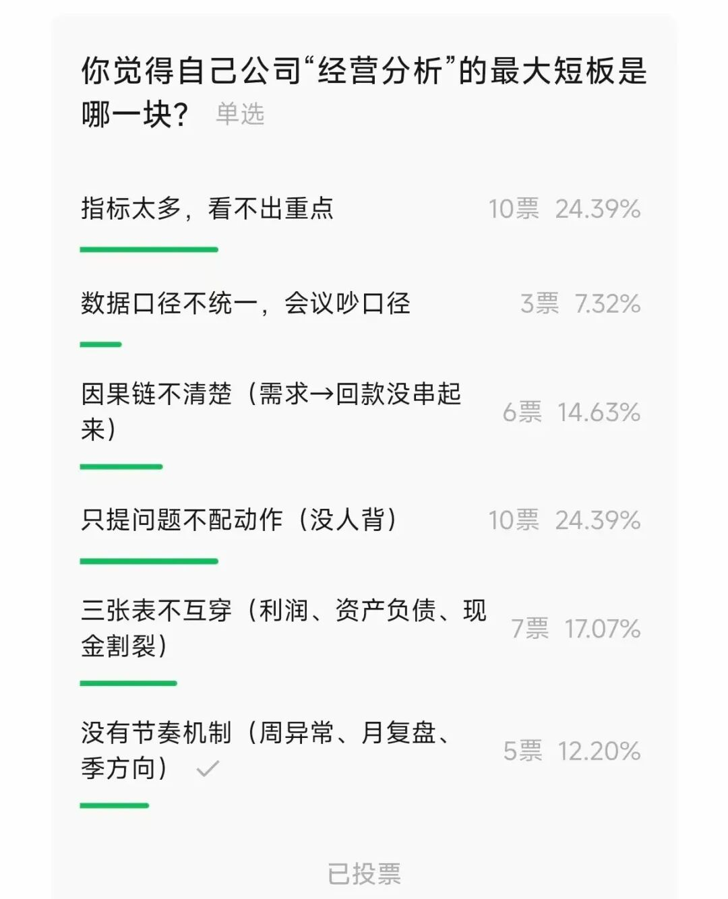
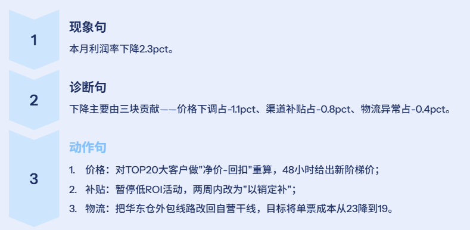
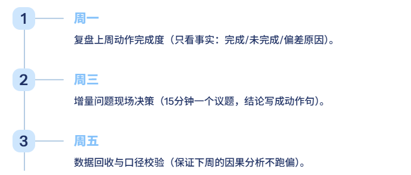
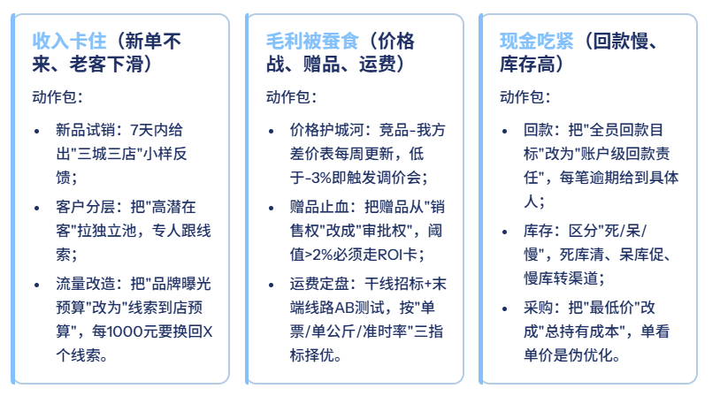
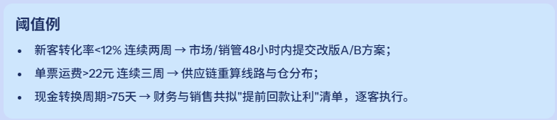
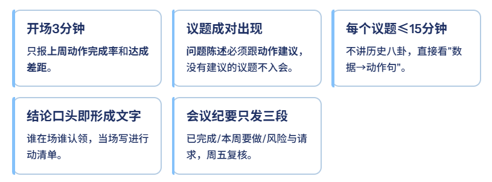
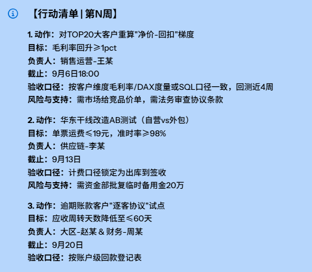
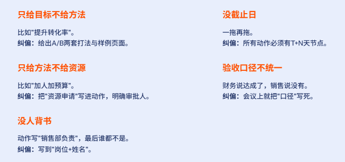
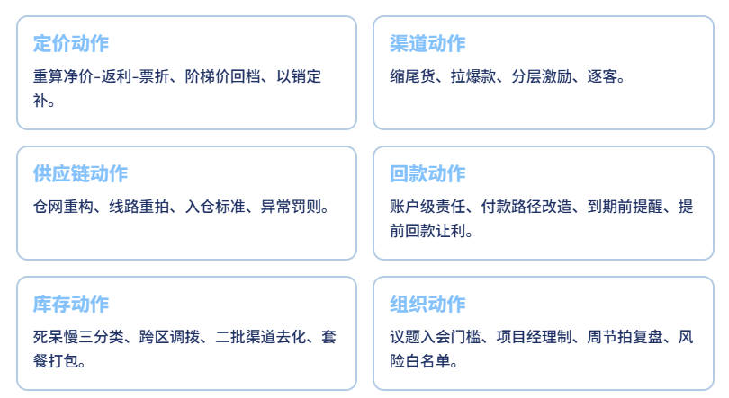
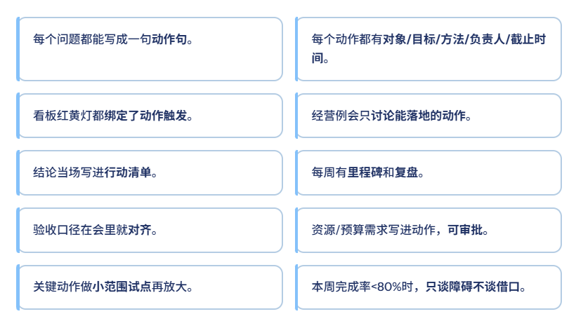

# 经营分析，不能只提问题不配动作

> 来源：微信公众号「数据熊」 · 作者 数据熊 · 发布于 2025-08-28 07:30  
> 原文链接：http://mp.weixin.qq.com/s?__biz=Mzg2MTg5OTgzNA==&mid=2247489299&idx=1&sn=3f0721fe5168d6e0960c87fcf2b313ba&chksm=ce114a46f966c350cb1bbae7753eb12c292a93067179c2f07159a317dc32fde73542b6b98fae
> 摘要：经营分析的终点不在PPT，而在一线动作。

大家好，我是数据熊。

这几年做经营分析，我最常听到的反馈是：“问题找得很准，但业务还是没动起来。”说白了——只提问题，不配动作，等于白说。

前几天大家的投票也反馈目前普遍存在的问题是经营分析无法落地。

今天这篇就讲清楚：把“问题”翻译成“动作”，怎么翻？谁来干？怎么验收？怎么复盘？

直接给你一套能落地的“问题→动作”转译法和配套的作业模板。

01

先把问题“说人话”：从诊断到可执行语句

很多报告卡在“描述现象”。我们把话说到“动作位”。

记忆法：现象→原因→动作，少一个环节，业务就不会动。

02

“问题→动作”转译器：五要素齐活

每条动作都写成一口气能念完的句子，包含“五要素”：

例：“针对渠道A的TOP50门店，两周内完成打爆款-砍尾货的陈列重排，由华东销售一部负责，

单店动销提升15%

为合格线。”

这五要素，少一个，都会稀释执行力。

03

把动作装进“节奏”：周节拍与里程碑

动作不是一次性吐槽，是节拍。

每个动作挂里程碑：T+2天交方案、T+7天试点、T+14天评估、T+21天规模化。

没有里程碑的动作，只是愿望清单。

04

三类高频问题，三套标准动作

05

用数据“驱动动作”，不是“讲故事”

指标不是PPT装饰，是触发器。

 建议在经营看板里给每个核心指标配一个“动作触发阈值”。

红黄绿灯别只变色，要绑定动作和责任人。否则就是彩灯。

06

经营例会的“动作化”SOP（强烈建议照抄）

07

行动清单长什么样？给你一个可复制模板

08

反例与纠偏：为什么你的动作还是没落地？

09

数据熊的动作词典（拿去对照）

10

给你一张“动作化”自检清单（10条，逐条打勾）

内容共创：
欢迎大家参与投票，票数最多的将优先展开。

数据熊说

经营分析的终点不在PPT，而在一线动作。把每个“问题”翻译成一句能执行的“动作句”，写上人名和日期，企业就开始变快、变准、变赚钱。

有需要
经营分析ppt模板、PowerBI定制
的朋友可到添加
数据熊微信咨询
。

